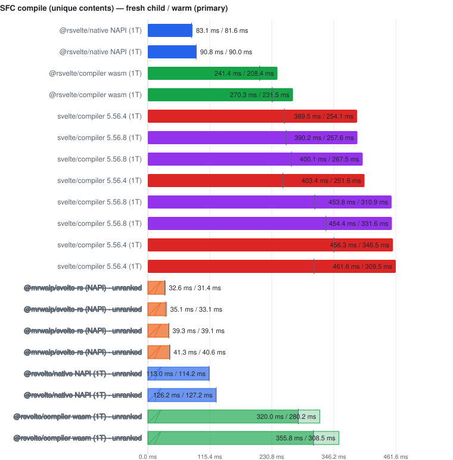
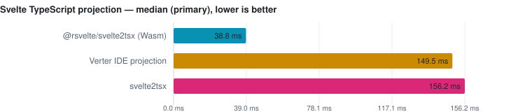
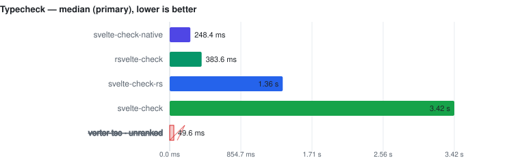
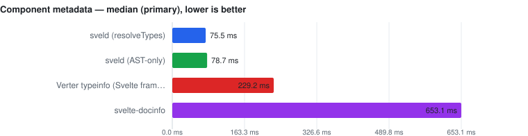
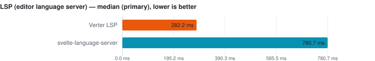
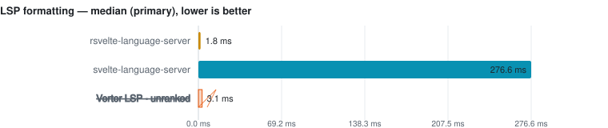
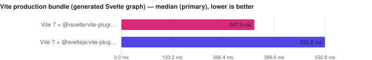

# Svelte Toolchain Benchmarks

Fair, fail-closed benchmarks for the Svelte toolchain: compile, projection,
typecheck, format, lint, component metadata, LSP/IDE operations, Vite
bundle/incremental transform, memory, and real-world project corpora — across
the official tools and the native alternatives (`@mrwaip/svelte-rs`,
`@rsvelte/*`, `svelte-check-rs`/`-native`, Verter, …).

## The contract

- **Performance evidence AND correctness evidence.** A tool never gets a
  performance advantage from doing less work: every timed row passes surface
  work gates, and compiler rows are additionally gated by a Svelte 5 runtime
  semantic plant suite (28 plants) executed in isolated child processes after
  timing.
- **Official Svelte is the reference** of each compatibility class. Candidates
  may target different Svelte patch releases (`svelte-5.56.8`,
  `svelte-5.56.4`); each class carries its own pinned official reference, and a
  failed reference unranks the whole class — the fastest survivor is never
  promoted into the reference slot.
- **A failed candidate stays visible** with its measured time (bracketed) but
  unranked. `UNKNOWN` correctness is not `PASS`. Missing functionality is
  `skipped` — a different API/workload is never substituted.
- **Warm median is the primary metric.** Compiler rows also publish a
  separately sampled **Fresh child** column (first timed workload in a new
  child process; startup/imports/adapter setup excluded — not machine-cold).
- **No tool can win by caching.** Every pass compiles a revised corpus
  (fixed-width token + used CSS custom-property rule); the timed loop asserts
  the token reached the emitted artifact.
- **Published reference numbers are Linux CI snapshots only.** Local runs are
  same-machine comparisons and can never silently overwrite published results.

## What is compared

| Surface | Tools |
| --- | --- |
| Compile (client/server × prod/dev) | `svelte/compiler` (5.56.8 + pinned 5.56.4 reference), `@mrwaip/svelte-rs`, `@rsvelte/compiler` (Wasm), `@rsvelte/vite-plugin-svelte-native` (NAPI) |
| Projection (svelte2tsx) | `svelte2tsx`, `@rsvelte/svelte2tsx`, Verter IDE projection (separate schema class) |
| Typecheck | `svelte-check`, `svelte-check-rs`, `svelte-check-native`, `rsvelte-check`, `verter-tsc` (tsc/tsgo engines as row properties) |
| Format | Prettier + prettier-plugin-svelte, `@rsvelte/fmt` |
| Lint | eslint-plugin-svelte (API/CLI/workers), `@rsvelte/lint`, Verter host diagnostics |
| Component metadata | `sveld`, `svelte-docinfo`, Verter typeinfo |
| LSP / IDE | `svelte-language-server`, `@rsvelte/language-server`, `verter-lsp` |
| Bundle / incremental | `@sveltejs/vite-plugin-svelte`, `@rsvelte/vite-plugin-svelte` (same Vite stack) |
| Real-world | Pinned OSS checkouts (SMUI, Flowbite-Svelte, open-webui, …) |

## How to read

- [docs/how-to-read.md](docs/how-to-read.md) — columns, markers, ranking rules.
- [docs/methodology.md](docs/methodology.md) — measurement methodology.
- Name markers: ⚠ failed validation (time bracketed, unranked) · ❌ error ·
  ⏭ skipped · **(JS)** = JavaScript TypeScript engine.
- Rows above CV 50% (≥3 samples) are TOO NOISY TO RANK — bracketed, excluded.

## Quick start

```bash
pnpm install --frozen-lockfile
pnpm generate            # fixtures (unique contents)
pnpm bench:small         # wiring smoke (NOT reference numbers)
pnpm test:harness        # harness self-tests
pnpm confirm             # correctness confirmation suites
pnpm docs                # regenerate README/docs from committed snapshots
```

See [CONTRIBUTING.md](CONTRIBUTING.md) for the full command surface and the
publication workflow (`pnpm pull:ci-results` / `pnpm publish:ci-results`).

## Results index

<!-- svelte-bench: begin:RESULTS_INDEX -->
- [Svelte compiler](docs/compiler.md)
- [Projection (svelte2tsx)](docs/projection.md)
- [Typecheck (svelte-check)](docs/typecheck.md)
- [Format](docs/format.md)
- [Lint](docs/lint.md)
- [Component metadata](docs/component-meta.md)
- [LSP / IDE operations](docs/lsp.md)
- [Vite bundle & incremental transform](docs/bundle-hmr.md)
- [Real-world projects](docs/real-world.md)
- [Memory (isolated probe)](docs/memory.md)
<!-- svelte-bench: end:RESULTS_INDEX -->

## Current run provenance

<!-- svelte-bench: begin:RUN_META -->
- **Generated:** 2026-09-12T10:46:24.868Z
- **Fixture:** `fixtures/200` (200 Svelte files)
- **Runs / warmups:** 5 / 1
- **Runner:** Linux · linux/x64 · 4 CPUs · AMD EPYC 7763 64-Core Processor · 16 GB RAM · Node v22.23.2
- **Commit:** [cc44ddb](https://github.com/pikax/svelte-benchmarks/commit/cc44ddb)
- **CI run:** https://github.com/pikax/svelte-benchmarks/actions/runs/34688909557
- **Source:** `bench-Linux-200-bench.json`
<!-- svelte-bench: end:RUN_META -->

## Benchmark results

<!-- svelte-bench: begin:BENCHMARK_RESULTS -->
Generated **2026-09-12** from the latest published **Linux** JSON snapshot (`bench-Linux-200-bench.json`, 200 Svelte files, 5 runs). Reference numbers only — re-run on your hardware; see [how to read](docs/how-to-read.md) and [methodology](docs/methodology.md).

### Svelte compiler

> [Full results, raw samples and validation evidence →](docs/compiler.md)

<picture>
  <source media="(prefers-color-scheme: dark)" srcset="docs/charts/readme-compiler-compile-dark.svg">
  
</picture>

| Tool | Fresh child | **Warm (primary)** | vs fastest | Peak RSS |
| --- | ---: | ---: | ---: | ---: |
| @rsvelte/native NAPI (1T) | 83.1 ms | **81.6 ms** | 1.00x | 81.375 MB |
| @rsvelte/native NAPI (1T) | 90.8 ms | **90.0 ms** | 1.10x | 81.375 MB |
| @rsvelte/compiler wasm (1T) | 241.4 ms | **208.4 ms** | 2.55x | 167.848 MB |
| @rsvelte/compiler wasm (1T) | 270.3 ms | **231.5 ms** | 2.84x | 167.848 MB |
| svelte/compiler 5.56.4 (1T) | 403.4 ms | **251.6 ms** | 3.08x | 118.949 MB |
| svelte/compiler 5.56.4 (1T) | 389.5 ms | **254.1 ms** | 3.11x | 118.949 MB |
| svelte/compiler 5.56.8 (1T) | 390.2 ms | **257.6 ms** | 3.16x | 116.758 MB |
| svelte/compiler 5.56.8 (1T) | 400.1 ms | **267.5 ms** | 3.28x | 116.758 MB |
| svelte/compiler 5.56.4 (1T) | 461.6 ms | **309.5 ms** | 3.79x | 118.949 MB |
| svelte/compiler 5.56.8 (1T) | 453.8 ms | **310.9 ms** | 3.81x | 116.758 MB |
| svelte/compiler 5.56.8 (1T) | 454.4 ms | **331.6 ms** | 4.06x | 116.758 MB |
| svelte/compiler 5.56.4 (1T) | 456.3 ms | **346.5 ms** | 4.25x | 118.949 MB |
| @mrwaip/svelte-rs (NAPI) ⚠ | 32.6 ms | (31.4 ms) | not ranked | 71.574 MB |
| @mrwaip/svelte-rs (NAPI) ⚠ | 35.1 ms | (33.1 ms) | not ranked | 71.574 MB |
| @mrwaip/svelte-rs (NAPI) ⚠ | 39.3 ms | (39.1 ms) | not ranked | 71.574 MB |
| @mrwaip/svelte-rs (NAPI) ⚠ | 41.3 ms | (40.6 ms) | not ranked | 71.574 MB |
| @rsvelte/native NAPI (1T) ⚠ | 113.0 ms | (114.2 ms) | not ranked | 81.375 MB |
| @rsvelte/native NAPI (1T) ⚠ | 126.2 ms | (127.2 ms) | not ranked | 81.375 MB |
| @rsvelte/compiler wasm (1T) ⚠ | 320.0 ms | (280.2 ms) | not ranked | 167.848 MB |
| @rsvelte/compiler wasm (1T) ⚠ | 355.8 ms | (308.5 ms) | not ranked | 167.848 MB |

⚠ bracketed rows are measured but unranked — see [the full page](docs/compiler.md) for why.


### Projection (svelte2tsx)

> [Full results, raw samples and validation evidence →](docs/projection.md)

<picture>
  <source media="(prefers-color-scheme: dark)" srcset="docs/charts/readme-projection-projection-dark.svg">
  
</picture>

| Tool | **Median (primary)** | vs fastest | Peak RSS |
| --- | ---: | ---: | ---: |
| @rsvelte/svelte2tsx (Wasm) | **38.8 ms** | 1.00x | 181.848 MB |
| Verter IDE projection | **149.5 ms** | 3.85x | 85.273 MB |
| svelte2tsx | **156.2 ms** | 4.02x | 131.832 MB |


### Typecheck (svelte-check)

> [Full results, raw samples and validation evidence →](docs/typecheck.md)

<picture>
  <source media="(prefers-color-scheme: dark)" srcset="docs/charts/readme-typecheck-typecheck-dark.svg">
  
</picture>

| Tool | **Median (primary)** | vs fastest | Peak RSS |
| --- | ---: | ---: | ---: |
| svelte-check-native | **248.4 ms** | 1.00x | n/a |
| rsvelte-check | **383.6 ms** | 1.54x | n/a |
| svelte-check-rs | **1.36 s** | 5.47x | n/a |
| svelte-check | **3.42 s** | 13.76x | n/a |
| verter-tsc ⚠ | (49.6 ms) | not ranked | n/a |

⚠ bracketed rows are measured but unranked — see [the full page](docs/typecheck.md) for why.


### Format

> [Full results, raw samples and validation evidence →](docs/format.md)

<picture>
  <source media="(prefers-color-scheme: dark)" srcset="docs/charts/readme-format-format-dark.svg">
  
</picture>

| Tool | **Median (primary)** | vs fastest | Peak RSS |
| --- | ---: | ---: | ---: |
| rsvelte-fmt | **166.6 ms** | 1.00x | n/a |
| Prettier + prettier-plugin-svelte | **2.91 s** | 17.45x | n/a |


### Lint

> [Full results, raw samples and validation evidence →](docs/lint.md)

<picture>
  <source media="(prefers-color-scheme: dark)" srcset="docs/charts/readme-lint-lint-dark.svg">
  
</picture>

| Tool | **Median (primary)** | vs fastest | Peak RSS |
| --- | ---: | ---: | ---: |
| rsvelte-lint | **148.2 ms** | 1.00x | n/a |
| eslint-plugin-svelte (1T) | **343.1 ms** | 2.32x | n/a |
| eslint-plugin-svelte (CLI) | **1.25 s** | 8.43x | n/a |
| eslint-plugin-svelte (4 workers) | **1.88 s** | 12.71x | n/a |
| Verter host lint ⚠ | (55.8 ms) | not ranked | n/a |

⚠ bracketed rows are measured but unranked — see [the full page](docs/lint.md) for why.


### Component metadata

> [Full results, raw samples and validation evidence →](docs/component-meta.md)

<picture>
  <source media="(prefers-color-scheme: dark)" srcset="docs/charts/readme-component-meta-component-meta-dark.svg">
  
</picture>

| Tool | **Median (primary)** | vs fastest | Peak RSS |
| --- | ---: | ---: | ---: |
| sveld (resolveTypes) | **75.5 ms** | 1.00x | n/a |
| sveld (AST-only) | **78.7 ms** | 1.04x | n/a |
| Verter typeinfo (Svelte framework surface) | **229.2 ms** | 3.04x | n/a |
| svelte-docinfo | **653.1 ms** | 8.65x | n/a |


### LSP / IDE operations

> [Full results, raw samples and validation evidence →](docs/lsp.md)

<picture>
  <source media="(prefers-color-scheme: dark)" srcset="docs/charts/readme-lsp-lsp-dark.svg">
  
</picture>

| Tool | **Median (primary)** | vs fastest | Peak RSS |
| --- | ---: | ---: | ---: |
| Verter LSP | **282.2 ms** | 1.00x | n/a |
| svelte-language-server | **780.7 ms** | 2.77x | n/a |

<picture>
  <source media="(prefers-color-scheme: dark)" srcset="docs/charts/readme-lsp-lsp-format-dark.svg">
  
</picture>

| Tool | **Median (primary)** | vs fastest | Peak RSS |
| --- | ---: | ---: | ---: |
| rsvelte-language-server | **1.8 ms** | 1.00x | n/a |
| svelte-language-server | **276.6 ms** | 154.53x | n/a |
| Verter LSP ⚠ | (3.1 ms) | not ranked | n/a |

⚠ bracketed rows are measured but unranked — see [the full page](docs/lsp.md) for why.


### Vite bundle & incremental transform

> [Full results, raw samples and validation evidence →](docs/bundle-hmr.md)

<picture>
  <source media="(prefers-color-scheme: dark)" srcset="docs/charts/readme-bundle-hmr-bundle-dark.svg">
  
</picture>

| Tool | **Median (primary)** | vs fastest | Peak RSS |
| --- | ---: | ---: | ---: |
| Vite 7 × @rsvelte/vite-plugin-svelte | **347.9 ms** | 1.00x | n/a |
| Vite 7 × @sveltejs/vite-plugin-svelte | **532.8 ms** | 1.53x | n/a |

<picture>
  <source media="(prefers-color-scheme: dark)" srcset="docs/charts/readme-bundle-hmr-hmr-dark.svg">
  
</picture>

| Tool | **Median (primary)** | vs fastest | Peak RSS |
| --- | ---: | ---: | ---: |
| Vite 7 × @sveltejs/vite-plugin-svelte | **25.5 ms** | 1.00x | n/a |
| Vite 7 × @rsvelte/vite-plugin-svelte | **25.7 ms** | 1.01x | n/a |


<!-- svelte-bench: end:BENCHMARK_RESULTS -->

## Real-world results

<!-- svelte-bench: begin:REAL_WORLD -->
Pinned OSS checkouts, re-compiled per surface — ranked within a corpus, never across projects (5 projects). Full evidence: [docs/real-world.md](docs/real-world.md).

- **carbon-components-svelte** — `real-world-Linux-carbon-components-svelte.json`
- **flowbite-svelte** — `real-world-Linux-flowbite-svelte.json`
- **open-webui** — `real-world-Linux-open-webui.json`
- **platform** — `real-world-Linux-platform.json`
- **smui** — `real-world-Linux-smui.json`
<!-- svelte-bench: end:REAL_WORLD -->


