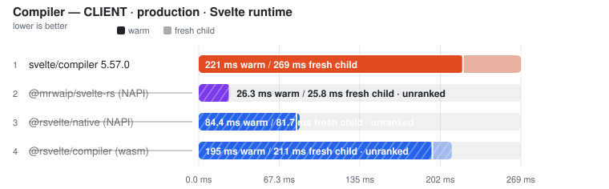
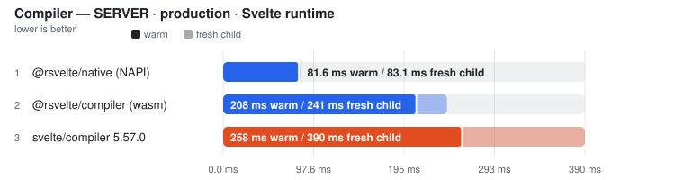
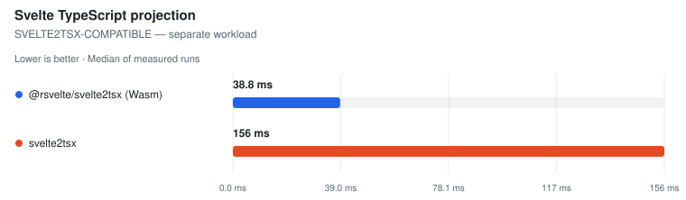
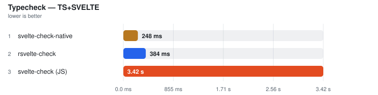
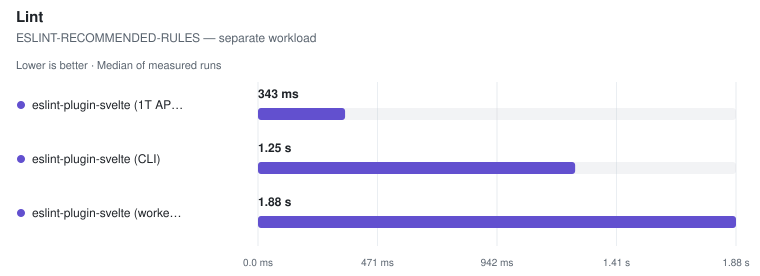
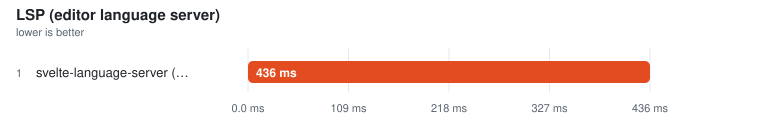
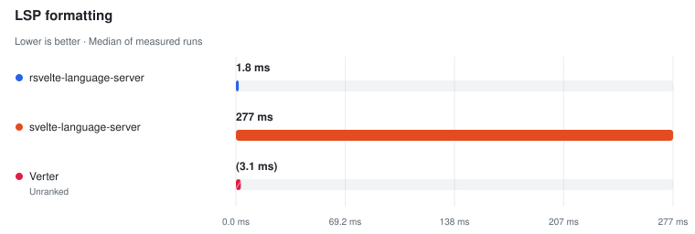
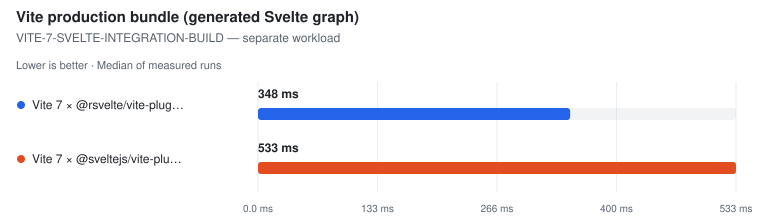
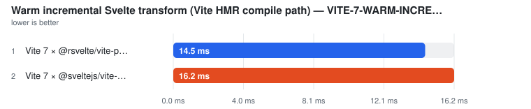

# Svelte Toolchain Benchmarks

Fair, fail-closed benchmarks for the Svelte toolchain: compile, projection,
typecheck, format, lint, component metadata, LSP/IDE operations, Vite
bundle/incremental transform, memory, and real-world project corpora — across
the official tools and the native alternatives (`@mrwaip/svelte-rs`,
`@rsvelte/*`, `svelte-check-rs`/`-native`, Verter, …).

## The contract

- **Performance evidence AND correctness evidence.** A tool never gets a
  performance advantage from doing less work: every ranked row passes surface
  work gates, and compiler rows are additionally gated by a Svelte 5 runtime
  semantic plant suite (28 plants) executed in isolated child processes after
  timing.
- **The latest official Svelte is the sole compiler reference.** Every compiler
  uses the same inputs and is validated against the same installed Svelte
  runtime. The exact version is pinned in the root dependency and recorded in
  each run. A failed reference unranks the whole comparison.
- **A failed candidate stays visible** with its measured time (bracketed) but
  unranked. `UNKNOWN` correctness is not `PASS`. Missing functionality is
  `skipped` — a different API/workload is never substituted.
  Verter's published compiler entrypoint is exercised on Svelte inputs as
  unranked diagnostic evidence, retaining invalid output and compilation errors.
- **Warm median is the primary metric.** Compiler rows also publish a
  separately sampled **Fresh child** column (first timed workload in a new
  child process; startup/imports/adapter setup excluded — not machine-cold).
- **No tool can win by caching.** Every pass compiles a revised corpus
  (fixed-width token + used CSS custom-property rule); the timed loop asserts
  the token reached the emitted artifact for ranked compilers. Verter's
  diagnostic pass records a missing output token as failed validation.
- **Published reference numbers are Linux CI snapshots only.** Local runs are
  same-machine comparisons and can never silently overwrite published results.

## What is compared

| Surface | Tools |
| --- | --- |
| Compile (client/server × prod/dev) | `svelte/compiler` (latest official release), `@mrwaip/svelte-rs`, `@rsvelte/compiler` (Wasm), `@rsvelte/vite-plugin-svelte-native` (NAPI), Verter `compileMany` (unranked diagnostics) |
| Projection (svelte2tsx) | `svelte2tsx`, `@rsvelte/svelte2tsx`, Verter IDE projection (separate schema class) |
| Typecheck | `svelte-check`, `svelte-check-rs`, `svelte-check-native`, `rsvelte-check`, `verter-tsc` (tsc/tsgo engines as row properties) |
| Format | Prettier + prettier-plugin-svelte, `@rsvelte/fmt` |
| Lint | eslint-plugin-svelte (API/CLI/workers), `@rsvelte/lint`, Verter host diagnostics |
| Component metadata | `sveld`, `svelte-docinfo`, Verter typeinfo |
| LSP / IDE | `svelte-language-server`, `@rsvelte/language-server`, `verter-lsp` |
| Bundle / incremental | `@sveltejs/vite-plugin-svelte`, `@rsvelte/vite-plugin-svelte` (same Vite stack) |
| Real-world | Pinned OSS checkouts (SMUI, Flowbite-Svelte, open-webui, …) |

## How to read

- [docs/how-to-read.md](docs/how-to-read.md) — columns, markers, ranking rules.
- [docs/methodology.md](docs/methodology.md) — measurement methodology.
- Name markers: ⚠ failed validation (time bracketed, unranked) · ❌ error ·
  ⏭ skipped · **(JS)** = JavaScript TypeScript engine.
- Rows above CV 50% (≥3 samples) are TOO NOISY TO RANK — bracketed, excluded.

## Quick start

```bash
pnpm install --frozen-lockfile
pnpm generate            # fixtures (unique contents)
pnpm bench:small         # wiring smoke (NOT reference numbers)
pnpm test:harness        # harness self-tests
pnpm confirm             # correctness confirmation suites
pnpm docs                # regenerate README/docs from committed snapshots
```

See [CONTRIBUTING.md](CONTRIBUTING.md) for the full command surface and the
publication workflow (`pnpm pull:ci-results` / `pnpm publish:ci-results`).

## Results index

<!-- svelte-bench: begin:RESULTS_INDEX -->
- [Svelte compiler](docs/compiler.md)
- [Projection (svelte2tsx)](docs/projection.md)
- [Typecheck (svelte-check)](docs/typecheck.md)
- [Format](docs/format.md)
- [Lint](docs/lint.md)
- [Component metadata](docs/component-meta.md)
- [LSP / IDE operations](docs/lsp.md)
- [Vite bundle & incremental transform](docs/bundle-hmr.md)
- [Real-world projects](docs/real-world.md)
- [Memory (isolated probe)](docs/memory.md)
<!-- svelte-bench: end:RESULTS_INDEX -->

## Current run provenance

<!-- svelte-bench: begin:RUN_META -->
- **Generated:** 2026-09-12T10:46:24.868Z
- **Fixture:** `fixtures/200` (200 Svelte files)
- **Runs / warmups:** 5 / 1
- **Runner:** Linux · linux/x64 · 4 CPUs · AMD EPYC 7763 64-Core Processor · 16 GB RAM · Node v22.23.2
- **Commit:** [cc44ddb](https://github.com/pikax/svelte-benchmarks/commit/cc44ddb)
- **CI run:** https://github.com/pikax/svelte-benchmarks/actions/runs/34688909557
- **Source:** `bench-Linux-200-bench.json`
<!-- svelte-bench: end:RUN_META -->

## Benchmark results

<!-- svelte-bench: begin:BENCHMARK_RESULTS -->
Generated **2026-09-12** from the latest published **Linux** JSON snapshot (`bench-Linux-200-bench.json`, 200 Svelte files, 5 runs). See [how to read](docs/how-to-read.md) and [methodology](docs/methodology.md).

Each chart covers one workload. Compiler range bars combine warm (solid) and fresh-child (lighter) measurements on the same scale. Hatched bars are unranked. Expand a timing table for ratios and memory; skipped and errored tools remain visible in the tables.

### Svelte compiler

> [Full results, raw samples and validation evidence →](docs/compiler.md)

<picture>
  <source media="(prefers-color-scheme: dark)" srcset="docs/charts/compiler-bench-linux-200-bench-compile-client-prod-class-svelte-dark.svg">
  
</picture>

<details><summary>Timing table and memory</summary>

| Tool | Fresh child | **Warm (primary)** | vs fastest | Peak RSS |
| --- | ---: | ---: | ---: | ---: |
| svelte/compiler 5.57.0 | 454 ms | **332 ms** | — | 116.8 MB |
| @rsvelte/native (NAPI) ⚠ | 113 ms | (114 ms) | not ranked | 81.4 MB |
| @rsvelte/compiler (wasm) ⚠ | 320 ms | (280 ms) | not ranked | 167.8 MB |
| @mrwaip/svelte-rs (NAPI) ⏭ | – | skipped | — | — |

⚠ bracketed rows are measured but unranked — see [the full page](docs/compiler.md) for why.

**@mrwaip/svelte-rs (NAPI) ⏭:** Awaiting rerun against the current Svelte reference. This historical result used a retired reference; its original samples and validation remain in the source JSON.

</details>

<picture>
  <source media="(prefers-color-scheme: dark)" srcset="docs/charts/compiler-bench-linux-200-bench-compile-server-prod-class-svelte-dark.svg">
  
</picture>

<details><summary>Timing table and memory</summary>

| Tool | Fresh child | **Warm (primary)** | vs fastest | Peak RSS |
| --- | ---: | ---: | ---: | ---: |
| @rsvelte/native (NAPI) | 83.1 ms | **81.6 ms** | 1.00x | 81.4 MB |
| @rsvelte/compiler (wasm) | 241 ms | **208 ms** | 2.55x | 167.8 MB |
| svelte/compiler 5.57.0 | 390 ms | **258 ms** | 3.16x | 116.8 MB |
| @mrwaip/svelte-rs (NAPI) ⏭ | – | skipped | — | — |

**@mrwaip/svelte-rs (NAPI) ⏭:** Awaiting rerun against the current Svelte reference. This historical result used a retired reference; its original samples and validation remain in the source JSON.

</details>

**Separate workloads and availability** — informational timings; no speed ranking across these rows.

| Tool | Workload | Median | Status |
| --- | --- | ---: | --- |
| Verter native | experimental-svelte | — | skipped |

**Verter native:** This snapshot predates the Verter compileMany diagnostic pass. That published entrypoint now runs unranked; timings will appear after a new benchmark run.

Development builds and all validation evidence: [full compiler results](docs/compiler.md).


### Projection (svelte2tsx)

> [Full results, raw samples and validation evidence →](docs/projection.md)

<picture>
  <source media="(prefers-color-scheme: dark)" srcset="docs/charts/projection-bench-linux-200-bench-projection-projection-class-sve-1trvr77-dark.svg">
  
</picture>

<details><summary>Timing table and memory</summary>

| Tool | **Median (primary)** | vs fastest | Peak RSS |
| --- | ---: | ---: | ---: |
| @rsvelte/svelte2tsx (Wasm) | **38.8 ms** | 1.00x | 181.8 MB |
| svelte2tsx | **156 ms** | 4.02x | 131.8 MB |

</details>

**Separate workloads and availability** — informational timings; no speed ranking across these rows.

| Tool | Workload | Median | Status |
| --- | --- | ---: | --- |
| Verter IDE projection | VERTER-IDE-PROJECTION | 150 ms | measured |


### Typecheck (svelte-check)

> [Full results, raw samples and validation evidence →](docs/typecheck.md)

<picture>
  <source media="(prefers-color-scheme: dark)" srcset="docs/charts/typecheck-bench-linux-200-bench-typecheck-typecheck-target-ts-svelte-dark.svg">
  
</picture>

<details><summary>Timing table and memory</summary>

| Tool | **Median (primary)** | vs fastest | Peak RSS |
| --- | ---: | ---: | ---: |
| svelte-check-native | **248 ms** | 1.00x | — |
| rsvelte-check | **384 ms** | 1.54x | — |
| svelte-check (JS) | **3.42 s** | 13.76x | — |

</details>

**Separate workloads and availability** — informational timings; no speed ranking across these rows.

| Tool | Workload | Median | Status |
| --- | --- | ---: | --- |
| svelte-check-rs | DEFAULT-SOURCES | 1.36 s | measured |
| verter-tsc | EXPERIMENTAL-SVELTE | (49.6 ms) | unranked |


### Format

> [Full results, raw samples and validation evidence →](docs/format.md)

<picture>
  <source media="(prefers-color-scheme: dark)" srcset="docs/charts/format-bench-linux-200-bench-format-format-all-dark.svg">
  
</picture>

<details><summary>Timing table and memory</summary>

| Tool | **Median (primary)** | vs fastest | Peak RSS |
| --- | ---: | ---: | ---: |
| rsvelte-fmt | **167 ms** | 1.00x | — |
| Prettier | **2.91 s** | 17.45x | — |
| Oxfmt ⏭ | skipped | — | — |

**Oxfmt ⏭:** Pinned Oxfmt release excludes .svelte files; no CLI-startup proxy is timed.

</details>


### Lint

> [Full results, raw samples and validation evidence →](docs/lint.md)

<picture>
  <source media="(prefers-color-scheme: dark)" srcset="docs/charts/lint-bench-linux-200-bench-lint-lint-class-eslint-recommended-rules-dark.svg">
  
</picture>

<details><summary>Timing table and memory</summary>

| Tool | **Median (primary)** | vs fastest | Peak RSS |
| --- | ---: | ---: | ---: |
| eslint-plugin-svelte (1T API) | **343 ms** | 1.00x | — |
| eslint-plugin-svelte (CLI) | **1.25 s** | 3.64x | — |
| eslint-plugin-svelte (worker pool) | **1.88 s** | 5.49x | — |

</details>

**Separate workloads and availability** — informational timings; no speed ranking across these rows.

| Tool | Workload | Median | Status |
| --- | --- | ---: | --- |
| rsvelte-lint | RSVELTE-NATIVE-RULES | 148 ms | measured |
| Verter host lint | VERTER-NATIVE-DIAGNOSTICS | (55.8 ms) | unranked |


### Component metadata

> [Full results, raw samples and validation evidence →](docs/component-meta.md)

**Separate workloads and availability** — informational timings; no speed ranking across these rows.

| Tool | Workload | Median | Status |
| --- | --- | ---: | --- |
| sveld (AST-only) | SVELD-AST-PROJECT | 78.7 ms | measured |
| sveld (resolveTypes) | SVELD-RESOLVE-TYPES-PROJECT | 75.5 ms | measured |
| svelte-docinfo | SVELTE-DOCINFO-FILES-NO-DEPENDENCIES | 653 ms | measured |
| Verter typeinfo | VERTER-FRAMEWORK-SURFACE | 229 ms | measured |


### LSP / IDE operations

> [Full results, raw samples and validation evidence →](docs/lsp.md)

<picture>
  <source media="(prefers-color-scheme: dark)" srcset="docs/charts/lsp-bench-linux-200-bench-lsp-lsp-all-dark.svg">
  
</picture>

<details><summary>Timing table and memory</summary>

| Tool | **Median (primary)** | vs fastest | Peak RSS |
| --- | ---: | ---: | ---: |
| Verter | **282 ms** | 1.00x | — |
| svelte-language-server (JS) | **781 ms** | 2.77x | — |

</details>

<picture>
  <source media="(prefers-color-scheme: dark)" srcset="docs/charts/lsp-bench-linux-200-bench-lsp-format-lsp-format-all-dark.svg">
  
</picture>

<details><summary>Timing table and memory</summary>

| Tool | **Median (primary)** | vs fastest | Peak RSS |
| --- | ---: | ---: | ---: |
| rsvelte-language-server | **1.8 ms** | 1.00x | — |
| svelte-language-server | **277 ms** | 154.53x | — |
| Verter ⚠ | (3.1 ms) | not ranked | — |

⚠ bracketed rows are measured but unranked — see [the full page](docs/lsp.md) for why.

</details>


### Vite bundle & incremental transform

> [Full results, raw samples and validation evidence →](docs/bundle-hmr.md)

<picture>
  <source media="(prefers-color-scheme: dark)" srcset="docs/charts/bundle-hmr-bench-linux-200-bench-bundle-bundle-class-vite-7-svel-0fso2i1-dark.svg">
  
</picture>

<details><summary>Timing table and memory</summary>

| Tool | **Median (primary)** | vs fastest | Peak RSS |
| --- | ---: | ---: | ---: |
| Vite 7 × @rsvelte/vite-plugin-svelte | **348 ms** | 1.00x | — |
| Vite 7 × @sveltejs/vite-plugin-svelte | **533 ms** | 1.53x | — |

</details>

<picture>
  <source media="(prefers-color-scheme: dark)" srcset="docs/charts/bundle-hmr-bench-linux-200-bench-hmr-hmr-class-vite-7-warm-incre-1lyd23z-dark.svg">
  
</picture>

<details><summary>Timing table and memory</summary>

| Tool | **Median (primary)** | vs fastest | Peak RSS |
| --- | ---: | ---: | ---: |
| Vite 7 × @sveltejs/vite-plugin-svelte | **25.5 ms** | 1.00x | — |
| Vite 7 × @rsvelte/vite-plugin-svelte | **25.7 ms** | 1.01x | — |

</details>


<!-- svelte-bench: end:BENCHMARK_RESULTS -->

## Real-world results

<!-- svelte-bench: begin:REAL_WORLD -->
Pinned OSS checkouts, re-compiled per surface — ranked within a corpus, never across projects (5 projects). Full evidence: [docs/real-world.md](docs/real-world.md).

- **carbon-components-svelte** — `real-world-Linux-carbon-components-svelte.json`
- **flowbite-svelte** — `real-world-Linux-flowbite-svelte.json`
- **open-webui** — `real-world-Linux-open-webui.json`
- **platform** — `real-world-Linux-platform.json`
- **smui** — `real-world-Linux-smui.json`
<!-- svelte-bench: end:REAL_WORLD -->
