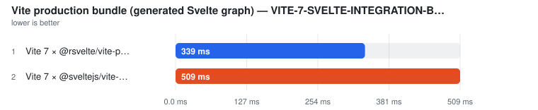
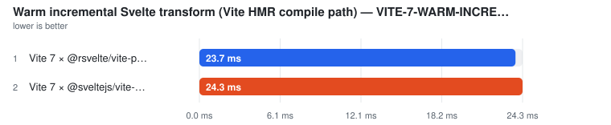

# Vite bundle & incremental transform

> This page is **generated** from committed JSON snapshots (`results/benchmarks/`, `results/real_world/`). Do not edit by hand — run `pnpm run docs`.

## Results

Ranking rules and measurement definitions

Ranked on the **median of measured runs** — Warm is the primary ordering and ranking metric. Compiler rows additionally publish a separately sampled **Fresh child** column: the first timed row workload in a new child process, after excluded process startup, package imports and adapter setup. It is not called Cold (the OS page cache is not flushed) and its ratio never substitutes for the warm verdict. One table per comparable workload class: engine, invocation and threading remain row properties; target or explicitly different work may split classes — the latest official Svelte compiler is the sole compiler baseline, and a failed reference unranks the whole comparison rather than promoting a survivor. Every active variant must visit every execution position; shorter runs are unranked. A class with fewer than two valid rows is informational. Rows tagged **(JS)** run the JavaScript TypeScript compiler. Name markers: ⚠ failed validation (time bracketed, unranked) · ❌ error · ⏭ skipped. A row above CV 50% with at least three samples is bracketed as TOO NOISY TO RANK, baseline included.

- **Generated:** 2026-09-29T12:45:43.678Z
- **Fixture:** `fixtures/200` (200 Svelte files)
- **Runs / warmups:** 5 / 1
- **Runner:** Linux · linux/x64 · 4 CPUs · AMD EPYC 7763 64-Core Processor · 16 GB RAM · Node v22.23.2
- **Commit:** [1bc177a](https://github.com/pikax/svelte-benchmarks/commit/1bc177a)
- **CI run:** https://github.com/pikax/svelte-benchmarks/actions/runs/36569419030
- **Source:** `bench-Linux-200-bench.json`

### Vite production bundle (generated Svelte graph)

Files: **200** · Bytes: **134,760**

##### VITE-7-SVELTE-INTEGRATION-BUILD — separate workload

<picture>
  <source media="(prefers-color-scheme: dark)" srcset="charts/bundle-hmr-bench-linux-200-bench-bundle-bundle-class-vite-7-svel-0fso2i1-dark.svg">
  
</picture>

| Tool | Files | **Median (primary)** | Min | Stddev | CV% | vs fastest | bundle bytes | Peak RSS | Throughput |
| --- | ---: | ---: | ---: | ---: | ---: | ---: | ---: | ---: | ---: |
| Vite 7 × @rsvelte/vite-plugin-svelte | 200 | **338.5 ms** | 314.4 ms | 29.7 ms | 8.8% | 1.00x | 300,455 | n/a | 591 files/s |
| Vite 7 × @sveltejs/vite-plugin-svelte | 200 | **508.5 ms** | 473.7 ms | 15.8 ms | 3.1% | 1.50x | 300,455 | n/a | 393 files/s |

Notes

- **Vite 7 × @rsvelte/vite-plugin-svelte**: 200/200 Svelte transforms passed the untimed census
- **Vite 7 × @sveltejs/vite-plugin-svelte**: 200/200 Svelte transforms passed the untimed census

Methodology

- Both rows use Vite 7.3.6, the newest Vite major supported by both pinned plugin lines without peer conflicts.
- The generated entry imports every selected component; Rollup tree-shaking and minification are disabled and Svelte runtime imports are externalized identically.
- An untimed post-transform census requires every Svelte file to reach non-empty compiled runtime code. A partial graph remains visible but unranked.
- Plugin construction and the complete in-process Vite build are inside the measured interval; package module loading occurs before the surface starts for both rows.
- This is one controlled generated module graph, not a claim about any third-party project's native build.

Raw runs:

- **Vite 7 × @rsvelte/vite-plugin-svelte**: 338.5 ms, 341.8 ms, 391.5 ms, 324.8 ms, 314.4 ms
- **Vite 7 × @sveltejs/vite-plugin-svelte**: 508.5 ms, 512.5 ms, 508.7 ms, 498.2 ms, 473.7 ms

### Warm incremental Svelte transform (Vite HMR compile path)

Files: **1** · Bytes: **99**

##### VITE-7-WARM-INCREMENTAL-SVELTE-TRANSFORM — separate workload

<picture>
  <source media="(prefers-color-scheme: dark)" srcset="charts/bundle-hmr-bench-linux-200-bench-hmr-hmr-class-vite-7-warm-incre-1lyd23z-dark.svg">
  
</picture>

| Tool | Files | **Median (primary)** | Min | Stddev | CV% | vs fastest | module bytes | Peak RSS | Throughput |
| --- | ---: | ---: | ---: | ---: | ---: | ---: | ---: | ---: | ---: |
| Vite 7 × @rsvelte/vite-plugin-svelte | 1 | **23.7 ms** | 21.8 ms | 2.1 ms | 8.8% | 1.00x | 516 | n/a | 42 files/s |
| Vite 7 × @sveltejs/vite-plugin-svelte | 1 | **24.3 ms** | 22.5 ms | 2.2 ms | 9.1% | 1.02x | 517 | n/a | 41 files/s |

Notes

- **Vite 7 × @rsvelte/vite-plugin-svelte**: fresh dev server, initial module transform discarded, changed marker required in updated module
- **Vite 7 × @sveltejs/vite-plugin-svelte**: fresh dev server, initial module transform discarded, changed marker required in updated module

Methodology

- Both rows edit the same first file from a 200-file generated corpus and require the unique edit marker in Vite's updated module.
- Each pass creates a fresh dev server, performs and discards the initial module transform, then times invalidation plus the changed module transform.
- Server creation, initial transform, file write, restoration, and shutdown are outside the measured interval.
- This measures the warm server-side Svelte transform path only. It excludes filesystem watcher debounce, WebSocket delivery, browser fetch/execution, and DOM patching, so it is not labeled an end-to-end HMR round trip.
- Both integrations use the same Vite version and identical hot/compiler options.

Raw runs:

- **Vite 7 × @rsvelte/vite-plugin-svelte**: 27.1 ms, 22.3 ms, 23.7 ms, 21.8 ms, 23.7 ms
- **Vite 7 × @sveltejs/vite-plugin-svelte**: 28.4 ms, 24.3 ms, 22.5 ms, 24.1 ms, 25.5 ms

## Tool versions

Pinned package versions

| Package | Version |
| --- | --- |
| svelte | 5.57.1 |
| svelte-check | 4.7.6 |
| svelte-check-rs | 0.11.2 |
| svelte-check-native | 1.8.0 |
| @mrwaip/svelte-rs | 0.0.0-canary.15.1 |
| @rsvelte/compiler | 0.12.6 |
| @rsvelte/svelte2tsx | 0.2.28 |
| @rsvelte/svelte-check | 0.5.32 |
| @rsvelte/language-server | 0.7.13 |
| @rsvelte/fmt | 0.7.25 |
| @rsvelte/lint | 0.12.6 |
| @rsvelte/vite-plugin-svelte-native | 0.3.17 |
| @rsvelte/vite-plugin-svelte | 0.5.3 |
| @sveltejs/vite-plugin-svelte | 7.3.1 |
| vite | 8.3.1 |
| @verter/native | 0.0.1-beta.6 |
| @verter/typeinfo | 0.0.1-beta.6 |
| @verter/proto | 0.0.1-beta.6 |
| @bufbuild/protobuf | 2.16.0 |
| verter-tsc | 0.0.1-beta.6 |
| verter-lsp | 0.0.1-beta.6 |
| svelte-language-server | 0.18.4 |
| svelte2tsx | 0.7.61 |
| sveld | 0.38.0 |
| svelte-docinfo | 0.7.0 |
| prettier | 3.9.9 |
| prettier-plugin-svelte | 4.1.1 |
| oxfmt | 0.71.0 |
| eslint-plugin-svelte | 3.23.0 |
| typescript | 6.0.3 |
| cli:svelte-check | 4.7.6 |
| cli:svelte-check-rs | 0.11.2 |
| cli:svelte-check-native | 1.8.0 |
| cli:rsvelte-check | unknown |
| cli:rsvelte-fmt | 0.7.25 |
| cli:rsvelte-lint | 0.12.6 |
| cli:prettier | 3.9.9 |
| cli:oxfmt | 0.71.0 |
| cli:verter-tsc | 0.0.1-beta.6 |

