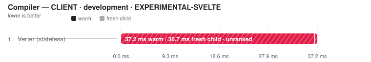
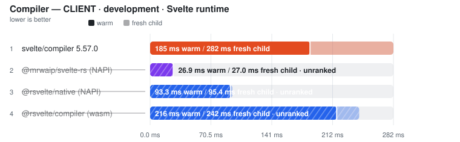
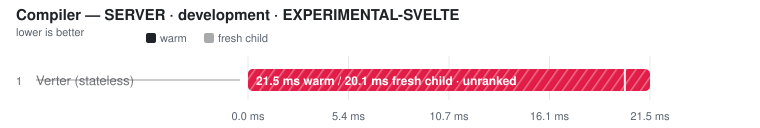
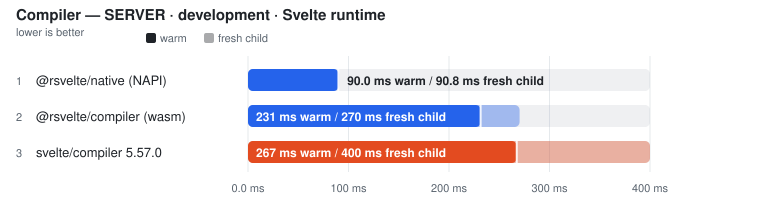

# Svelte compiler

> This page is **generated** from committed JSON snapshots (`results/benchmarks/`, `results/real_world/`). Do not edit by hand — run `pnpm run docs`.

## Results

Ranking rules and measurement definitions

Ranked on the **median of measured runs** — Warm is the primary ordering and ranking metric. Compiler rows additionally publish a separately sampled **Fresh child** column: the first timed row workload in a new child process, after excluded process startup, package imports and adapter setup. It is not called Cold (the OS page cache is not flushed) and its ratio never substitutes for the warm verdict. One table per comparable workload class: engine, invocation and threading remain row properties; target or explicitly different work may split classes — the latest official Svelte compiler is the sole compiler baseline, and a failed reference unranks the whole comparison rather than promoting a survivor. Every active variant must visit every execution position; shorter runs are unranked. A class with fewer than two valid rows is informational. Rows tagged **(JS)** run the JavaScript TypeScript compiler. Name markers: ⚠ failed validation (time bracketed, unranked) · ❌ error · ⏭ skipped. A row above CV 50% with at least three samples is bracketed as TOO NOISY TO RANK, baseline included.

- **Generated:** 2026-09-18T13:11:29.670Z
- **Fixture:** `fixtures/200` (200 Svelte files)
- **Runs / warmups:** 5 / 1
- **Runner:** Linux · linux/x64 · 4 CPUs · AMD EPYC 9V45 96-Core Processor · 16 GB RAM · Node v22.23.2
- **Commit:** [649f404](https://github.com/pikax/svelte-benchmarks/commit/649f404)
- **CI run:** https://github.com/pikax/svelte-benchmarks/actions/runs/35348270026
- **Source:** `bench-Linux-200-bench.json`

### SFC compile (unique contents)

Files: **200** · Bytes: **134,760**

Tools:

- **svelte/compiler 5.57.0** — Official svelte/compiler compile() API, single-threaded.
- **@mrwaip/svelte-rs (NAPI)** — MrWaip/svelte-rs native compiler through its svelte/compiler-compatible API.
- **@rsvelte/compiler (wasm)** — rsvelte WASM compiler bindings.
- **@rsvelte/native (NAPI)** — rsvelte native NAPI compiler (@rsvelte/vite-plugin-svelte-native).
- **Verter (stateless)** — VerterHost.compileMany without cross-run cache; experimental Svelte carrier.

Validation (runtime semantic plants):

Suite 2026-09-12.2 · hash 451381a17402 · 4 cell(s)

| Cell | Status | Entrypoint verdicts |
| --- | --- | --- |
| client/production/source-map-off | FAIL | svelte-official: PASS · mrwaip-svelte-rs: FAIL · rsvelte-wasm: FAIL · rsvelte-native: FAIL · verter-svelte: FAIL |
| client/development/source-map-off | FAIL | svelte-official: PASS · mrwaip-svelte-rs: FAIL · rsvelte-wasm: FAIL · rsvelte-native: FAIL · verter-svelte: FAIL |
| server/production/source-map-off | FAIL | svelte-official: PASS · mrwaip-svelte-rs: FAIL · rsvelte-wasm: PASS · rsvelte-native: PASS · verter-svelte: FAIL |
| server/development/source-map-off | FAIL | svelte-official: PASS · mrwaip-svelte-rs: FAIL · rsvelte-wasm: PASS · rsvelte-native: PASS · verter-svelte: FAIL |

Compile results are **grouped by target × environment**, then by comparison class.

#### CLIENT · production

Target: `client` · Environment: `production`

##### EXPERIMENTAL-SVELTE — separate workload

<picture>
  <source media="(prefers-color-scheme: dark)" srcset="charts/compiler-bench-linux-200-bench-compile-client-prod-class-experim-16hjxvc-dark.svg">
  
</picture>

| Tool | Files | Fresh child | vs fastest fresh | **Warm (primary)** | Min | Stddev | CV% | vs fastest | Code bytes | Peak RSS | Throughput |
| --- | ---: | ---: | ---: | ---: | ---: | ---: | ---: | ---: | ---: | ---: | ---: |
| Verter (stateless) ⚠ | 200 | (36.1 ms) | not ranked | (40.7 ms) | (37.8 ms) | – | – | not ranked | (0) | n/a | – |

Notes

- **Verter (stateless) ⚠**: VerterHost.compileMany(target=runtime-render, mode=stateless, 1 CPU thread) on the same revised Svelte inputs. Diagnostic timing only: the published path is not validated as a Svelte runtime compiler; invalid/empty output and per-file errors are retained, never ranked. | output gate: FAIL — returned empty JavaScript; 200/200 entries, 200 compile errors, 200 entries missing the CSS revision token; first error: [Comp00000.svelte] host error: runtime surface refused for 'Comp00000.svelte': svelte-runtime-unsupported-dynamic-attribute: Svelte client emission does not yet support the dynamic attribute / directive `hidden`. | ⓘ adapter parity: 10 distinct input revisions across 10 passes (warm + fresh child) | ⚠ RUNTIME SEMANTIC VALIDITY FAIL (4/33 plants) — state-derived-update (plant): [Plant.svelte] host error: runtime surface refused for 'Plant.svelte': svelte-runtime-unsupported-advanced-rune: Svelte client emission does not yet support the `$derived` rune form.; bindable-prop (plant): [Plant.svelte] host error: runtime surface refused for 'Plant.svelte': svelte-runtime-unsupported-advanced-rune: Svelte client emission does not yet support the `$props() non-interpolation usage` rune form.; callback-prop-events (plant): [Plant.svelte] host error: runtime surface refused for 'Plant.svelte': svelte-runtime-unsupported-non-delegated-event: Svelte client emission does not yet support the non-delegated / capture / global event `click`.

##### Svelte runtime

<picture>
  <source media="(prefers-color-scheme: dark)" srcset="charts/compiler-bench-linux-200-bench-compile-client-prod-class-svelte-dark.svg">
  
</picture>

| Tool | Files | Fresh child | vs fastest fresh | **Warm (primary)** | Min | Stddev | CV% | vs fastest | Code bytes | Peak RSS | Throughput |
| --- | ---: | ---: | ---: | ---: | ---: | ---: | ---: | ---: | ---: | ---: | ---: |
| svelte/compiler 5.57.0 | 200 | 269.2 ms | — | **220.8 ms** | 200.4 ms | 24.4 ms | 11.1% ⚠ | — | 360,966 | 118.617 MB | — |
| @mrwaip/svelte-rs (NAPI) ⚠ | 200 | (25.8 ms) | not ranked | (26.3 ms) | (23.9 ms) | – | – | not ranked | (364,246) | 69.871 MB | – |
| @rsvelte/native (NAPI) ⚠ | 200 | (81.7 ms) | not ranked | (84.4 ms) | (80.1 ms) | – | – | not ranked | (360,966) | 81.867 MB | – |
| @rsvelte/compiler (wasm) ⚠ | 200 | (211.5 ms) | not ranked | (195.2 ms) | (191.1 ms) | – | – | not ranked | (360,966) | 179.168 MB | – |

Notes

- **svelte/compiler 5.57.0**: Official svelte/compiler compile(), generate=client, dev=false, css=external, runes=true | runtime gate: ✓ 200/200 parseable outputs use svelte/internal/client and match official CSS presence; dev option changes output | ⓘ adapter parity: 10 distinct input revisions across 10 passes (warm + fresh child) | ✓ runtime semantic validity: 33/33 plants passed through svelte/compiler compile() per plant, css=external, runes=true | ✓ source-map coordinates: 4/4 anchored tokens traced exactly (LF/CRLF, non-BMP)
- **@mrwaip/svelte-rs (NAPI) ⚠**: @mrwaip/svelte-rs compile(), generate=client, dev=false, css=external | runtime gate: ✓ 200/200 parseable outputs use svelte/internal/client and match official CSS presence; dev option changes output | ⓘ adapter parity: 10 distinct input revisions across 10 passes (warm + fresh child) | ⚠ SOURCE-MAP COORDINATE VALIDITY FAIL — all 33 runtime plants passed, but generated JS/CSS tokens did not trace back to their exact source positions (lf-styles: css.css-0: mapped to 2:24; expected 9:24; crlf-styles: css.css-0: mapped to 2:24; expected 9:24). The timing remains visible but cannot rank until the emitted maps are correct.
- **@rsvelte/native (NAPI) ⚠**: rsvelte NAPI compile(), generate=client, dev=false, css=external | runtime gate: ✓ 200/200 parseable outputs use svelte/internal/client and match official CSS presence; dev option changes output | ⓘ adapter parity: 10 distinct input revisions across 10 passes (warm + fresh child) | ⚠ SOURCE-MAP COORDINATE VALIDITY FAIL — all 33 runtime plants passed, but generated JS/CSS tokens did not trace back to their exact source positions (lf-raw: js.script: mapped to 2:19; expected 2:17; lf-styles: js.script: mapped to 2:19; expected 2:17). The timing remains visible but cannot rank until the emitted maps are correct.
- **@rsvelte/compiler (wasm) ⚠**: rsvelte WASM compile(), generate=client, dev=false, css=external. ⚠ WASM path — not the NAPI native binding. | runtime gate: ✓ 200/200 parseable outputs use svelte/internal/client and match official CSS presence; dev option changes output | ⓘ adapter parity: 10 distinct input revisions across 10 passes (warm + fresh child) | ⚠ SOURCE-MAP COORDINATE VALIDITY FAIL — all 33 runtime plants passed, but generated JS/CSS tokens did not trace back to their exact source positions (lf-raw: js.template: generated token has no original mapping; lf-styles: js.template: generated token has no original mapping). The timing remains visible but cannot rank until the emitted maps are correct.

Raw runs

- **Verter (stateless)**: 40.7 ms, 39.5 ms, 42.7 ms, 45.5 ms, 37.8 ms · fresh child: 35.7 ms, 36.9 ms, 37.1 ms, 35.4 ms, 36.1 ms
- **svelte/compiler 5.57.0**: 259.5 ms, 237.7 ms, 220.8 ms, 200.4 ms, 204.7 ms · fresh child: 259.2 ms, 271.2 ms, 273.1 ms, 266.5 ms, 269.2 ms
- **@mrwaip/svelte-rs (NAPI)**: 26.4 ms, 26.6 ms, 24.8 ms, 23.9 ms, 26.3 ms · fresh child: 25.6 ms, 25.8 ms, 25.3 ms, 26.0 ms, 25.9 ms
- **@rsvelte/native (NAPI)**: 84.0 ms, 80.1 ms, 84.8 ms, 84.4 ms, 84.9 ms · fresh child: 79.8 ms, 85.7 ms, 79.1 ms, 84.5 ms, 81.7 ms
- **@rsvelte/compiler (wasm)**: 206.9 ms, 202.2 ms, 191.1 ms, 195.2 ms, 195.1 ms · fresh child: 211.5 ms, 214.8 ms, 209.7 ms, 222.2 ms, 211.3 ms

#### CLIENT · development

Target: `client` · Environment: `development`

##### EXPERIMENTAL-SVELTE — separate workload

<picture>
  <source media="(prefers-color-scheme: dark)" srcset="charts/compiler-bench-linux-200-bench-compile-client-dev-class-experime-16ual2o-dark.svg">
  
</picture>

| Tool | Files | Fresh child | vs fastest fresh | **Warm (primary)** | Min | Stddev | CV% | vs fastest | Code bytes | Peak RSS | Throughput |
| --- | ---: | ---: | ---: | ---: | ---: | ---: | ---: | ---: | ---: | ---: | ---: |
| Verter (stateless) ⚠ | 200 | (36.7 ms) | not ranked | (37.2 ms) | (37.0 ms) | – | – | not ranked | (0) | n/a | – |

Notes

- **Verter (stateless) ⚠**: VerterHost.compileMany(target=runtime-render, mode=stateless, 1 CPU thread) on the same revised Svelte inputs. Diagnostic timing only: the published path is not validated as a Svelte runtime compiler; invalid/empty output and per-file errors are retained, never ranked. | output gate: FAIL — returned empty JavaScript; 200/200 entries, 200 compile errors, 200 entries missing the CSS revision token; first error: [Comp00000.svelte] host error: runtime surface refused for 'Comp00000.svelte': svelte-runtime-unsupported-dynamic-attribute: Svelte client emission does not yet support the dynamic attribute / directive `hidden`. | ⓘ adapter parity: 10 distinct input revisions across 10 passes (warm + fresh child) | ⚠ RUNTIME SEMANTIC VALIDITY FAIL (4/33 plants) — state-derived-update (plant): [Plant.svelte] host error: runtime surface refused for 'Plant.svelte': svelte-runtime-unsupported-advanced-rune: Svelte client emission does not yet support the `$derived` rune form.; bindable-prop (plant): [Plant.svelte] host error: runtime surface refused for 'Plant.svelte': svelte-runtime-unsupported-advanced-rune: Svelte client emission does not yet support the `$props() non-interpolation usage` rune form.; callback-prop-events (plant): [Plant.svelte] host error: runtime surface refused for 'Plant.svelte': svelte-runtime-unsupported-non-delegated-event: Svelte client emission does not yet support the non-delegated / capture / global event `click`.

##### Svelte runtime

<picture>
  <source media="(prefers-color-scheme: dark)" srcset="charts/compiler-bench-linux-200-bench-compile-client-dev-class-svelte-dark.svg">
  
</picture>

| Tool | Files | Fresh child | vs fastest fresh | **Warm (primary)** | Min | Stddev | CV% | vs fastest | Code bytes | Peak RSS | Throughput |
| --- | ---: | ---: | ---: | ---: | ---: | ---: | ---: | ---: | ---: | ---: | ---: |
| svelte/compiler 5.57.0 | 200 | 282.1 ms | — | **185.4 ms** | 180.6 ms | 2.9 ms | 1.6% | — | 468,726 | 118.617 MB | — |
| @mrwaip/svelte-rs (NAPI) ⚠ | 200 | (27.0 ms) | not ranked | (26.9 ms) | (26.5 ms) | – | – | not ranked | (466,626) | 69.871 MB | – |
| @rsvelte/native (NAPI) ⚠ | 200 | (95.4 ms) | not ranked | (93.3 ms) | (93.0 ms) | – | – | not ranked | (468,726) | 81.867 MB | – |
| @rsvelte/compiler (wasm) ⚠ | 200 | (242.3 ms) | not ranked | (216.2 ms) | (213.4 ms) | – | – | not ranked | (468,726) | 179.168 MB | – |

Notes

- **svelte/compiler 5.57.0**: Official svelte/compiler compile(), generate=client, dev=true, css=external, runes=true | runtime gate: ✓ 200/200 parseable outputs use svelte/internal/client and match official CSS presence; dev option changes output | ⓘ adapter parity: 10 distinct input revisions across 10 passes (warm + fresh child) | ✓ runtime semantic validity: 33/33 plants passed through svelte/compiler compile() per plant, css=external, runes=true | ✓ source-map coordinates: 4/4 anchored tokens traced exactly (LF/CRLF, non-BMP)
- **@mrwaip/svelte-rs (NAPI) ⚠**: @mrwaip/svelte-rs compile(), generate=client, dev=true, css=external | runtime gate: ✓ 200/200 parseable outputs use svelte/internal/client and match official CSS presence; dev option changes output | ⓘ adapter parity: 10 distinct input revisions across 10 passes (warm + fresh child) | ⚠ SOURCE-MAP COORDINATE VALIDITY FAIL — all 33 runtime plants passed, but generated JS/CSS tokens did not trace back to their exact source positions (lf-styles: css.css-0: mapped to 2:24; expected 9:24; crlf-styles: css.css-0: mapped to 2:24; expected 9:24). The timing remains visible but cannot rank until the emitted maps are correct.
- **@rsvelte/native (NAPI) ⚠**: rsvelte NAPI compile(), generate=client, dev=true, css=external | runtime gate: ✓ 200/200 parseable outputs use svelte/internal/client and match official CSS presence; dev option changes output | ⓘ adapter parity: 10 distinct input revisions across 10 passes (warm + fresh child) | ⚠ SOURCE-MAP COORDINATE VALIDITY FAIL — all 33 runtime plants passed, but generated JS/CSS tokens did not trace back to their exact source positions (lf-raw: js.script: mapped to 2:19; expected 2:17; lf-styles: js.script: mapped to 2:19; expected 2:17). The timing remains visible but cannot rank until the emitted maps are correct.
- **@rsvelte/compiler (wasm) ⚠**: rsvelte WASM compile(), generate=client, dev=true, css=external. ⚠ WASM path — not the NAPI native binding. | runtime gate: ✓ 200/200 parseable outputs use svelte/internal/client and match official CSS presence; dev option changes output | ⓘ adapter parity: 10 distinct input revisions across 10 passes (warm + fresh child) | ⚠ SOURCE-MAP COORDINATE VALIDITY FAIL — all 33 runtime plants passed, but generated JS/CSS tokens did not trace back to their exact source positions (lf-raw: js.template: generated token has no original mapping; lf-styles: js.template: generated token has no original mapping). The timing remains visible but cannot rank until the emitted maps are correct.

Raw runs

- **Verter (stateless)**: 37.4 ms, 37.0 ms, 37.1 ms, 40.3 ms, 37.2 ms · fresh child: 33.9 ms, 38.6 ms, 36.1 ms, 37.4 ms, 36.7 ms
- **svelte/compiler 5.57.0**: 185.9 ms, 180.6 ms, 181.4 ms, 187.3 ms, 185.4 ms · fresh child: 282.1 ms, 285.9 ms, 276.7 ms, 279.7 ms, 282.6 ms
- **@mrwaip/svelte-rs (NAPI)**: 27.4 ms, 26.5 ms, 26.9 ms, 32.0 ms, 26.6 ms · fresh child: 26.8 ms, 27.7 ms, 27.0 ms, 27.8 ms, 26.4 ms
- **@rsvelte/native (NAPI)**: 93.3 ms, 93.0 ms, 93.3 ms, 93.6 ms, 93.3 ms · fresh child: 88.7 ms, 95.4 ms, 91.2 ms, 96.7 ms, 96.4 ms
- **@rsvelte/compiler (wasm)**: 216.4 ms, 215.4 ms, 216.2 ms, 219.9 ms, 213.4 ms · fresh child: 234.6 ms, 229.6 ms, 243.2 ms, 242.3 ms, 249.5 ms

#### SERVER · production

Target: `server` · Environment: `production`

##### EXPERIMENTAL-SVELTE — separate workload

<picture>
  <source media="(prefers-color-scheme: dark)" srcset="charts/compiler-bench-linux-200-bench-compile-server-prod-class-experim-0ngnah0-dark.svg">
  
</picture>

| Tool | Files | Fresh child | vs fastest fresh | **Warm (primary)** | Min | Stddev | CV% | vs fastest | Code bytes | Peak RSS | Throughput |
| --- | ---: | ---: | ---: | ---: | ---: | ---: | ---: | ---: | ---: | ---: | ---: |
| Verter (stateless) ⚠ | 200 | (19.9 ms) | not ranked | (22.1 ms) | (19.8 ms) | – | – | not ranked | (0) | n/a | – |

Notes

- **Verter (stateless) ⚠**: VerterHost.compileMany(target=runtime-render, mode=stateless, 1 CPU thread) on the same revised Svelte inputs. Diagnostic timing only: the published path is not validated as a Svelte runtime compiler; invalid/empty output and per-file errors are retained, never ranked. | output gate: FAIL — returned empty JavaScript; 200/200 entries, 200 compile errors, 200 entries missing the CSS revision token; first error: [Comp00000.svelte] host error: runtime surface refused for 'Comp00000.svelte': svelte-runtime-unsupported-server-generate: Svelte client emission does not yet support server-side rendering (`generate: 'server'`). | ⓘ adapter parity: 10 distinct input revisions across 10 passes (warm + fresh child) | ⚠ RUNTIME SEMANTIC VALIDITY FAIL (0/33 plants) — props-defaults-interpolation (plant): [Plant.svelte] host error: runtime surface refused for 'Plant.svelte': svelte-runtime-unsupported-server-generate: Svelte client emission does not yet support server-side rendering (`generate: 'server'`).; state-derived-update (plant): [Plant.svelte] host error: runtime surface refused for 'Plant.svelte': svelte-runtime-unsupported-server-generate: Svelte client emission does not yet support server-side rendering (`generate: 'server'`).; bindable-prop (plant): [Plant.svelte] host error: runtime surface refused for 'Plant.svelte': svelte-runtime-unsupported-server-generate: Svelte client emission does not yet support server-side rendering (`generate: 'server'`).

##### Svelte runtime

<picture>
  <source media="(prefers-color-scheme: dark)" srcset="charts/compiler-bench-linux-200-bench-compile-server-prod-class-svelte-dark.svg">
  
</picture>

| Tool | Files | Fresh child | vs fastest fresh | **Warm (primary)** | Min | Stddev | CV% | vs fastest | Code bytes | Peak RSS | Throughput |
| --- | ---: | ---: | ---: | ---: | ---: | ---: | ---: | ---: | ---: | ---: | ---: |
| @rsvelte/native (NAPI) | 200 | 57.8 ms | 1.00x | **56.5 ms** | 56.1 ms | 0.6 ms | 1.1% | 1.00x | 214,546 | 81.867 MB | 3.5k files/s |
| svelte/compiler 5.57.0 | 200 | 240.4 ms | 4.16x | **146.9 ms** | 136.7 ms | 7.8 ms | 5.3% | 2.60x | 214,546 | 118.617 MB | 1.4k files/s |
| @rsvelte/compiler (wasm) | 200 | 165.6 ms | 2.86x | **147.2 ms** | 144.3 ms | 1.6 ms | 1.1% | 2.61x | 214,546 | 179.168 MB | 1.4k files/s |
| @mrwaip/svelte-rs (NAPI) ⚠ | 200 | (19.7 ms) | not ranked | (18.3 ms) | (18.2 ms) | – | – | not ranked | (217,846) | 69.871 MB | – |

Notes

- **@rsvelte/native (NAPI)**: rsvelte NAPI compile(), generate=server, dev=false, css=external | runtime gate: ✓ 200/200 parseable outputs use svelte/internal/server and match official CSS presence; dev option changes output | ⓘ adapter parity: 10 distinct input revisions across 10 passes (warm + fresh child) | ✓ runtime semantic validity: 33/33 plants passed through @rsvelte/vite-plugin-svelte-native compileSync() per plant, css=external, runes=true | ✓ source-map coordinates: 4/4 anchored tokens traced exactly (LF/CRLF, non-BMP)
- **svelte/compiler 5.57.0**: Official svelte/compiler compile(), generate=server, dev=false, css=external, runes=true | runtime gate: ✓ 200/200 parseable outputs use svelte/internal/server and match official CSS presence; dev option changes output | ⓘ adapter parity: 10 distinct input revisions across 10 passes (warm + fresh child) | ✓ runtime semantic validity: 33/33 plants passed through svelte/compiler compile() per plant, css=external, runes=true | ✓ source-map coordinates: 4/4 anchored tokens traced exactly (LF/CRLF, non-BMP)
- **@rsvelte/compiler (wasm)**: rsvelte WASM compile(), generate=server, dev=false, css=external. ⚠ WASM path — not the NAPI native binding. | runtime gate: ✓ 200/200 parseable outputs use svelte/internal/server and match official CSS presence; dev option changes output | ⓘ adapter parity: 10 distinct input revisions across 10 passes (warm + fresh child) | ✓ runtime semantic validity: 33/33 plants passed through @rsvelte/compiler compile() per plant after initSync, css=external, runes=true | ✓ source-map coordinates: 4/4 anchored tokens traced exactly (LF/CRLF, non-BMP)
- **@mrwaip/svelte-rs (NAPI) ⚠**: @mrwaip/svelte-rs compile(), generate=server, dev=false, css=external | runtime gate: ✓ 200/200 parseable outputs use svelte/internal/server and match official CSS presence; dev option changes output | ⓘ adapter parity: 10 distinct input revisions across 10 passes (warm + fresh child) | ⚠ SOURCE-MAP COORDINATE VALIDITY FAIL — all 33 runtime plants passed, but generated JS/CSS tokens did not trace back to their exact source positions (lf-raw: js.missing or invalid version-3 source map; lf-styles: js.missing or invalid version-3 source map). The timing remains visible but cannot rank until the emitted maps are correct.

Raw runs

- **Verter (stateless)**: 22.1 ms, 22.1 ms, 22.3 ms, 19.8 ms, 20.7 ms · fresh child: 19.9 ms, 21.2 ms, 18.4 ms, 19.4 ms, 20.6 ms
- **@rsvelte/native (NAPI)**: 57.1 ms, 56.5 ms, 56.2 ms, 56.1 ms, 57.5 ms · fresh child: 57.4 ms, 57.0 ms, 57.8 ms, 57.9 ms, 57.9 ms
- **svelte/compiler 5.57.0**: 150.6 ms, 158.3 ms, 146.9 ms, 145.6 ms, 136.7 ms · fresh child: 335.5 ms, 244.1 ms, 235.4 ms, 233.7 ms, 240.4 ms
- **@rsvelte/compiler (wasm)**: 147.2 ms, 145.2 ms, 144.3 ms, 148.0 ms, 147.8 ms · fresh child: 156.0 ms, 170.2 ms, 165.6 ms, 153.9 ms, 169.2 ms
- **@mrwaip/svelte-rs (NAPI)**: 20.7 ms, 18.2 ms, 18.3 ms, 18.6 ms, 18.3 ms · fresh child: 19.6 ms, 19.7 ms, 19.6 ms, 20.3 ms, 19.8 ms

#### SERVER · development

Target: `server` · Environment: `development`

##### EXPERIMENTAL-SVELTE — separate workload

<picture>
  <source media="(prefers-color-scheme: dark)" srcset="charts/compiler-bench-linux-200-bench-compile-server-dev-class-experime-0rqidlo-dark.svg">
  
</picture>

| Tool | Files | Fresh child | vs fastest fresh | **Warm (primary)** | Min | Stddev | CV% | vs fastest | Code bytes | Peak RSS | Throughput |
| --- | ---: | ---: | ---: | ---: | ---: | ---: | ---: | ---: | ---: | ---: | ---: |
| Verter (stateless) ⚠ | 200 | (20.1 ms) | not ranked | (21.5 ms) | (20.3 ms) | – | – | not ranked | (0) | n/a | – |

Notes

- **Verter (stateless) ⚠**: VerterHost.compileMany(target=runtime-render, mode=stateless, 1 CPU thread) on the same revised Svelte inputs. Diagnostic timing only: the published path is not validated as a Svelte runtime compiler; invalid/empty output and per-file errors are retained, never ranked. | output gate: FAIL — returned empty JavaScript; 200/200 entries, 200 compile errors, 200 entries missing the CSS revision token; first error: [Comp00000.svelte] host error: runtime surface refused for 'Comp00000.svelte': svelte-runtime-unsupported-server-generate: Svelte client emission does not yet support server-side rendering (`generate: 'server'`). | ⓘ adapter parity: 10 distinct input revisions across 10 passes (warm + fresh child) | ⚠ RUNTIME SEMANTIC VALIDITY FAIL (0/33 plants) — props-defaults-interpolation (plant): [Plant.svelte] host error: runtime surface refused for 'Plant.svelte': svelte-runtime-unsupported-server-generate: Svelte client emission does not yet support server-side rendering (`generate: 'server'`).; state-derived-update (plant): [Plant.svelte] host error: runtime surface refused for 'Plant.svelte': svelte-runtime-unsupported-server-generate: Svelte client emission does not yet support server-side rendering (`generate: 'server'`).; bindable-prop (plant): [Plant.svelte] host error: runtime surface refused for 'Plant.svelte': svelte-runtime-unsupported-server-generate: Svelte client emission does not yet support server-side rendering (`generate: 'server'`).

##### Svelte runtime

<picture>
  <source media="(prefers-color-scheme: dark)" srcset="charts/compiler-bench-linux-200-bench-compile-server-dev-class-svelte-dark.svg">
  
</picture>

| Tool | Files | Fresh child | vs fastest fresh | **Warm (primary)** | Min | Stddev | CV% | vs fastest | Code bytes | Peak RSS | Throughput |
| --- | ---: | ---: | ---: | ---: | ---: | ---: | ---: | ---: | ---: | ---: | ---: |
| @rsvelte/native (NAPI) | 200 | 63.3 ms | 1.00x | **64.2 ms** | 62.5 ms | 1.4 ms | 2.1% | 1.00x | 445,986 | 81.867 MB | 3.1k files/s |
| @rsvelte/compiler (wasm) | 200 | 183.4 ms | 2.90x | **163.2 ms** | 162.1 ms | 1.0 ms | 0.6% | 2.54x | 445,986 | 179.168 MB | 1.2k files/s |
| svelte/compiler 5.57.0 | 200 | 247.6 ms | 3.91x | **164.1 ms** | 149.0 ms | 11.5 ms | 7.0% | 2.56x | 445,986 | 118.617 MB | 1.2k files/s |
| @mrwaip/svelte-rs (NAPI) ⚠ | 200 | (20.4 ms) | not ranked | (20.2 ms) | (19.6 ms) | – | – | not ranked | (438,986) | 69.871 MB | – |

Notes

- **@rsvelte/native (NAPI)**: rsvelte NAPI compile(), generate=server, dev=true, css=external | runtime gate: ✓ 200/200 parseable outputs use svelte/internal/server and match official CSS presence; dev option changes output | ⓘ adapter parity: 10 distinct input revisions across 10 passes (warm + fresh child) | ✓ runtime semantic validity: 33/33 plants passed through @rsvelte/vite-plugin-svelte-native compileSync() per plant, css=external, runes=true | ✓ source-map coordinates: 4/4 anchored tokens traced exactly (LF/CRLF, non-BMP)
- **@rsvelte/compiler (wasm)**: rsvelte WASM compile(), generate=server, dev=true, css=external. ⚠ WASM path — not the NAPI native binding. | runtime gate: ✓ 200/200 parseable outputs use svelte/internal/server and match official CSS presence; dev option changes output | ⓘ adapter parity: 10 distinct input revisions across 10 passes (warm + fresh child) | ✓ runtime semantic validity: 33/33 plants passed through @rsvelte/compiler compile() per plant after initSync, css=external, runes=true | ✓ source-map coordinates: 4/4 anchored tokens traced exactly (LF/CRLF, non-BMP)
- **svelte/compiler 5.57.0**: Official svelte/compiler compile(), generate=server, dev=true, css=external, runes=true | runtime gate: ✓ 200/200 parseable outputs use svelte/internal/server and match official CSS presence; dev option changes output | ⓘ adapter parity: 10 distinct input revisions across 10 passes (warm + fresh child) | ✓ runtime semantic validity: 33/33 plants passed through svelte/compiler compile() per plant, css=external, runes=true | ✓ source-map coordinates: 4/4 anchored tokens traced exactly (LF/CRLF, non-BMP)
- **@mrwaip/svelte-rs (NAPI) ⚠**: @mrwaip/svelte-rs compile(), generate=server, dev=true, css=external | runtime gate: ✓ 200/200 parseable outputs use svelte/internal/server and match official CSS presence; dev option changes output | ⓘ adapter parity: 10 distinct input revisions across 10 passes (warm + fresh child) | ⚠ SOURCE-MAP COORDINATE VALIDITY FAIL — all 33 runtime plants passed, but generated JS/CSS tokens did not trace back to their exact source positions (lf-raw: js.missing or invalid version-3 source map; lf-styles: js.missing or invalid version-3 source map). The timing remains visible but cannot rank until the emitted maps are correct.

Raw runs

- **Verter (stateless)**: 22.0 ms, 21.5 ms, 20.4 ms, 21.6 ms, 20.3 ms · fresh child: 20.5 ms, 18.6 ms, 20.1 ms, 23.4 ms, 18.9 ms
- **@rsvelte/native (NAPI)**: 62.5 ms, 62.5 ms, 65.3 ms, 64.2 ms, 65.3 ms · fresh child: 65.2 ms, 63.3 ms, 65.1 ms, 62.8 ms, 62.9 ms
- **@rsvelte/compiler (wasm)**: 164.8 ms, 162.1 ms, 164.0 ms, 163.1 ms, 163.2 ms · fresh child: 188.1 ms, 183.4 ms, 189.0 ms, 168.9 ms, 172.9 ms
- **svelte/compiler 5.57.0**: 178.7 ms, 156.1 ms, 169.7 ms, 149.0 ms, 164.1 ms · fresh child: 249.3 ms, 241.5 ms, 247.6 ms, 258.2 ms, 226.8 ms
- **@mrwaip/svelte-rs (NAPI)**: 19.6 ms, 19.6 ms, 21.2 ms, 21.9 ms, 20.2 ms · fresh child: 21.6 ms, 20.4 ms, 21.9 ms, 19.6 ms, 20.0 ms

Methodology

- Matrix: generate ∈ {client, server} × env ∈ {production, development} × source-map ∈ {off, on} (off by default).
- Every compiler receives the same in-memory Svelte SFC corpus. The latest official Svelte compiler is the sole reference and decides real-world eligibility for every tool.
- Official: svelte/compiler compile() with runes=true. Generated fixtures force runes; real-world sources use compiler auto-detection.
- MrWaip: @mrwaip/svelte-rs native compiler through its compatible compile() API, validated against the same latest Svelte runtime and official baseline as every other compiler.
- rsvelte: WASM (@rsvelte/compiler) and NAPI (@rsvelte/vite-plugin-svelte-native) paths are separate rows against the same official Svelte baseline.
- Verter's published compileMany runtime-render path receives the same revised Svelte inputs with stateless caching and one CPU thread. Completed passes publish warm/fresh timings even when their code is invalid or entries contain compile errors. They are permanently unranked diagnostic evidence until the adapter is validated; errors, output samples, revision-token failures and runtime-plant verdicts are retained. Only a missing API/package is skipped; a thrown batch failure is an error.
- Every warmed/fresh pass compiles a REVISED corpus: a fixed-width comment token plus a used CSS custom-property rule. The timed loop asserts the token reached the emitted CSS, so a cached whole-output result from a previous pass fails the gate. Adapter parity additionally requires every warm and fresh pass to have received a distinct input revision.
- Every compiler must return one non-empty code artifact per input file, emit the expected Svelte client/server runtime import, and remove Svelte runes; aggregate byte totals alone are not accepted as proof of coverage.
- Fresh child = the first timed row workload in a NEW child process, after excluded Node startup, package imports, adapter construction and input materialisation. It is NOT machine-cold (OS page cache is not flushed) and its ratio never substitutes for the warm verdict.
- Source maps: every compared Svelte 5 compiler ALWAYS emits js.map/css.map from compile() (no off/on flag exists — the 'sourcemap' option is a chained-map INPUT), so an off/on matrix would measure the harness, not the tools. Instead the maps' COORDINATE CORRECTNESS gates every row: anchored tokens in generated JS/CSS must trace back to their exact source positions (segment fallback allowed, exact line/column required, sourcesContent equal to the full component), across LF/CRLF and non-BMP-shifted columns. Wrong-file, shifted, stale or byte-counted maps unrank the row.
- Runtime semantic validity: a 28-plant Svelte 5 suite (props/state/derived/bindable/bindings/events/each-keyed/await/snippets/stores/actions/context/dynamic components/{@html}/SVG/module script/legacy syntax + CSS semantics) runs per entrypoint per cell in isolated child processes after timing; non-PASS rows unrank, and a failed official reference unranks every candidate in the comparison (no survivor promotion).
- Tool order is rotated on every warmup and measured run. A row is unranked unless the measured runs cover every active execution position; ranking metric is the median of warmed runs.

## Confirmation (correctness plants)

#### compile

| Case | Tool | Status | Detail |
| --- | --- | --- | --- |
| server-render | svelte | ✓ pass |  |
| server-render | svelte-rs | ✓ pass |  |
| server-render | rsvelte-wasm | ✓ pass |  |
| server-render | rsvelte-native | ✓ pass |  |
| server-render | verter | ✗ fail | [Confirm31415.svelte] host error: runtime surface refused for 'Confirm31415.svelte': svelte-runtime-unsupported-server-generate: Svelte client emission does not |
| validity-client | mrwaip-svelte-rs | ✗ fail | 0 failed, 0 unknown of 33; source-map FAIL (2 failed) — first failures:   'FAIL' !== 'PASS'  |
| validity-client | rsvelte-wasm | ✗ fail | 0 failed, 0 unknown of 33; source-map FAIL (4 failed) — first failures:   'FAIL' !== 'PASS'  |
| validity-client | rsvelte-native | ✗ fail | 0 failed, 0 unknown of 33; source-map FAIL (4 failed) — first failures:   'FAIL' !== 'PASS'  |
| validity-client | verter-svelte | ✗ fail | 29 failed, 0 unknown of 33; source-map FAIL (4 failed) — first failures: state-derived-update: [Plant.svelte] host error: runtime surface refused for 'Plant.sve |
| validity-server | mrwaip-svelte-rs | ✗ fail | 0 failed, 0 unknown of 33; source-map FAIL (4 failed) — first failures:   'FAIL' !== 'PASS'  |
| validity-server | verter-svelte | ✗ fail | 33 failed, 0 unknown of 33; source-map FAIL (4 failed) — first failures: props-defaults-interpolation: [Plant.svelte] host error: runtime surface refused for 'P |
| validity-client | svelte-official | ✓ pass |  |
| validity-server | svelte-official | ✓ pass |  |
| validity-server | rsvelte-wasm | ✓ pass |  |
| validity-server | rsvelte-native | ✓ pass |  |

## Memory (isolated probe)

| Surface | Tool | Peak RSS | Retained Δ | CPU ms | Status |
| --- | --- | ---: | ---: | ---: | --- |
| compile | svelte/compiler 5.57.0 | 118.6 MB | 72.109 MB | 1241.57 | ok |
| compile | @rsvelte/compiler (Wasm) | 179.2 MB | 120.906 MB | 2129.149 | ok |
| compile | @rsvelte/native (NAPI) | 81.9 MB | 37.004 MB | 151.303 | ok |
| compile | @mrwaip/svelte-rs (NAPI) | 69.9 MB | 25.051 MB | 60.945 | ok |
| compile | Verter runtime compile | n/a | n/a | n/a | skipped |

## Tool versions

Pinned package versions

| Package | Version |
| --- | --- |
| svelte | 5.57.0 |
| svelte-check | 4.7.6 |
| svelte-check-rs | 0.11.2 |
| svelte-check-native | 1.7.0 |
| @mrwaip/svelte-rs | 0.0.0-canary.15.1 |
| @rsvelte/compiler | 0.12.3 |
| @rsvelte/svelte2tsx | 0.2.27 |
| @rsvelte/svelte-check | 0.5.29 |
| @rsvelte/language-server | 0.7.9 |
| @rsvelte/fmt | 0.7.24 |
| @rsvelte/lint | 0.12.3 |
| @rsvelte/vite-plugin-svelte-native | 0.3.14 |
| @rsvelte/vite-plugin-svelte | 0.5.3 |
| @sveltejs/vite-plugin-svelte | 7.3.0 |
| vite | 8.3.0 |
| @verter/native | 0.0.1-beta.5 |
| @verter/typeinfo | 0.0.1-beta.5 |
| @verter/proto | 0.0.1-beta.5 |
| @bufbuild/protobuf | 2.15.0 |
| verter-tsc | 0.0.1-beta.5 |
| verter-lsp | 0.0.1-beta.5 |
| svelte-language-server | 0.18.4 |
| svelte2tsx | 0.7.61 |
| sveld | 0.37.3 |
| svelte-docinfo | 0.7.0 |
| prettier | 3.9.8 |
| prettier-plugin-svelte | 4.1.1 |
| oxfmt | 0.68.0 |
| eslint-plugin-svelte | 3.23.0 |
| typescript | 6.0.3 |
| cli:svelte-check | 4.7.6 |
| cli:svelte-check-rs | 0.11.2 |
| cli:svelte-check-native | 1.7.0 |
| cli:rsvelte-check | unknown |
| cli:rsvelte-fmt | 0.7.24 |
| cli:rsvelte-lint | 0.12.3 |
| cli:prettier | 3.9.8 |
| cli:oxfmt | 0.68.0 |
| cli:verter-tsc | 0.0.1-beta.5 |

