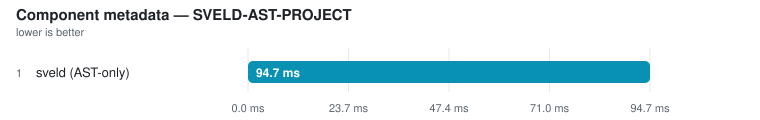
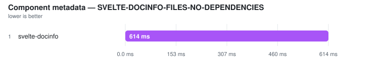
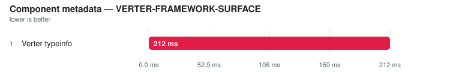

# Component metadata

> This page is **generated** from committed JSON snapshots (`results/benchmarks/`, `results/real_world/`). Do not edit by hand — run `pnpm run docs`.

## Results

Ranking rules and measurement definitions

Ranked on the **median of measured runs** — Warm is the primary ordering and ranking metric. Compiler rows additionally publish a separately sampled **Fresh child** column: the first timed row workload in a new child process, after excluded process startup, package imports and adapter setup. It is not called Cold (the OS page cache is not flushed) and its ratio never substitutes for the warm verdict. One table per comparable workload class: engine, invocation and threading remain row properties; target or explicitly different work may split classes — the latest official Svelte compiler is the sole compiler baseline, and a failed reference unranks the whole comparison rather than promoting a survivor. Every active variant must visit every execution position; shorter runs are unranked. A class with fewer than two valid rows is informational. Rows tagged **(JS)** run the JavaScript TypeScript compiler. Name markers: ⚠ failed validation (time bracketed, unranked) · ❌ error · ⏭ skipped. A row above CV 50% with at least three samples is bracketed as TOO NOISY TO RANK, baseline included.

- **Generated:** 2026-09-29T12:45:43.678Z
- **Fixture:** `fixtures/200` (200 Svelte files)
- **Runs / warmups:** 5 / 1
- **Runner:** Linux · linux/x64 · 4 CPUs · AMD EPYC 7763 64-Core Processor · 16 GB RAM · Node v22.23.2
- **Commit:** [1bc177a](https://github.com/pikax/svelte-benchmarks/commit/1bc177a)
- **CI run:** https://github.com/pikax/svelte-benchmarks/actions/runs/36569419030
- **Source:** `bench-Linux-200-bench.json`

### Component metadata

Files: **200** · Bytes: **134,760**

Tools:

- **sveld (AST-only)** — sveld component API extraction (AST-only; sveld 0.38 removed resolveTypes).
- **svelte-docinfo** — TypeScript-semantic Svelte component/module metadata extraction.
- **Verter typeinfo** — @verter/typeinfo decoding @verter/native's dedicated Svelte framework-surface metadata.

##### SVELD-AST-PROJECT — separate workload

<picture>
  <source media="(prefers-color-scheme: dark)" srcset="charts/component-meta-bench-linux-200-bench-component-meta-component-me-0r8vvn3-dark.svg">
  
</picture>

| Tool | Files | **Median (primary)** | Min | Stddev | CV% | vs fastest | Metadata items | Peak RSS | Throughput |
| --- | ---: | ---: | ---: | ---: | ---: | ---: | ---: | ---: | ---: |
| sveld (AST-only) | 200 | **94.7 ms** | 80.0 ms | 12.8 ms | 13.5% ⚠ | — | 260 | n/a | — |

Notes

- **sveld (AST-only)**: default AST-only extraction (sveld 0.38 removed resolveTypes); cache disabled | gate: ✓ 200/200 component records (200 unique) · 20/20 prop-bearing records (20 unique) · 60 props

##### SVELTE-DOCINFO-FILES-NO-DEPENDENCIES — separate workload

<picture>
  <source media="(prefers-color-scheme: dark)" srcset="charts/component-meta-bench-linux-200-bench-component-meta-component-me-11ekz4e-dark.svg">
  
</picture>

| Tool | Files | **Median (primary)** | Min | Stddev | CV% | vs fastest | Metadata items | Peak RSS | Throughput |
| --- | ---: | ---: | ---: | ---: | ---: | ---: | ---: | ---: | ---: |
| svelte-docinfo | 200 | **613.9 ms** | 588.7 ms | 21.7 ms | 3.5% | — | 260 | n/a | — |

Notes

- **svelte-docinfo**: TypeScript semantic analysis; dependency graph disabled because generated files have no imports | gate: ✓ 200/200 component records (200 unique) · 20/20 prop-bearing records (20 unique) · 60 props

##### VERTER-FRAMEWORK-SURFACE — separate workload

<picture>
  <source media="(prefers-color-scheme: dark)" srcset="charts/component-meta-bench-linux-200-bench-component-meta-component-me-1f97lmt-dark.svg">
  
</picture>

| Tool | Files | **Median (primary)** | Min | Stddev | CV% | vs fastest | Metadata items | Peak RSS | Throughput |
| --- | ---: | ---: | ---: | ---: | ---: | ---: | ---: | ---: | ---: |
| Verter typeinfo | 200 | **211.8 ms** | 202.3 ms | 6.1 ms | 2.9% | — | 260 | n/a | — |

Notes

- **Verter typeinfo**: @verter/typeinfo wire decoder over @verter/native's dedicated Svelte framework-surface executor | gate: ✓ 200/200 component records (200 unique) · 20/20 prop-bearing records (20 unique) · 60 props

Methodology

- Every metadata API is a separate workload class unless its discovery, dependency traversal, semantic products, and correctness gates are equivalent. Current metadata timings are informational, without cross-tool ratios.
- sveld analyzes the generated barrel/project with AST-only extraction; svelte-docinfo is TypeScript-semantic and globs Svelte files with dependency traversal disabled. Their work products are not asserted equivalent.
- Verter uses @verter/typeinfo's wire decoder over @verter/native's dedicated Svelte framework-surface executor. It is a separate API/workload class because sveld and svelte-docinfo perform project discovery and barrel analysis.
- Persistent caches are disabled and every measured pass re-analyzes the same staged files.
- Identity gate: component records and exact per-file prop-name sets must match the staged sources, with no missing, extra, or duplicated records.
- Staged entry: index.js; svelte-docinfo dependency traversal is disabled because this generated corpus has no component imports.

Raw runs:

- **sveld (AST-only)**: 111.2 ms, 106.4 ms, 94.7 ms, 80.0 ms, 88.5 ms
- **svelte-docinfo**: 646.4 ms, 613.9 ms, 588.7 ms, 604.8 ms, 625.1 ms
- **Verter typeinfo**: 218.1 ms, 215.9 ms, 202.3 ms, 209.9 ms, 211.8 ms

## Confirmation (correctness plants)

#### component-meta

| Case | Tool | Status | Detail |
| --- | --- | --- | --- |
| typed-props-with-defaults | sveld | ✓ pass |  |
| typed-props-with-defaults | svelte-docinfo | ✓ pass |  |
| typed-props-with-defaults | verter-typeinfo | ✓ pass |  |
| bindable-and-callbacks | sveld | ✓ pass |  |
| bindable-and-callbacks | svelte-docinfo | ✓ pass |  |
| bindable-and-callbacks | verter-typeinfo | ✓ pass |  |
| callback-signatures | sveld | ✓ pass |  |
| callback-signatures | svelte-docinfo | ✓ pass |  |
| callback-signatures | verter-typeinfo | ✗ fail | verter-typeinfo: prop "onMove": type "[object Object]" is not a callable type |
| plain-component | sveld | ✓ pass |  |
| plain-component | svelte-docinfo | ✓ pass |  |
| plain-component | verter-typeinfo | ✓ pass |  |

## Tool versions

Pinned package versions

| Package | Version |
| --- | --- |
| svelte | 5.57.1 |
| svelte-check | 4.7.6 |
| svelte-check-rs | 0.11.2 |
| svelte-check-native | 1.8.0 |
| @mrwaip/svelte-rs | 0.0.0-canary.15.1 |
| @rsvelte/compiler | 0.12.6 |
| @rsvelte/svelte2tsx | 0.2.28 |
| @rsvelte/svelte-check | 0.5.32 |
| @rsvelte/language-server | 0.7.13 |
| @rsvelte/fmt | 0.7.25 |
| @rsvelte/lint | 0.12.6 |
| @rsvelte/vite-plugin-svelte-native | 0.3.17 |
| @rsvelte/vite-plugin-svelte | 0.5.3 |
| @sveltejs/vite-plugin-svelte | 7.3.1 |
| vite | 8.3.1 |
| @verter/native | 0.0.1-beta.6 |
| @verter/typeinfo | 0.0.1-beta.6 |
| @verter/proto | 0.0.1-beta.6 |
| @bufbuild/protobuf | 2.16.0 |
| verter-tsc | 0.0.1-beta.6 |
| verter-lsp | 0.0.1-beta.6 |
| svelte-language-server | 0.18.4 |
| svelte2tsx | 0.7.61 |
| sveld | 0.38.0 |
| svelte-docinfo | 0.7.0 |
| prettier | 3.9.9 |
| prettier-plugin-svelte | 4.1.1 |
| oxfmt | 0.71.0 |
| eslint-plugin-svelte | 3.23.0 |
| typescript | 6.0.3 |
| cli:svelte-check | 4.7.6 |
| cli:svelte-check-rs | 0.11.2 |
| cli:svelte-check-native | 1.8.0 |
| cli:rsvelte-check | unknown |
| cli:rsvelte-fmt | 0.7.25 |
| cli:rsvelte-lint | 0.12.6 |
| cli:prettier | 3.9.9 |
| cli:oxfmt | 0.71.0 |
| cli:verter-tsc | 0.0.1-beta.6 |

