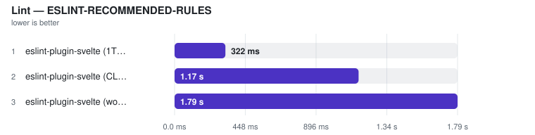
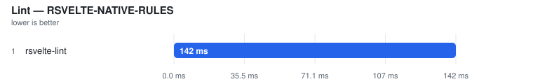

# Lint

> This page is **generated** from committed JSON snapshots (`results/benchmarks/`, `results/real_world/`). Do not edit by hand — run `pnpm run docs`.

## Results

Ranking rules and measurement definitions

Ranked on the **median of measured runs** — Warm is the primary ordering and ranking metric. Compiler rows additionally publish a separately sampled **Fresh child** column: the first timed row workload in a new child process, after excluded process startup, package imports and adapter setup. It is not called Cold (the OS page cache is not flushed) and its ratio never substitutes for the warm verdict. One table per comparable workload class: engine, invocation and threading remain row properties; target or explicitly different work may split classes — the latest official Svelte compiler is the sole compiler baseline, and a failed reference unranks the whole comparison rather than promoting a survivor. Every active variant must visit every execution position; shorter runs are unranked. A class with fewer than two valid rows is informational. Rows tagged **(JS)** run the JavaScript TypeScript compiler. Name markers: ⚠ failed validation (time bracketed, unranked) · ❌ error · ⏭ skipped. A row above CV 50% with at least three samples is bracketed as TOO NOISY TO RANK, baseline included.

- **Generated:** 2026-09-29T12:45:43.678Z
- **Fixture:** `fixtures/200` (200 Svelte files)
- **Runs / warmups:** 5 / 1
- **Runner:** Linux · linux/x64 · 4 CPUs · AMD EPYC 7763 64-Core Processor · 16 GB RAM · Node v22.23.2
- **Commit:** [1bc177a](https://github.com/pikax/svelte-benchmarks/commit/1bc177a)
- **CI run:** https://github.com/pikax/svelte-benchmarks/actions/runs/36569419030
- **Source:** `bench-Linux-200-bench.json`

### Lint

Files: **200** · Bytes: **134,760**

Tools:

- **eslint-plugin-svelte (1T API)** — ESLint API + eslint-plugin-svelte recommended rules, single-threaded.
- **eslint-plugin-svelte (worker pool)** — ESLint API + eslint-plugin-svelte recommended rules, split across worker threads.
- **eslint-plugin-svelte (CLI)** — ESLint CLI + eslint-plugin-svelte recommended rules.
- **rsvelte-lint** — @rsvelte/lint — Rust Svelte linter.
- **Verter host lint** — VerterHost lint/diagnostics API with fileKind=svelte; experimental and gated on the {@html} diagnostic.

##### ESLINT-RECOMMENDED-RULES — separate workload

<picture>
  <source media="(prefers-color-scheme: dark)" srcset="charts/lint-bench-linux-200-bench-lint-lint-class-eslint-recommended-rules-dark.svg">
  
</picture>

| Tool | Files | **Median (primary)** | Min | Stddev | CV% | vs fastest | Artifact | Peak RSS | Throughput |
| --- | ---: | ---: | ---: | ---: | ---: | ---: | ---: | ---: | ---: |
| eslint-plugin-svelte (1T API) | 200 | **321.8 ms** | 304.0 ms | 40.6 ms | 12.6% ⚠ | 1.00x | n/a | n/a | 621 files/s |
| eslint-plugin-svelte (CLI) | 200 | **1.17 s** | 1.13 s | 23.1 ms | 2.0% | 3.62x | n/a | n/a | 172 files/s |
| eslint-plugin-svelte (worker pool) | 200 | **1.79 s** | 1.78 s | 9.8 ms | 0.5% | 5.57x | n/a | n/a | 112 files/s |

Notes

- **eslint-plugin-svelte (1T API)**: ESLint flat config + eslint-plugin-svelte recommended; explicit file list | ⓘ file coverage by construction: the invocation receives all 200 corpus files as an explicit list.
- **eslint-plugin-svelte (CLI)**: eslint . over the same isolated corpus; pays startup and config load | ⓘ file coverage verified: named 200/200 planted Svelte files.
- **eslint-plugin-svelte (worker pool)**: ESLint worker_threads fan-out; explicit file list | ⓘ file coverage by construction: the invocation receives all 200 corpus files as an explicit list.

##### RSVELTE-NATIVE-RULES — separate workload

<picture>
  <source media="(prefers-color-scheme: dark)" srcset="charts/lint-bench-linux-200-bench-lint-lint-class-rsvelte-native-rules-dark.svg">
  
</picture>

| Tool | Files | **Median (primary)** | Min | Stddev | CV% | vs fastest | Artifact | Peak RSS | Throughput |
| --- | ---: | ---: | ---: | ---: | ---: | ---: | ---: | ---: | ---: |
| rsvelte-lint | 200 | **142.2 ms** | 140.6 ms | 22.2 ms | 15.6% ⚠ | — | n/a | n/a | — |

Notes

- **rsvelte-lint**: rsvelte-lint . (Rust linter) | ⓘ file coverage verified: named 200/200 planted Svelte files.

##### VERTER-NATIVE-DIAGNOSTICS — separate workload

<picture>
  <source media="(prefers-color-scheme: dark)" srcset="charts/lint-bench-linux-200-bench-lint-lint-class-verter-native-diagnostics-dark.svg">
  
</picture>

| Tool | Files | **Median (primary)** | Min | Stddev | CV% | vs fastest | Artifact | Peak RSS | Throughput |
| --- | ---: | ---: | ---: | ---: | ---: | ---: | ---: | ---: | ---: |
| Verter host lint ⚠ | 200 | (125.3 ms) | (122.4 ms) | – | – | not ranked | – | n/a | – |

Notes

- **Verter host lint ⚠**: VerterHost.upsert(fileKind=svelte) + lint/getDiagnostics for each explicit file | ⚠ FAILED VALIDATION — planted issue or markup work not observed | ⓘ file coverage by construction: the invocation receives all 200 corpus files as an explicit list.

Methodology

- Every tool receives the same isolated Svelte corpus.
- A planted {@html} issue must be reported; missing the template rule leaves the time visible but unranked.
- An untimed file-coverage census requires each directory-walk CLI to name every planted corpus file; explicit-list APIs are exact by construction.
- ESLint is measured in single-threaded API, worker-pool API, and CLI modes so invocation and thread-count costs remain visible.
- Rule sets are not identical, so ESLint recommended rules, rsvelte native rules, and Verter diagnostics are separate workload classes. The shared planted gate establishes minimum work but never cross-engine equivalence.
- Tool order is rotated; ranking metric is the median of warmed runs.

Raw runs:

- **eslint-plugin-svelte (1T API)**: 380.7 ms, 392.7 ms, 316.0 ms, 304.0 ms, 321.8 ms
- **eslint-plugin-svelte (CLI)**: 1.19 s, 1.16 s, 1.13 s, 1.17 s, 1.17 s
- **eslint-plugin-svelte (worker pool)**: 1.79 s, 1.78 s, 1.79 s, 1.79 s, 1.80 s
- **rsvelte-lint**: 141.2 ms, 144.9 ms, 140.6 ms, 191.6 ms, 142.2 ms
- **Verter host lint**: 126.1 ms, 122.4 ms, 125.3 ms, 125.1 ms, 126.2 ms

## Confirmation (correctness plants)

#### lint

| Case | Tool | Status | Detail |
| --- | --- | --- | --- |
| html-injection | eslint-plugin-svelte | ✓ pass |  |
| html-injection | rsvelte-lint | ✓ pass |  |
| html-injection | verter | ✗ fail | The input did not match the regular expression /html\|security\|unsafe/i. Input:  '[{"rule":"block-lang","category":"vue-recommended","severity":"warning","mess |
| dupe-else-if | eslint-plugin-svelte | ✓ pass |  |
| dupe-else-if | rsvelte-lint | ○ skip | no comparable rule in the native rule set |
| dupe-else-if | verter | ○ skip | no comparable rule in the native diagnostics |
| dupe-else-if | verter | ✓ pass |  |
| dupe-style-properties | eslint-plugin-svelte | ✓ pass |  |
| dupe-style-properties | rsvelte-lint | ○ skip | no comparable rule in the native rule set |
| dupe-style-properties | verter | ○ skip | no comparable rule in the native diagnostics |
| dupe-style-properties | verter | ✓ pass |  |

## Tool versions

Pinned package versions

| Package | Version |
| --- | --- |
| svelte | 5.57.1 |
| svelte-check | 4.7.6 |
| svelte-check-rs | 0.11.2 |
| svelte-check-native | 1.8.0 |
| @mrwaip/svelte-rs | 0.0.0-canary.15.1 |
| @rsvelte/compiler | 0.12.6 |
| @rsvelte/svelte2tsx | 0.2.28 |
| @rsvelte/svelte-check | 0.5.32 |
| @rsvelte/language-server | 0.7.13 |
| @rsvelte/fmt | 0.7.25 |
| @rsvelte/lint | 0.12.6 |
| @rsvelte/vite-plugin-svelte-native | 0.3.17 |
| @rsvelte/vite-plugin-svelte | 0.5.3 |
| @sveltejs/vite-plugin-svelte | 7.3.1 |
| vite | 8.3.1 |
| @verter/native | 0.0.1-beta.6 |
| @verter/typeinfo | 0.0.1-beta.6 |
| @verter/proto | 0.0.1-beta.6 |
| @bufbuild/protobuf | 2.16.0 |
| verter-tsc | 0.0.1-beta.6 |
| verter-lsp | 0.0.1-beta.6 |
| svelte-language-server | 0.18.4 |
| svelte2tsx | 0.7.61 |
| sveld | 0.38.0 |
| svelte-docinfo | 0.7.0 |
| prettier | 3.9.9 |
| prettier-plugin-svelte | 4.1.1 |
| oxfmt | 0.71.0 |
| eslint-plugin-svelte | 3.23.0 |
| typescript | 6.0.3 |
| cli:svelte-check | 4.7.6 |
| cli:svelte-check-rs | 0.11.2 |
| cli:svelte-check-native | 1.8.0 |
| cli:rsvelte-check | unknown |
| cli:rsvelte-fmt | 0.7.25 |
| cli:rsvelte-lint | 0.12.6 |
| cli:prettier | 3.9.9 |
| cli:oxfmt | 0.71.0 |
| cli:verter-tsc | 0.0.1-beta.6 |

