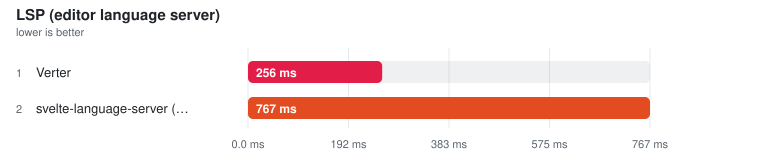
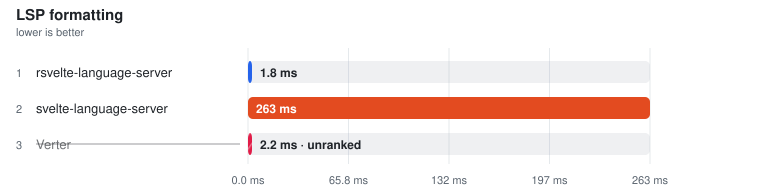

# LSP / IDE operations

> This page is **generated** from committed JSON snapshots (`results/benchmarks/`, `results/real_world/`). Do not edit by hand — run `pnpm run docs`.

## Results

Ranking rules and measurement definitions

Ranked on the **median of measured runs** — Warm is the primary ordering and ranking metric. Compiler rows additionally publish a separately sampled **Fresh child** column: the first timed row workload in a new child process, after excluded process startup, package imports and adapter setup. It is not called Cold (the OS page cache is not flushed) and its ratio never substitutes for the warm verdict. One table per comparable workload class: engine, invocation and threading remain row properties; target or explicitly different work may split classes — the latest official Svelte compiler is the sole compiler baseline, and a failed reference unranks the whole comparison rather than promoting a survivor. Every active variant must visit every execution position; shorter runs are unranked. A class with fewer than two valid rows is informational. Rows tagged **(JS)** run the JavaScript TypeScript compiler. Name markers: ⚠ failed validation (time bracketed, unranked) · ❌ error · ⏭ skipped. A row above CV 50% with at least three samples is bracketed as TOO NOISY TO RANK, baseline included.

- **Generated:** 2026-09-29T12:45:43.678Z
- **Fixture:** `fixtures/200` (200 Svelte files)
- **Runs / warmups:** 5 / 1
- **Runner:** Linux · linux/x64 · 4 CPUs · AMD EPYC 7763 64-Core Processor · 16 GB RAM · Node v22.23.2
- **Commit:** [1bc177a](https://github.com/pikax/svelte-benchmarks/commit/1bc177a)
- **CI run:** https://github.com/pikax/svelte-benchmarks/actions/runs/36569419030
- **Source:** `bench-Linux-200-bench.json`

### LSP (editor language server)

Files: **1** · Bytes: **227**

Tools:

- **svelte-language-server (JS)** — Official Svelte language server (stdio) from svelte-language-server.
- **Verter** — verter-lsp — native server from the published npm package; experimental Svelte carrier.

<picture>
  <source media="(prefers-color-scheme: dark)" srcset="charts/lsp-bench-linux-200-bench-lsp-lsp-all-dark.svg">
  
</picture>

| Tool | Files | **Median (primary)** | Min | Stddev | CV% | vs fastest | Hover bytes | Peak RSS | Throughput |
| --- | ---: | ---: | ---: | ---: | ---: | ---: | ---: | ---: | ---: |
| Verter | 1 | **256.0 ms** | 249.4 ms | 13.9 ms | 5.4% | 1.00x | 43 | n/a | 4 files/s |
| svelte-language-server (JS) | 1 | **766.7 ms** | 753.7 ms | 10.2 ms | 1.3% | 3.00x | 43 | n/a | 1 files/s |

Notes

- **Verter**: verter-lsp — native server (experimental Svelte carrier when enabled) | init=39ms · open→hover=284ms · hoverWarm=3ms
- **svelte-language-server (JS)**: Official Svelte language server (stdio) | init=482ms · open→hover=767ms · hoverWarm=1ms

Methodology

- Identical workspace, LspTarget.svelte, UTF-16 hover position on benchMarker.
- Hover content gated on script position and template {benchMarker}.
- Fresh language-server process per measured run.
- Primary ranking column: didOpen→hover latency (median of warmed runs).
- VS Code extension host overhead is NOT measured — only stdio LSP.

Raw runs:

- **Verter**: 284.5 ms, 256.0 ms, 260.4 ms, 249.4 ms, 253.1 ms
- **svelte-language-server (JS)**: 766.7 ms, 757.4 ms, 774.5 ms, 753.7 ms, 777.0 ms

### LSP formatting

Files: **1** · Bytes: **166**

Tools:

- **svelte-language-server** — Official Svelte language server (stdio) from svelte-language-server.
- **rsvelte-language-server** — @rsvelte/language-server — formatting and native Svelte lint diagnostics; no TypeScript hover/completion.
- **Verter** — verter-lsp — native server from the published npm package; experimental Svelte carrier.

<picture>
  <source media="(prefers-color-scheme: dark)" srcset="charts/lsp-bench-linux-200-bench-lsp-format-lsp-format-all-dark.svg">
  
</picture>

| Tool | Files | **Median (primary)** | Min | Stddev | CV% | vs fastest | Formatted bytes | Peak RSS | Throughput |
| --- | ---: | ---: | ---: | ---: | ---: | ---: | ---: | ---: | ---: |
| rsvelte-language-server | 1 | **1.8 ms** | 1.4 ms | 0.2 ms | 10.9% ⚠ | 1.00x | 176 | n/a | 545 files/s |
| svelte-language-server | 1 | **263.3 ms** | 260.0 ms | 10.2 ms | 3.9% | 143.41x | 176 | n/a | 4 files/s |
| Verter ⚠ | 1 | (2.2 ms) | (1.7 ms) | – | – | not ranked | (167) | n/a | – |

Notes

- **rsvelte-language-server**: Fresh stdio server; didOpen→formatting | gate: ✓ changed=true script=true markup=true
- **svelte-language-server**: Fresh stdio server; didOpen→formatting | gate: ✓ changed=true script=true markup=true
- **Verter ⚠**: Fresh stdio server; didOpen→formatting | gate: ✗ changed=true script=false markup=false

Methodology

- This surface exists separately from hover: rsvelte-language-server implements formatting and lint diagnostics, not TypeScript hover.
- Every pass starts a fresh stdio server, opens the same valid Svelte 5 component, and times textDocument/formatting.
- The output must rewrite both script and nested markup; a server that returns no edits or formats only one region is unranked.
- Server initialization is completed before the primary interval and is therefore not included in didOpen→formatting.

Raw runs:

- **rsvelte-language-server**: 1.9 ms, 1.8 ms, 2.0 ms, 1.4 ms, 1.8 ms
- **svelte-language-server**: 260.0 ms, 263.6 ms, 260.9 ms, 263.3 ms, 284.5 ms
- **Verter**: 6.9 ms, 2.0 ms, 1.7 ms, 2.2 ms, 7.1 ms

## Tool versions

Pinned package versions

| Package | Version |
| --- | --- |
| svelte | 5.57.1 |
| svelte-check | 4.7.6 |
| svelte-check-rs | 0.11.2 |
| svelte-check-native | 1.8.0 |
| @mrwaip/svelte-rs | 0.0.0-canary.15.1 |
| @rsvelte/compiler | 0.12.6 |
| @rsvelte/svelte2tsx | 0.2.28 |
| @rsvelte/svelte-check | 0.5.32 |
| @rsvelte/language-server | 0.7.13 |
| @rsvelte/fmt | 0.7.25 |
| @rsvelte/lint | 0.12.6 |
| @rsvelte/vite-plugin-svelte-native | 0.3.17 |
| @rsvelte/vite-plugin-svelte | 0.5.3 |
| @sveltejs/vite-plugin-svelte | 7.3.1 |
| vite | 8.3.1 |
| @verter/native | 0.0.1-beta.6 |
| @verter/typeinfo | 0.0.1-beta.6 |
| @verter/proto | 0.0.1-beta.6 |
| @bufbuild/protobuf | 2.16.0 |
| verter-tsc | 0.0.1-beta.6 |
| verter-lsp | 0.0.1-beta.6 |
| svelte-language-server | 0.18.4 |
| svelte2tsx | 0.7.61 |
| sveld | 0.38.0 |
| svelte-docinfo | 0.7.0 |
| prettier | 3.9.9 |
| prettier-plugin-svelte | 4.1.1 |
| oxfmt | 0.71.0 |
| eslint-plugin-svelte | 3.23.0 |
| typescript | 6.0.3 |
| cli:svelte-check | 4.7.6 |
| cli:svelte-check-rs | 0.11.2 |
| cli:svelte-check-native | 1.8.0 |
| cli:rsvelte-check | unknown |
| cli:rsvelte-fmt | 0.7.25 |
| cli:rsvelte-lint | 0.12.6 |
| cli:prettier | 3.9.9 |
| cli:oxfmt | 0.71.0 |
| cli:verter-tsc | 0.0.1-beta.6 |

