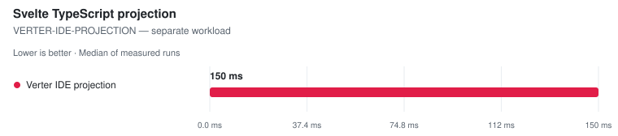

# Projection (svelte2tsx)

> This page is **generated** from committed JSON snapshots (`results/benchmarks/`, `results/real_world/`). Do not edit by hand — run `pnpm run docs`.

## Results

Ranking rules and measurement definitions

Ranked on the **median of measured runs** — Warm is the primary ordering and ranking metric. Compiler rows additionally publish a separately sampled **Fresh child** column: the first timed row workload in a new child process, after excluded process startup, package imports and adapter setup. It is not called Cold (the OS page cache is not flushed) and its ratio never substitutes for the warm verdict. One table per comparable workload class: engine, invocation and threading remain row properties; target or explicitly different work may split classes — a pinned official Svelte reference is the baseline of its compatibility class, and a failed reference unranks the whole class rather than promoting a survivor. Every active variant must visit every execution position; shorter runs are unranked. A class with fewer than two valid rows is informational. Rows tagged **(JS)** run the JavaScript TypeScript compiler. Name markers: ⚠ failed validation (time bracketed, unranked) · ❌ error · ⏭ skipped. A row above CV 50% with at least three samples is bracketed as TOO NOISY TO RANK, baseline included.

- **Generated:** 2026-09-12T10:46:24.868Z
- **Fixture:** `fixtures/200` (200 Svelte files)
- **Runs / warmups:** 5 / 1
- **Runner:** Linux · linux/x64 · 4 CPUs · AMD EPYC 7763 64-Core Processor · 16 GB RAM · Node v22.23.2
- **Commit:** [cc44ddb](https://github.com/pikax/svelte-benchmarks/commit/cc44ddb)
- **CI run:** https://github.com/pikax/svelte-benchmarks/actions/runs/34688909557
- **Source:** `bench-Linux-200-bench.json`

### Svelte TypeScript projection

Files: **200** · Bytes: **134,760**

Tools:

- **svelte2tsx** — Official Svelte-to-TSX projection from sveltejs/language-tools.
- **@rsvelte/svelte2tsx (Wasm)** — rsvelte Rust/Wasm drop-in Svelte-to-TSX projection.
- **Verter IDE projection** — VerterHost ensureIdeCompiled/getIde Svelte projection; separate schema from svelte2tsx.

##### SVELTE2TSX-COMPATIBLE — separate workload

<picture>
  <source media="(prefers-color-scheme: dark)" srcset="charts/projection-bench-linux-200-bench-projection-projection-class-sve-1trvr77-dark.svg">
  
</picture>

| Tool | Files | **Median (primary)** | Min | Stddev | CV% | vs fastest | TSX bytes | Peak RSS | Throughput |
| --- | ---: | ---: | ---: | ---: | ---: | ---: | ---: | ---: | ---: |
| @rsvelte/svelte2tsx (Wasm) | 200 | **38.8 ms** | 37.9 ms | 2.9 ms | 7.4% | 1.00x | 253,740 | 181.848 MB | 5.1k files/s |
| svelte2tsx | 200 | **156.2 ms** | 142.4 ms | 8.8 ms | 5.6% | 4.02x | 253,740 | 131.832 MB | 1.3k files/s |

Notes

- **@rsvelte/svelte2tsx (Wasm)**: Rust/Wasm drop-in; TypeScript-printer structural parity against official output | gate: ✓ 200/200 valid TSX outputs
- **svelte2tsx**: Official svelte2tsx, Svelte 5 TS projection | gate: ✓ 200/200 valid TSX outputs

##### VERTER-IDE-PROJECTION — separate workload

<picture>
  <source media="(prefers-color-scheme: dark)" srcset="charts/projection-bench-linux-200-bench-projection-projection-class-ver-1iuap19-dark.svg">
  
</picture>

| Tool | Files | **Median (primary)** | Min | Stddev | CV% | vs fastest | Projection bytes | Peak RSS | Throughput |
| --- | ---: | ---: | ---: | ---: | ---: | ---: | ---: | ---: | ---: |
| Verter IDE projection | 200 | **149.5 ms** | 147.5 ms | 1.1 ms | 0.7% | — | 2,403,380 | 85.273 MB | — |

Notes

- **Verter IDE projection**: Native ensureIdeCompiled/getIde Svelte path; separate class because this is Verter's IDE carrier, not a svelte2tsx-compatible schema | gate: ✓ 200/200 valid Svelte IDE projections

Methodology

- This is the type-analysis projection used by Svelte-aware TypeScript tooling; it is not runtime compilation or component documentation.
- The svelte2tsx-compatible rows use the synchronous in-process API with identical Svelte 5 options and file order.
- Every output must parse as TSX and contain tool-specific Svelte projection helpers.
- The rsvelte row must match official output after TypeScript parses and reprints both outputs, ignoring formatting-only whitespace while retaining syntax and comments.
- Verter's ensureIdeCompiled/getIde output is a genuine Svelte IDE projection, but its carrier and helper contract differ from svelte2tsx; it is therefore measured in a separate comparison class.

Raw runs:

- **@rsvelte/svelte2tsx (Wasm)**: 44.7 ms, 40.9 ms, 37.9 ms, 37.9 ms, 38.8 ms
- **svelte2tsx**: 156.2 ms, 156.8 ms, 163.6 ms, 145.1 ms, 142.4 ms
- **Verter IDE projection**: 149.0 ms, 149.5 ms, 149.8 ms, 147.5 ms, 150.4 ms

## Confirmation (correctness plants)

#### projection

| Case | Tool | Status | Detail |
| --- | --- | --- | --- |
| svelte-projection | svelte2tsx | ✓ pass |  |
| svelte-projection | @rsvelte/svelte2tsx | ✓ pass |  |
| svelte-projection | verter | ✓ pass |  |

## Memory (isolated probe)

| Surface | Tool | Peak RSS | Retained Δ | CPU ms | Status |
| --- | --- | ---: | ---: | ---: | --- |
| projection | svelte2tsx | 131.8 MB | 84.219 MB | 1124.299 | ok |
| projection | @rsvelte/svelte2tsx (Wasm) | 181.8 MB | 113.129 MB | 590.615 | ok |
| projection | Verter IDE projection | 85.3 MB | 40.098 MB | 217.81 | ok |

## Tool versions

Pinned package versions

| Package | Version |
| --- | --- |
| svelte | 5.57.0 |
| svelte-mrwaip-reference | 5.56.4 |
| svelte-check | 4.7.6 |
| svelte-check-rs | 0.11.2 |
| svelte-check-native | 1.5.2 |
| @mrwaip/svelte-rs | 0.0.0-canary.13.1 |
| @rsvelte/compiler | 0.12.2 |
| @rsvelte/svelte2tsx | 0.2.26 |
| @rsvelte/svelte-check | 0.5.28 |
| @rsvelte/language-server | 0.7.8 |
| @rsvelte/fmt | 0.7.23 |
| @rsvelte/lint | 0.12.2 |
| @rsvelte/vite-plugin-svelte-native | 0.3.14 |
| @rsvelte/vite-plugin-svelte | 0.5.2 |
| @sveltejs/vite-plugin-svelte | 7.3.0 |
| vite | 8.3.0 |
| @verter/native | 0.0.1-beta.3 |
| @verter/typeinfo | 0.0.1-beta.3 |
| @verter/proto | 0.0.1-beta.3 |
| @bufbuild/protobuf | 2.15.0 |
| verter-tsc | 0.0.1-beta.3 |
| verter-lsp | 0.0.1-beta.3 |
| svelte-language-server | 0.18.4 |
| svelte2tsx | 0.7.61 |
| sveld | 0.36.11 |
| svelte-docinfo | 0.7.0 |
| prettier | 3.9.6 |
| prettier-plugin-svelte | 4.1.1 |
| oxfmt | 0.67.0 |
| eslint-plugin-svelte | 3.23.0 |
| typescript | 6.0.3 |
| cli:svelte-check | 4.7.6 |
| cli:svelte-check-rs | 0.11.2 |
| cli:svelte-check-native | 1.5.2 |
| cli:rsvelte-check | unknown |
| cli:rsvelte-fmt | 0.7.23 |
| cli:rsvelte-lint | 0.12.2 |
| cli:prettier | 3.9.6 |
| cli:oxfmt | 0.67.0 |
| cli:verter-tsc | 0.0.1-beta.3 |

