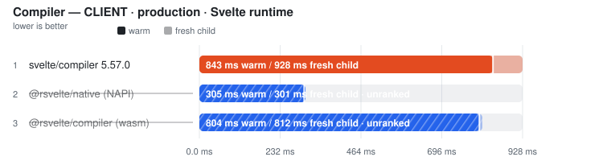
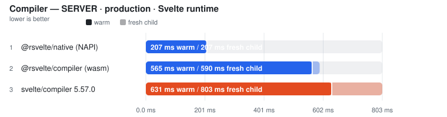
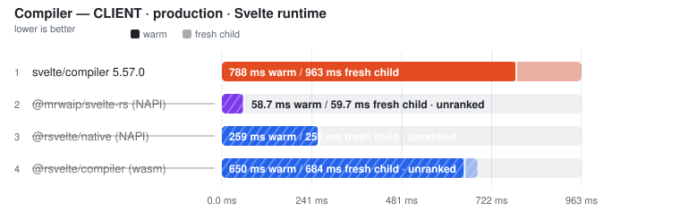
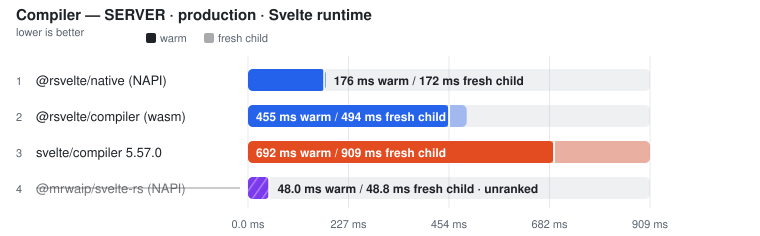
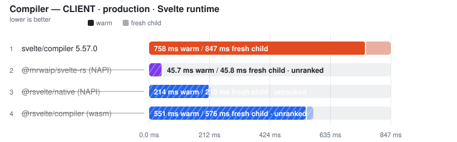
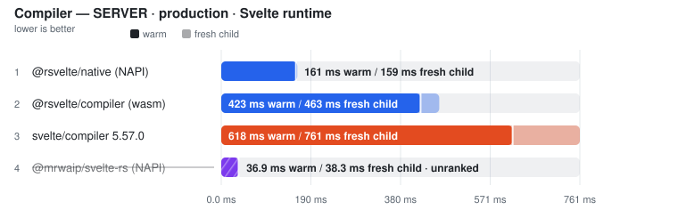

# Real-world projects

> Generated from committed snapshots under `results/real_world/`. Ranked within a corpus, never across projects. Pinned revisions — see each project's provenance line.

Ranking rules and measurement definitions

Ranked on the **median of measured runs** — Warm is the primary ordering and ranking metric. Compiler rows additionally publish a separately sampled **Fresh child** column: the first timed row workload in a new child process, after excluded process startup, package imports and adapter setup. It is not called Cold (the OS page cache is not flushed) and its ratio never substitutes for the warm verdict. One table per comparable workload class: engine, invocation and threading remain row properties; target or explicitly different work may split classes — the latest official Svelte compiler is the sole compiler baseline, and a failed reference unranks the whole comparison rather than promoting a survivor. Every active variant must visit every execution position; shorter runs are unranked. A class with fewer than two valid rows is informational. Rows tagged **(JS)** run the JavaScript TypeScript compiler. Name markers: ⚠ failed validation (time bracketed, unranked) · ❌ error · ⏭ skipped. A row above CV 50% with at least three samples is bracketed as TOO NOISY TO RANK, baseline included.

## carbon-components-svelte

- **Generated:** 2026-09-18T13:14:10.971Z
- **Fixture:** `pinned real-world Svelte source checkouts` (287 Svelte files)
- **Runs / warmups:** 5 / 1
- **Runner:** Linux · linux/x64 · 4 CPUs · AMD EPYC 7763 64-Core Processor · 16 GB RAM · Node v22.23.2
- **Commit:** [649f404](https://github.com/pikax/svelte-benchmarks/commit/649f404)
- **CI run:** https://github.com/pikax/svelte-benchmarks/actions/runs/35348275151
- **Source:** `real-world-Linux-carbon-components-svelte.json`

Corpus: carbon-components-svelte:components

### SFC compile (unique contents)

Files: **287** · Bytes: **941,662**

Corpus: carbon-components-svelte:components @ v0.110.2 (dec0ea44, released/committed 2026-07-31) · 287 SFCs · library-source · Apache-2.0

Tools:

- **svelte/compiler 5.57.0** — Official svelte/compiler compile() API, single-threaded.
- **@mrwaip/svelte-rs (NAPI)** — MrWaip/svelte-rs native compiler through its svelte/compiler-compatible API.
- **@rsvelte/compiler (wasm)** — rsvelte WASM compiler bindings.
- **@rsvelte/native (NAPI)** — rsvelte native NAPI compiler (@rsvelte/vite-plugin-svelte-native).
- **Verter (stateless)** — VerterHost.compileMany without cross-run cache; experimental Svelte carrier.

Validation (runtime semantic plants):

Suite 2026-09-12.2 · hash 451381a17402 · 2 cell(s)

| Cell | Status | Entrypoint verdicts |
| --- | --- | --- |
| client/production/source-map-off | FAIL | svelte-official: PASS · mrwaip-svelte-rs: FAIL · rsvelte-wasm: FAIL · rsvelte-native: FAIL · verter-svelte: FAIL |
| server/production/source-map-off | FAIL | svelte-official: PASS · mrwaip-svelte-rs: FAIL · rsvelte-wasm: PASS · rsvelte-native: PASS · verter-svelte: FAIL |

Compile results are **grouped by target × environment**, then by comparison class.

#### CLIENT · production

Target: `client` · Environment: `production`

##### EXPERIMENTAL-SVELTE — separate workload

<picture>
  <source media="(prefers-color-scheme: dark)" srcset="charts/real-world-carbon-components-svelte-real-world-linux-carbon-comp-11zo403-dark.svg">
  
</picture>

| Tool | Files | Fresh child | vs fastest fresh | **Warm (primary)** | Min | Stddev | CV% | vs fastest | Code bytes | Peak RSS | Throughput |
| --- | ---: | ---: | ---: | ---: | ---: | ---: | ---: | ---: | ---: | ---: | ---: |
| Verter (stateless) ⚠ | 287 | (165.4 ms) | not ranked | (163.2 ms) | (159.4 ms) | – | – | not ranked | (0) | n/a | – |

Notes

- **Verter (stateless) ⚠**: VerterHost.compileMany(target=runtime-render, mode=stateless, 1 CPU thread) on the same revised Svelte inputs. Diagnostic timing only: the published path is not validated as a Svelte runtime compiler; invalid/empty output and per-file errors are retained, never ranked. | output gate: FAIL — returned empty JavaScript; 287/287 entries, 287 compile errors, 287 entries missing the CSS revision token; first error: [00000--Accordion.svelte] host error: runtime surface refused for '00000--Accordion.svelte': svelte-runtime-unsupported-magic-identifier: Svelte client emission does not yet support the compiler-magic identifier `$$restProps` (the official  | ⓘ adapter parity: 10 distinct input revisions across 10 passes (warm + fresh child) | ⚠ RUNTIME SEMANTIC VALIDITY FAIL (4/33 plants) — state-derived-update (plant): [Plant.svelte] host error: runtime surface refused for 'Plant.svelte': svelte-runtime-unsupported-advanced-rune: Svelte client emission does not yet support the `$derived` rune form.; bindable-prop (plant): [Plant.svelte] host error: runtime surface refused for 'Plant.svelte': svelte-runtime-unsupported-advanced-rune: Svelte client emission does not yet support the `$props() non-interpolation usage` rune form.; callback-prop-events (plant): [Plant.svelte] host error: runtime surface refused for 'Plant.svelte': svelte-runtime-unsupported-non-delegated-event: Svelte client emission does not yet support the non-delegated / capture / global event `click`.

##### Svelte runtime

<picture>
  <source media="(prefers-color-scheme: dark)" srcset="charts/real-world-carbon-components-svelte-real-world-linux-carbon-comp-04u9s1o-dark.svg">
  
</picture>

| Tool | Files | Fresh child | vs fastest fresh | **Warm (primary)** | Min | Stddev | CV% | vs fastest | Code bytes | Peak RSS | Throughput |
| --- | ---: | ---: | ---: | ---: | ---: | ---: | ---: | ---: | ---: | ---: | ---: |
| svelte/compiler 5.57.0 | 287 | 1.28 s | — | **1.07 s** | 1.01 s | 31.0 ms | 2.9% | — | 1,750,066 | n/a | — |
| @mrwaip/svelte-rs (NAPI) ⚠ | 287 | (97.9 ms) | not ranked | (94.3 ms) | (93.4 ms) | – | – | not ranked | (1,502,774) | n/a | – |
| @rsvelte/native (NAPI) ⚠ | 287 | (391.3 ms) | not ranked | (382.6 ms) | (378.7 ms) | – | – | not ranked | (1,748,162) | n/a | – |
| @rsvelte/compiler (wasm) ⚠ | 287 | (1.09 s) | not ranked | (1.01 s) | (998.5 ms) | – | – | not ranked | (1,748,245) | n/a | – |

Notes

- **svelte/compiler 5.57.0**: Official svelte/compiler compile(), generate=client, dev=false, css=external, runes=auto | runtime gate: ✓ 287/287 parseable outputs use svelte/internal/client and match official CSS presence; dev option changes output | ⓘ adapter parity: 10 distinct input revisions across 10 passes (warm + fresh child) | ✓ runtime semantic validity: 33/33 plants passed through svelte/compiler compile() per plant, css=external, runes=true | ✓ source-map coordinates: 4/4 anchored tokens traced exactly (LF/CRLF, non-BMP)
- **@mrwaip/svelte-rs (NAPI) ⚠**: @mrwaip/svelte-rs compile(), generate=client, dev=false, css=external | runtime gate: ✓ 287/287 parseable outputs use svelte/internal/client and match official CSS presence; dev option changes output | ⓘ adapter parity: 10 distinct input revisions across 10 passes (warm + fresh child) | ⚠ SOURCE-MAP COORDINATE VALIDITY FAIL — all 33 runtime plants passed, but generated JS/CSS tokens did not trace back to their exact source positions (lf-styles: css.css-0: mapped to 2:24; expected 9:24; crlf-styles: css.css-0: mapped to 2:24; expected 9:24). The timing remains visible but cannot rank until the emitted maps are correct.
- **@rsvelte/native (NAPI) ⚠**: rsvelte NAPI compile(), generate=client, dev=false, css=external | runtime gate: ✓ 287/287 parseable outputs use svelte/internal/client and match official CSS presence; dev option changes output | ⓘ adapter parity: 10 distinct input revisions across 10 passes (warm + fresh child) | ⚠ SOURCE-MAP COORDINATE VALIDITY FAIL — all 33 runtime plants passed, but generated JS/CSS tokens did not trace back to their exact source positions (lf-raw: js.script: mapped to 2:19; expected 2:17; lf-styles: js.script: mapped to 2:19; expected 2:17). The timing remains visible but cannot rank until the emitted maps are correct.
- **@rsvelte/compiler (wasm) ⚠**: rsvelte WASM compile(), generate=client, dev=false, css=external. ⚠ WASM path — not the NAPI native binding. | runtime gate: ✓ 287/287 parseable outputs use svelte/internal/client and match official CSS presence; dev option changes output | ⓘ adapter parity: 10 distinct input revisions across 10 passes (warm + fresh child) | ⚠ SOURCE-MAP COORDINATE VALIDITY FAIL — all 33 runtime plants passed, but generated JS/CSS tokens did not trace back to their exact source positions (lf-raw: js.template: generated token has no original mapping; lf-styles: js.template: generated token has no original mapping). The timing remains visible but cannot rank until the emitted maps are correct.

Raw runs

- **Verter (stateless)**: 163.0 ms, 166.0 ms, 165.7 ms, 163.2 ms, 159.4 ms · fresh child: 162.2 ms, 166.6 ms, 166.4 ms, 163.8 ms, 165.4 ms
- **svelte/compiler 5.57.0**: 1.06 s, 1.10 s, 1.07 s, 1.01 s, 1.07 s · fresh child: 1.28 s, 1.28 s, 1.37 s, 1.32 s, 1.28 s
- **@mrwaip/svelte-rs (NAPI)**: 94.3 ms, 93.5 ms, 93.4 ms, 96.5 ms, 95.9 ms · fresh child: 108.5 ms, 96.8 ms, 95.3 ms, 98.2 ms, 97.9 ms
- **@rsvelte/native (NAPI)**: 397.8 ms, 381.0 ms, 382.6 ms, 384.0 ms, 378.7 ms · fresh child: 387.4 ms, 380.5 ms, 399.4 ms, 391.3 ms, 394.0 ms
- **@rsvelte/compiler (wasm)**: 1.01 s, 998.5 ms, 1.02 s, 1.06 s, 1.01 s · fresh child: 1.08 s, 1.05 s, 1.09 s, 1.10 s, 1.10 s

#### SERVER · production

Target: `server` · Environment: `production`

##### EXPERIMENTAL-SVELTE — separate workload

<picture>
  <source media="(prefers-color-scheme: dark)" srcset="charts/real-world-carbon-components-svelte-real-world-linux-carbon-comp-1q4nvvz-dark.svg">
  
</picture>

| Tool | Files | Fresh child | vs fastest fresh | **Warm (primary)** | Min | Stddev | CV% | vs fastest | Code bytes | Peak RSS | Throughput |
| --- | ---: | ---: | ---: | ---: | ---: | ---: | ---: | ---: | ---: | ---: | ---: |
| Verter (stateless) ⚠ | 287 | (84.1 ms) | not ranked | (85.8 ms) | (84.1 ms) | – | – | not ranked | (0) | n/a | – |

Notes

- **Verter (stateless) ⚠**: VerterHost.compileMany(target=runtime-render, mode=stateless, 1 CPU thread) on the same revised Svelte inputs. Diagnostic timing only: the published path is not validated as a Svelte runtime compiler; invalid/empty output and per-file errors are retained, never ranked. | output gate: FAIL — returned empty JavaScript; 287/287 entries, 287 compile errors, 287 entries missing the CSS revision token; first error: [00000--Accordion.svelte] host error: runtime surface refused for '00000--Accordion.svelte': svelte-runtime-unsupported-server-generate: Svelte client emission does not yet support server-side rendering (`generate: 'server'`). | ⓘ adapter parity: 10 distinct input revisions across 10 passes (warm + fresh child) | ⚠ RUNTIME SEMANTIC VALIDITY FAIL (0/33 plants) — props-defaults-interpolation (plant): [Plant.svelte] host error: runtime surface refused for 'Plant.svelte': svelte-runtime-unsupported-server-generate: Svelte client emission does not yet support server-side rendering (`generate: 'server'`).; state-derived-update (plant): [Plant.svelte] host error: runtime surface refused for 'Plant.svelte': svelte-runtime-unsupported-server-generate: Svelte client emission does not yet support server-side rendering (`generate: 'server'`).; bindable-prop (plant): [Plant.svelte] host error: runtime surface refused for 'Plant.svelte': svelte-runtime-unsupported-server-generate: Svelte client emission does not yet support server-side rendering (`generate: 'server'`).

##### Svelte runtime

<picture>
  <source media="(prefers-color-scheme: dark)" srcset="charts/real-world-carbon-components-svelte-real-world-linux-carbon-comp-0megbpc-dark.svg">
  
</picture>

| Tool | Files | Fresh child | vs fastest fresh | **Warm (primary)** | Min | Stddev | CV% | vs fastest | Code bytes | Peak RSS | Throughput |
| --- | ---: | ---: | ---: | ---: | ---: | ---: | ---: | ---: | ---: | ---: | ---: |
| @rsvelte/native (NAPI) | 287 | 255.5 ms | 1.00x | **263.4 ms** | 263.0 ms | 2.0 ms | 0.7% | 1.00x | 1,260,940 | n/a | 1.1k files/s |
| @rsvelte/compiler (wasm) | 287 | 756.5 ms | 2.96x | **721.1 ms** | 717.1 ms | 4.7 ms | 0.6% | 2.74x | 1,260,940 | n/a | 398 files/s |
| svelte/compiler 5.57.0 | 287 | 1.10 s | 4.31x | **902.2 ms** | 870.2 ms | 44.2 ms | 4.9% | 3.43x | 1,262,630 | n/a | 318 files/s |
| @mrwaip/svelte-rs (NAPI) ⚠ | 287 | (80.5 ms) | not ranked | (78.2 ms) | (77.2 ms) | – | – | not ranked | (1,001,022) | n/a | – |

Notes

- **@rsvelte/native (NAPI)**: rsvelte NAPI compile(), generate=server, dev=false, css=external | runtime gate: ✓ 287/287 parseable outputs use svelte/internal/server and match official CSS presence; dev option changes output | ⓘ adapter parity: 10 distinct input revisions across 10 passes (warm + fresh child) | ✓ runtime semantic validity: 33/33 plants passed through @rsvelte/vite-plugin-svelte-native compileSync() per plant, css=external, runes=true | ✓ source-map coordinates: 4/4 anchored tokens traced exactly (LF/CRLF, non-BMP)
- **@rsvelte/compiler (wasm)**: rsvelte WASM compile(), generate=server, dev=false, css=external. ⚠ WASM path — not the NAPI native binding. | runtime gate: ✓ 287/287 parseable outputs use svelte/internal/server and match official CSS presence; dev option changes output | ⓘ adapter parity: 10 distinct input revisions across 10 passes (warm + fresh child) | ✓ runtime semantic validity: 33/33 plants passed through @rsvelte/compiler compile() per plant after initSync, css=external, runes=true | ✓ source-map coordinates: 4/4 anchored tokens traced exactly (LF/CRLF, non-BMP)
- **svelte/compiler 5.57.0**: Official svelte/compiler compile(), generate=server, dev=false, css=external, runes=auto | runtime gate: ✓ 287/287 parseable outputs use svelte/internal/server and match official CSS presence; dev option changes output | ⓘ adapter parity: 10 distinct input revisions across 10 passes (warm + fresh child) | ✓ runtime semantic validity: 33/33 plants passed through svelte/compiler compile() per plant, css=external, runes=true | ✓ source-map coordinates: 4/4 anchored tokens traced exactly (LF/CRLF, non-BMP)
- **@mrwaip/svelte-rs (NAPI) ⚠**: @mrwaip/svelte-rs compile(), generate=server, dev=false, css=external | runtime gate: ✓ 287/287 parseable outputs use svelte/internal/server and match official CSS presence; dev option changes output | ⓘ adapter parity: 10 distinct input revisions across 10 passes (warm + fresh child) | ⚠ SOURCE-MAP COORDINATE VALIDITY FAIL — all 33 runtime plants passed, but generated JS/CSS tokens did not trace back to their exact source positions (lf-raw: js.missing or invalid version-3 source map; lf-styles: js.missing or invalid version-3 source map). The timing remains visible but cannot rank until the emitted maps are correct.

Raw runs

- **Verter (stateless)**: 85.8 ms, 89.7 ms, 84.1 ms, 87.3 ms, 85.0 ms · fresh child: 85.6 ms, 82.5 ms, 83.2 ms, 84.1 ms, 85.6 ms
- **@rsvelte/native (NAPI)**: 266.8 ms, 263.4 ms, 263.0 ms, 266.8 ms, 263.4 ms · fresh child: 254.0 ms, 262.5 ms, 256.4 ms, 252.9 ms, 255.5 ms
- **@rsvelte/compiler (wasm)**: 729.7 ms, 720.5 ms, 721.1 ms, 717.1 ms, 721.1 ms · fresh child: 754.1 ms, 773.0 ms, 772.2 ms, 756.5 ms, 754.9 ms
- **svelte/compiler 5.57.0**: 895.2 ms, 902.2 ms, 924.5 ms, 986.9 ms, 870.2 ms · fresh child: 1.12 s, 1.21 s, 1.09 s, 1.10 s, 1.07 s
- **@mrwaip/svelte-rs (NAPI)**: 79.5 ms, 79.5 ms, 77.2 ms, 77.8 ms, 78.2 ms · fresh child: 79.9 ms, 82.3 ms, 84.6 ms, 80.2 ms, 80.5 ms

Methodology

- Matrix: generate ∈ {client, server} × env ∈ {production, development} × source-map ∈ {off, on} (off by default).
- Every compiler receives the same in-memory Svelte SFC corpus. The latest official Svelte compiler is the sole reference and decides real-world eligibility for every tool.
- Official: svelte/compiler compile() with runes=auto. Generated fixtures force runes; real-world sources use compiler auto-detection.
- MrWaip: @mrwaip/svelte-rs native compiler through its compatible compile() API, validated against the same latest Svelte runtime and official baseline as every other compiler.
- rsvelte: WASM (@rsvelte/compiler) and NAPI (@rsvelte/vite-plugin-svelte-native) paths are separate rows against the same official Svelte baseline.
- Verter's published compileMany runtime-render path receives the same revised Svelte inputs with stateless caching and one CPU thread. Completed passes publish warm/fresh timings even when their code is invalid or entries contain compile errors. They are permanently unranked diagnostic evidence until the adapter is validated; errors, output samples, revision-token failures and runtime-plant verdicts are retained. Only a missing API/package is skipped; a thrown batch failure is an error.
- Every warmed/fresh pass compiles a REVISED corpus: a fixed-width comment token plus a used CSS custom-property rule. The timed loop asserts the token reached the emitted CSS, so a cached whole-output result from a previous pass fails the gate. Adapter parity additionally requires every warm and fresh pass to have received a distinct input revision.
- Every compiler must return one non-empty code artifact per input file, emit the expected Svelte client/server runtime import, and remove Svelte runes; aggregate byte totals alone are not accepted as proof of coverage.
- Fresh child = the first timed row workload in a NEW child process, after excluded Node startup, package imports, adapter construction and input materialisation. It is NOT machine-cold (OS page cache is not flushed) and its ratio never substitutes for the warm verdict.
- Source maps: every compared Svelte 5 compiler ALWAYS emits js.map/css.map from compile() (no off/on flag exists — the 'sourcemap' option is a chained-map INPUT), so an off/on matrix would measure the harness, not the tools. Instead the maps' COORDINATE CORRECTNESS gates every row: anchored tokens in generated JS/CSS must trace back to their exact source positions (segment fallback allowed, exact line/column required, sourcesContent equal to the full component), across LF/CRLF and non-BMP-shifted columns. Wrong-file, shifted, stale or byte-counted maps unrank the row.
- Runtime semantic validity: a 28-plant Svelte 5 suite (props/state/derived/bindable/bindings/events/each-keyed/await/snippets/stores/actions/context/dynamic components/{@html}/SVG/module script/legacy syntax + CSS semantics) runs per entrypoint per cell in isolated child processes after timing; non-PASS rows unrank, and a failed official reference unranks every candidate in the comparison (no survivor promotion).
- Tool order is rotated on every warmup and measured run. A row is unranked unless the measured runs cover every active execution position; ranking metric is the median of warmed runs.

### Svelte TypeScript projection

Files: **287** · Bytes: **941,662**

Corpus: carbon-components-svelte:components @ v0.110.2 (dec0ea44, released/committed 2026-07-31) · 287 SFCs · library-source · Apache-2.0

Tools:

- **svelte2tsx** — Official Svelte-to-TSX projection from sveltejs/language-tools.
- **@rsvelte/svelte2tsx (Wasm)** — rsvelte Rust/Wasm drop-in Svelte-to-TSX projection.
- **Verter IDE projection** — VerterHost ensureIdeCompiled/getIde Svelte projection; separate schema from svelte2tsx.

##### SVELTE2TSX-COMPATIBLE — separate workload

<picture>
  <source media="(prefers-color-scheme: dark)" srcset="charts/real-world-carbon-components-svelte-real-world-linux-carbon-comp-0socado-dark.svg">
  
</picture>

| Tool | Files | **Median (primary)** | Min | Stddev | CV% | vs fastest | TSX bytes | Peak RSS | Throughput |
| --- | ---: | ---: | ---: | ---: | ---: | ---: | ---: | ---: | ---: |
| svelte2tsx | 287 | **628.0 ms** | 606.9 ms | 17.9 ms | 2.9% | — | 1,474,117 | n/a | — |
| @rsvelte/svelte2tsx (Wasm) ⚠ | 287 | (151.7 ms) | (144.3 ms) | – | – | not ranked | (1,474,125) | n/a | – |

Notes

- **svelte2tsx**: Official svelte2tsx, Svelte 5 TS projection | gate: ✓ 287/287 valid TSX outputs
- **@rsvelte/svelte2tsx (Wasm) ⚠**: Rust/Wasm drop-in; TypeScript-printer structural parity against official output | gate: ✗ 00039--DataTable.svelte differs structurally from official svelte2tsx output

##### VERTER-IDE-PROJECTION — separate workload

| Tool | Files | **Median (primary)** | Min | Stddev | CV% | vs fastest | Projection bytes | Peak RSS | Throughput |
| --- | ---: | ---: | ---: | ---: | ---: | ---: | ---: | ---: | ---: |
| Verter IDE projection ❌ | 287 | error | – | – | – | – | – | – | – |

Notes

- **Verter IDE projection ❌**: HostError: runtime surface refused for '/home/runner/work/svelte-benchmarks/svelte-benchmarks/work-real/carbon-components-svelte/projection/corpus-ZQVF76/00000--Accordion.svelte': svelte-runtime-unsupported-magic-identifier: Svelte client emission does not yet support the compiler-magic identifier `$$restProps` (the official compiler synthesizes it from the component signature; emitting a raw reference would bind an undefined identifier).

Methodology

- This is the type-analysis projection used by Svelte-aware TypeScript tooling; it is not runtime compilation or component documentation.
- The svelte2tsx-compatible rows use the synchronous in-process API with identical Svelte 5 options and file order.
- Every output must parse as TSX and contain tool-specific Svelte projection helpers.
- The rsvelte row must match official output after TypeScript parses and reprints both outputs, ignoring formatting-only whitespace while retaining syntax and comments.
- Verter's ensureIdeCompiled/getIde output is a genuine Svelte IDE projection, but its carrier and helper contract differ from svelte2tsx; it is therefore measured in a separate comparison class.

Raw runs:

- **svelte2tsx**: 651.1 ms, 608.9 ms, 628.7 ms, 606.9 ms, 628.0 ms
- **@rsvelte/svelte2tsx (Wasm)**: 152.7 ms, 151.9 ms, 145.0 ms, 144.3 ms, 151.7 ms

### Format

Files: **287** · Bytes: **941,662**

Corpus: carbon-components-svelte:components @ v0.110.2 (dec0ea44, released/committed 2026-07-31) · 287 SFCs · library-source · Apache-2.0

Tools:

- **Prettier** — prettier --write with prettier-plugin-svelte over a fresh corpus copy.
- **rsvelte-fmt** — @rsvelte/fmt — Rust formatter for .svelte.
- **Oxfmt** — Oxc formatter; skipped because the pinned release excludes .svelte files.

<picture>
  <source media="(prefers-color-scheme: dark)" srcset="charts/real-world-carbon-components-svelte-real-world-linux-carbon-comp-1vbo9u1-dark.svg">
  
</picture>

| Tool | Files | **Median (primary)** | Min | Stddev | CV% | vs fastest | Artifact | Peak RSS | Throughput |
| --- | ---: | ---: | ---: | ---: | ---: | ---: | ---: | ---: | ---: |
| rsvelte-fmt | 287 | **163.5 ms** | 157.5 ms | 5.2 ms | 3.2% | 1.00x | n/a | n/a | 1.8k files/s |
| Prettier | 287 | **5.58 s** | 5.43 s | 97.5 ms | 1.7% | 34.14x | n/a | n/a | 51 files/s |
| Oxfmt ⏭ | 287 | skipped | – | – | – | – | – | – | – |

Notes

- **rsvelte-fmt**: rsvelte-fmt . (Rust); may route embedded JS/TS/CSS through other formatters | ⓘ file coverage verified: rewrote 287/287 Svelte files.
- **Prettier**: prettier --write **/*.svelte with prettier-plugin-svelte · single-threaded | ⓘ file coverage verified: rewrote 287/287 Svelte files.
- **Oxfmt ⏭**: Pinned Oxfmt release excludes .svelte files; no CLI-startup proxy is timed.

Methodology

- Every timed invocation receives a fresh copy of the same Svelte corpus.
- All rows are CLI invocations; any non-zero exit is an operational failure and cannot rank, even if some files changed first.
- A nested markup-rewrite plant fails tools that no-op, format only &lt;script>, or use a non-recursive file pattern.
- An untimed coverage census dirties every Svelte file; a tool that rewrites fewer than the full corpus is measured but unranked.
- Output style is not normalized — this measures whole-SFC format throughput, not byte identity.
- Tool order is rotated; ranking metric is the median of warmed runs.

Raw runs:

- **rsvelte-fmt**: 171.0 ms, 167.9 ms, 161.8 ms, 163.5 ms, 157.5 ms
- **Prettier**: 5.69 s, 5.61 s, 5.58 s, 5.54 s, 5.43 s

### Lint

Files: **287** · Bytes: **941,662**

Corpus: carbon-components-svelte:components @ v0.110.2 (dec0ea44, released/committed 2026-07-31) · 287 SFCs · library-source · Apache-2.0

Tools:

- **eslint-plugin-svelte (1T API)** — ESLint API + eslint-plugin-svelte recommended rules, single-threaded.
- **eslint-plugin-svelte (worker pool)** — ESLint API + eslint-plugin-svelte recommended rules, split across worker threads.
- **eslint-plugin-svelte (CLI)** — ESLint CLI + eslint-plugin-svelte recommended rules.
- **rsvelte-lint** — @rsvelte/lint — Rust Svelte linter.
- **Verter host lint** — VerterHost lint/diagnostics API with fileKind=svelte; experimental and gated on the {@html} diagnostic.

##### ESLINT-RECOMMENDED-RULES — separate workload

| Tool | Files | **Median (primary)** | Min | Stddev | CV% | vs fastest | Artifact | Peak RSS | Throughput |
| --- | ---: | ---: | ---: | ---: | ---: | ---: | ---: | ---: | ---: |
| eslint-plugin-svelte (1T API) ❌ | 287 | error | – | – | – | – | – | – | – |
| eslint-plugin-svelte (worker pool) ❌ | 287 | error | – | – | – | – | – | – | – |
| eslint-plugin-svelte (CLI) ❌ | 287 | error | – | – | – | – | – | – | – |

Notes

- **eslint-plugin-svelte (1T API) ❌**: source.isSpaceBetweenTokens is not a function Occurred while linting /home/runner/work/svelte-benchmarks/svelte-benchmarks/work-real/carbon-components-svelte/lint/work/lint/n287/00149--SkeletonPlaceholder.svelte:23 Rule: "svelte/no-reactive-functions"
- **eslint-plugin-svelte (worker pool) ❌**: TypeError: source.isSpaceBetweenTokens is not a function Occurred while linting /home/runner/work/svelte-benchmarks/svelte-benchmarks/work-real/carbon-components-svelte/lint/work/lint/n287/00149--SkeletonPlaceholder.svelte:23 Rule: "svelte/no-reactive-functions"     at Object.fix (file:///home/runner/work/svelte-benchmarks/svelte-benchmarks/node_modules/.pnpm/eslint-plugin-svelte@3.23.0_eslint@10.10.0_svelte@5.57.0_@typescript-eslint+types@8.70.0_/node_modules/eslint-plugin-svelte/lib/rules/no-reactive-functions.js:48:61)     at normalizeFixes (/home/runner/work/svelte-benchmarks/svelte-benchmarks/node_modules/.pnpm/eslint@10.10.0/node_modules/eslint/lib/linter/file-report.js:296:25)     at /home/runner/work/svelte-benchmarks/svelte-benchmarks/node_modules/.pnpm/eslint@10.10.0/node_modules/eslint/lib/linter/file-report.js:328:11     at Array.map (<anonymous>)     at mapSuggestions (/home/runner/work/svelte-benchmarks/svelte-benchmarks/node_modules/.pnpm/eslint@10.10.0/node_modules/eslint/lib/linter/file-report.js:321:5)     at FileReport.addRuleMessage (/home/runner/work/svelte-benchmarks/svelte-benchmarks/node_modules/.pnpm/eslint@10.10.0/node_modules/eslint/lib/linter/file-report.js:558:8)     at FileContext.report (/home/runner/work/svelte-benchmarks/svelte-benchmarks/node_modules/.pnpm/eslint@10.10.0/node_modules/eslint/lib/linter/linter.js:583:28)     at SvelteReactiveStatement > ExpressionStatement > AssignmentExpression > :function (file:///home/runner/work/svelte-benchmarks/svelte-benchmarks/node_modules/.pnpm/eslint-plugin-svelte@3.23.0_eslint@10.10.0_svelte@5.57.0_@typescript-eslint+types@8.70.0_/node_modules/eslint-plugin-svelte/lib/rules/no-reactive-functions.js:36:32)     at ruleErrorHandler (/home/runner/work/svelte-benchmarks/svelte-benchmarks/node_modules/.pnpm/eslint@10.10.0/node_modules/eslint/lib/linter/linter.js:645:33)     at /home/runner/work/svelte-benchmarks/svelte-benchmarks/node_modules/.pnpm/eslint@10.10.0/node_modules/eslint/lib/linter/source-code-visitor.js:76:46
- **eslint-plugin-svelte (CLI) ❌**: /home/runner/work/svelte-benchmarks/svelte-benchmarks/node_modules/.bin/eslint . exited with 2 Oops! Something went wrong! :(  ESLint: 10.10.0  TypeError: source.isSpaceBetweenTokens is not a function Occurred while linting /home/runner/work/svelte-benchmarks/svelte-benchmarks/work-real/carbon-components-svelte/lint/work/lint/n287/00149--SkeletonPlaceholder.svelte:23 Rule: "svelte/no-reactive-functions"     at Object.fix (file:///home/runner/work/svelte-benchmarks/svelte-benchmarks/node_modules/.pnpm/eslint-plugin-svelte@3.23.0_eslint@10.10.0_svelte@5.57.0_@typescript-eslint+types@8.70.0_/node_modules/eslint-plugin-svelte/lib/rules/no-reactive-functions.js:48:61)     at normalizeFixes (/home/runner/work/svelte-benchmarks/svelte-benchmarks/node_modules/.pnpm/eslint@10.10.0/node_modules/eslint/lib/linter/file-report.js:296:25)     at /home/runner/work/svelte-benchmarks/svelte-benchmarks/node_modules/.pnpm/eslint@10.10.0/node_modules/eslint/lib/linter/file-report.js:328:11     at Array.map (<anonymous>)     at mapSuggestions (/home/runner/work/svelte-benchmarks/svelte-benchmarks/node_modules/.pnpm/eslint@10.10.0/node_modules/eslint/lib/linter/file-report.js:321:5)     at FileReport.addRuleMessage (/home/runner/work/svelte-benchmarks/svelte-benchmarks/node_modules/.pnpm/eslint@10.10.0/node_modules/eslint/lib/linter/file-report.js:558:8)     at FileContext.report (/home/runner/work/svelte-benchmarks/svelte-benchmarks/node_modules/.pnpm/eslint@10.10.0/node_modules/eslint/lib/linter/linter.js:583:28)     at SvelteReactiveStatement > ExpressionStatement > AssignmentExpression > :function (file:///home/runner/work/svelte-benchmarks/svelte-benchmarks/node_modules/.pnpm/eslint-plugin-svelte@3.23.0_eslint@10.10.0_svelte@5.57.0_@typescript-eslint+types@8.70.0_/node_modules/eslint-plugin-svelte/lib/rules/no-reactive-functions.js:36:32)     at ruleErrorHandler (/home/runner/work/svelte-benchmarks/svelte-benchmarks/node_modules/.pnpm/eslint@10.10.0/node_modules/eslint/lib/linter/linter.js:645:33)     at /home/runner/work/svelte-benchmarks/svelte-benchmarks/node_modules/.pnpm/eslint@10.10.0/node_modules/eslint/lib/linter/source-code-visitor.js:76:46

##### RSVELTE-NATIVE-RULES — separate workload

<picture>
  <source media="(prefers-color-scheme: dark)" srcset="charts/real-world-carbon-components-svelte-real-world-linux-carbon-comp-19b8jpw-dark.svg">
  
</picture>

| Tool | Files | **Median (primary)** | Min | Stddev | CV% | vs fastest | Artifact | Peak RSS | Throughput |
| --- | ---: | ---: | ---: | ---: | ---: | ---: | ---: | ---: | ---: |
| rsvelte-lint ⚠ | 287 | (399.2 ms) | (387.8 ms) | – | – | not ranked | – | n/a | – |

Notes

- **rsvelte-lint ⚠**: rsvelte-lint . (Rust linter) | ⚠ TOO NOISY TO RANK — CV 77.7% exceeds the 50% ceiling across 5 samples. The time remains visible but is excluded from ranking. | ⓘ file coverage verified: named 287/287 planted Svelte files.

##### VERTER-NATIVE-DIAGNOSTICS — separate workload

| Tool | Files | **Median (primary)** | Min | Stddev | CV% | vs fastest | Artifact | Peak RSS | Throughput |
| --- | ---: | ---: | ---: | ---: | ---: | ---: | ---: | ---: | ---: |
| Verter host lint ❌ | 287 | error | – | – | – | – | – | – | – |

Notes

- **Verter host lint ❌**: HostError: scheduler error: stage Source failed for /home/runner/work/svelte-benchmarks/svelte-benchmarks/work-real/carbon-components-svelte/lint/work/lint/n287/00010--Button.svelte: carrier publication did not admit

Methodology

- Every tool receives the same isolated Svelte corpus.
- A planted {@html} issue must be reported; missing the template rule leaves the time visible but unranked.
- An untimed file-coverage census requires each directory-walk CLI to name every planted corpus file; explicit-list APIs are exact by construction.
- ESLint is measured in single-threaded API, worker-pool API, and CLI modes so invocation and thread-count costs remain visible.
- Rule sets are not identical, so ESLint recommended rules, rsvelte native rules, and Verter diagnostics are separate workload classes. The shared planted gate establishes minimum work but never cross-engine equivalence.
- Tool order is rotated; ranking metric is the median of warmed runs.

Raw runs:

- **rsvelte-lint**: 387.8 ms, 399.2 ms, 398.4 ms, 1.09 s, 400.7 ms

## flowbite-svelte

- **Generated:** 2026-09-18T13:13:14.196Z
- **Fixture:** `pinned real-world Svelte source checkouts` (183 Svelte files)
- **Runs / warmups:** 5 / 1
- **Runner:** Linux · linux/x64 · 4 CPUs · AMD EPYC 7763 64-Core Processor · 16 GB RAM · Node v22.23.2
- **Commit:** [649f404](https://github.com/pikax/svelte-benchmarks/commit/649f404)
- **CI run:** https://github.com/pikax/svelte-benchmarks/actions/runs/35348275151
- **Source:** `real-world-Linux-flowbite-svelte.json`

Corpus: flowbite-svelte:components

### SFC compile (unique contents)

Files: **183** · Bytes: **478,393**

Corpus: flowbite-svelte:components @ v1.33.1 (3fbf1a18, released/committed 2026-04-07) · 183 SFCs · library-source · MIT

Tools:

- **svelte/compiler 5.57.0** — Official svelte/compiler compile() API, single-threaded.
- **@mrwaip/svelte-rs (NAPI)** — MrWaip/svelte-rs native compiler through its svelte/compiler-compatible API.
- **@rsvelte/compiler (wasm)** — rsvelte WASM compiler bindings.
- **@rsvelte/native (NAPI)** — rsvelte native NAPI compiler (@rsvelte/vite-plugin-svelte-native).
- **Verter (stateless)** — VerterHost.compileMany without cross-run cache; experimental Svelte carrier.

Validation (runtime semantic plants):

Suite 2026-09-12.2 · hash 451381a17402 · 2 cell(s)

| Cell | Status | Entrypoint verdicts |
| --- | --- | --- |
| client/production/source-map-off | FAIL | svelte-official: PASS · mrwaip-svelte-rs: FAIL · rsvelte-wasm: FAIL · rsvelte-native: FAIL · verter-svelte: FAIL |
| server/production/source-map-off | FAIL | svelte-official: PASS · mrwaip-svelte-rs: FAIL · rsvelte-wasm: PASS · rsvelte-native: PASS · verter-svelte: FAIL |

Compile results are **grouped by target × environment**, then by comparison class.

#### CLIENT · production

Target: `client` · Environment: `production`

##### EXPERIMENTAL-SVELTE — separate workload

<picture>
  <source media="(prefers-color-scheme: dark)" srcset="charts/real-world-flowbite-svelte-real-world-linux-flowbite-svelte-comp-07brceb-dark.svg">
  
</picture>

| Tool | Files | Fresh child | vs fastest fresh | **Warm (primary)** | Min | Stddev | CV% | vs fastest | Code bytes | Peak RSS | Throughput |
| --- | ---: | ---: | ---: | ---: | ---: | ---: | ---: | ---: | ---: | ---: | ---: |
| Verter (stateless) ⚠ | 183 | (109.0 ms) | not ranked | (106.9 ms) | (106.4 ms) | – | – | not ranked | (0) | n/a | – |

Notes

- **Verter (stateless) ⚠**: VerterHost.compileMany(target=runtime-render, mode=stateless, 1 CPU thread) on the same revised Svelte inputs. Diagnostic timing only: the published path is not validated as a Svelte runtime compiler; invalid/empty output and per-file errors are retained, never ranked. | output gate: FAIL — returned empty JavaScript; 183/183 entries, 183 compile errors, 183 entries missing the CSS revision token; first error: [00000--Accordion.svelte] host error: runtime surface refused for '00000--Accordion.svelte': svelte-runtime-unsupported-advanced-rune: Svelte client emission does not yet support the `non-let $derived declarator` rune form. | ⓘ adapter parity: 10 distinct input revisions across 10 passes (warm + fresh child) | ⚠ RUNTIME SEMANTIC VALIDITY FAIL (4/33 plants) — state-derived-update (plant): [Plant.svelte] host error: runtime surface refused for 'Plant.svelte': svelte-runtime-unsupported-advanced-rune: Svelte client emission does not yet support the `$derived` rune form.; bindable-prop (plant): [Plant.svelte] host error: runtime surface refused for 'Plant.svelte': svelte-runtime-unsupported-advanced-rune: Svelte client emission does not yet support the `$props() non-interpolation usage` rune form.; callback-prop-events (plant): [Plant.svelte] host error: runtime surface refused for 'Plant.svelte': svelte-runtime-unsupported-non-delegated-event: Svelte client emission does not yet support the non-delegated / capture / global event `click`.

##### Svelte runtime

<picture>
  <source media="(prefers-color-scheme: dark)" srcset="charts/real-world-flowbite-svelte-real-world-linux-flowbite-svelte-comp-0xre1h8-dark.svg">
  
</picture>

| Tool | Files | Fresh child | vs fastest fresh | **Warm (primary)** | Min | Stddev | CV% | vs fastest | Code bytes | Peak RSS | Throughput |
| --- | ---: | ---: | ---: | ---: | ---: | ---: | ---: | ---: | ---: | ---: | ---: |
| svelte/compiler 5.57.0 | 183 | 962.6 ms | — | **788.0 ms** | 710.6 ms | 62.4 ms | 7.9% | — | 800,573 | n/a | — |
| @mrwaip/svelte-rs (NAPI) ⚠ | 183 | (59.7 ms) | not ranked | (58.7 ms) | (57.2 ms) | – | – | not ranked | (772,681) | n/a | – |
| @rsvelte/native (NAPI) ⚠ | 183 | (258.6 ms) | not ranked | (258.7 ms) | (249.3 ms) | – | – | not ranked | (795,928) | n/a | – |
| @rsvelte/compiler (wasm) ⚠ | 183 | (683.8 ms) | not ranked | (649.6 ms) | (630.7 ms) | – | – | not ranked | (796,731) | n/a | – |

Notes

- **svelte/compiler 5.57.0**: Official svelte/compiler compile(), generate=client, dev=false, css=external, runes=auto | runtime gate: ✓ 183/183 parseable outputs use svelte/internal/client and match official CSS presence; dev option changes output | ⓘ adapter parity: 10 distinct input revisions across 10 passes (warm + fresh child) | ✓ runtime semantic validity: 33/33 plants passed through svelte/compiler compile() per plant, css=external, runes=true | ✓ source-map coordinates: 4/4 anchored tokens traced exactly (LF/CRLF, non-BMP)
- **@mrwaip/svelte-rs (NAPI) ⚠**: @mrwaip/svelte-rs compile(), generate=client, dev=false, css=external | runtime gate: ✓ 183/183 parseable outputs use svelte/internal/client and match official CSS presence; dev option changes output | ⓘ adapter parity: 10 distinct input revisions across 10 passes (warm + fresh child) | ⚠ SOURCE-MAP COORDINATE VALIDITY FAIL — all 33 runtime plants passed, but generated JS/CSS tokens did not trace back to their exact source positions (lf-styles: css.css-0: mapped to 2:24; expected 9:24; crlf-styles: css.css-0: mapped to 2:24; expected 9:24). The timing remains visible but cannot rank until the emitted maps are correct.
- **@rsvelte/native (NAPI) ⚠**: rsvelte NAPI compile(), generate=client, dev=false, css=external | runtime gate: ✓ 183/183 parseable outputs use svelte/internal/client and match official CSS presence; dev option changes output | ⓘ adapter parity: 10 distinct input revisions across 10 passes (warm + fresh child) | ⚠ SOURCE-MAP COORDINATE VALIDITY FAIL — all 33 runtime plants passed, but generated JS/CSS tokens did not trace back to their exact source positions (lf-raw: js.script: mapped to 2:19; expected 2:17; lf-styles: js.script: mapped to 2:19; expected 2:17). The timing remains visible but cannot rank until the emitted maps are correct.
- **@rsvelte/compiler (wasm) ⚠**: rsvelte WASM compile(), generate=client, dev=false, css=external. ⚠ WASM path — not the NAPI native binding. | runtime gate: ✓ 183/183 parseable outputs use svelte/internal/client and match official CSS presence; dev option changes output | ⓘ adapter parity: 10 distinct input revisions across 10 passes (warm + fresh child) | ⚠ SOURCE-MAP COORDINATE VALIDITY FAIL — all 33 runtime plants passed, but generated JS/CSS tokens did not trace back to their exact source positions (lf-raw: js.template: generated token has no original mapping; lf-styles: js.template: generated token has no original mapping). The timing remains visible but cannot rank until the emitted maps are correct.

Raw runs

- **Verter (stateless)**: 107.7 ms, 106.4 ms, 109.5 ms, 106.9 ms, 106.9 ms · fresh child: 109.0 ms, 106.6 ms, 107.9 ms, 109.4 ms, 109.6 ms
- **svelte/compiler 5.57.0**: 841.4 ms, 846.2 ms, 788.0 ms, 729.0 ms, 710.6 ms · fresh child: 937.4 ms, 990.0 ms, 950.8 ms, 962.6 ms, 971.2 ms
- **@mrwaip/svelte-rs (NAPI)**: 58.4 ms, 58.7 ms, 59.1 ms, 58.8 ms, 57.2 ms · fresh child: 60.5 ms, 58.9 ms, 60.4 ms, 58.1 ms, 59.7 ms
- **@rsvelte/native (NAPI)**: 249.3 ms, 258.7 ms, 264.7 ms, 256.8 ms, 261.2 ms · fresh child: 259.0 ms, 258.6 ms, 254.4 ms, 260.8 ms, 246.7 ms
- **@rsvelte/compiler (wasm)**: 657.8 ms, 649.6 ms, 668.0 ms, 630.7 ms, 635.5 ms · fresh child: 674.8 ms, 690.6 ms, 683.8 ms, 689.1 ms, 682.3 ms

#### SERVER · production

Target: `server` · Environment: `production`

##### EXPERIMENTAL-SVELTE — separate workload

<picture>
  <source media="(prefers-color-scheme: dark)" srcset="charts/real-world-flowbite-svelte-real-world-linux-flowbite-svelte-comp-1mtjwbz-dark.svg">
  
</picture>

| Tool | Files | Fresh child | vs fastest fresh | **Warm (primary)** | Min | Stddev | CV% | vs fastest | Code bytes | Peak RSS | Throughput |
| --- | ---: | ---: | ---: | ---: | ---: | ---: | ---: | ---: | ---: | ---: | ---: |
| Verter (stateless) ⚠ | 183 | (50.1 ms) | not ranked | (50.4 ms) | (49.1 ms) | – | – | not ranked | (0) | n/a | – |

Notes

- **Verter (stateless) ⚠**: VerterHost.compileMany(target=runtime-render, mode=stateless, 1 CPU thread) on the same revised Svelte inputs. Diagnostic timing only: the published path is not validated as a Svelte runtime compiler; invalid/empty output and per-file errors are retained, never ranked. | output gate: FAIL — returned empty JavaScript; 183/183 entries, 183 compile errors, 183 entries missing the CSS revision token; first error: [00000--Accordion.svelte] host error: runtime surface refused for '00000--Accordion.svelte': svelte-runtime-unsupported-server-generate: Svelte client emission does not yet support server-side rendering (`generate: 'server'`). | ⓘ adapter parity: 10 distinct input revisions across 10 passes (warm + fresh child) | ⚠ RUNTIME SEMANTIC VALIDITY FAIL (0/33 plants) — props-defaults-interpolation (plant): [Plant.svelte] host error: runtime surface refused for 'Plant.svelte': svelte-runtime-unsupported-server-generate: Svelte client emission does not yet support server-side rendering (`generate: 'server'`).; state-derived-update (plant): [Plant.svelte] host error: runtime surface refused for 'Plant.svelte': svelte-runtime-unsupported-server-generate: Svelte client emission does not yet support server-side rendering (`generate: 'server'`).; bindable-prop (plant): [Plant.svelte] host error: runtime surface refused for 'Plant.svelte': svelte-runtime-unsupported-server-generate: Svelte client emission does not yet support server-side rendering (`generate: 'server'`).

##### Svelte runtime

<picture>
  <source media="(prefers-color-scheme: dark)" srcset="charts/real-world-flowbite-svelte-real-world-linux-flowbite-svelte-comp-1kn5pfk-dark.svg">
  
</picture>

| Tool | Files | Fresh child | vs fastest fresh | **Warm (primary)** | Min | Stddev | CV% | vs fastest | Code bytes | Peak RSS | Throughput |
| --- | ---: | ---: | ---: | ---: | ---: | ---: | ---: | ---: | ---: | ---: | ---: |
| @rsvelte/native (NAPI) | 183 | 172.3 ms | 1.00x | **175.8 ms** | 173.0 ms | 3.3 ms | 1.8% | 1.00x | 539,119 | n/a | 1.0k files/s |
| @rsvelte/compiler (wasm) | 183 | 494.5 ms | 2.87x | **454.6 ms** | 453.2 ms | 4.4 ms | 1.0% | 2.59x | 539,119 | n/a | 403 files/s |
| svelte/compiler 5.57.0 | 183 | 909.0 ms | 5.28x | **691.9 ms** | 673.8 ms | 22.3 ms | 3.2% | 3.94x | 539,119 | n/a | 264 files/s |
| @mrwaip/svelte-rs (NAPI) ⚠ | 183 | (48.8 ms) | not ranked | (48.0 ms) | (47.3 ms) | – | – | not ranked | (520,180) | n/a | – |

Notes

- **@rsvelte/native (NAPI)**: rsvelte NAPI compile(), generate=server, dev=false, css=external | runtime gate: ✓ 183/183 parseable outputs use svelte/internal/server and match official CSS presence; dev option changes output | ⓘ adapter parity: 10 distinct input revisions across 10 passes (warm + fresh child) | ✓ runtime semantic validity: 33/33 plants passed through @rsvelte/vite-plugin-svelte-native compileSync() per plant, css=external, runes=true | ✓ source-map coordinates: 4/4 anchored tokens traced exactly (LF/CRLF, non-BMP)
- **@rsvelte/compiler (wasm)**: rsvelte WASM compile(), generate=server, dev=false, css=external. ⚠ WASM path — not the NAPI native binding. | runtime gate: ✓ 183/183 parseable outputs use svelte/internal/server and match official CSS presence; dev option changes output | ⓘ adapter parity: 10 distinct input revisions across 10 passes (warm + fresh child) | ✓ runtime semantic validity: 33/33 plants passed through @rsvelte/compiler compile() per plant after initSync, css=external, runes=true | ✓ source-map coordinates: 4/4 anchored tokens traced exactly (LF/CRLF, non-BMP)
- **svelte/compiler 5.57.0**: Official svelte/compiler compile(), generate=server, dev=false, css=external, runes=auto | runtime gate: ✓ 183/183 parseable outputs use svelte/internal/server and match official CSS presence; dev option changes output | ⓘ adapter parity: 10 distinct input revisions across 10 passes (warm + fresh child) | ✓ runtime semantic validity: 33/33 plants passed through svelte/compiler compile() per plant, css=external, runes=true | ✓ source-map coordinates: 4/4 anchored tokens traced exactly (LF/CRLF, non-BMP)
- **@mrwaip/svelte-rs (NAPI) ⚠**: @mrwaip/svelte-rs compile(), generate=server, dev=false, css=external | runtime gate: ✗ returned empty JavaScript; dev option changes output | ⓘ adapter parity: 10 distinct input revisions across 10 passes (warm + fresh child) | ⚠ SOURCE-MAP COORDINATE VALIDITY FAIL — all 33 runtime plants passed, but generated JS/CSS tokens did not trace back to their exact source positions (lf-raw: js.missing or invalid version-3 source map; lf-styles: js.missing or invalid version-3 source map). The timing remains visible but cannot rank until the emitted maps are correct.

Raw runs

- **Verter (stateless)**: 50.4 ms, 49.1 ms, 50.4 ms, 50.7 ms, 55.5 ms · fresh child: 48.9 ms, 52.9 ms, 50.1 ms, 48.5 ms, 50.4 ms
- **@rsvelte/native (NAPI)**: 179.9 ms, 175.8 ms, 173.0 ms, 173.9 ms, 179.9 ms · fresh child: 172.3 ms, 170.1 ms, 174.8 ms, 173.3 ms, 171.4 ms
- **@rsvelte/compiler (wasm)**: 454.4 ms, 458.0 ms, 453.2 ms, 454.6 ms, 464.0 ms · fresh child: 500.5 ms, 495.1 ms, 472.0 ms, 494.5 ms, 477.2 ms
- **svelte/compiler 5.57.0**: 684.8 ms, 673.8 ms, 691.9 ms, 693.1 ms, 732.7 ms · fresh child: 906.4 ms, 909.0 ms, 909.7 ms, 985.5 ms, 878.3 ms
- **@mrwaip/svelte-rs (NAPI)**: 47.8 ms, 48.0 ms, 49.3 ms, 48.0 ms, 47.3 ms · fresh child: 49.3 ms, 48.7 ms, 48.8 ms, 48.3 ms, 48.8 ms

Methodology

- Matrix: generate ∈ {client, server} × env ∈ {production, development} × source-map ∈ {off, on} (off by default).
- Every compiler receives the same in-memory Svelte SFC corpus. The latest official Svelte compiler is the sole reference and decides real-world eligibility for every tool.
- Official: svelte/compiler compile() with runes=auto. Generated fixtures force runes; real-world sources use compiler auto-detection.
- MrWaip: @mrwaip/svelte-rs native compiler through its compatible compile() API, validated against the same latest Svelte runtime and official baseline as every other compiler.
- rsvelte: WASM (@rsvelte/compiler) and NAPI (@rsvelte/vite-plugin-svelte-native) paths are separate rows against the same official Svelte baseline.
- Verter's published compileMany runtime-render path receives the same revised Svelte inputs with stateless caching and one CPU thread. Completed passes publish warm/fresh timings even when their code is invalid or entries contain compile errors. They are permanently unranked diagnostic evidence until the adapter is validated; errors, output samples, revision-token failures and runtime-plant verdicts are retained. Only a missing API/package is skipped; a thrown batch failure is an error.
- Every warmed/fresh pass compiles a REVISED corpus: a fixed-width comment token plus a used CSS custom-property rule. The timed loop asserts the token reached the emitted CSS, so a cached whole-output result from a previous pass fails the gate. Adapter parity additionally requires every warm and fresh pass to have received a distinct input revision.
- Every compiler must return one non-empty code artifact per input file, emit the expected Svelte client/server runtime import, and remove Svelte runes; aggregate byte totals alone are not accepted as proof of coverage.
- Fresh child = the first timed row workload in a NEW child process, after excluded Node startup, package imports, adapter construction and input materialisation. It is NOT machine-cold (OS page cache is not flushed) and its ratio never substitutes for the warm verdict.
- Source maps: every compared Svelte 5 compiler ALWAYS emits js.map/css.map from compile() (no off/on flag exists — the 'sourcemap' option is a chained-map INPUT), so an off/on matrix would measure the harness, not the tools. Instead the maps' COORDINATE CORRECTNESS gates every row: anchored tokens in generated JS/CSS must trace back to their exact source positions (segment fallback allowed, exact line/column required, sourcesContent equal to the full component), across LF/CRLF and non-BMP-shifted columns. Wrong-file, shifted, stale or byte-counted maps unrank the row.
- Runtime semantic validity: a 28-plant Svelte 5 suite (props/state/derived/bindable/bindings/events/each-keyed/await/snippets/stores/actions/context/dynamic components/{@html}/SVG/module script/legacy syntax + CSS semantics) runs per entrypoint per cell in isolated child processes after timing; non-PASS rows unrank, and a failed official reference unranks every candidate in the comparison (no survivor promotion).
- Tool order is rotated on every warmup and measured run. A row is unranked unless the measured runs cover every active execution position; ranking metric is the median of warmed runs.

### Svelte TypeScript projection

Files: **183** · Bytes: **478,393**

Corpus: flowbite-svelte:components @ v1.33.1 (3fbf1a18, released/committed 2026-04-07) · 183 SFCs · library-source · MIT

Tools:

- **svelte2tsx** — Official Svelte-to-TSX projection from sveltejs/language-tools.
- **@rsvelte/svelte2tsx (Wasm)** — rsvelte Rust/Wasm drop-in Svelte-to-TSX projection.
- **Verter IDE projection** — VerterHost ensureIdeCompiled/getIde Svelte projection; separate schema from svelte2tsx.

##### SVELTE2TSX-COMPATIBLE — separate workload

<picture>
  <source media="(prefers-color-scheme: dark)" srcset="charts/real-world-flowbite-svelte-real-world-linux-flowbite-svelte-proj-0b8h51o-dark.svg">
  
</picture>

| Tool | Files | **Median (primary)** | Min | Stddev | CV% | vs fastest | TSX bytes | Peak RSS | Throughput |
| --- | ---: | ---: | ---: | ---: | ---: | ---: | ---: | ---: | ---: |
| @rsvelte/svelte2tsx (Wasm) | 183 | **71.7 ms** | 70.9 ms | 4.2 ms | 5.9% | 1.00x | 621,013 | n/a | 2.6k files/s |
| svelte2tsx | 183 | **328.9 ms** | 326.4 ms | 12.4 ms | 3.8% | 4.59x | 621,320 | n/a | 556 files/s |

Notes

- **@rsvelte/svelte2tsx (Wasm)**: Rust/Wasm drop-in; TypeScript-printer structural parity against official output | gate: ✓ 183/183 valid TSX outputs
- **svelte2tsx**: Official svelte2tsx, Svelte 5 TS projection | gate: ✓ 183/183 valid TSX outputs

##### VERTER-IDE-PROJECTION — separate workload

| Tool | Files | **Median (primary)** | Min | Stddev | CV% | vs fastest | Projection bytes | Peak RSS | Throughput |
| --- | ---: | ---: | ---: | ---: | ---: | ---: | ---: | ---: | ---: |
| Verter IDE projection ❌ | 183 | error | – | – | – | – | – | – | – |

Notes

- **Verter IDE projection ❌**: HostError: runtime surface refused for '/home/runner/work/svelte-benchmarks/svelte-benchmarks/work-real/flowbite-svelte/projection/corpus-Opp7hl/00000--Accordion.svelte': svelte-runtime-unsupported-advanced-rune: Svelte client emission does not yet support the `non-let $derived declarator` rune form.

Methodology

- This is the type-analysis projection used by Svelte-aware TypeScript tooling; it is not runtime compilation or component documentation.
- The svelte2tsx-compatible rows use the synchronous in-process API with identical Svelte 5 options and file order.
- Every output must parse as TSX and contain tool-specific Svelte projection helpers.
- The rsvelte row must match official output after TypeScript parses and reprints both outputs, ignoring formatting-only whitespace while retaining syntax and comments.
- Verter's ensureIdeCompiled/getIde output is a genuine Svelte IDE projection, but its carrier and helper contract differ from svelte2tsx; it is therefore measured in a separate comparison class.

Raw runs:

- **@rsvelte/svelte2tsx (Wasm)**: 81.1 ms, 74.0 ms, 70.9 ms, 71.5 ms, 71.7 ms
- **svelte2tsx**: 355.2 ms, 327.8 ms, 326.4 ms, 328.9 ms, 341.6 ms

### Format

Files: **183** · Bytes: **478,393**

Corpus: flowbite-svelte:components @ v1.33.1 (3fbf1a18, released/committed 2026-04-07) · 183 SFCs · library-source · MIT

Tools:

- **Prettier** — prettier --write with prettier-plugin-svelte over a fresh corpus copy.
- **rsvelte-fmt** — @rsvelte/fmt — Rust formatter for .svelte.
- **Oxfmt** — Oxc formatter; skipped because the pinned release excludes .svelte files.

<picture>
  <source media="(prefers-color-scheme: dark)" srcset="charts/real-world-flowbite-svelte-real-world-linux-flowbite-svelte-form-10p0mtl-dark.svg">
  
</picture>

| Tool | Files | **Median (primary)** | Min | Stddev | CV% | vs fastest | Artifact | Peak RSS | Throughput |
| --- | ---: | ---: | ---: | ---: | ---: | ---: | ---: | ---: | ---: |
| rsvelte-fmt | 183 | **161.5 ms** | 157.8 ms | 2.0 ms | 1.3% | 1.00x | n/a | n/a | 1.1k files/s |
| Prettier | 183 | **4.38 s** | 4.36 s | 50.7 ms | 1.2% | 27.14x | n/a | n/a | 42 files/s |
| Oxfmt ⏭ | 183 | skipped | – | – | – | – | – | – | – |

Notes

- **rsvelte-fmt**: rsvelte-fmt . (Rust); may route embedded JS/TS/CSS through other formatters | ⓘ file coverage verified: rewrote 183/183 Svelte files.
- **Prettier**: prettier --write **/*.svelte with prettier-plugin-svelte · single-threaded | ⓘ file coverage verified: rewrote 183/183 Svelte files.
- **Oxfmt ⏭**: Pinned Oxfmt release excludes .svelte files; no CLI-startup proxy is timed.

Methodology

- Every timed invocation receives a fresh copy of the same Svelte corpus.
- All rows are CLI invocations; any non-zero exit is an operational failure and cannot rank, even if some files changed first.
- A nested markup-rewrite plant fails tools that no-op, format only &lt;script>, or use a non-recursive file pattern.
- An untimed coverage census dirties every Svelte file; a tool that rewrites fewer than the full corpus is measured but unranked.
- Output style is not normalized — this measures whole-SFC format throughput, not byte identity.
- Tool order is rotated; ranking metric is the median of warmed runs.

Raw runs:

- **rsvelte-fmt**: 161.5 ms, 162.9 ms, 157.8 ms, 160.7 ms, 162.5 ms
- **Prettier**: 4.49 s, 4.43 s, 4.38 s, 4.38 s, 4.36 s

### Lint

Files: **183** · Bytes: **478,393**

Corpus: flowbite-svelte:components @ v1.33.1 (3fbf1a18, released/committed 2026-04-07) · 183 SFCs · library-source · MIT

Tools:

- **eslint-plugin-svelte (1T API)** — ESLint API + eslint-plugin-svelte recommended rules, single-threaded.
- **eslint-plugin-svelte (worker pool)** — ESLint API + eslint-plugin-svelte recommended rules, split across worker threads.
- **eslint-plugin-svelte (CLI)** — ESLint CLI + eslint-plugin-svelte recommended rules.
- **rsvelte-lint** — @rsvelte/lint — Rust Svelte linter.
- **Verter host lint** — VerterHost lint/diagnostics API with fileKind=svelte; experimental and gated on the {@html} diagnostic.

##### ESLINT-RECOMMENDED-RULES — separate workload

<picture>
  <source media="(prefers-color-scheme: dark)" srcset="charts/real-world-flowbite-svelte-real-world-linux-flowbite-svelte-lint-1tcgxz8-dark.svg">
  
</picture>

| Tool | Files | **Median (primary)** | Min | Stddev | CV% | vs fastest | Artifact | Peak RSS | Throughput |
| --- | ---: | ---: | ---: | ---: | ---: | ---: | ---: | ---: | ---: |
| eslint-plugin-svelte (1T API) | 183 | **2.58 s** | 2.41 s | 429.7 ms | 16.7% ⚠ | 1.00x | n/a | n/a | 71 files/s |
| eslint-plugin-svelte (CLI) | 183 | **4.64 s** | 4.60 s | 70.1 ms | 1.5% | 1.80x | n/a | n/a | 39 files/s |
| eslint-plugin-svelte (worker pool) | 183 | **5.60 s** | 5.46 s | 88.9 ms | 1.6% | 2.17x | n/a | n/a | 33 files/s |

Notes

- **eslint-plugin-svelte (1T API)**: ESLint flat config + eslint-plugin-svelte recommended; explicit file list | ⓘ file coverage by construction: the invocation receives all 183 corpus files as an explicit list.
- **eslint-plugin-svelte (CLI)**: eslint . over the same isolated corpus; pays startup and config load | ⓘ file coverage verified: named 183/183 planted Svelte files.
- **eslint-plugin-svelte (worker pool)**: ESLint worker_threads fan-out; explicit file list | ⓘ file coverage by construction: the invocation receives all 183 corpus files as an explicit list.

##### RSVELTE-NATIVE-RULES — separate workload

<picture>
  <source media="(prefers-color-scheme: dark)" srcset="charts/real-world-flowbite-svelte-real-world-linux-flowbite-svelte-lint-1ls505w-dark.svg">
  
</picture>

| Tool | Files | **Median (primary)** | Min | Stddev | CV% | vs fastest | Artifact | Peak RSS | Throughput |
| --- | ---: | ---: | ---: | ---: | ---: | ---: | ---: | ---: | ---: |
| rsvelte-lint | 183 | **279.5 ms** | 273.1 ms | 3.7 ms | 1.3% | — | n/a | n/a | — |

Notes

- **rsvelte-lint**: rsvelte-lint . (Rust linter) | ⓘ file coverage verified: named 183/183 planted Svelte files.

##### VERTER-NATIVE-DIAGNOSTICS — separate workload

| Tool | Files | **Median (primary)** | Min | Stddev | CV% | vs fastest | Artifact | Peak RSS | Throughput |
| --- | ---: | ---: | ---: | ---: | ---: | ---: | ---: | ---: | ---: |
| Verter host lint ❌ | 183 | error | – | – | – | – | – | – | – |

Notes

- **Verter host lint ❌**: HostError: scheduler error: stage Source failed for /home/runner/work/svelte-benchmarks/svelte-benchmarks/work-real/flowbite-svelte/lint/work/lint/n183/00011--BreadcrumbItem.svelte: carrier publication did not admit

Methodology

- Every tool receives the same isolated Svelte corpus.
- A planted {@html} issue must be reported; missing the template rule leaves the time visible but unranked.
- An untimed file-coverage census requires each directory-walk CLI to name every planted corpus file; explicit-list APIs are exact by construction.
- ESLint is measured in single-threaded API, worker-pool API, and CLI modes so invocation and thread-count costs remain visible.
- Rule sets are not identical, so ESLint recommended rules, rsvelte native rules, and Verter diagnostics are separate workload classes. The shared planted gate establishes minimum work but never cross-engine equivalence.
- Tool order is rotated; ranking metric is the median of warmed runs.

Raw runs:

- **eslint-plugin-svelte (1T API)**: 2.83 s, 3.48 s, 2.58 s, 2.41 s, 2.52 s
- **eslint-plugin-svelte (CLI)**: 4.73 s, 4.76 s, 4.60 s, 4.62 s, 4.64 s
- **eslint-plugin-svelte (worker pool)**: 5.67 s, 5.68 s, 5.59 s, 5.46 s, 5.60 s
- **rsvelte-lint**: 279.5 ms, 273.1 ms, 277.1 ms, 281.9 ms, 281.9 ms

## open-webui

- **Generated:** 2026-09-18T13:22:05.156Z
- **Fixture:** `pinned real-world Svelte source checkouts` (650 Svelte files)
- **Runs / warmups:** 5 / 1
- **Runner:** Linux · linux/x64 · 4 CPUs · AMD EPYC 7763 64-Core Processor · 16 GB RAM · Node v22.23.2
- **Commit:** [649f404](https://github.com/pikax/svelte-benchmarks/commit/649f404)
- **CI run:** https://github.com/pikax/svelte-benchmarks/actions/runs/35348275151
- **Source:** `real-world-Linux-open-webui.json`

Corpus: open-webui:app

### SFC compile (unique contents)

Files: **649** · Bytes: **3,610,179**

Corpus: open-webui:app @ v0.11.0 (f9590b80, released/committed 2026-07-27) · 650 SFCs · app-source · Open WebUI License

Surface scope: **649/650** files · 1 excluded before timing because an applicable official reference API rejected the raw, unpreprocessed source. The identical accepted set is used for every row.

Tools:

- **svelte/compiler 5.57.0** — Official svelte/compiler compile() API, single-threaded.
- **@mrwaip/svelte-rs (NAPI)** — MrWaip/svelte-rs native compiler through its svelte/compiler-compatible API.
- **@rsvelte/compiler (wasm)** — rsvelte WASM compiler bindings.
- **@rsvelte/native (NAPI)** — rsvelte native NAPI compiler (@rsvelte/vite-plugin-svelte-native).
- **Verter (stateless)** — VerterHost.compileMany without cross-run cache; experimental Svelte carrier.

Validation (runtime semantic plants):

Suite 2026-09-12.2 · hash 451381a17402 · 2 cell(s)

| Cell | Status | Entrypoint verdicts |
| --- | --- | --- |
| client/production/source-map-off | FAIL | svelte-official: PASS · mrwaip-svelte-rs: FAIL · rsvelte-wasm: FAIL · rsvelte-native: FAIL · verter-svelte: FAIL |
| server/production/source-map-off | FAIL | svelte-official: PASS · mrwaip-svelte-rs: FAIL · rsvelte-wasm: PASS · rsvelte-native: PASS · verter-svelte: FAIL |

Compile results are **grouped by target × environment**, then by comparison class.

#### CLIENT · production

Target: `client` · Environment: `production`

##### EXPERIMENTAL-SVELTE — separate workload

<picture>
  <source media="(prefers-color-scheme: dark)" srcset="charts/real-world-open-webui-real-world-linux-open-webui-compile-client-0g1kspv-dark.svg">
  
</picture>

| Tool | Files | Fresh child | vs fastest fresh | **Warm (primary)** | Min | Stddev | CV% | vs fastest | Code bytes | Peak RSS | Throughput |
| --- | ---: | ---: | ---: | ---: | ---: | ---: | ---: | ---: | ---: | ---: | ---: |
| Verter (stateless) ⚠ | 649 | (431.3 ms) | not ranked | (436.4 ms) | (434.0 ms) | – | – | not ranked | (0) | n/a | – |

Notes

- **Verter (stateless) ⚠**: VerterHost.compileMany(target=runtime-render, mode=stateless, 1 CPU thread) on the same revised Svelte inputs. Diagnostic timing only: the published path is not validated as a Svelte runtime compiler; invalid/empty output and per-file errors are retained, never ranked. | output gate: FAIL — returned empty JavaScript; 649/649 entries, 649 compile errors, 649 entries missing the CSS revision token; first error: upsert failed: scheduler error: stage Source failed for 00000--AddConnectionModal.svelte: carrier publication did not admit | ⓘ adapter parity: 10 distinct input revisions across 10 passes (warm + fresh child) | ⚠ RUNTIME SEMANTIC VALIDITY FAIL (4/33 plants) — state-derived-update (plant): [Plant.svelte] host error: runtime surface refused for 'Plant.svelte': svelte-runtime-unsupported-advanced-rune: Svelte client emission does not yet support the `$derived` rune form.; bindable-prop (plant): [Plant.svelte] host error: runtime surface refused for 'Plant.svelte': svelte-runtime-unsupported-advanced-rune: Svelte client emission does not yet support the `$props() non-interpolation usage` rune form.; callback-prop-events (plant): [Plant.svelte] host error: runtime surface refused for 'Plant.svelte': svelte-runtime-unsupported-non-delegated-event: Svelte client emission does not yet support the non-delegated / capture / global event `click`.

##### Svelte runtime

| Tool | Files | **Median (primary)** | Min | Stddev | CV% | vs fastest | Code bytes | Peak RSS | Throughput |
| --- | ---: | ---: | ---: | ---: | ---: | ---: | ---: | ---: | ---: |
| svelte/compiler 5.57.0 ❌ | 649 | error | – | – | – | – | – | – | – |
| @mrwaip/svelte-rs (NAPI) ❌ | 649 | error | – | – | – | – | – | – | – |
| @rsvelte/compiler (wasm) ❌ | 649 | error | – | – | – | – | – | – | – |
| @rsvelte/native (NAPI) ❌ | 649 | error | – | – | – | – | – | – | – |

Notes

- **svelte/compiler 5.57.0 ❌**: output-cache gate: pass revision token missing from emitted CSS for 00051--ManageOllama.svelte — the compiler did not process this pass's input
- **@mrwaip/svelte-rs (NAPI) ❌**: output-cache gate: pass revision token missing from emitted CSS for 00051--ManageOllama.svelte — the compiler did not process this pass's input
- **@rsvelte/compiler (wasm) ❌**: output-cache gate: pass revision token missing from emitted CSS for 00051--ManageOllama.svelte — the compiler did not process this pass's input
- **@rsvelte/native (NAPI) ❌**: output-cache gate: pass revision token missing from emitted CSS for 00051--ManageOllama.svelte — the compiler did not process this pass's input

Raw runs

- **Verter (stateless)**: 436.4 ms, 434.5 ms, 434.0 ms, 437.0 ms, 454.4 ms · fresh child: 431.1 ms, 431.4 ms, 431.3 ms, 434.0 ms, 426.5 ms

#### SERVER · production

Target: `server` · Environment: `production`

##### EXPERIMENTAL-SVELTE — separate workload

<picture>
  <source media="(prefers-color-scheme: dark)" srcset="charts/real-world-open-webui-real-world-linux-open-webui-compile-server-04jjrdb-dark.svg">
  
</picture>

| Tool | Files | Fresh child | vs fastest fresh | **Warm (primary)** | Min | Stddev | CV% | vs fastest | Code bytes | Peak RSS | Throughput |
| --- | ---: | ---: | ---: | ---: | ---: | ---: | ---: | ---: | ---: | ---: | ---: |
| Verter (stateless) ⚠ | 649 | (228.4 ms) | not ranked | (233.1 ms) | (230.8 ms) | – | – | not ranked | (0) | n/a | – |

Notes

- **Verter (stateless) ⚠**: VerterHost.compileMany(target=runtime-render, mode=stateless, 1 CPU thread) on the same revised Svelte inputs. Diagnostic timing only: the published path is not validated as a Svelte runtime compiler; invalid/empty output and per-file errors are retained, never ranked. | output gate: FAIL — returned empty JavaScript; 649/649 entries, 649 compile errors, 649 entries missing the CSS revision token; first error: upsert failed: scheduler error: stage Source failed for 00000--AddConnectionModal.svelte: carrier publication did not admit | ⓘ adapter parity: 10 distinct input revisions across 10 passes (warm + fresh child) | ⚠ RUNTIME SEMANTIC VALIDITY FAIL (0/33 plants) — props-defaults-interpolation (plant): [Plant.svelte] host error: runtime surface refused for 'Plant.svelte': svelte-runtime-unsupported-server-generate: Svelte client emission does not yet support server-side rendering (`generate: 'server'`).; state-derived-update (plant): [Plant.svelte] host error: runtime surface refused for 'Plant.svelte': svelte-runtime-unsupported-server-generate: Svelte client emission does not yet support server-side rendering (`generate: 'server'`).; bindable-prop (plant): [Plant.svelte] host error: runtime surface refused for 'Plant.svelte': svelte-runtime-unsupported-server-generate: Svelte client emission does not yet support server-side rendering (`generate: 'server'`).

##### Svelte runtime

| Tool | Files | **Median (primary)** | Min | Stddev | CV% | vs fastest | Code bytes | Peak RSS | Throughput |
| --- | ---: | ---: | ---: | ---: | ---: | ---: | ---: | ---: | ---: |
| svelte/compiler 5.57.0 ❌ | 649 | error | – | – | – | – | – | – | – |
| @mrwaip/svelte-rs (NAPI) ❌ | 649 | error | – | – | – | – | – | – | – |
| @rsvelte/compiler (wasm) ❌ | 649 | error | – | – | – | – | – | – | – |
| @rsvelte/native (NAPI) ❌ | 649 | error | – | – | – | – | – | – | – |

Notes

- **svelte/compiler 5.57.0 ❌**: output-cache gate: pass revision token missing from emitted CSS for 00051--ManageOllama.svelte — the compiler did not process this pass's input
- **@mrwaip/svelte-rs (NAPI) ❌**: output-cache gate: pass revision token missing from emitted CSS for 00051--ManageOllama.svelte — the compiler did not process this pass's input
- **@rsvelte/compiler (wasm) ❌**: output-cache gate: pass revision token missing from emitted CSS for 00051--ManageOllama.svelte — the compiler did not process this pass's input
- **@rsvelte/native (NAPI) ❌**: output-cache gate: pass revision token missing from emitted CSS for 00051--ManageOllama.svelte — the compiler did not process this pass's input

Raw runs

- **Verter (stateless)**: 232.2 ms, 241.3 ms, 233.1 ms, 230.8 ms, 235.4 ms · fresh child: 229.7 ms, 228.4 ms, 228.5 ms, 226.8 ms, 226.9 ms

Methodology

- Matrix: generate ∈ {client, server} × env ∈ {production, development} × source-map ∈ {off, on} (off by default).
- Every compiler receives the same in-memory Svelte SFC corpus. The latest official Svelte compiler is the sole reference and decides real-world eligibility for every tool.
- Official: svelte/compiler compile() with runes=auto. Generated fixtures force runes; real-world sources use compiler auto-detection.
- MrWaip: @mrwaip/svelte-rs native compiler through its compatible compile() API, validated against the same latest Svelte runtime and official baseline as every other compiler.
- rsvelte: WASM (@rsvelte/compiler) and NAPI (@rsvelte/vite-plugin-svelte-native) paths are separate rows against the same official Svelte baseline.
- Verter's published compileMany runtime-render path receives the same revised Svelte inputs with stateless caching and one CPU thread. Completed passes publish warm/fresh timings even when their code is invalid or entries contain compile errors. They are permanently unranked diagnostic evidence until the adapter is validated; errors, output samples, revision-token failures and runtime-plant verdicts are retained. Only a missing API/package is skipped; a thrown batch failure is an error.
- Every warmed/fresh pass compiles a REVISED corpus: a fixed-width comment token plus a used CSS custom-property rule. The timed loop asserts the token reached the emitted CSS, so a cached whole-output result from a previous pass fails the gate. Adapter parity additionally requires every warm and fresh pass to have received a distinct input revision.
- Every compiler must return one non-empty code artifact per input file, emit the expected Svelte client/server runtime import, and remove Svelte runes; aggregate byte totals alone are not accepted as proof of coverage.
- Fresh child = the first timed row workload in a NEW child process, after excluded Node startup, package imports, adapter construction and input materialisation. It is NOT machine-cold (OS page cache is not flushed) and its ratio never substitutes for the warm verdict.
- Source maps: every compared Svelte 5 compiler ALWAYS emits js.map/css.map from compile() (no off/on flag exists — the 'sourcemap' option is a chained-map INPUT), so an off/on matrix would measure the harness, not the tools. Instead the maps' COORDINATE CORRECTNESS gates every row: anchored tokens in generated JS/CSS must trace back to their exact source positions (segment fallback allowed, exact line/column required, sourcesContent equal to the full component), across LF/CRLF and non-BMP-shifted columns. Wrong-file, shifted, stale or byte-counted maps unrank the row.
- Runtime semantic validity: a 28-plant Svelte 5 suite (props/state/derived/bindable/bindings/events/each-keyed/await/snippets/stores/actions/context/dynamic components/{@html}/SVG/module script/legacy syntax + CSS semantics) runs per entrypoint per cell in isolated child processes after timing; non-PASS rows unrank, and a failed official reference unranks every candidate in the comparison (no survivor promotion).
- Tool order is rotated on every warmup and measured run. A row is unranked unless the measured runs cover every active execution position; ranking metric is the median of warmed runs.

### Svelte TypeScript projection

Files: **650** · Bytes: **3,612,860**

Corpus: open-webui:app @ v0.11.0 (f9590b80, released/committed 2026-07-27) · 650 SFCs · app-source · Open WebUI License

Tools:

- **svelte2tsx** — Official Svelte-to-TSX projection from sveltejs/language-tools.
- **@rsvelte/svelte2tsx (Wasm)** — rsvelte Rust/Wasm drop-in Svelte-to-TSX projection.
- **Verter IDE projection** — VerterHost ensureIdeCompiled/getIde Svelte projection; separate schema from svelte2tsx.

##### SVELTE2TSX-COMPATIBLE — separate workload

<picture>
  <source media="(prefers-color-scheme: dark)" srcset="charts/real-world-open-webui-real-world-linux-open-webui-projection-pro-110xcq4-dark.svg">
  
</picture>

| Tool | Files | **Median (primary)** | Min | Stddev | CV% | vs fastest | TSX bytes | Peak RSS | Throughput |
| --- | ---: | ---: | ---: | ---: | ---: | ---: | ---: | ---: | ---: |
| @rsvelte/svelte2tsx (Wasm) | 650 | **498.2 ms** | 495.3 ms | 3.4 ms | 0.7% | 1.00x | 4,963,608 | n/a | 1.3k files/s |
| svelte2tsx | 650 | **2.65 s** | 2.62 s | 21.5 ms | 0.8% | 5.32x | 4,963,608 | n/a | 245 files/s |

Notes

- **@rsvelte/svelte2tsx (Wasm)**: Rust/Wasm drop-in; TypeScript-printer structural parity against official output | gate: ✓ 650/650 valid TSX outputs
- **svelte2tsx**: Official svelte2tsx, Svelte 5 TS projection | gate: ✓ 650/650 valid TSX outputs

##### VERTER-IDE-PROJECTION — separate workload

| Tool | Files | **Median (primary)** | Min | Stddev | CV% | vs fastest | Projection bytes | Peak RSS | Throughput |
| --- | ---: | ---: | ---: | ---: | ---: | ---: | ---: | ---: | ---: |
| Verter IDE projection ❌ | 650 | error | – | – | – | – | – | – | – |

Notes

- **Verter IDE projection ❌**: HostError: scheduler error: stage Source failed for /home/runner/work/svelte-benchmarks/svelte-benchmarks/work-real/open-webui/projection/corpus-CigaTV/00000--AddConnectionModal.svelte: carrier publication did not admit

Methodology

- This is the type-analysis projection used by Svelte-aware TypeScript tooling; it is not runtime compilation or component documentation.
- The svelte2tsx-compatible rows use the synchronous in-process API with identical Svelte 5 options and file order.
- Every output must parse as TSX and contain tool-specific Svelte projection helpers.
- The rsvelte row must match official output after TypeScript parses and reprints both outputs, ignoring formatting-only whitespace while retaining syntax and comments.
- Verter's ensureIdeCompiled/getIde output is a genuine Svelte IDE projection, but its carrier and helper contract differ from svelte2tsx; it is therefore measured in a separate comparison class.

Raw runs:

- **@rsvelte/svelte2tsx (Wasm)**: 503.0 ms, 498.2 ms, 502.3 ms, 496.9 ms, 495.3 ms
- **svelte2tsx**: 2.65 s, 2.65 s, 2.67 s, 2.64 s, 2.62 s

### Format

Files: **650** · Bytes: **3,612,860**

Corpus: open-webui:app @ v0.11.0 (f9590b80, released/committed 2026-07-27) · 650 SFCs · app-source · Open WebUI License

Tools:

- **Prettier** — prettier --write with prettier-plugin-svelte over a fresh corpus copy.
- **rsvelte-fmt** — @rsvelte/fmt — Rust formatter for .svelte.
- **Oxfmt** — Oxc formatter; skipped because the pinned release excludes .svelte files.

<picture>
  <source media="(prefers-color-scheme: dark)" srcset="charts/real-world-open-webui-real-world-linux-open-webui-format-format-all-dark.svg">
  
</picture>

| Tool | Files | **Median (primary)** | Min | Stddev | CV% | vs fastest | Artifact | Peak RSS | Throughput |
| --- | ---: | ---: | ---: | ---: | ---: | ---: | ---: | ---: | ---: |
| Prettier | 650 | **18.11 s** | 17.89 s | 200.6 ms | 1.1% | — | n/a | n/a | — |
| rsvelte-fmt ❌ | 650 | error | – | – | – | – | – | – | – |
| Oxfmt ⏭ | 650 | skipped | – | – | – | – | – | – | – |

Notes

- **Prettier**: prettier --write **/*.svelte with prettier-plugin-svelte · single-threaded | ⓘ file coverage verified: rewrote 650/650 Svelte files.
- **rsvelte-fmt ❌**: /home/runner/work/svelte-benchmarks/svelte-benchmarks/node_modules/.bin/rsvelte-fmt . exited with 2 No files found matching the given patterns. rsvelte-fmt: /home/runner/work/svelte-benchmarks/svelte-benchmarks/work-real/open-webui/format/work/format/rsvelte-fmt-12/00106--Embeds.svelte: rsvelte_formatter error: script parse failed: Diagnostics([OxcDiagnostic { inner: OxcDiagnosticInner { message: "A required parameter cannot follow an optional parameter.", labels: [LabeledSpan { label: None, span: Span { start: 304, end: 320 }, primary: false }], help: None, note: None, severity: Error, code: OxcCode { scope: Some("TS"), number: Some("1016") }, url: None } }]) rsvelte-fmt: formatted 648 / 651 files
- **Oxfmt ⏭**: Pinned Oxfmt release excludes .svelte files; no CLI-startup proxy is timed.

Methodology

- Every timed invocation receives a fresh copy of the same Svelte corpus.
- All rows are CLI invocations; any non-zero exit is an operational failure and cannot rank, even if some files changed first.
- A nested markup-rewrite plant fails tools that no-op, format only &lt;script>, or use a non-recursive file pattern.
- An untimed coverage census dirties every Svelte file; a tool that rewrites fewer than the full corpus is measured but unranked.
- Output style is not normalized — this measures whole-SFC format throughput, not byte identity.
- Tool order is rotated; ranking metric is the median of warmed runs.

Raw runs:

- **Prettier**: 18.13 s, 18.39 s, 18.11 s, 17.89 s, 17.92 s

### Lint

Files: **650** · Bytes: **3,612,860**

Corpus: open-webui:app @ v0.11.0 (f9590b80, released/committed 2026-07-27) · 650 SFCs · app-source · Open WebUI License

Tools:

- **eslint-plugin-svelte (1T API)** — ESLint API + eslint-plugin-svelte recommended rules, single-threaded.
- **eslint-plugin-svelte (worker pool)** — ESLint API + eslint-plugin-svelte recommended rules, split across worker threads.
- **eslint-plugin-svelte (CLI)** — ESLint CLI + eslint-plugin-svelte recommended rules.
- **rsvelte-lint** — @rsvelte/lint — Rust Svelte linter.
- **Verter host lint** — VerterHost lint/diagnostics API with fileKind=svelte; experimental and gated on the {@html} diagnostic.

##### ESLINT-RECOMMENDED-RULES — separate workload

<picture>
  <source media="(prefers-color-scheme: dark)" srcset="charts/real-world-open-webui-real-world-linux-open-webui-lint-lint-clas-1gxzjl0-dark.svg">
  
</picture>

| Tool | Files | **Median (primary)** | Min | Stddev | CV% | vs fastest | Artifact | Peak RSS | Throughput |
| --- | ---: | ---: | ---: | ---: | ---: | ---: | ---: | ---: | ---: |
| eslint-plugin-svelte (1T API) | 650 | **19.56 s** | 19.18 s | 1.23 s | 6.3% | 1.00x | n/a | n/a | 33 files/s |
| eslint-plugin-svelte (worker pool) | 650 | **20.19 s** | 19.87 s | 643.3 ms | 3.2% | 1.03x | n/a | n/a | 32 files/s |
| eslint-plugin-svelte (CLI) | 650 | **21.12 s** | 20.68 s | 217.2 ms | 1.0% | 1.08x | n/a | n/a | 31 files/s |

Notes

- **eslint-plugin-svelte (1T API)**: ESLint flat config + eslint-plugin-svelte recommended; explicit file list | ⓘ file coverage by construction: the invocation receives all 650 corpus files as an explicit list.
- **eslint-plugin-svelte (worker pool)**: ESLint worker_threads fan-out; explicit file list | ⓘ file coverage by construction: the invocation receives all 650 corpus files as an explicit list.
- **eslint-plugin-svelte (CLI)**: eslint . over the same isolated corpus; pays startup and config load | ⓘ file coverage verified: named 650/650 planted Svelte files.

##### RSVELTE-NATIVE-RULES — separate workload

<picture>
  <source media="(prefers-color-scheme: dark)" srcset="charts/real-world-open-webui-real-world-linux-open-webui-lint-lint-clas-0liko6s-dark.svg">
  
</picture>

| Tool | Files | **Median (primary)** | Min | Stddev | CV% | vs fastest | Artifact | Peak RSS | Throughput |
| --- | ---: | ---: | ---: | ---: | ---: | ---: | ---: | ---: | ---: |
| rsvelte-lint | 650 | **1.67 s** | 1.62 s | 28.5 ms | 1.7% | — | n/a | n/a | — |

Notes

- **rsvelte-lint**: rsvelte-lint . (Rust linter) | ⓘ file coverage verified: named 650/650 planted Svelte files.

##### VERTER-NATIVE-DIAGNOSTICS — separate workload

| Tool | Files | **Median (primary)** | Min | Stddev | CV% | vs fastest | Artifact | Peak RSS | Throughput |
| --- | ---: | ---: | ---: | ---: | ---: | ---: | ---: | ---: | ---: |
| Verter host lint ❌ | 650 | error | – | – | – | – | – | – | – |

Notes

- **Verter host lint ❌**: HostError: scheduler error: stage Source failed for /home/runner/work/svelte-benchmarks/svelte-benchmarks/work-real/open-webui/lint/work/lint/n650/00000--AddConnectionModal.svelte: carrier publication did not admit

Methodology

- Every tool receives the same isolated Svelte corpus.
- A planted {@html} issue must be reported; missing the template rule leaves the time visible but unranked.
- An untimed file-coverage census requires each directory-walk CLI to name every planted corpus file; explicit-list APIs are exact by construction.
- ESLint is measured in single-threaded API, worker-pool API, and CLI modes so invocation and thread-count costs remain visible.
- Rule sets are not identical, so ESLint recommended rules, rsvelte native rules, and Verter diagnostics are separate workload classes. The shared planted gate establishes minimum work but never cross-engine equivalence.
- Tool order is rotated; ranking metric is the median of warmed runs.

Raw runs:

- **eslint-plugin-svelte (1T API)**: 19.50 s, 19.18 s, 19.56 s, 22.17 s, 20.65 s
- **eslint-plugin-svelte (worker pool)**: 19.87 s, 20.00 s, 20.19 s, 20.48 s, 21.48 s
- **eslint-plugin-svelte (CLI)**: 21.14 s, 20.68 s, 20.85 s, 21.18 s, 21.12 s
- **rsvelte-lint**: 1.68 s, 1.70 s, 1.62 s, 1.67 s, 1.67 s

## platform

- **Generated:** 2026-09-18T13:27:27.796Z
- **Fixture:** `pinned real-world Svelte source checkouts` (2462 Svelte files)
- **Runs / warmups:** 5 / 1
- **Runner:** Linux · linux/x64 · 4 CPUs · AMD EPYC 9V74 80-Core Processor · 16 GB RAM · Node v22.23.2
- **Commit:** [649f404](https://github.com/pikax/svelte-benchmarks/commit/649f404)
- **CI run:** https://github.com/pikax/svelte-benchmarks/actions/runs/35348275151
- **Source:** `real-world-Linux-platform.json`

Corpus: platform:workspace

### SFC compile (unique contents)

Files: **2,432** · Bytes: **7,859,391**

Corpus: platform:workspace @ v0.7.426 (ccefccd8, released/committed 2026-07-05) · 2462 SFCs · app-source · EPL-2.0

Surface scope: **2432/2462** files · 30 excluded before timing because an applicable official reference API rejected the raw, unpreprocessed source. The identical accepted set is used for every row.

Tools:

- **svelte/compiler 5.57.0** — Official svelte/compiler compile() API, single-threaded.
- **@mrwaip/svelte-rs (NAPI)** — MrWaip/svelte-rs native compiler through its svelte/compiler-compatible API.
- **@rsvelte/compiler (wasm)** — rsvelte WASM compiler bindings.
- **@rsvelte/native (NAPI)** — rsvelte native NAPI compiler (@rsvelte/vite-plugin-svelte-native).
- **Verter (stateless)** — VerterHost.compileMany without cross-run cache; experimental Svelte carrier.

Validation (runtime semantic plants):

Suite 2026-09-12.2 · hash 451381a17402 · 2 cell(s)

| Cell | Status | Entrypoint verdicts |
| --- | --- | --- |
| client/production/source-map-off | FAIL | svelte-official: PASS · mrwaip-svelte-rs: FAIL · rsvelte-wasm: FAIL · rsvelte-native: FAIL · verter-svelte: FAIL |
| server/production/source-map-off | FAIL | svelte-official: PASS · mrwaip-svelte-rs: FAIL · rsvelte-wasm: PASS · rsvelte-native: PASS · verter-svelte: FAIL |

Compile results are **grouped by target × environment**, then by comparison class.

#### CLIENT · production

Target: `client` · Environment: `production`

##### EXPERIMENTAL-SVELTE — separate workload

<picture>
  <source media="(prefers-color-scheme: dark)" srcset="charts/real-world-platform-real-world-linux-platform-compile-client-pro-0bc8mgv-dark.svg">
  
</picture>

| Tool | Files | Fresh child | vs fastest fresh | **Warm (primary)** | Min | Stddev | CV% | vs fastest | Code bytes | Peak RSS | Throughput |
| --- | ---: | ---: | ---: | ---: | ---: | ---: | ---: | ---: | ---: | ---: | ---: |
| Verter (stateless) ⚠ | 2,432 | (1.35 s) | not ranked | (1.39 s) | (1.37 s) | – | – | not ranked | (0) | n/a | – |

Notes

- **Verter (stateless) ⚠**: VerterHost.compileMany(target=runtime-render, mode=stateless, 1 CPU thread) on the same revised Svelte inputs. Diagnostic timing only: the published path is not validated as a Svelte runtime compiler; invalid/empty output and per-file errors are retained, never ranked. | output gate: FAIL — returned empty JavaScript; 2432/2432 entries, 2432 compile errors, 2432 entries missing the CSS revision token; first error: [00000--Kanban.svelte] host error: runtime surface refused for '00000--Kanban.svelte': svelte-runtime-style-stage-requires-plain-css: Svelte client emission does not yet support a `&lt;style>` css construct the scoping analysis cannot parse or | ⓘ adapter parity: 10 distinct input revisions across 10 passes (warm + fresh child) | ⚠ RUNTIME SEMANTIC VALIDITY FAIL (4/33 plants) — state-derived-update (plant): [Plant.svelte] host error: runtime surface refused for 'Plant.svelte': svelte-runtime-unsupported-advanced-rune: Svelte client emission does not yet support the `$derived` rune form.; bindable-prop (plant): [Plant.svelte] host error: runtime surface refused for 'Plant.svelte': svelte-runtime-unsupported-advanced-rune: Svelte client emission does not yet support the `$props() non-interpolation usage` rune form.; callback-prop-events (plant): [Plant.svelte] host error: runtime surface refused for 'Plant.svelte': svelte-runtime-unsupported-non-delegated-event: Svelte client emission does not yet support the non-delegated / capture / global event `click`.

##### Svelte runtime

| Tool | Files | **Median (primary)** | Min | Stddev | CV% | vs fastest | Code bytes | Peak RSS | Throughput |
| --- | ---: | ---: | ---: | ---: | ---: | ---: | ---: | ---: | ---: |
| svelte/compiler 5.57.0 ❌ | 2,432 | error | – | – | – | – | – | – | – |
| @mrwaip/svelte-rs (NAPI) ❌ | 2,432 | error | – | – | – | – | – | – | – |
| @rsvelte/compiler (wasm) ❌ | 2,432 | error | – | – | – | – | – | – | – |
| @rsvelte/native (NAPI) ❌ | 2,432 | error | – | – | – | – | – | – | – |

Notes

- **svelte/compiler 5.57.0 ❌**: output-cache gate: pass revision token missing from emitted CSS for 00554--Calendar.svelte — the compiler did not process this pass's input
- **@mrwaip/svelte-rs (NAPI) ❌**: output-cache gate: pass revision token missing from emitted CSS for 00554--Calendar.svelte — the compiler did not process this pass's input
- **@rsvelte/compiler (wasm) ❌**: output-cache gate: pass revision token missing from emitted CSS for 00554--Calendar.svelte — the compiler did not process this pass's input
- **@rsvelte/native (NAPI) ❌**: output-cache gate: pass revision token missing from emitted CSS for 00554--Calendar.svelte — the compiler did not process this pass's input

Raw runs

- **Verter (stateless)**: 1.37 s, 1.37 s, 1.39 s, 1.39 s, 1.39 s · fresh child: 1.35 s, 1.34 s, 1.35 s, 1.35 s, 1.35 s

#### SERVER · production

Target: `server` · Environment: `production`

##### EXPERIMENTAL-SVELTE — separate workload

<picture>
  <source media="(prefers-color-scheme: dark)" srcset="charts/real-world-platform-real-world-linux-platform-compile-server-pro-11k1iub-dark.svg">
  
</picture>

| Tool | Files | Fresh child | vs fastest fresh | **Warm (primary)** | Min | Stddev | CV% | vs fastest | Code bytes | Peak RSS | Throughput |
| --- | ---: | ---: | ---: | ---: | ---: | ---: | ---: | ---: | ---: | ---: | ---: |
| Verter (stateless) ⚠ | 2,432 | (792.1 ms) | not ranked | (813.7 ms) | (806.1 ms) | – | – | not ranked | (0) | n/a | – |

Notes

- **Verter (stateless) ⚠**: VerterHost.compileMany(target=runtime-render, mode=stateless, 1 CPU thread) on the same revised Svelte inputs. Diagnostic timing only: the published path is not validated as a Svelte runtime compiler; invalid/empty output and per-file errors are retained, never ranked. | output gate: FAIL — returned empty JavaScript; 2432/2432 entries, 2432 compile errors, 2432 entries missing the CSS revision token; first error: [00000--Kanban.svelte] host error: runtime surface refused for '00000--Kanban.svelte': svelte-runtime-unsupported-server-generate: Svelte client emission does not yet support server-side rendering (`generate: 'server'`). | ⓘ adapter parity: 10 distinct input revisions across 10 passes (warm + fresh child) | ⚠ RUNTIME SEMANTIC VALIDITY FAIL (0/33 plants) — props-defaults-interpolation (plant): [Plant.svelte] host error: runtime surface refused for 'Plant.svelte': svelte-runtime-unsupported-server-generate: Svelte client emission does not yet support server-side rendering (`generate: 'server'`).; state-derived-update (plant): [Plant.svelte] host error: runtime surface refused for 'Plant.svelte': svelte-runtime-unsupported-server-generate: Svelte client emission does not yet support server-side rendering (`generate: 'server'`).; bindable-prop (plant): [Plant.svelte] host error: runtime surface refused for 'Plant.svelte': svelte-runtime-unsupported-server-generate: Svelte client emission does not yet support server-side rendering (`generate: 'server'`).

##### Svelte runtime

| Tool | Files | **Median (primary)** | Min | Stddev | CV% | vs fastest | Code bytes | Peak RSS | Throughput |
| --- | ---: | ---: | ---: | ---: | ---: | ---: | ---: | ---: | ---: |
| svelte/compiler 5.57.0 ❌ | 2,432 | error | – | – | – | – | – | – | – |
| @mrwaip/svelte-rs (NAPI) ❌ | 2,432 | error | – | – | – | – | – | – | – |
| @rsvelte/compiler (wasm) ❌ | 2,432 | error | – | – | – | – | – | – | – |
| @rsvelte/native (NAPI) ❌ | 2,432 | error | – | – | – | – | – | – | – |

Notes

- **svelte/compiler 5.57.0 ❌**: output-cache gate: pass revision token missing from emitted CSS for 00554--Calendar.svelte — the compiler did not process this pass's input
- **@mrwaip/svelte-rs (NAPI) ❌**: output-cache gate: pass revision token missing from emitted CSS for 00554--Calendar.svelte — the compiler did not process this pass's input
- **@rsvelte/compiler (wasm) ❌**: output-cache gate: pass revision token missing from emitted CSS for 00554--Calendar.svelte — the compiler did not process this pass's input
- **@rsvelte/native (NAPI) ❌**: output-cache gate: pass revision token missing from emitted CSS for 00554--Calendar.svelte — the compiler did not process this pass's input

Raw runs

- **Verter (stateless)**: 806.7 ms, 813.7 ms, 816.0 ms, 842.3 ms, 806.1 ms · fresh child: 794.6 ms, 792.1 ms, 791.3 ms, 785.9 ms, 792.8 ms

Methodology

- Matrix: generate ∈ {client, server} × env ∈ {production, development} × source-map ∈ {off, on} (off by default).
- Every compiler receives the same in-memory Svelte SFC corpus. The latest official Svelte compiler is the sole reference and decides real-world eligibility for every tool.
- Official: svelte/compiler compile() with runes=auto. Generated fixtures force runes; real-world sources use compiler auto-detection.
- MrWaip: @mrwaip/svelte-rs native compiler through its compatible compile() API, validated against the same latest Svelte runtime and official baseline as every other compiler.
- rsvelte: WASM (@rsvelte/compiler) and NAPI (@rsvelte/vite-plugin-svelte-native) paths are separate rows against the same official Svelte baseline.
- Verter's published compileMany runtime-render path receives the same revised Svelte inputs with stateless caching and one CPU thread. Completed passes publish warm/fresh timings even when their code is invalid or entries contain compile errors. They are permanently unranked diagnostic evidence until the adapter is validated; errors, output samples, revision-token failures and runtime-plant verdicts are retained. Only a missing API/package is skipped; a thrown batch failure is an error.
- Every warmed/fresh pass compiles a REVISED corpus: a fixed-width comment token plus a used CSS custom-property rule. The timed loop asserts the token reached the emitted CSS, so a cached whole-output result from a previous pass fails the gate. Adapter parity additionally requires every warm and fresh pass to have received a distinct input revision.
- Every compiler must return one non-empty code artifact per input file, emit the expected Svelte client/server runtime import, and remove Svelte runes; aggregate byte totals alone are not accepted as proof of coverage.
- Fresh child = the first timed row workload in a NEW child process, after excluded Node startup, package imports, adapter construction and input materialisation. It is NOT machine-cold (OS page cache is not flushed) and its ratio never substitutes for the warm verdict.
- Source maps: every compared Svelte 5 compiler ALWAYS emits js.map/css.map from compile() (no off/on flag exists — the 'sourcemap' option is a chained-map INPUT), so an off/on matrix would measure the harness, not the tools. Instead the maps' COORDINATE CORRECTNESS gates every row: anchored tokens in generated JS/CSS must trace back to their exact source positions (segment fallback allowed, exact line/column required, sourcesContent equal to the full component), across LF/CRLF and non-BMP-shifted columns. Wrong-file, shifted, stale or byte-counted maps unrank the row.
- Runtime semantic validity: a 28-plant Svelte 5 suite (props/state/derived/bindable/bindings/events/each-keyed/await/snippets/stores/actions/context/dynamic components/{@html}/SVG/module script/legacy syntax + CSS semantics) runs per entrypoint per cell in isolated child processes after timing; non-PASS rows unrank, and a failed official reference unranks every candidate in the comparison (no survivor promotion).
- Tool order is rotated on every warmup and measured run. A row is unranked unless the measured runs cover every active execution position; ranking metric is the median of warmed runs.

### Svelte TypeScript projection

Files: **2,456** · Bytes: **8,151,670**

Corpus: platform:workspace @ v0.7.426 (ccefccd8, released/committed 2026-07-05) · 2462 SFCs · app-source · EPL-2.0

Surface scope: **2456/2462** files · 6 excluded before timing because an applicable official reference API rejected the raw, unpreprocessed source. The identical accepted set is used for every row.

Tools:

- **svelte2tsx** — Official Svelte-to-TSX projection from sveltejs/language-tools.
- **@rsvelte/svelte2tsx (Wasm)** — rsvelte Rust/Wasm drop-in Svelte-to-TSX projection.
- **Verter IDE projection** — VerterHost ensureIdeCompiled/getIde Svelte projection; separate schema from svelte2tsx.

##### SVELTE2TSX-COMPATIBLE — separate workload

<picture>
  <source media="(prefers-color-scheme: dark)" srcset="charts/real-world-platform-real-world-linux-platform-projection-project-0pdb814-dark.svg">
  
</picture>

| Tool | Files | **Median (primary)** | Min | Stddev | CV% | vs fastest | TSX bytes | Peak RSS | Throughput |
| --- | ---: | ---: | ---: | ---: | ---: | ---: | ---: | ---: | ---: |
| @rsvelte/svelte2tsx (Wasm) | 2,456 | **1.06 s** | 1.05 s | 5.3 ms | 0.5% | 1.00x | 10,283,742 | n/a | 2.3k files/s |
| svelte2tsx | 2,456 | **4.31 s** | 4.27 s | 19.4 ms | 0.4% | 4.08x | 10,283,705 | n/a | 570 files/s |

Notes

- **@rsvelte/svelte2tsx (Wasm)**: Rust/Wasm drop-in; TypeScript-printer structural parity against official output | gate: ✓ 2456/2456 valid TSX outputs
- **svelte2tsx**: Official svelte2tsx, Svelte 5 TS projection | gate: ✓ 2456/2456 valid TSX outputs

##### VERTER-IDE-PROJECTION — separate workload

| Tool | Files | **Median (primary)** | Min | Stddev | CV% | vs fastest | Projection bytes | Peak RSS | Throughput |
| --- | ---: | ---: | ---: | ---: | ---: | ---: | ---: | ---: | ---: |
| Verter IDE projection ❌ | 2,456 | error | – | – | – | – | – | – | – |

Notes

- **Verter IDE projection ❌**: HostError: runtime surface refused for '/home/runner/work/svelte-benchmarks/svelte-benchmarks/work-real/platform/projection/corpus-CJbQuV/00000--HlsVideo.svelte': svelte-runtime-style-stage-requires-plain-css: Svelte client emission does not yet support a `&lt;style>` css construct the scoping analysis cannot parse or prove (a css body-parse failure, a `:global` / nesting placement violation, or a render refusal; `svelte-runtime-style-stage-requires-plain-css`).

Methodology

- This is the type-analysis projection used by Svelte-aware TypeScript tooling; it is not runtime compilation or component documentation.
- The svelte2tsx-compatible rows use the synchronous in-process API with identical Svelte 5 options and file order.
- Every output must parse as TSX and contain tool-specific Svelte projection helpers.
- The rsvelte row must match official output after TypeScript parses and reprints both outputs, ignoring formatting-only whitespace while retaining syntax and comments.
- Verter's ensureIdeCompiled/getIde output is a genuine Svelte IDE projection, but its carrier and helper contract differ from svelte2tsx; it is therefore measured in a separate comparison class.

Raw runs:

- **@rsvelte/svelte2tsx (Wasm)**: 1.07 s, 1.06 s, 1.05 s, 1.05 s, 1.06 s
- **svelte2tsx**: 4.32 s, 4.32 s, 4.31 s, 4.29 s, 4.27 s

### Format

Files: **2,462** · Bytes: **8,184,534**

Corpus: platform:workspace @ v0.7.426 (ccefccd8, released/committed 2026-07-05) · 2462 SFCs · app-source · EPL-2.0

Tools:

- **Prettier** — prettier --write with prettier-plugin-svelte over a fresh corpus copy.
- **rsvelte-fmt** — @rsvelte/fmt — Rust formatter for .svelte.
- **Oxfmt** — Oxc formatter; skipped because the pinned release excludes .svelte files.

<picture>
  <source media="(prefers-color-scheme: dark)" srcset="charts/real-world-platform-real-world-linux-platform-format-format-all-dark.svg">
  
</picture>

| Tool | Files | **Median (primary)** | Min | Stddev | CV% | vs fastest | Artifact | Peak RSS | Throughput |
| --- | ---: | ---: | ---: | ---: | ---: | ---: | ---: | ---: | ---: |
| rsvelte-fmt | 2,462 | **518.6 ms** | 509.4 ms | 14.7 ms | 2.8% | 1.00x | n/a | n/a | 4.7k files/s |
| Prettier | 2,462 | **38.28 s** | 36.98 s | 1.14 s | 3.0% | 73.82x | n/a | n/a | 64 files/s |
| Oxfmt ⏭ | 2,462 | skipped | – | – | – | – | – | – | – |

Notes

- **rsvelte-fmt**: rsvelte-fmt . (Rust); may route embedded JS/TS/CSS through other formatters | ⓘ file coverage verified: rewrote 2462/2462 Svelte files.
- **Prettier**: prettier --write **/*.svelte with prettier-plugin-svelte · single-threaded | ⓘ file coverage verified: rewrote 2462/2462 Svelte files.
- **Oxfmt ⏭**: Pinned Oxfmt release excludes .svelte files; no CLI-startup proxy is timed.

Methodology

- Every timed invocation receives a fresh copy of the same Svelte corpus.
- All rows are CLI invocations; any non-zero exit is an operational failure and cannot rank, even if some files changed first.
- A nested markup-rewrite plant fails tools that no-op, format only &lt;script>, or use a non-recursive file pattern.
- An untimed coverage census dirties every Svelte file; a tool that rewrites fewer than the full corpus is measured but unranked.
- Output style is not normalized — this measures whole-SFC format throughput, not byte identity.
- Tool order is rotated; ranking metric is the median of warmed runs.

Raw runs:

- **rsvelte-fmt**: 521.1 ms, 518.6 ms, 510.1 ms, 509.4 ms, 545.6 ms
- **Prettier**: 39.53 s, 39.59 s, 38.28 s, 36.98 s, 37.73 s

### Lint

Files: **2,462** · Bytes: **8,184,534**

Corpus: platform:workspace @ v0.7.426 (ccefccd8, released/committed 2026-07-05) · 2462 SFCs · app-source · EPL-2.0

Tools:

- **eslint-plugin-svelte (1T API)** — ESLint API + eslint-plugin-svelte recommended rules, single-threaded.
- **eslint-plugin-svelte (worker pool)** — ESLint API + eslint-plugin-svelte recommended rules, split across worker threads.
- **eslint-plugin-svelte (CLI)** — ESLint CLI + eslint-plugin-svelte recommended rules.
- **rsvelte-lint** — @rsvelte/lint — Rust Svelte linter.
- **Verter host lint** — VerterHost lint/diagnostics API with fileKind=svelte; experimental and gated on the {@html} diagnostic.

##### ESLINT-RECOMMENDED-RULES — separate workload

| Tool | Files | **Median (primary)** | Min | Stddev | CV% | vs fastest | Artifact | Peak RSS | Throughput |
| --- | ---: | ---: | ---: | ---: | ---: | ---: | ---: | ---: | ---: |
| eslint-plugin-svelte (1T API) ❌ | 2,462 | error | – | – | – | – | – | – | – |
| eslint-plugin-svelte (worker pool) ❌ | 2,462 | error | – | – | – | – | – | – | – |
| eslint-plugin-svelte (CLI) ❌ | 2,462 | error | – | – | – | – | – | – | – |

Notes

- **eslint-plugin-svelte (1T API) ❌**: source.isSpaceBetweenTokens is not a function Occurred while linting /home/runner/work/svelte-benchmarks/svelte-benchmarks/work-real/platform/lint/work/lint/n2462/00154--PopupInstance.svelte:39 Rule: "svelte/no-reactive-functions"
- **eslint-plugin-svelte (worker pool) ❌**: TypeError: source.isSpaceBetweenTokens is not a function Occurred while linting /home/runner/work/svelte-benchmarks/svelte-benchmarks/work-real/platform/lint/work/lint/n2462/00154--PopupInstance.svelte:39 Rule: "svelte/no-reactive-functions"     at Object.fix (file:///home/runner/work/svelte-benchmarks/svelte-benchmarks/node_modules/.pnpm/eslint-plugin-svelte@3.23.0_eslint@10.10.0_svelte@5.57.0_@typescript-eslint+types@8.70.0_/node_modules/eslint-plugin-svelte/lib/rules/no-reactive-functions.js:48:61)     at normalizeFixes (/home/runner/work/svelte-benchmarks/svelte-benchmarks/node_modules/.pnpm/eslint@10.10.0/node_modules/eslint/lib/linter/file-report.js:296:25)     at /home/runner/work/svelte-benchmarks/svelte-benchmarks/node_modules/.pnpm/eslint@10.10.0/node_modules/eslint/lib/linter/file-report.js:328:11     at Array.map (<anonymous>)     at mapSuggestions (/home/runner/work/svelte-benchmarks/svelte-benchmarks/node_modules/.pnpm/eslint@10.10.0/node_modules/eslint/lib/linter/file-report.js:321:5)     at FileReport.addRuleMessage (/home/runner/work/svelte-benchmarks/svelte-benchmarks/node_modules/.pnpm/eslint@10.10.0/node_modules/eslint/lib/linter/file-report.js:558:8)     at FileContext.report (/home/runner/work/svelte-benchmarks/svelte-benchmarks/node_modules/.pnpm/eslint@10.10.0/node_modules/eslint/lib/linter/linter.js:583:28)     at SvelteReactiveStatement > ExpressionStatement > AssignmentExpression > :function (file:///home/runner/work/svelte-benchmarks/svelte-benchmarks/node_modules/.pnpm/eslint-plugin-svelte@3.23.0_eslint@10.10.0_svelte@5.57.0_@typescript-eslint+types@8.70.0_/node_modules/eslint-plugin-svelte/lib/rules/no-reactive-functions.js:36:32)     at ruleErrorHandler (/home/runner/work/svelte-benchmarks/svelte-benchmarks/node_modules/.pnpm/eslint@10.10.0/node_modules/eslint/lib/linter/linter.js:645:33)     at /home/runner/work/svelte-benchmarks/svelte-benchmarks/node_modules/.pnpm/eslint@10.10.0/node_modules/eslint/lib/linter/source-code-visitor.js:76:46
- **eslint-plugin-svelte (CLI) ❌**: /home/runner/work/svelte-benchmarks/svelte-benchmarks/node_modules/.bin/eslint . exited with 2 Oops! Something went wrong! :(  ESLint: 10.10.0  TypeError: source.isSpaceBetweenTokens is not a function Occurred while linting /home/runner/work/svelte-benchmarks/svelte-benchmarks/work-real/platform/lint/work/lint/n2462/00154--PopupInstance.svelte:39 Rule: "svelte/no-reactive-functions"     at Object.fix (file:///home/runner/work/svelte-benchmarks/svelte-benchmarks/node_modules/.pnpm/eslint-plugin-svelte@3.23.0_eslint@10.10.0_svelte@5.57.0_@typescript-eslint+types@8.70.0_/node_modules/eslint-plugin-svelte/lib/rules/no-reactive-functions.js:48:61)     at normalizeFixes (/home/runner/work/svelte-benchmarks/svelte-benchmarks/node_modules/.pnpm/eslint@10.10.0/node_modules/eslint/lib/linter/file-report.js:296:25)     at /home/runner/work/svelte-benchmarks/svelte-benchmarks/node_modules/.pnpm/eslint@10.10.0/node_modules/eslint/lib/linter/file-report.js:328:11     at Array.map (<anonymous>)     at mapSuggestions (/home/runner/work/svelte-benchmarks/svelte-benchmarks/node_modules/.pnpm/eslint@10.10.0/node_modules/eslint/lib/linter/file-report.js:321:5)     at FileReport.addRuleMessage (/home/runner/work/svelte-benchmarks/svelte-benchmarks/node_modules/.pnpm/eslint@10.10.0/node_modules/eslint/lib/linter/file-report.js:558:8)     at FileContext.report (/home/runner/work/svelte-benchmarks/svelte-benchmarks/node_modules/.pnpm/eslint@10.10.0/node_modules/eslint/lib/linter/linter.js:583:28)     at SvelteReactiveStatement > ExpressionStatement > AssignmentExpression > :function (file:///home/runner/work/svelte-benchmarks/svelte-benchmarks/node_modules/.pnpm/eslint-plugin-svelte@3.23.0_eslint@10.10.0_svelte@5.57.0_@typescript-eslint+types@8.70.0_/node_modules/eslint-plugin-svelte/lib/rules/no-reactive-functions.js:36:32)     at ruleErrorHandler (/home/runner/work/svelte-benchmarks/svelte-benchmarks/node_modules/.pnpm/eslint@10.10.0/node_modules/eslint/lib/linter/linter.js:645:33)     at /home/runner/work/svelte-benchmarks/svelte-benchmarks/node_modules/.pnpm/eslint@10.10.0/node_modules/eslint/lib/linter/source-code-visitor.js:76:46

##### RSVELTE-NATIVE-RULES — separate workload

<picture>
  <source media="(prefers-color-scheme: dark)" srcset="charts/real-world-platform-real-world-linux-platform-lint-lint-class-rs-0eec7c8-dark.svg">
  
</picture>

| Tool | Files | **Median (primary)** | Min | Stddev | CV% | vs fastest | Artifact | Peak RSS | Throughput |
| --- | ---: | ---: | ---: | ---: | ---: | ---: | ---: | ---: | ---: |
| rsvelte-lint | 2,462 | **8.83 s** | 4.10 s | 2.20 s | 24.9% ⚠ | — | n/a | n/a | — |

Notes

- **rsvelte-lint**: rsvelte-lint . (Rust linter) | ⓘ file coverage verified: named 2462/2462 planted Svelte files.

##### VERTER-NATIVE-DIAGNOSTICS — separate workload

| Tool | Files | **Median (primary)** | Min | Stddev | CV% | vs fastest | Artifact | Peak RSS | Throughput |
| --- | ---: | ---: | ---: | ---: | ---: | ---: | ---: | ---: | ---: |
| Verter host lint ❌ | 2,462 | error | – | – | – | – | – | – | – |

Notes

- **Verter host lint ❌**: HostError: scheduler error: stage Source failed for /home/runner/work/svelte-benchmarks/svelte-benchmarks/work-real/platform/lint/work/lint/n2462/00009--DocPopup.svelte: carrier publication did not admit

Methodology

- Every tool receives the same isolated Svelte corpus.
- A planted {@html} issue must be reported; missing the template rule leaves the time visible but unranked.
- An untimed file-coverage census requires each directory-walk CLI to name every planted corpus file; explicit-list APIs are exact by construction.
- ESLint is measured in single-threaded API, worker-pool API, and CLI modes so invocation and thread-count costs remain visible.
- Rule sets are not identical, so ESLint recommended rules, rsvelte native rules, and Verter diagnostics are separate workload classes. The shared planted gate establishes minimum work but never cross-engine equivalence.
- Tool order is rotated; ranking metric is the median of warmed runs.

Raw runs:

- **rsvelte-lint**: 9.44 s, 9.17 s, 4.10 s, 8.83 s, 8.20 s

## smui

- **Generated:** 2026-09-18T13:19:10.040Z
- **Fixture:** `pinned real-world Svelte source checkouts` (126 Svelte files)
- **Runs / warmups:** 5 / 1
- **Runner:** Linux · linux/x64 · 4 CPUs · AMD EPYC 7763 64-Core Processor · 16 GB RAM · Node v22.23.2
- **Commit:** [649f404](https://github.com/pikax/svelte-benchmarks/commit/649f404)
- **CI run:** https://github.com/pikax/svelte-benchmarks/actions/runs/35348275151
- **Source:** `real-world-Linux-smui.json`

Corpus: smui:components

### SFC compile (unique contents)

Files: **126** · Bytes: **530,360**

Corpus: smui:components @ v9.0.1 (8d204fe8, released/committed 2026-06-02) · 126 SFCs · library-source · Apache-2.0

Tools:

- **svelte/compiler 5.57.0** — Official svelte/compiler compile() API, single-threaded.
- **@mrwaip/svelte-rs (NAPI)** — MrWaip/svelte-rs native compiler through its svelte/compiler-compatible API.
- **@rsvelte/compiler (wasm)** — rsvelte WASM compiler bindings.
- **@rsvelte/native (NAPI)** — rsvelte native NAPI compiler (@rsvelte/vite-plugin-svelte-native).
- **Verter (stateless)** — VerterHost.compileMany without cross-run cache; experimental Svelte carrier.

Validation (runtime semantic plants):

Suite 2026-09-12.2 · hash 451381a17402 · 2 cell(s)

| Cell | Status | Entrypoint verdicts |
| --- | --- | --- |
| client/production/source-map-off | FAIL | svelte-official: PASS · mrwaip-svelte-rs: FAIL · rsvelte-wasm: FAIL · rsvelte-native: FAIL · verter-svelte: FAIL |
| server/production/source-map-off | FAIL | svelte-official: PASS · mrwaip-svelte-rs: FAIL · rsvelte-wasm: PASS · rsvelte-native: PASS · verter-svelte: FAIL |

Compile results are **grouped by target × environment**, then by comparison class.

#### CLIENT · production

Target: `client` · Environment: `production`

##### EXPERIMENTAL-SVELTE — separate workload

<picture>
  <source media="(prefers-color-scheme: dark)" srcset="charts/real-world-smui-real-world-linux-smui-compile-client-prod-class--1g0llnj-dark.svg">
  
</picture>

| Tool | Files | Fresh child | vs fastest fresh | **Warm (primary)** | Min | Stddev | CV% | vs fastest | Code bytes | Peak RSS | Throughput |
| --- | ---: | ---: | ---: | ---: | ---: | ---: | ---: | ---: | ---: | ---: | ---: |
| Verter (stateless) ⚠ | 126 | (136.8 ms) | not ranked | (136.4 ms) | (135.4 ms) | – | – | not ranked | (0) | n/a | – |

Notes

- **Verter (stateless) ⚠**: VerterHost.compileMany(target=runtime-render, mode=stateless, 1 CPU thread) on the same revised Svelte inputs. Diagnostic timing only: the published path is not validated as a Svelte runtime compiler; invalid/empty output and per-file errors are retained, never ranked. | output gate: FAIL — returned empty JavaScript; 126/126 entries, 126 compile errors, 126 entries missing the CSS revision token; first error: [00000--Accordion.svelte] host error: runtime surface refused for '00000--Accordion.svelte': svelte-runtime-unsupported-binding: Svelte client emission does not yet support the `bind:this` binding. | ⓘ adapter parity: 10 distinct input revisions across 10 passes (warm + fresh child) | ⚠ RUNTIME SEMANTIC VALIDITY FAIL (4/33 plants) — state-derived-update (plant): [Plant.svelte] host error: runtime surface refused for 'Plant.svelte': svelte-runtime-unsupported-advanced-rune: Svelte client emission does not yet support the `$derived` rune form.; bindable-prop (plant): [Plant.svelte] host error: runtime surface refused for 'Plant.svelte': svelte-runtime-unsupported-advanced-rune: Svelte client emission does not yet support the `$props() non-interpolation usage` rune form.; callback-prop-events (plant): [Plant.svelte] host error: runtime surface refused for 'Plant.svelte': svelte-runtime-unsupported-non-delegated-event: Svelte client emission does not yet support the non-delegated / capture / global event `click`.

##### Svelte runtime

<picture>
  <source media="(prefers-color-scheme: dark)" srcset="charts/real-world-smui-real-world-linux-smui-compile-client-prod-class-svelte-dark.svg">
  
</picture>

| Tool | Files | Fresh child | vs fastest fresh | **Warm (primary)** | Min | Stddev | CV% | vs fastest | Code bytes | Peak RSS | Throughput |
| --- | ---: | ---: | ---: | ---: | ---: | ---: | ---: | ---: | ---: | ---: | ---: |
| svelte/compiler 5.57.0 | 126 | 847.3 ms | — | **758.4 ms** | 713.8 ms | 30.9 ms | 4.1% | — | 641,386 | n/a | — |
| @mrwaip/svelte-rs (NAPI) ⚠ | 126 | (45.8 ms) | not ranked | (45.7 ms) | (44.5 ms) | – | – | not ranked | (598,944) | n/a | – |
| @rsvelte/native (NAPI) ⚠ | 126 | (210.5 ms) | not ranked | (213.8 ms) | (208.7 ms) | – | – | not ranked | (634,181) | n/a | – |
| @rsvelte/compiler (wasm) ⚠ | 126 | (575.7 ms) | not ranked | (551.2 ms) | (546.2 ms) | – | – | not ranked | (633,849) | n/a | – |

Notes

- **svelte/compiler 5.57.0**: Official svelte/compiler compile(), generate=client, dev=false, css=external, runes=auto | runtime gate: ✓ 126/126 parseable outputs use svelte/internal/client and match official CSS presence; dev option changes output | ⓘ adapter parity: 10 distinct input revisions across 10 passes (warm + fresh child) | ✓ runtime semantic validity: 33/33 plants passed through svelte/compiler compile() per plant, css=external, runes=true | ✓ source-map coordinates: 4/4 anchored tokens traced exactly (LF/CRLF, non-BMP)
- **@mrwaip/svelte-rs (NAPI) ⚠**: @mrwaip/svelte-rs compile(), generate=client, dev=false, css=external | runtime gate: ✓ 126/126 parseable outputs use svelte/internal/client and match official CSS presence; dev option changes output | ⓘ adapter parity: 10 distinct input revisions across 10 passes (warm + fresh child) | ⚠ SOURCE-MAP COORDINATE VALIDITY FAIL — all 33 runtime plants passed, but generated JS/CSS tokens did not trace back to their exact source positions (lf-styles: css.css-0: mapped to 2:24; expected 9:24; crlf-styles: css.css-0: mapped to 2:24; expected 9:24). The timing remains visible but cannot rank until the emitted maps are correct.
- **@rsvelte/native (NAPI) ⚠**: rsvelte NAPI compile(), generate=client, dev=false, css=external | runtime gate: ✓ 126/126 parseable outputs use svelte/internal/client and match official CSS presence; dev option changes output | ⓘ adapter parity: 10 distinct input revisions across 10 passes (warm + fresh child) | ⚠ SOURCE-MAP COORDINATE VALIDITY FAIL — all 33 runtime plants passed, but generated JS/CSS tokens did not trace back to their exact source positions (lf-raw: js.script: mapped to 2:19; expected 2:17; lf-styles: js.script: mapped to 2:19; expected 2:17). The timing remains visible but cannot rank until the emitted maps are correct.
- **@rsvelte/compiler (wasm) ⚠**: rsvelte WASM compile(), generate=client, dev=false, css=external. ⚠ WASM path — not the NAPI native binding. | runtime gate: ✓ 126/126 parseable outputs use svelte/internal/client and match official CSS presence; dev option changes output | ⓘ adapter parity: 10 distinct input revisions across 10 passes (warm + fresh child) | ⚠ SOURCE-MAP COORDINATE VALIDITY FAIL — all 33 runtime plants passed, but generated JS/CSS tokens did not trace back to their exact source positions (lf-raw: js.template: generated token has no original mapping; lf-styles: js.template: generated token has no original mapping). The timing remains visible but cannot rank until the emitted maps are correct.

Raw runs

- **Verter (stateless)**: 136.6 ms, 135.4 ms, 135.4 ms, 136.4 ms, 153.5 ms · fresh child: 136.8 ms, 136.3 ms, 135.7 ms, 137.2 ms, 139.2 ms
- **svelte/compiler 5.57.0**: 783.4 ms, 768.4 ms, 718.4 ms, 713.8 ms, 758.4 ms · fresh child: 884.6 ms, 822.6 ms, 864.1 ms, 847.3 ms, 842.8 ms
- **@mrwaip/svelte-rs (NAPI)**: 47.0 ms, 44.5 ms, 44.5 ms, 46.0 ms, 45.7 ms · fresh child: 45.7 ms, 45.3 ms, 45.8 ms, 46.0 ms, 45.9 ms
- **@rsvelte/native (NAPI)**: 208.7 ms, 213.8 ms, 221.8 ms, 210.4 ms, 215.8 ms · fresh child: 205.4 ms, 210.8 ms, 211.5 ms, 206.8 ms, 210.5 ms
- **@rsvelte/compiler (wasm)**: 569.6 ms, 550.0 ms, 546.2 ms, 556.1 ms, 551.2 ms · fresh child: 583.8 ms, 563.0 ms, 576.5 ms, 573.4 ms, 575.7 ms

#### SERVER · production

Target: `server` · Environment: `production`

##### EXPERIMENTAL-SVELTE — separate workload

<picture>
  <source media="(prefers-color-scheme: dark)" srcset="charts/real-world-smui-real-world-linux-smui-compile-server-prod-class--178tb2b-dark.svg">
  
</picture>

| Tool | Files | Fresh child | vs fastest fresh | **Warm (primary)** | Min | Stddev | CV% | vs fastest | Code bytes | Peak RSS | Throughput |
| --- | ---: | ---: | ---: | ---: | ---: | ---: | ---: | ---: | ---: | ---: | ---: |
| Verter (stateless) ⚠ | 126 | (41.9 ms) | not ranked | (42.7 ms) | (40.8 ms) | – | – | not ranked | (0) | n/a | – |

Notes

- **Verter (stateless) ⚠**: VerterHost.compileMany(target=runtime-render, mode=stateless, 1 CPU thread) on the same revised Svelte inputs. Diagnostic timing only: the published path is not validated as a Svelte runtime compiler; invalid/empty output and per-file errors are retained, never ranked. | output gate: FAIL — returned empty JavaScript; 126/126 entries, 126 compile errors, 126 entries missing the CSS revision token; first error: [00000--Accordion.svelte] host error: runtime surface refused for '00000--Accordion.svelte': svelte-runtime-unsupported-server-generate: Svelte client emission does not yet support server-side rendering (`generate: 'server'`). | ⓘ adapter parity: 10 distinct input revisions across 10 passes (warm + fresh child) | ⚠ RUNTIME SEMANTIC VALIDITY FAIL (0/33 plants) — props-defaults-interpolation (plant): [Plant.svelte] host error: runtime surface refused for 'Plant.svelte': svelte-runtime-unsupported-server-generate: Svelte client emission does not yet support server-side rendering (`generate: 'server'`).; state-derived-update (plant): [Plant.svelte] host error: runtime surface refused for 'Plant.svelte': svelte-runtime-unsupported-server-generate: Svelte client emission does not yet support server-side rendering (`generate: 'server'`).; bindable-prop (plant): [Plant.svelte] host error: runtime surface refused for 'Plant.svelte': svelte-runtime-unsupported-server-generate: Svelte client emission does not yet support server-side rendering (`generate: 'server'`).

##### Svelte runtime

<picture>
  <source media="(prefers-color-scheme: dark)" srcset="charts/real-world-smui-real-world-linux-smui-compile-server-prod-class-svelte-dark.svg">
  
</picture>

| Tool | Files | Fresh child | vs fastest fresh | **Warm (primary)** | Min | Stddev | CV% | vs fastest | Code bytes | Peak RSS | Throughput |
| --- | ---: | ---: | ---: | ---: | ---: | ---: | ---: | ---: | ---: | ---: | ---: |
| @rsvelte/native (NAPI) | 126 | 158.5 ms | 1.00x | **161.2 ms** | 160.9 ms | 3.2 ms | 2.0% | 1.00x | 467,102 | n/a | 782 files/s |
| @rsvelte/compiler (wasm) | 126 | 462.7 ms | 2.92x | **422.9 ms** | 421.7 ms | 1.8 ms | 0.4% | 2.62x | 460,781 | n/a | 298 files/s |
| svelte/compiler 5.57.0 | 126 | 761.0 ms | 4.80x | **618.3 ms** | 588.8 ms | 26.4 ms | 4.3% | 3.84x | 460,975 | n/a | 204 files/s |
| @mrwaip/svelte-rs (NAPI) ⚠ | 126 | (38.3 ms) | not ranked | (36.9 ms) | (36.7 ms) | – | – | not ranked | (435,528) | n/a | – |

Notes

- **@rsvelte/native (NAPI)**: rsvelte NAPI compile(), generate=server, dev=false, css=external | runtime gate: ✓ 126/126 parseable outputs use svelte/internal/server and match official CSS presence; dev option changes output | ⓘ adapter parity: 10 distinct input revisions across 10 passes (warm + fresh child) | ✓ runtime semantic validity: 33/33 plants passed through @rsvelte/vite-plugin-svelte-native compileSync() per plant, css=external, runes=true | ✓ source-map coordinates: 4/4 anchored tokens traced exactly (LF/CRLF, non-BMP)
- **@rsvelte/compiler (wasm)**: rsvelte WASM compile(), generate=server, dev=false, css=external. ⚠ WASM path — not the NAPI native binding. | runtime gate: ✓ 126/126 parseable outputs use svelte/internal/server and match official CSS presence; dev option changes output | ⓘ adapter parity: 10 distinct input revisions across 10 passes (warm + fresh child) | ✓ runtime semantic validity: 33/33 plants passed through @rsvelte/compiler compile() per plant after initSync, css=external, runes=true | ✓ source-map coordinates: 4/4 anchored tokens traced exactly (LF/CRLF, non-BMP)
- **svelte/compiler 5.57.0**: Official svelte/compiler compile(), generate=server, dev=false, css=external, runes=auto | runtime gate: ✓ 126/126 parseable outputs use svelte/internal/server and match official CSS presence; dev option changes output | ⓘ adapter parity: 10 distinct input revisions across 10 passes (warm + fresh child) | ✓ runtime semantic validity: 33/33 plants passed through svelte/compiler compile() per plant, css=external, runes=true | ✓ source-map coordinates: 4/4 anchored tokens traced exactly (LF/CRLF, non-BMP)
- **@mrwaip/svelte-rs (NAPI) ⚠**: @mrwaip/svelte-rs compile(), generate=server, dev=false, css=external | runtime gate: ✗ returned empty JavaScript; dev option changes output | ⓘ adapter parity: 10 distinct input revisions across 10 passes (warm + fresh child) | ⚠ SOURCE-MAP COORDINATE VALIDITY FAIL — all 33 runtime plants passed, but generated JS/CSS tokens did not trace back to their exact source positions (lf-raw: js.missing or invalid version-3 source map; lf-styles: js.missing or invalid version-3 source map). The timing remains visible but cannot rank until the emitted maps are correct.

Raw runs

- **Verter (stateless)**: 42.7 ms, 40.8 ms, 42.5 ms, 44.7 ms, 45.7 ms · fresh child: 41.2 ms, 41.9 ms, 41.2 ms, 42.9 ms, 42.9 ms
- **@rsvelte/native (NAPI)**: 165.8 ms, 160.9 ms, 161.2 ms, 167.5 ms, 160.9 ms · fresh child: 158.5 ms, 160.9 ms, 158.5 ms, 158.5 ms, 163.1 ms
- **@rsvelte/compiler (wasm)**: 422.9 ms, 421.7 ms, 422.1 ms, 423.4 ms, 426.2 ms · fresh child: 462.7 ms, 446.5 ms, 459.8 ms, 489.0 ms, 466.0 ms
- **svelte/compiler 5.57.0**: 637.3 ms, 595.1 ms, 618.3 ms, 650.4 ms, 588.8 ms · fresh child: 773.1 ms, 761.0 ms, 759.1 ms, 754.1 ms, 798.2 ms
- **@mrwaip/svelte-rs (NAPI)**: 36.9 ms, 36.9 ms, 38.2 ms, 36.7 ms, 37.1 ms · fresh child: 38.3 ms, 38.1 ms, 38.1 ms, 38.5 ms, 38.5 ms

Methodology

- Matrix: generate ∈ {client, server} × env ∈ {production, development} × source-map ∈ {off, on} (off by default).
- Every compiler receives the same in-memory Svelte SFC corpus. The latest official Svelte compiler is the sole reference and decides real-world eligibility for every tool.
- Official: svelte/compiler compile() with runes=auto. Generated fixtures force runes; real-world sources use compiler auto-detection.
- MrWaip: @mrwaip/svelte-rs native compiler through its compatible compile() API, validated against the same latest Svelte runtime and official baseline as every other compiler.
- rsvelte: WASM (@rsvelte/compiler) and NAPI (@rsvelte/vite-plugin-svelte-native) paths are separate rows against the same official Svelte baseline.
- Verter's published compileMany runtime-render path receives the same revised Svelte inputs with stateless caching and one CPU thread. Completed passes publish warm/fresh timings even when their code is invalid or entries contain compile errors. They are permanently unranked diagnostic evidence until the adapter is validated; errors, output samples, revision-token failures and runtime-plant verdicts are retained. Only a missing API/package is skipped; a thrown batch failure is an error.
- Every warmed/fresh pass compiles a REVISED corpus: a fixed-width comment token plus a used CSS custom-property rule. The timed loop asserts the token reached the emitted CSS, so a cached whole-output result from a previous pass fails the gate. Adapter parity additionally requires every warm and fresh pass to have received a distinct input revision.
- Every compiler must return one non-empty code artifact per input file, emit the expected Svelte client/server runtime import, and remove Svelte runes; aggregate byte totals alone are not accepted as proof of coverage.
- Fresh child = the first timed row workload in a NEW child process, after excluded Node startup, package imports, adapter construction and input materialisation. It is NOT machine-cold (OS page cache is not flushed) and its ratio never substitutes for the warm verdict.
- Source maps: every compared Svelte 5 compiler ALWAYS emits js.map/css.map from compile() (no off/on flag exists — the 'sourcemap' option is a chained-map INPUT), so an off/on matrix would measure the harness, not the tools. Instead the maps' COORDINATE CORRECTNESS gates every row: anchored tokens in generated JS/CSS must trace back to their exact source positions (segment fallback allowed, exact line/column required, sourcesContent equal to the full component), across LF/CRLF and non-BMP-shifted columns. Wrong-file, shifted, stale or byte-counted maps unrank the row.
- Runtime semantic validity: a 28-plant Svelte 5 suite (props/state/derived/bindable/bindings/events/each-keyed/await/snippets/stores/actions/context/dynamic components/{@html}/SVG/module script/legacy syntax + CSS semantics) runs per entrypoint per cell in isolated child processes after timing; non-PASS rows unrank, and a failed official reference unranks every candidate in the comparison (no survivor promotion).
- Tool order is rotated on every warmup and measured run. A row is unranked unless the measured runs cover every active execution position; ranking metric is the median of warmed runs.

### Svelte TypeScript projection

Files: **126** · Bytes: **530,360**

Corpus: smui:components @ v9.0.1 (8d204fe8, released/committed 2026-06-02) · 126 SFCs · library-source · Apache-2.0

Tools:

- **svelte2tsx** — Official Svelte-to-TSX projection from sveltejs/language-tools.
- **@rsvelte/svelte2tsx (Wasm)** — rsvelte Rust/Wasm drop-in Svelte-to-TSX projection.
- **Verter IDE projection** — VerterHost ensureIdeCompiled/getIde Svelte projection; separate schema from svelte2tsx.

##### SVELTE2TSX-COMPATIBLE — separate workload

<picture>
  <source media="(prefers-color-scheme: dark)" srcset="charts/real-world-smui-real-world-linux-smui-projection-projection-clas-0xidrig-dark.svg">
  
</picture>

| Tool | Files | **Median (primary)** | Min | Stddev | CV% | vs fastest | TSX bytes | Peak RSS | Throughput |
| --- | ---: | ---: | ---: | ---: | ---: | ---: | ---: | ---: | ---: |
| @rsvelte/svelte2tsx (Wasm) | 126 | **70.3 ms** | 68.0 ms | 5.6 ms | 8.0% | 1.00x | 731,489 | n/a | 1.8k files/s |
| svelte2tsx | 126 | **274.1 ms** | 269.6 ms | 14.9 ms | 5.4% | 3.90x | 731,490 | n/a | 460 files/s |

Notes

- **@rsvelte/svelte2tsx (Wasm)**: Rust/Wasm drop-in; TypeScript-printer structural parity against official output | gate: ✓ 126/126 valid TSX outputs
- **svelte2tsx**: Official svelte2tsx, Svelte 5 TS projection | gate: ✓ 126/126 valid TSX outputs

##### VERTER-IDE-PROJECTION — separate workload

| Tool | Files | **Median (primary)** | Min | Stddev | CV% | vs fastest | Projection bytes | Peak RSS | Throughput |
| --- | ---: | ---: | ---: | ---: | ---: | ---: | ---: | ---: | ---: |
| Verter IDE projection ❌ | 126 | error | – | – | – | – | – | – | – |

Notes

- **Verter IDE projection ❌**: HostError: runtime surface refused for '/home/runner/work/svelte-benchmarks/svelte-benchmarks/work-real/smui/projection/corpus-5pu8Kc/00000--Accordion.svelte': svelte-runtime-unsupported-binding: Svelte client emission does not yet support the `bind:this` binding.

Methodology

- This is the type-analysis projection used by Svelte-aware TypeScript tooling; it is not runtime compilation or component documentation.
- The svelte2tsx-compatible rows use the synchronous in-process API with identical Svelte 5 options and file order.
- Every output must parse as TSX and contain tool-specific Svelte projection helpers.
- The rsvelte row must match official output after TypeScript parses and reprints both outputs, ignoring formatting-only whitespace while retaining syntax and comments.
- Verter's ensureIdeCompiled/getIde output is a genuine Svelte IDE projection, but its carrier and helper contract differ from svelte2tsx; it is therefore measured in a separate comparison class.

Raw runs:

- **@rsvelte/svelte2tsx (Wasm)**: 78.8 ms, 80.1 ms, 70.3 ms, 69.5 ms, 68.0 ms
- **svelte2tsx**: 305.4 ms, 270.4 ms, 274.1 ms, 269.6 ms, 276.4 ms

### Format

Files: **126** · Bytes: **530,360**

Corpus: smui:components @ v9.0.1 (8d204fe8, released/committed 2026-06-02) · 126 SFCs · library-source · Apache-2.0

Tools:

- **Prettier** — prettier --write with prettier-plugin-svelte over a fresh corpus copy.
- **rsvelte-fmt** — @rsvelte/fmt — Rust formatter for .svelte.
- **Oxfmt** — Oxc formatter; skipped because the pinned release excludes .svelte files.

<picture>
  <source media="(prefers-color-scheme: dark)" srcset="charts/real-world-smui-real-world-linux-smui-format-format-all-dark.svg">
  
</picture>

| Tool | Files | **Median (primary)** | Min | Stddev | CV% | vs fastest | Artifact | Peak RSS | Throughput |
| --- | ---: | ---: | ---: | ---: | ---: | ---: | ---: | ---: | ---: |
| rsvelte-fmt | 126 | **157.1 ms** | 154.6 ms | 3.1 ms | 2.0% | 1.00x | n/a | n/a | 802 files/s |
| Prettier | 126 | **3.33 s** | 3.25 s | 38.2 ms | 1.1% | 21.18x | n/a | n/a | 38 files/s |
| Oxfmt ⏭ | 126 | skipped | – | – | – | – | – | – | – |

Notes

- **rsvelte-fmt**: rsvelte-fmt . (Rust); may route embedded JS/TS/CSS through other formatters | ⓘ file coverage verified: rewrote 126/126 Svelte files.
- **Prettier**: prettier --write **/*.svelte with prettier-plugin-svelte · single-threaded | ⓘ file coverage verified: rewrote 126/126 Svelte files.
- **Oxfmt ⏭**: Pinned Oxfmt release excludes .svelte files; no CLI-startup proxy is timed.

Methodology

- Every timed invocation receives a fresh copy of the same Svelte corpus.
- All rows are CLI invocations; any non-zero exit is an operational failure and cannot rank, even if some files changed first.
- A nested markup-rewrite plant fails tools that no-op, format only &lt;script>, or use a non-recursive file pattern.
- An untimed coverage census dirties every Svelte file; a tool that rewrites fewer than the full corpus is measured but unranked.
- Output style is not normalized — this measures whole-SFC format throughput, not byte identity.
- Tool order is rotated; ranking metric is the median of warmed runs.

Raw runs:

- **rsvelte-fmt**: 157.1 ms, 154.6 ms, 160.6 ms, 161.5 ms, 155.3 ms
- **Prettier**: 3.25 s, 3.34 s, 3.33 s, 3.33 s, 3.28 s

### Lint

Files: **126** · Bytes: **530,360**

Corpus: smui:components @ v9.0.1 (8d204fe8, released/committed 2026-06-02) · 126 SFCs · library-source · Apache-2.0

Tools:

- **eslint-plugin-svelte (1T API)** — ESLint API + eslint-plugin-svelte recommended rules, single-threaded.
- **eslint-plugin-svelte (worker pool)** — ESLint API + eslint-plugin-svelte recommended rules, split across worker threads.
- **eslint-plugin-svelte (CLI)** — ESLint CLI + eslint-plugin-svelte recommended rules.
- **rsvelte-lint** — @rsvelte/lint — Rust Svelte linter.
- **Verter host lint** — VerterHost lint/diagnostics API with fileKind=svelte; experimental and gated on the {@html} diagnostic.

##### ESLINT-RECOMMENDED-RULES — separate workload

<picture>
  <source media="(prefers-color-scheme: dark)" srcset="charts/real-world-smui-real-world-linux-smui-lint-lint-class-eslint-rec-0aff248-dark.svg">
  
</picture>

| Tool | Files | **Median (primary)** | Min | Stddev | CV% | vs fastest | Artifact | Peak RSS | Throughput |
| --- | ---: | ---: | ---: | ---: | ---: | ---: | ---: | ---: | ---: |
| eslint-plugin-svelte (1T API) | 126 | **2.14 s** | 2.03 s | 318.7 ms | 14.9% ⚠ | 1.00x | n/a | n/a | 59 files/s |
| eslint-plugin-svelte (CLI) | 126 | **3.99 s** | 3.98 s | 83.4 ms | 2.1% | 1.87x | n/a | n/a | 32 files/s |
| eslint-plugin-svelte (worker pool) | 126 | **4.92 s** | 4.87 s | 45.4 ms | 0.9% | 2.30x | n/a | n/a | 26 files/s |

Notes

- **eslint-plugin-svelte (1T API)**: ESLint flat config + eslint-plugin-svelte recommended; explicit file list | ⓘ file coverage by construction: the invocation receives all 126 corpus files as an explicit list.
- **eslint-plugin-svelte (CLI)**: eslint . over the same isolated corpus; pays startup and config load | ⓘ file coverage verified: named 126/126 planted Svelte files.
- **eslint-plugin-svelte (worker pool)**: ESLint worker_threads fan-out; explicit file list | ⓘ file coverage by construction: the invocation receives all 126 corpus files as an explicit list.

##### RSVELTE-NATIVE-RULES — separate workload

<picture>
  <source media="(prefers-color-scheme: dark)" srcset="charts/real-world-smui-real-world-linux-smui-lint-lint-class-rsvelte-na-04tm8y0-dark.svg">
  
</picture>

| Tool | Files | **Median (primary)** | Min | Stddev | CV% | vs fastest | Artifact | Peak RSS | Throughput |
| --- | ---: | ---: | ---: | ---: | ---: | ---: | ---: | ---: | ---: |
| rsvelte-lint | 126 | **296.4 ms** | 294.6 ms | 15.9 ms | 5.4% | — | n/a | n/a | — |

Notes

- **rsvelte-lint**: rsvelte-lint . (Rust linter) | ⓘ file coverage verified: named 126/126 planted Svelte files.

##### VERTER-NATIVE-DIAGNOSTICS — separate workload

| Tool | Files | **Median (primary)** | Min | Stddev | CV% | vs fastest | Artifact | Peak RSS | Throughput |
| --- | ---: | ---: | ---: | ---: | ---: | ---: | ---: | ---: | ---: |
| Verter host lint ❌ | 126 | error | – | – | – | – | – | – | – |

Notes

- **Verter host lint ❌**: HostError: scheduler error: stage Source failed for /home/runner/work/svelte-benchmarks/svelte-benchmarks/work-real/smui/lint/work/lint/n126/00003--Autocomplete.svelte: carrier publication did not admit

Methodology

- Every tool receives the same isolated Svelte corpus.
- A planted {@html} issue must be reported; missing the template rule leaves the time visible but unranked.
- An untimed file-coverage census requires each directory-walk CLI to name every planted corpus file; explicit-list APIs are exact by construction.
- ESLint is measured in single-threaded API, worker-pool API, and CLI modes so invocation and thread-count costs remain visible.
- Rule sets are not identical, so ESLint recommended rules, rsvelte native rules, and Verter diagnostics are separate workload classes. The shared planted gate establishes minimum work but never cross-engine equivalence.
- Tool order is rotated; ranking metric is the median of warmed runs.

Raw runs:

- **eslint-plugin-svelte (1T API)**: 2.23 s, 2.81 s, 2.03 s, 2.09 s, 2.14 s
- **eslint-plugin-svelte (CLI)**: 4.16 s, 4.11 s, 3.98 s, 3.99 s, 3.98 s
- **eslint-plugin-svelte (worker pool)**: 4.99 s, 4.93 s, 4.92 s, 4.89 s, 4.87 s
- **rsvelte-lint**: 295.3 ms, 303.8 ms, 296.4 ms, 332.1 ms, 294.6 ms

