# Real-world projects

> Generated from committed snapshots under `results/real_world/`. Ranked within a corpus, never across projects. Pinned revisions — see each project's provenance line.

Ranking rules and measurement definitions

Ranked on the **median of measured runs** — Warm is the primary ordering and ranking metric. Compiler rows additionally publish a separately sampled **Fresh child** column: the first timed row workload in a new child process, after excluded process startup, package imports and adapter setup. It is not called Cold (the OS page cache is not flushed) and its ratio never substitutes for the warm verdict. One table per comparable workload class: engine, invocation and threading remain row properties; target or explicitly different work may split classes — a pinned official Svelte reference is the baseline of its compatibility class, and a failed reference unranks the whole class rather than promoting a survivor. Every active variant must visit every execution position; shorter runs are unranked. A class with fewer than two valid rows is informational. Rows tagged **(JS)** run the JavaScript TypeScript compiler. Name markers: ⚠ failed validation (time bracketed, unranked) · ❌ error · ⏭ skipped. A row above CV 50% with at least three samples is bracketed as TOO NOISY TO RANK, baseline included.

## carbon-components-svelte

- **Generated:** 2026-09-12T10:44:14.832Z
- **Fixture:** `pinned real-world Svelte source checkouts` (287 Svelte files)
- **Runs / warmups:** 5 / 1
- **Runner:** Linux · linux/x64 · 4 CPUs · AMD EPYC 9V74 80-Core Processor · 16 GB RAM · Node v22.23.2
- **Commit:** [cc44ddb](https://github.com/pikax/svelte-benchmarks/commit/cc44ddb)
- **CI run:** https://github.com/pikax/svelte-benchmarks/actions/runs/34688914621
- **Source:** `real-world-Linux-carbon-components-svelte.json`

Corpus: carbon-components-svelte:components

### SFC compile (unique contents)

Files: **287** · Bytes: **941,662**

Corpus: carbon-components-svelte:components @ v0.110.2 (dec0ea44, released/committed 2026-07-31) · 287 SFCs · library-source · Apache-2.0

Version-class scopes: svelte-5.56.8: **287/287** files (0 excluded) · svelte-5.56.4: **287/287** files (0 excluded). Each row's Files column identifies its applicable corpus; classes are never ranked together.

Tools:

- **svelte/compiler 5.56.8** — Primary official Svelte compiler reference used by the rsvelte packages in this harness.
- **svelte/compiler 5.56.4** — Pinned official reference for @mrwaip/svelte-rs, which documents parity against Svelte 5.56.4.
- **@mrwaip/svelte-rs (NAPI)** — MrWaip/svelte-rs native compiler through its svelte/compiler-compatible API.
- **@rsvelte/compiler (wasm)** — rsvelte WASM compiler bindings.
- **@rsvelte/native (NAPI)** — rsvelte native NAPI compiler (@rsvelte/vite-plugin-svelte-native).

Validation (runtime semantic plants):

Suite 2026-09-12.2 · hash 451381a17402 · 2 cell(s)

| Cell | Status | Entrypoint verdicts |
| --- | --- | --- |
| client/production/source-map-off | FAIL | svelte-official: PASS · svelte-mrwaip-reference: PASS · mrwaip-svelte-rs: FAIL · rsvelte-wasm: FAIL · rsvelte-native: FAIL |
| server/production/source-map-off | FAIL | svelte-official: PASS · svelte-mrwaip-reference: PASS · mrwaip-svelte-rs: FAIL · rsvelte-wasm: PASS · rsvelte-native: PASS |

Compile results are **grouped by target × environment**, then by comparison class.

#### CLIENT · production

Target: `client` · Environment: `production`

##### EXPERIMENTAL-SVELTE — separate workload

<picture>
  <source media="(prefers-color-scheme: dark)" srcset="charts/real-world-carbon-components-svelte-real-world-linux-carbon-comp-11zo403-dark.svg">
  
</picture>

| Tool | Files | **Median (primary)** | Min | Stddev | CV% | vs fastest | Artifact | Peak RSS | Throughput |
| --- | ---: | ---: | ---: | ---: | ---: | ---: | ---: | ---: | ---: |
| Verter native ⏭ | 287 | skipped | – | – | – | – | – | – | – |

Notes

- **Verter native ⏭**: No public Svelte runtime compile API; the experimental carrier exposes an IDE projection only. No proxy workload is timed.

##### SVELTE-5.56.4 — separate workload

<picture>
  <source media="(prefers-color-scheme: dark)" srcset="charts/real-world-carbon-components-svelte-real-world-linux-carbon-comp-0pz5r37-dark.svg">
  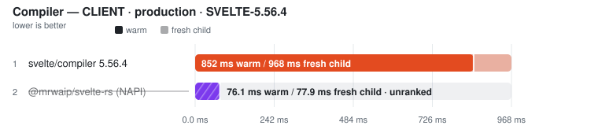
</picture>

| Tool | Files | Fresh child | vs fastest fresh | **Warm (primary)** | Min | Stddev | CV% | vs fastest | Code bytes | Peak RSS | Throughput |
| --- | ---: | ---: | ---: | ---: | ---: | ---: | ---: | ---: | ---: | ---: | ---: |
| svelte/compiler 5.56.4 | 287 | 968.3 ms | — | **852.4 ms** | 842.0 ms | 21.9 ms | 2.6% | — | 1,752,966 | n/a | — |
| @mrwaip/svelte-rs (NAPI) ⚠ | 287 | (77.9 ms) | not ranked | (76.1 ms) | (75.7 ms) | – | – | not ranked | (1,502,774) | n/a | – |

Notes

- **svelte/compiler 5.56.4**: Pinned official reference for @mrwaip/svelte-rs; generate=client, dev=false, css=external | runtime gate: ✓ 287/287 parseable outputs use svelte/internal/client and match official CSS presence; dev option changes output | ⓘ adapter parity: 10 distinct input revisions across 10 passes (warm + fresh child) | ✓ runtime semantic validity: 33/33 plants passed through svelte-mrwaip-reference/compiler compile() per plant, css=external, runes=true | ✓ source-map coordinates: 4/4 anchored tokens traced exactly (LF/CRLF, non-BMP)
- **@mrwaip/svelte-rs (NAPI) ⚠**: @mrwaip/svelte-rs compile(), generate=client, dev=false, css=external | runtime gate: ✓ 287/287 parseable outputs use svelte/internal/client and match official CSS presence; dev option changes output | ⓘ adapter parity: 10 distinct input revisions across 10 passes (warm + fresh child) | ⚠ SOURCE-MAP COORDINATE VALIDITY FAIL — all 33 runtime plants passed, but generated JS/CSS tokens did not trace back to their exact source positions (lf-styles: css.css-0: mapped to 2:24; expected 9:24; crlf-styles: css.css-0: mapped to 2:24; expected 9:24). The timing remains visible but cannot rank until the emitted maps are correct.

##### SVELTE-5.56.8 — separate workload

<picture>
  <source media="(prefers-color-scheme: dark)" srcset="charts/real-world-carbon-components-svelte-real-world-linux-carbon-comp-0tb0zev-dark.svg">
  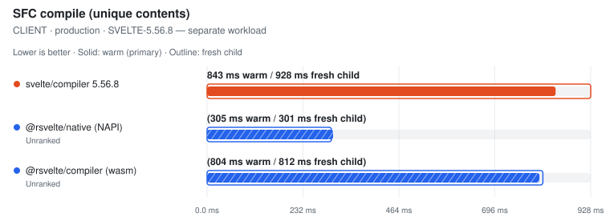
</picture>

| Tool | Files | Fresh child | vs fastest fresh | **Warm (primary)** | Min | Stddev | CV% | vs fastest | Code bytes | Peak RSS | Throughput |
| --- | ---: | ---: | ---: | ---: | ---: | ---: | ---: | ---: | ---: | ---: | ---: |
| svelte/compiler 5.56.8 | 287 | 928.2 ms | — | **843.2 ms** | 758.4 ms | 47.4 ms | 5.6% | — | 1,750,066 | n/a | — |
| @rsvelte/native (NAPI) ⚠ | 287 | (301.0 ms) | not ranked | (304.8 ms) | (301.9 ms) | – | – | not ranked | (1,748,162) | n/a | – |
| @rsvelte/compiler (wasm) ⚠ | 287 | (812.4 ms) | not ranked | (804.2 ms) | (786.3 ms) | – | – | not ranked | (1,748,162) | n/a | – |

Notes

- **svelte/compiler 5.56.8**: Official svelte/compiler compile(), generate=client, dev=false, css=external, runes=auto | runtime gate: ✓ 287/287 parseable outputs use svelte/internal/client and match official CSS presence; dev option changes output | ⓘ adapter parity: 10 distinct input revisions across 10 passes (warm + fresh child) | ✓ runtime semantic validity: 33/33 plants passed through svelte/compiler compile() per plant, css=external, runes=true | ✓ source-map coordinates: 4/4 anchored tokens traced exactly (LF/CRLF, non-BMP)
- **@rsvelte/native (NAPI) ⚠**: rsvelte NAPI compile(), generate=client, dev=false, css=external | runtime gate: ✓ 287/287 parseable outputs use svelte/internal/client and match official CSS presence; dev option changes output | ⓘ adapter parity: 10 distinct input revisions across 10 passes (warm + fresh child) | ⚠ SOURCE-MAP COORDINATE VALIDITY FAIL — all 33 runtime plants passed, but generated JS/CSS tokens did not trace back to their exact source positions (lf-raw: js.script: mapped to 2:19; expected 2:17; lf-styles: js.script: mapped to 2:19; expected 2:17). The timing remains visible but cannot rank until the emitted maps are correct.
- **@rsvelte/compiler (wasm) ⚠**: rsvelte WASM compile(), generate=client, dev=false, css=external. ⚠ WASM path — not the NAPI native binding. | runtime gate: ✓ 287/287 parseable outputs use svelte/internal/client and match official CSS presence; dev option changes output | ⓘ adapter parity: 10 distinct input revisions across 10 passes (warm + fresh child) | ⚠ SOURCE-MAP COORDINATE VALIDITY FAIL — all 33 runtime plants passed, but generated JS/CSS tokens did not trace back to their exact source positions (lf-raw: js.script: mapped to 2:19; expected 2:17; lf-styles: js.script: mapped to 2:19; expected 2:17). The timing remains visible but cannot rank until the emitted maps are correct.

Raw runs

- **svelte/compiler 5.56.4**: 879.3 ms, 893.3 ms, 852.4 ms, 842.0 ms, 849.4 ms · fresh child: 993.7 ms, 974.3 ms, 968.3 ms, 956.0 ms, 939.9 ms
- **@mrwaip/svelte-rs (NAPI)**: 76.0 ms, 76.8 ms, 76.1 ms, 76.6 ms, 75.7 ms · fresh child: 76.8 ms, 78.3 ms, 78.6 ms, 77.9 ms, 76.8 ms
- **svelte/compiler 5.56.8**: 872.7 ms, 870.0 ms, 843.2 ms, 813.1 ms, 758.4 ms · fresh child: 1.01 s, 961.8 ms, 917.6 ms, 928.2 ms, 920.8 ms
- **@rsvelte/native (NAPI)**: 304.8 ms, 304.8 ms, 314.6 ms, 305.2 ms, 301.9 ms · fresh child: 301.7 ms, 301.6 ms, 300.6 ms, 301.0 ms, 300.9 ms
- **@rsvelte/compiler (wasm)**: 807.2 ms, 826.6 ms, 786.3 ms, 804.2 ms, 786.8 ms · fresh child: 822.0 ms, 811.3 ms, 817.8 ms, 812.4 ms, 809.7 ms

#### SERVER · production

Target: `server` · Environment: `production`

##### EXPERIMENTAL-SVELTE — separate workload

<picture>
  <source media="(prefers-color-scheme: dark)" srcset="charts/real-world-carbon-components-svelte-real-world-linux-carbon-comp-1q4nvvz-dark.svg">
  
</picture>

| Tool | Files | **Median (primary)** | Min | Stddev | CV% | vs fastest | Artifact | Peak RSS | Throughput |
| --- | ---: | ---: | ---: | ---: | ---: | ---: | ---: | ---: | ---: |
| Verter native ⏭ | 287 | skipped | – | – | – | – | – | – | – |

Notes

- **Verter native ⏭**: No public Svelte runtime compile API; the experimental carrier exposes an IDE projection only. No proxy workload is timed.

##### SVELTE-5.56.4 — separate workload

<picture>
  <source media="(prefers-color-scheme: dark)" srcset="charts/real-world-carbon-components-svelte-real-world-linux-carbon-comp-1lmz2af-dark.svg">
  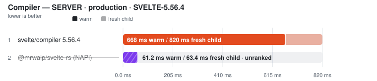
</picture>

| Tool | Files | Fresh child | vs fastest fresh | **Warm (primary)** | Min | Stddev | CV% | vs fastest | Code bytes | Peak RSS | Throughput |
| --- | ---: | ---: | ---: | ---: | ---: | ---: | ---: | ---: | ---: | ---: | ---: |
| svelte/compiler 5.56.4 | 287 | 819.8 ms | — | **668.1 ms** | 630.7 ms | 26.7 ms | 4.0% | — | 1,273,269 | n/a | — |
| @mrwaip/svelte-rs (NAPI) ⚠ | 287 | (63.4 ms) | not ranked | (61.2 ms) | (60.2 ms) | – | – | not ranked | (1,001,022) | n/a | – |

Notes

- **svelte/compiler 5.56.4**: Pinned official reference for @mrwaip/svelte-rs; generate=server, dev=false, css=external | runtime gate: ✓ 287/287 parseable outputs use svelte/internal/server and match official CSS presence; dev option changes output | ⓘ adapter parity: 10 distinct input revisions across 10 passes (warm + fresh child) | ✓ runtime semantic validity: 33/33 plants passed through svelte-mrwaip-reference/compiler compile() per plant, css=external, runes=true | ✓ source-map coordinates: 4/4 anchored tokens traced exactly (LF/CRLF, non-BMP)
- **@mrwaip/svelte-rs (NAPI) ⚠**: @mrwaip/svelte-rs compile(), generate=server, dev=false, css=external | runtime gate: ✓ 287/287 parseable outputs use svelte/internal/server and match official CSS presence; dev option changes output | ⓘ adapter parity: 10 distinct input revisions across 10 passes (warm + fresh child) | ⚠ SOURCE-MAP COORDINATE VALIDITY FAIL — all 33 runtime plants passed, but generated JS/CSS tokens did not trace back to their exact source positions (lf-raw: js.missing or invalid version-3 source map; lf-styles: js.missing or invalid version-3 source map). The timing remains visible but cannot rank until the emitted maps are correct.

##### SVELTE-5.56.8 — separate workload

<picture>
  <source media="(prefers-color-scheme: dark)" srcset="charts/real-world-carbon-components-svelte-real-world-linux-carbon-comp-1ib3tyr-dark.svg">
  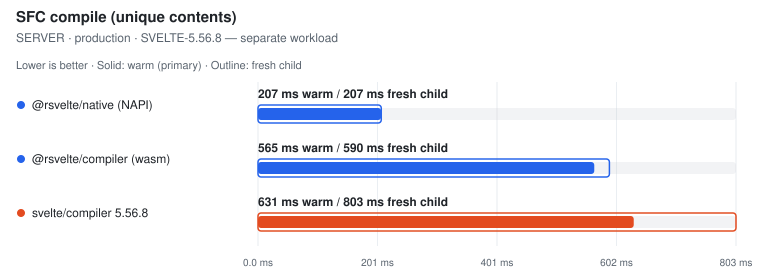
</picture>

| Tool | Files | Fresh child | vs fastest fresh | **Warm (primary)** | Min | Stddev | CV% | vs fastest | Code bytes | Peak RSS | Throughput |
| --- | ---: | ---: | ---: | ---: | ---: | ---: | ---: | ---: | ---: | ---: | ---: |
| @rsvelte/native (NAPI) | 287 | 206.9 ms | 1.00x | **206.7 ms** | 206.0 ms | 0.5 ms | 0.2% | 1.00x | 1,260,940 | n/a | 1.4k files/s |
| @rsvelte/compiler (wasm) | 287 | 590.0 ms | 2.85x | **564.6 ms** | 563.2 ms | 0.9 ms | 0.2% | 2.73x | 1,260,940 | n/a | 508 files/s |
| svelte/compiler 5.56.8 | 287 | 802.5 ms | 3.88x | **630.8 ms** | 625.8 ms | 27.8 ms | 4.4% | 3.05x | 1,262,630 | n/a | 455 files/s |

Notes

- **@rsvelte/native (NAPI)**: rsvelte NAPI compile(), generate=server, dev=false, css=external | runtime gate: ✓ 287/287 parseable outputs use svelte/internal/server and match official CSS presence; dev option changes output | ⓘ adapter parity: 10 distinct input revisions across 10 passes (warm + fresh child) | ✓ runtime semantic validity: 33/33 plants passed through @rsvelte/vite-plugin-svelte-native compileSync() per plant, css=external, runes=true | ✓ source-map coordinates: 4/4 anchored tokens traced exactly (LF/CRLF, non-BMP)
- **@rsvelte/compiler (wasm)**: rsvelte WASM compile(), generate=server, dev=false, css=external. ⚠ WASM path — not the NAPI native binding. | runtime gate: ✓ 287/287 parseable outputs use svelte/internal/server and match official CSS presence; dev option changes output | ⓘ adapter parity: 10 distinct input revisions across 10 passes (warm + fresh child) | ✓ runtime semantic validity: 33/33 plants passed through @rsvelte/compiler compile() per plant after initSync, css=external, runes=true | ✓ source-map coordinates: 4/4 anchored tokens traced exactly (LF/CRLF, non-BMP)
- **svelte/compiler 5.56.8**: Official svelte/compiler compile(), generate=server, dev=false, css=external, runes=auto | runtime gate: ✓ 287/287 parseable outputs use svelte/internal/server and match official CSS presence; dev option changes output | ⓘ adapter parity: 10 distinct input revisions across 10 passes (warm + fresh child) | ✓ runtime semantic validity: 33/33 plants passed through svelte/compiler compile() per plant, css=external, runes=true | ✓ source-map coordinates: 4/4 anchored tokens traced exactly (LF/CRLF, non-BMP)

Raw runs

- **svelte/compiler 5.56.4**: 668.1 ms, 630.7 ms, 669.2 ms, 634.6 ms, 694.5 ms · fresh child: 816.7 ms, 819.8 ms, 795.8 ms, 849.0 ms, 851.9 ms
- **@mrwaip/svelte-rs (NAPI)**: 61.1 ms, 62.0 ms, 60.2 ms, 61.6 ms, 61.2 ms · fresh child: 63.1 ms, 63.4 ms, 63.2 ms, 63.6 ms, 64.6 ms
- **@rsvelte/native (NAPI)**: 206.4 ms, 206.7 ms, 207.3 ms, 206.9 ms, 206.0 ms · fresh child: 206.9 ms, 205.5 ms, 207.8 ms, 206.0 ms, 209.0 ms
- **@rsvelte/compiler (wasm)**: 564.6 ms, 563.9 ms, 565.5 ms, 564.9 ms, 563.2 ms · fresh child: 590.0 ms, 591.2 ms, 588.8 ms, 583.6 ms, 597.3 ms
- **svelte/compiler 5.56.8**: 625.8 ms, 669.2 ms, 630.8 ms, 686.2 ms, 628.3 ms · fresh child: 792.6 ms, 834.6 ms, 797.0 ms, 802.5 ms, 961.3 ms

Methodology

- Matrix: generate ∈ {client, server} × env ∈ {production, development} × source-map ∈ {off, on} (off by default).
- Within each pinned compiler-version class, every tool receives the same in-memory Svelte SFC corpus. Real-world eligibility is decided independently by that class's official reference and per-row file counts remain visible.
- Official: svelte/compiler compile() with runes=auto. Generated fixtures force runes; real-world sources use compiler auto-detection.
- MrWaip: @mrwaip/svelte-rs native compiler through its compatible compile() API, ranked inside the pinned svelte-5.56.4 class with svelte/compiler 5.56.4 as the official reference/baseline.
- rsvelte: WASM (@rsvelte/compiler) and NAPI (@rsvelte/vite-plugin-svelte-native) paths are separate rows in the svelte-5.56.8 class.
- Verter exposes no public Svelte runtime compile API in the installed package (probed at runtime), so it is reported skipped; its different runtime-render batching API is not substituted.
- Every warmed/fresh pass compiles a REVISED corpus: a fixed-width comment token plus a used CSS custom-property rule. The timed loop asserts the token reached the emitted CSS, so a cached whole-output result from a previous pass fails the gate. Adapter parity additionally requires every warm and fresh pass to have received a distinct input revision.
- Every compiler must return one non-empty code artifact per input file, emit the expected Svelte client/server runtime import, and remove Svelte runes; aggregate byte totals alone are not accepted as proof of coverage.
- Fresh child = the first timed row workload in a NEW child process, after excluded Node startup, package imports, adapter construction and input materialisation. It is NOT machine-cold (OS page cache is not flushed) and its ratio never substitutes for the warm verdict.
- Source maps: every compared Svelte 5 compiler ALWAYS emits js.map/css.map from compile() (no off/on flag exists — the 'sourcemap' option is a chained-map INPUT), so an off/on matrix would measure the harness, not the tools. Instead the maps' COORDINATE CORRECTNESS gates every row: anchored tokens in generated JS/CSS must trace back to their exact source positions (segment fallback allowed, exact line/column required, sourcesContent equal to the full component), across LF/CRLF and non-BMP-shifted columns. Wrong-file, shifted, stale or byte-counted maps unrank the row.
- Runtime semantic validity: a 28-plant Svelte 5 suite (props/state/derived/bindable/bindings/events/each-keyed/await/snippets/stores/actions/context/dynamic components/{@html}/SVG/module script/legacy syntax + CSS semantics) runs per entrypoint per cell in isolated child processes after timing; non-PASS rows unrank, and a failed official reference unrankS every candidate in its compatibility class (no survivor promotion).
- Tool order is rotated on every warmup and measured run. A row is unranked unless the measured runs cover every active execution position; ranking metric is the median of warmed runs.

### Svelte TypeScript projection

Files: **287** · Bytes: **941,662**

Corpus: carbon-components-svelte:components @ v0.110.2 (dec0ea44, released/committed 2026-07-31) · 287 SFCs · library-source · Apache-2.0

Tools:

- **svelte2tsx** — Official Svelte-to-TSX projection from sveltejs/language-tools.
- **@rsvelte/svelte2tsx (Wasm)** — rsvelte Rust/Wasm drop-in Svelte-to-TSX projection.
- **Verter IDE projection** — VerterHost ensureIdeCompiled/getIde Svelte projection; separate schema from svelte2tsx.

##### SVELTE2TSX-COMPATIBLE — separate workload

<picture>
  <source media="(prefers-color-scheme: dark)" srcset="charts/real-world-carbon-components-svelte-real-world-linux-carbon-comp-0socado-dark.svg">
  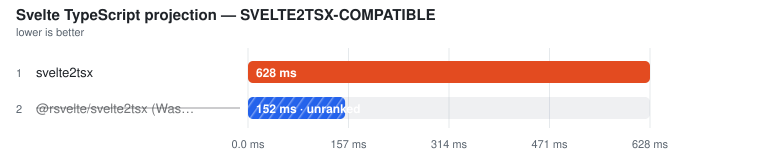
</picture>

| Tool | Files | **Median (primary)** | Min | Stddev | CV% | vs fastest | TSX bytes | Peak RSS | Throughput |
| --- | ---: | ---: | ---: | ---: | ---: | ---: | ---: | ---: | ---: |
| svelte2tsx | 287 | **473.0 ms** | 461.6 ms | 5.6 ms | 1.2% | — | 1,474,117 | n/a | — |
| @rsvelte/svelte2tsx (Wasm) ⚠ | 287 | (115.1 ms) | (113.0 ms) | – | – | not ranked | (1,474,125) | n/a | – |

Notes

- **svelte2tsx**: Official svelte2tsx, Svelte 5 TS projection | gate: ✓ 287/287 valid TSX outputs
- **@rsvelte/svelte2tsx (Wasm) ⚠**: Rust/Wasm drop-in; TypeScript-printer structural parity against official output | gate: ✗ 00039--DataTable.svelte differs structurally from official svelte2tsx output

##### VERTER-IDE-PROJECTION — separate workload

<picture>
  <source media="(prefers-color-scheme: dark)" srcset="charts/real-world-carbon-components-svelte-real-world-linux-carbon-comp-1eudhku-dark.svg">
  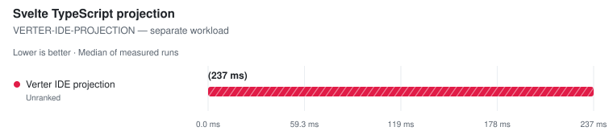
</picture>

| Tool | Files | **Median (primary)** | Min | Stddev | CV% | vs fastest | Projection bytes | Peak RSS | Throughput |
| --- | ---: | ---: | ---: | ---: | ---: | ---: | ---: | ---: | ---: |
| Verter IDE projection ⚠ | 287 | (237.2 ms) | (235.0 ms) | – | – | not ranked | (3,546,358) | n/a | – |

Notes

- **Verter IDE projection ⚠**: Native ensureIdeCompiled/getIde Svelte path; separate class because this is Verter's IDE carrier, not a svelte2tsx-compatible schema | gate: ✗ invalid TSX: JSX element 'input' has no corresponding closing tag.

Methodology

- This is the type-analysis projection used by Svelte-aware TypeScript tooling; it is not runtime compilation or component documentation.
- The svelte2tsx-compatible rows use the synchronous in-process API with identical Svelte 5 options and file order.
- Every output must parse as TSX and contain tool-specific Svelte projection helpers.
- The rsvelte row must match official output after TypeScript parses and reprints both outputs, ignoring formatting-only whitespace while retaining syntax and comments.
- Verter's ensureIdeCompiled/getIde output is a genuine Svelte IDE projection, but its carrier and helper contract differ from svelte2tsx; it is therefore measured in a separate comparison class.

Raw runs:

- **svelte2tsx**: 475.0 ms, 473.0 ms, 474.5 ms, 461.6 ms, 468.6 ms
- **@rsvelte/svelte2tsx (Wasm)**: 121.1 ms, 116.3 ms, 113.0 ms, 114.9 ms, 115.1 ms
- **Verter IDE projection**: 237.2 ms, 235.0 ms, 239.0 ms, 237.8 ms, 237.2 ms

### Format

Files: **287** · Bytes: **941,662**

Corpus: carbon-components-svelte:components @ v0.110.2 (dec0ea44, released/committed 2026-07-31) · 287 SFCs · library-source · Apache-2.0

Tools:

- **Prettier** — prettier --write with prettier-plugin-svelte over a fresh corpus copy.
- **rsvelte-fmt** — @rsvelte/fmt — Rust formatter for .svelte.
- **Oxfmt** — Oxc formatter; skipped because the pinned release excludes .svelte files.

<picture>
  <source media="(prefers-color-scheme: dark)" srcset="charts/real-world-carbon-components-svelte-real-world-linux-carbon-comp-1vbo9u1-dark.svg">
  
</picture>

| Tool | Files | **Median (primary)** | Min | Stddev | CV% | vs fastest | Artifact | Peak RSS | Throughput |
| --- | ---: | ---: | ---: | ---: | ---: | ---: | ---: | ---: | ---: |
| rsvelte-fmt | 287 | **137.2 ms** | 136.8 ms | 6.1 ms | 4.5% | 1.00x | n/a | n/a | 2.1k files/s |
| Prettier | 287 | **4.06 s** | 4.02 s | 23.6 ms | 0.6% | 29.63x | n/a | n/a | 71 files/s |
| Oxfmt ⏭ | 287 | skipped | – | – | – | – | – | – | – |

Notes

- **rsvelte-fmt**: rsvelte-fmt . (Rust); may route embedded JS/TS/CSS through other formatters | ⓘ file coverage verified: rewrote 287/287 Svelte files.
- **Prettier**: prettier --write **/*.svelte with prettier-plugin-svelte · single-threaded | ⓘ file coverage verified: rewrote 287/287 Svelte files.
- **Oxfmt ⏭**: Pinned Oxfmt release excludes .svelte files; no CLI-startup proxy is timed.

Methodology

- Every timed invocation receives a fresh copy of the same Svelte corpus.
- All rows are CLI invocations; any non-zero exit is an operational failure and cannot rank, even if some files changed first.
- A nested markup-rewrite plant fails tools that no-op, format only &lt;script>, or use a non-recursive file pattern.
- An untimed coverage census dirties every Svelte file; a tool that rewrites fewer than the full corpus is measured but unranked.
- Output style is not normalized — this measures whole-SFC format throughput, not byte identity.
- Tool order is rotated; ranking metric is the median of warmed runs.

Raw runs:

- **rsvelte-fmt**: 149.1 ms, 147.1 ms, 136.8 ms, 137.2 ms, 136.9 ms
- **Prettier**: 4.06 s, 4.07 s, 4.07 s, 4.02 s, 4.04 s

### Lint

Files: **287** · Bytes: **941,662**

Corpus: carbon-components-svelte:components @ v0.110.2 (dec0ea44, released/committed 2026-07-31) · 287 SFCs · library-source · Apache-2.0

Tools:

- **eslint-plugin-svelte (1T API)** — ESLint API + eslint-plugin-svelte recommended rules, single-threaded.
- **eslint-plugin-svelte (worker pool)** — ESLint API + eslint-plugin-svelte recommended rules, split across worker threads.
- **eslint-plugin-svelte (CLI)** — ESLint CLI + eslint-plugin-svelte recommended rules.
- **rsvelte-lint** — @rsvelte/lint — Rust Svelte linter.
- **Verter host lint** — VerterHost lint/diagnostics API with fileKind=svelte; experimental and gated on the {@html} diagnostic.

##### ESLINT-RECOMMENDED-RULES — separate workload

<picture>
  <source media="(prefers-color-scheme: dark)" srcset="charts/real-world-carbon-components-svelte-real-world-linux-carbon-comp-0cc84hw-dark.svg">
  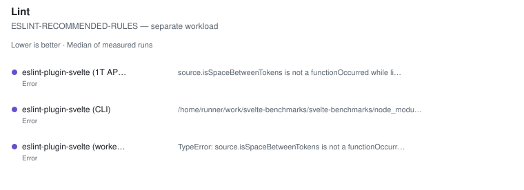
</picture>

| Tool | Files | **Median (primary)** | Min | Stddev | CV% | vs fastest | Artifact | Peak RSS | Throughput |
| --- | ---: | ---: | ---: | ---: | ---: | ---: | ---: | ---: | ---: |
| eslint-plugin-svelte (1T API) ❌ | 287 | error | – | – | – | – | – | – | – |
| eslint-plugin-svelte (worker pool) ❌ | 287 | error | – | – | – | – | – | – | – |
| eslint-plugin-svelte (CLI) ❌ | 287 | error | – | – | – | – | – | – | – |

Notes

- **eslint-plugin-svelte (1T API) ❌**: source.isSpaceBetweenTokens is not a function Occurred while linting /home/runner/work/svelte-benchmarks/svelte-benchmarks/work-real/carbon-components-svelte/lint/work/lint/n287/00149--SkeletonPlaceholder.svelte:23 Rule: "svelte/no-reactive-functions"
- **eslint-plugin-svelte (worker pool) ❌**: TypeError: source.isSpaceBetweenTokens is not a function Occurred while linting /home/runner/work/svelte-benchmarks/svelte-benchmarks/work-real/carbon-components-svelte/lint/work/lint/n287/00149--SkeletonPlaceholder.svelte:23 Rule: "svelte/no-reactive-functions"     at Object.fix (file:///home/runner/work/svelte-benchmarks/svelte-benchmarks/node_modules/.pnpm/eslint-plugin-svelte@3.23.0_eslint@10.10.0_svelte@5.57.0_@typescript-eslint+types@8.70.0_/node_modules/eslint-plugin-svelte/lib/rules/no-reactive-functions.js:48:61)     at normalizeFixes (/home/runner/work/svelte-benchmarks/svelte-benchmarks/node_modules/.pnpm/eslint@10.10.0/node_modules/eslint/lib/linter/file-report.js:296:25)     at /home/runner/work/svelte-benchmarks/svelte-benchmarks/node_modules/.pnpm/eslint@10.10.0/node_modules/eslint/lib/linter/file-report.js:328:11     at Array.map (<anonymous>)     at mapSuggestions (/home/runner/work/svelte-benchmarks/svelte-benchmarks/node_modules/.pnpm/eslint@10.10.0/node_modules/eslint/lib/linter/file-report.js:321:5)     at FileReport.addRuleMessage (/home/runner/work/svelte-benchmarks/svelte-benchmarks/node_modules/.pnpm/eslint@10.10.0/node_modules/eslint/lib/linter/file-report.js:558:8)     at FileContext.report (/home/runner/work/svelte-benchmarks/svelte-benchmarks/node_modules/.pnpm/eslint@10.10.0/node_modules/eslint/lib/linter/linter.js:583:28)     at SvelteReactiveStatement > ExpressionStatement > AssignmentExpression > :function (file:///home/runner/work/svelte-benchmarks/svelte-benchmarks/node_modules/.pnpm/eslint-plugin-svelte@3.23.0_eslint@10.10.0_svelte@5.57.0_@typescript-eslint+types@8.70.0_/node_modules/eslint-plugin-svelte/lib/rules/no-reactive-functions.js:36:32)     at ruleErrorHandler (/home/runner/work/svelte-benchmarks/svelte-benchmarks/node_modules/.pnpm/eslint@10.10.0/node_modules/eslint/lib/linter/linter.js:645:33)     at /home/runner/work/svelte-benchmarks/svelte-benchmarks/node_modules/.pnpm/eslint@10.10.0/node_modules/eslint/lib/linter/source-code-visitor.js:76:46
- **eslint-plugin-svelte (CLI) ❌**: /home/runner/work/svelte-benchmarks/svelte-benchmarks/node_modules/.bin/eslint . exited with 2 Oops! Something went wrong! :(  ESLint: 10.10.0  TypeError: source.isSpaceBetweenTokens is not a function Occurred while linting /home/runner/work/svelte-benchmarks/svelte-benchmarks/work-real/carbon-components-svelte/lint/work/lint/n287/00149--SkeletonPlaceholder.svelte:23 Rule: "svelte/no-reactive-functions"     at Object.fix (file:///home/runner/work/svelte-benchmarks/svelte-benchmarks/node_modules/.pnpm/eslint-plugin-svelte@3.23.0_eslint@10.10.0_svelte@5.57.0_@typescript-eslint+types@8.70.0_/node_modules/eslint-plugin-svelte/lib/rules/no-reactive-functions.js:48:61)     at normalizeFixes (/home/runner/work/svelte-benchmarks/svelte-benchmarks/node_modules/.pnpm/eslint@10.10.0/node_modules/eslint/lib/linter/file-report.js:296:25)     at /home/runner/work/svelte-benchmarks/svelte-benchmarks/node_modules/.pnpm/eslint@10.10.0/node_modules/eslint/lib/linter/file-report.js:328:11     at Array.map (<anonymous>)     at mapSuggestions (/home/runner/work/svelte-benchmarks/svelte-benchmarks/node_modules/.pnpm/eslint@10.10.0/node_modules/eslint/lib/linter/file-report.js:321:5)     at FileReport.addRuleMessage (/home/runner/work/svelte-benchmarks/svelte-benchmarks/node_modules/.pnpm/eslint@10.10.0/node_modules/eslint/lib/linter/file-report.js:558:8)     at FileContext.report (/home/runner/work/svelte-benchmarks/svelte-benchmarks/node_modules/.pnpm/eslint@10.10.0/node_modules/eslint/lib/linter/linter.js:583:28)     at SvelteReactiveStatement > ExpressionStatement > AssignmentExpression > :function (file:///home/runner/work/svelte-benchmarks/svelte-benchmarks/node_modules/.pnpm/eslint-plugin-svelte@3.23.0_eslint@10.10.0_svelte@5.57.0_@typescript-eslint+types@8.70.0_/node_modules/eslint-plugin-svelte/lib/rules/no-reactive-functions.js:36:32)     at ruleErrorHandler (/home/runner/work/svelte-benchmarks/svelte-benchmarks/node_modules/.pnpm/eslint@10.10.0/node_modules/eslint/lib/linter/linter.js:645:33)     at /home/runner/work/svelte-benchmarks/svelte-benchmarks/node_modules/.pnpm/eslint@10.10.0/node_modules/eslint/lib/linter/source-code-visitor.js:76:46

##### RSVELTE-NATIVE-RULES — separate workload

<picture>
  <source media="(prefers-color-scheme: dark)" srcset="charts/real-world-carbon-components-svelte-real-world-linux-carbon-comp-19b8jpw-dark.svg">
  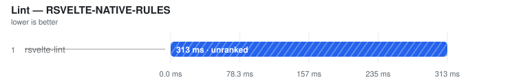
</picture>

| Tool | Files | **Median (primary)** | Min | Stddev | CV% | vs fastest | Artifact | Peak RSS | Throughput |
| --- | ---: | ---: | ---: | ---: | ---: | ---: | ---: | ---: | ---: |
| rsvelte-lint ⚠ | 287 | (313.1 ms) | (301.9 ms) | – | – | not ranked | – | n/a | – |

Notes

- **rsvelte-lint ⚠**: rsvelte-lint . (Rust linter) | ⚠ TOO NOISY TO RANK — CV 79.2% exceeds the 50% ceiling across 5 samples. The time remains visible but is excluded from ranking. | ⓘ file coverage verified: named 287/287 planted Svelte files.

##### VERTER-NATIVE-DIAGNOSTICS — separate workload

<picture>
  <source media="(prefers-color-scheme: dark)" srcset="charts/real-world-carbon-components-svelte-real-world-linux-carbon-comp-1g7w9gu-dark.svg">
  
</picture>

| Tool | Files | **Median (primary)** | Min | Stddev | CV% | vs fastest | Artifact | Peak RSS | Throughput |
| --- | ---: | ---: | ---: | ---: | ---: | ---: | ---: | ---: | ---: |
| Verter host lint ⚠ | 287 | (123.4 ms) | (122.8 ms) | – | – | not ranked | – | n/a | – |

Notes

- **Verter host lint ⚠**: VerterHost.upsert(fileKind=svelte) + lint/getDiagnostics for each explicit file | ⚠ FAILED VALIDATION — planted issue or markup work not observed | ⓘ file coverage by construction: the invocation receives all 287 corpus files as an explicit list.

Methodology

- Every tool receives the same isolated Svelte corpus.
- A planted {@html} issue must be reported; missing the template rule leaves the time visible but unranked.
- An untimed file-coverage census requires each directory-walk CLI to name every planted corpus file; explicit-list APIs are exact by construction.
- ESLint is measured in single-threaded API, worker-pool API, and CLI modes so invocation and thread-count costs remain visible.
- Rule sets are not identical, so ESLint recommended rules, rsvelte native rules, and Verter diagnostics are separate workload classes. The shared planted gate establishes minimum work but never cross-engine equivalence.
- Tool order is rotated; ranking metric is the median of warmed runs.

Raw runs:

- **rsvelte-lint**: 301.9 ms, 313.1 ms, 315.3 ms, 864.0 ms, 308.7 ms
- **Verter host lint**: 123.0 ms, 126.7 ms, 123.4 ms, 1.02 s, 122.8 ms

## flowbite-svelte

- **Generated:** 2026-09-12T10:43:34.611Z
- **Fixture:** `pinned real-world Svelte source checkouts` (183 Svelte files)
- **Runs / warmups:** 5 / 1
- **Runner:** Linux · linux/x64 · 4 CPUs · INTEL(R) XEON(R) PLATINUM 8573C · 16 GB RAM · Node v22.23.2
- **Commit:** [cc44ddb](https://github.com/pikax/svelte-benchmarks/commit/cc44ddb)
- **CI run:** https://github.com/pikax/svelte-benchmarks/actions/runs/34688914621
- **Source:** `real-world-Linux-flowbite-svelte.json`

Corpus: flowbite-svelte:components

### SFC compile (unique contents)

Files: **183** · Bytes: **478,393**

Corpus: flowbite-svelte:components @ v1.33.1 (3fbf1a18, released/committed 2026-04-07) · 183 SFCs · library-source · MIT

Version-class scopes: svelte-5.56.8: **183/183** files (0 excluded) · svelte-5.56.4: **183/183** files (0 excluded). Each row's Files column identifies its applicable corpus; classes are never ranked together.

Tools:

- **svelte/compiler 5.56.8** — Primary official Svelte compiler reference used by the rsvelte packages in this harness.
- **svelte/compiler 5.56.4** — Pinned official reference for @mrwaip/svelte-rs, which documents parity against Svelte 5.56.4.
- **@mrwaip/svelte-rs (NAPI)** — MrWaip/svelte-rs native compiler through its svelte/compiler-compatible API.
- **@rsvelte/compiler (wasm)** — rsvelte WASM compiler bindings.
- **@rsvelte/native (NAPI)** — rsvelte native NAPI compiler (@rsvelte/vite-plugin-svelte-native).

Validation (runtime semantic plants):

Suite 2026-09-12.2 · hash 451381a17402 · 2 cell(s)

| Cell | Status | Entrypoint verdicts |
| --- | --- | --- |
| client/production/source-map-off | FAIL | svelte-official: PASS · svelte-mrwaip-reference: PASS · mrwaip-svelte-rs: FAIL · rsvelte-wasm: FAIL · rsvelte-native: FAIL |
| server/production/source-map-off | FAIL | svelte-official: PASS · svelte-mrwaip-reference: PASS · mrwaip-svelte-rs: FAIL · rsvelte-wasm: PASS · rsvelte-native: PASS |

Compile results are **grouped by target × environment**, then by comparison class.

#### CLIENT · production

Target: `client` · Environment: `production`

##### EXPERIMENTAL-SVELTE — separate workload

<picture>
  <source media="(prefers-color-scheme: dark)" srcset="charts/real-world-flowbite-svelte-real-world-linux-flowbite-svelte-comp-07brceb-dark.svg">
  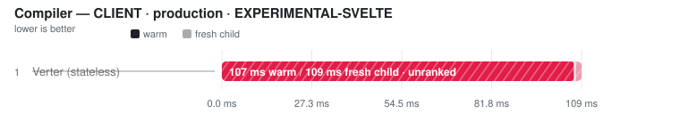
</picture>

| Tool | Files | **Median (primary)** | Min | Stddev | CV% | vs fastest | Artifact | Peak RSS | Throughput |
| --- | ---: | ---: | ---: | ---: | ---: | ---: | ---: | ---: | ---: |
| Verter native ⏭ | 183 | skipped | – | – | – | – | – | – | – |

Notes

- **Verter native ⏭**: No public Svelte runtime compile API; the experimental carrier exposes an IDE projection only. No proxy workload is timed.

##### SVELTE-5.56.4 — separate workload

<picture>
  <source media="(prefers-color-scheme: dark)" srcset="charts/real-world-flowbite-svelte-real-world-linux-flowbite-svelte-comp-0o229ib-dark.svg">
  
</picture>

| Tool | Files | Fresh child | vs fastest fresh | **Warm (primary)** | Min | Stddev | CV% | vs fastest | Code bytes | Peak RSS | Throughput |
| --- | ---: | ---: | ---: | ---: | ---: | ---: | ---: | ---: | ---: | ---: | ---: |
| svelte/compiler 5.56.4 | 183 | 763.5 ms | — | **678.0 ms** | 626.3 ms | 31.9 ms | 4.7% | — | 802,404 | n/a | — |
| @mrwaip/svelte-rs (NAPI) ⚠ | 183 | (50.9 ms) | not ranked | (50.8 ms) | (49.4 ms) | – | – | not ranked | (772,681) | n/a | – |

Notes

- **svelte/compiler 5.56.4**: Pinned official reference for @mrwaip/svelte-rs; generate=client, dev=false, css=external | runtime gate: ✓ 183/183 parseable outputs use svelte/internal/client and match official CSS presence; dev option changes output | ⓘ adapter parity: 10 distinct input revisions across 10 passes (warm + fresh child) | ✓ runtime semantic validity: 33/33 plants passed through svelte-mrwaip-reference/compiler compile() per plant, css=external, runes=true | ✓ source-map coordinates: 4/4 anchored tokens traced exactly (LF/CRLF, non-BMP)
- **@mrwaip/svelte-rs (NAPI) ⚠**: @mrwaip/svelte-rs compile(), generate=client, dev=false, css=external | runtime gate: ✓ 183/183 parseable outputs use svelte/internal/client and match official CSS presence; dev option changes output | ⓘ adapter parity: 10 distinct input revisions across 10 passes (warm + fresh child) | ⚠ SOURCE-MAP COORDINATE VALIDITY FAIL — all 33 runtime plants passed, but generated JS/CSS tokens did not trace back to their exact source positions (lf-styles: css.css-0: mapped to 2:24; expected 9:24; crlf-styles: css.css-0: mapped to 2:24; expected 9:24). The timing remains visible but cannot rank until the emitted maps are correct.

##### SVELTE-5.56.8 — separate workload

<picture>
  <source media="(prefers-color-scheme: dark)" srcset="charts/real-world-flowbite-svelte-real-world-linux-flowbite-svelte-comp-0rdxhtz-dark.svg">
  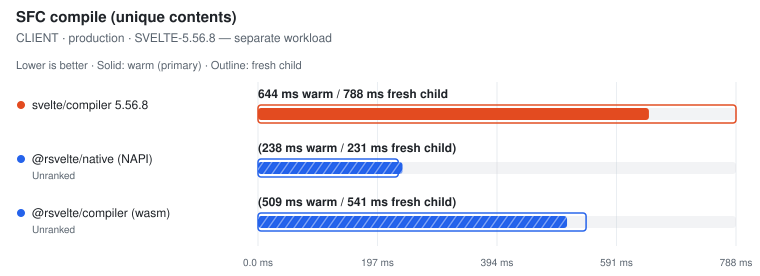
</picture>

| Tool | Files | Fresh child | vs fastest fresh | **Warm (primary)** | Min | Stddev | CV% | vs fastest | Code bytes | Peak RSS | Throughput |
| --- | ---: | ---: | ---: | ---: | ---: | ---: | ---: | ---: | ---: | ---: | ---: |
| svelte/compiler 5.56.8 | 183 | 787.8 ms | — | **644.3 ms** | 611.3 ms | 35.0 ms | 5.4% | — | 800,573 | n/a | — |
| @rsvelte/native (NAPI) ⚠ | 183 | (231.2 ms) | not ranked | (238.2 ms) | (229.2 ms) | – | – | not ranked | (795,928) | n/a | – |
| @rsvelte/compiler (wasm) ⚠ | 183 | (540.8 ms) | not ranked | (509.4 ms) | (494.8 ms) | – | – | not ranked | (795,928) | n/a | – |

Notes

- **svelte/compiler 5.56.8**: Official svelte/compiler compile(), generate=client, dev=false, css=external, runes=auto | runtime gate: ✓ 183/183 parseable outputs use svelte/internal/client and match official CSS presence; dev option changes output | ⓘ adapter parity: 10 distinct input revisions across 10 passes (warm + fresh child) | ✓ runtime semantic validity: 33/33 plants passed through svelte/compiler compile() per plant, css=external, runes=true | ✓ source-map coordinates: 4/4 anchored tokens traced exactly (LF/CRLF, non-BMP)
- **@rsvelte/native (NAPI) ⚠**: rsvelte NAPI compile(), generate=client, dev=false, css=external | runtime gate: ✓ 183/183 parseable outputs use svelte/internal/client and match official CSS presence; dev option changes output | ⓘ adapter parity: 10 distinct input revisions across 10 passes (warm + fresh child) | ⚠ SOURCE-MAP COORDINATE VALIDITY FAIL — all 33 runtime plants passed, but generated JS/CSS tokens did not trace back to their exact source positions (lf-raw: js.script: mapped to 2:19; expected 2:17; lf-styles: js.script: mapped to 2:19; expected 2:17). The timing remains visible but cannot rank until the emitted maps are correct.
- **@rsvelte/compiler (wasm) ⚠**: rsvelte WASM compile(), generate=client, dev=false, css=external. ⚠ WASM path — not the NAPI native binding. | runtime gate: ✓ 183/183 parseable outputs use svelte/internal/client and match official CSS presence; dev option changes output | ⓘ adapter parity: 10 distinct input revisions across 10 passes (warm + fresh child) | ⚠ SOURCE-MAP COORDINATE VALIDITY FAIL — all 33 runtime plants passed, but generated JS/CSS tokens did not trace back to their exact source positions (lf-raw: js.script: mapped to 2:19; expected 2:17; lf-styles: js.script: mapped to 2:19; expected 2:17). The timing remains visible but cannot rank until the emitted maps are correct.

Raw runs

- **svelte/compiler 5.56.4**: 691.1 ms, 697.1 ms, 626.3 ms, 678.0 ms, 638.5 ms · fresh child: 763.5 ms, 760.0 ms, 736.6 ms, 796.6 ms, 785.9 ms
- **@mrwaip/svelte-rs (NAPI)**: 50.8 ms, 53.2 ms, 50.4 ms, 55.4 ms, 49.4 ms · fresh child: 57.1 ms, 50.9 ms, 50.7 ms, 50.1 ms, 51.6 ms
- **svelte/compiler 5.56.8**: 663.3 ms, 705.6 ms, 644.3 ms, 638.5 ms, 611.3 ms · fresh child: 793.0 ms, 792.4 ms, 787.0 ms, 787.8 ms, 785.4 ms
- **@rsvelte/native (NAPI)**: 229.2 ms, 239.8 ms, 238.2 ms, 238.7 ms, 233.8 ms · fresh child: 231.2 ms, 232.4 ms, 234.9 ms, 230.8 ms, 230.4 ms
- **@rsvelte/compiler (wasm)**: 514.8 ms, 510.1 ms, 509.4 ms, 501.4 ms, 494.8 ms · fresh child: 533.4 ms, 540.2 ms, 542.2 ms, 540.8 ms, 546.7 ms

#### SERVER · production

Target: `server` · Environment: `production`

##### EXPERIMENTAL-SVELTE — separate workload

<picture>
  <source media="(prefers-color-scheme: dark)" srcset="charts/real-world-flowbite-svelte-real-world-linux-flowbite-svelte-comp-1mtjwbz-dark.svg">
  
</picture>

| Tool | Files | **Median (primary)** | Min | Stddev | CV% | vs fastest | Artifact | Peak RSS | Throughput |
| --- | ---: | ---: | ---: | ---: | ---: | ---: | ---: | ---: | ---: |
| Verter native ⏭ | 183 | skipped | – | – | – | – | – | – | – |

Notes

- **Verter native ⏭**: No public Svelte runtime compile API; the experimental carrier exposes an IDE projection only. No proxy workload is timed.

##### SVELTE-5.56.4 — separate workload

<picture>
  <source media="(prefers-color-scheme: dark)" srcset="charts/real-world-flowbite-svelte-real-world-linux-flowbite-svelte-comp-0wl451z-dark.svg">
  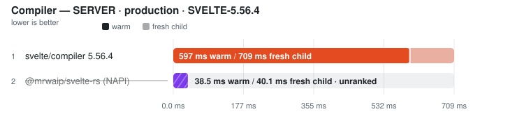
</picture>

| Tool | Files | Fresh child | vs fastest fresh | **Warm (primary)** | Min | Stddev | CV% | vs fastest | Code bytes | Peak RSS | Throughput |
| --- | ---: | ---: | ---: | ---: | ---: | ---: | ---: | ---: | ---: | ---: | ---: |
| svelte/compiler 5.56.4 | 183 | 709.2 ms | — | **597.3 ms** | 561.5 ms | 29.1 ms | 4.9% | — | 545,633 | n/a | — |
| @mrwaip/svelte-rs (NAPI) ⚠ | 183 | (40.1 ms) | not ranked | (38.5 ms) | (37.3 ms) | – | – | not ranked | (520,180) | n/a | – |

Notes

- **svelte/compiler 5.56.4**: Pinned official reference for @mrwaip/svelte-rs; generate=server, dev=false, css=external | runtime gate: ✓ 183/183 parseable outputs use svelte/internal/server and match official CSS presence; dev option changes output | ⓘ adapter parity: 10 distinct input revisions across 10 passes (warm + fresh child) | ✓ runtime semantic validity: 33/33 plants passed through svelte-mrwaip-reference/compiler compile() per plant, css=external, runes=true | ✓ source-map coordinates: 4/4 anchored tokens traced exactly (LF/CRLF, non-BMP)
- **@mrwaip/svelte-rs (NAPI) ⚠**: @mrwaip/svelte-rs compile(), generate=server, dev=false, css=external | runtime gate: ✗ returned empty JavaScript; dev option changes output | ⓘ adapter parity: 10 distinct input revisions across 10 passes (warm + fresh child) | ⚠ SOURCE-MAP COORDINATE VALIDITY FAIL — all 33 runtime plants passed, but generated JS/CSS tokens did not trace back to their exact source positions (lf-raw: js.missing or invalid version-3 source map; lf-styles: js.missing or invalid version-3 source map). The timing remains visible but cannot rank until the emitted maps are correct.

##### SVELTE-5.56.8 — separate workload

<picture>
  <source media="(prefers-color-scheme: dark)" srcset="charts/real-world-flowbite-svelte-real-world-linux-flowbite-svelte-comp-0t98wqb-dark.svg">
  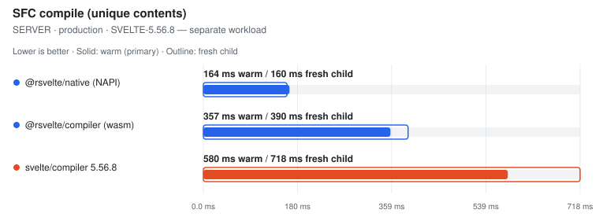
</picture>

| Tool | Files | Fresh child | vs fastest fresh | **Warm (primary)** | Min | Stddev | CV% | vs fastest | Code bytes | Peak RSS | Throughput |
| --- | ---: | ---: | ---: | ---: | ---: | ---: | ---: | ---: | ---: | ---: | ---: |
| @rsvelte/native (NAPI) | 183 | 159.6 ms | 1.00x | **164.2 ms** | 162.7 ms | 1.5 ms | 0.9% | 1.00x | 539,119 | n/a | 1.1k files/s |
| @rsvelte/compiler (wasm) | 183 | 390.2 ms | 2.45x | **356.6 ms** | 348.8 ms | 4.8 ms | 1.3% | 2.17x | 539,119 | n/a | 513 files/s |
| svelte/compiler 5.56.8 | 183 | 718.1 ms | 4.50x | **580.3 ms** | 556.8 ms | 19.6 ms | 3.4% | 3.53x | 539,119 | n/a | 315 files/s |

Notes

- **@rsvelte/native (NAPI)**: rsvelte NAPI compile(), generate=server, dev=false, css=external | runtime gate: ✓ 183/183 parseable outputs use svelte/internal/server and match official CSS presence; dev option changes output | ⓘ adapter parity: 10 distinct input revisions across 10 passes (warm + fresh child) | ✓ runtime semantic validity: 33/33 plants passed through @rsvelte/vite-plugin-svelte-native compileSync() per plant, css=external, runes=true | ✓ source-map coordinates: 4/4 anchored tokens traced exactly (LF/CRLF, non-BMP)
- **@rsvelte/compiler (wasm)**: rsvelte WASM compile(), generate=server, dev=false, css=external. ⚠ WASM path — not the NAPI native binding. | runtime gate: ✓ 183/183 parseable outputs use svelte/internal/server and match official CSS presence; dev option changes output | ⓘ adapter parity: 10 distinct input revisions across 10 passes (warm + fresh child) | ✓ runtime semantic validity: 33/33 plants passed through @rsvelte/compiler compile() per plant after initSync, css=external, runes=true | ✓ source-map coordinates: 4/4 anchored tokens traced exactly (LF/CRLF, non-BMP)
- **svelte/compiler 5.56.8**: Official svelte/compiler compile(), generate=server, dev=false, css=external, runes=auto | runtime gate: ✓ 183/183 parseable outputs use svelte/internal/server and match official CSS presence; dev option changes output | ⓘ adapter parity: 10 distinct input revisions across 10 passes (warm + fresh child) | ✓ runtime semantic validity: 33/33 plants passed through svelte/compiler compile() per plant, css=external, runes=true | ✓ source-map coordinates: 4/4 anchored tokens traced exactly (LF/CRLF, non-BMP)

Raw runs

- **svelte/compiler 5.56.4**: 586.6 ms, 614.8 ms, 561.5 ms, 638.8 ms, 597.3 ms · fresh child: 726.5 ms, 718.9 ms, 701.4 ms, 709.2 ms, 679.3 ms
- **@mrwaip/svelte-rs (NAPI)**: 39.8 ms, 38.5 ms, 38.2 ms, 39.8 ms, 37.3 ms · fresh child: 47.6 ms, 38.7 ms, 38.7 ms, 40.1 ms, 41.9 ms
- **@rsvelte/native (NAPI)**: 162.7 ms, 166.6 ms, 164.5 ms, 163.4 ms, 164.2 ms · fresh child: 159.0 ms, 156.7 ms, 159.6 ms, 159.9 ms, 161.1 ms
- **@rsvelte/compiler (wasm)**: 361.7 ms, 356.6 ms, 358.1 ms, 354.6 ms, 348.8 ms · fresh child: 389.6 ms, 390.9 ms, 379.2 ms, 390.2 ms, 396.2 ms
- **svelte/compiler 5.56.8**: 556.8 ms, 590.4 ms, 580.3 ms, 566.8 ms, 606.8 ms · fresh child: 725.5 ms, 715.8 ms, 736.7 ms, 718.1 ms, 702.9 ms

Methodology

- Matrix: generate ∈ {client, server} × env ∈ {production, development} × source-map ∈ {off, on} (off by default).
- Within each pinned compiler-version class, every tool receives the same in-memory Svelte SFC corpus. Real-world eligibility is decided independently by that class's official reference and per-row file counts remain visible.
- Official: svelte/compiler compile() with runes=auto. Generated fixtures force runes; real-world sources use compiler auto-detection.
- MrWaip: @mrwaip/svelte-rs native compiler through its compatible compile() API, ranked inside the pinned svelte-5.56.4 class with svelte/compiler 5.56.4 as the official reference/baseline.
- rsvelte: WASM (@rsvelte/compiler) and NAPI (@rsvelte/vite-plugin-svelte-native) paths are separate rows in the svelte-5.56.8 class.
- Verter exposes no public Svelte runtime compile API in the installed package (probed at runtime), so it is reported skipped; its different runtime-render batching API is not substituted.
- Every warmed/fresh pass compiles a REVISED corpus: a fixed-width comment token plus a used CSS custom-property rule. The timed loop asserts the token reached the emitted CSS, so a cached whole-output result from a previous pass fails the gate. Adapter parity additionally requires every warm and fresh pass to have received a distinct input revision.
- Every compiler must return one non-empty code artifact per input file, emit the expected Svelte client/server runtime import, and remove Svelte runes; aggregate byte totals alone are not accepted as proof of coverage.
- Fresh child = the first timed row workload in a NEW child process, after excluded Node startup, package imports, adapter construction and input materialisation. It is NOT machine-cold (OS page cache is not flushed) and its ratio never substitutes for the warm verdict.
- Source maps: every compared Svelte 5 compiler ALWAYS emits js.map/css.map from compile() (no off/on flag exists — the 'sourcemap' option is a chained-map INPUT), so an off/on matrix would measure the harness, not the tools. Instead the maps' COORDINATE CORRECTNESS gates every row: anchored tokens in generated JS/CSS must trace back to their exact source positions (segment fallback allowed, exact line/column required, sourcesContent equal to the full component), across LF/CRLF and non-BMP-shifted columns. Wrong-file, shifted, stale or byte-counted maps unrank the row.
- Runtime semantic validity: a 28-plant Svelte 5 suite (props/state/derived/bindable/bindings/events/each-keyed/await/snippets/stores/actions/context/dynamic components/{@html}/SVG/module script/legacy syntax + CSS semantics) runs per entrypoint per cell in isolated child processes after timing; non-PASS rows unrank, and a failed official reference unrankS every candidate in its compatibility class (no survivor promotion).
- Tool order is rotated on every warmup and measured run. A row is unranked unless the measured runs cover every active execution position; ranking metric is the median of warmed runs.

### Svelte TypeScript projection

Files: **183** · Bytes: **478,393**

Corpus: flowbite-svelte:components @ v1.33.1 (3fbf1a18, released/committed 2026-04-07) · 183 SFCs · library-source · MIT

Tools:

- **svelte2tsx** — Official Svelte-to-TSX projection from sveltejs/language-tools.
- **@rsvelte/svelte2tsx (Wasm)** — rsvelte Rust/Wasm drop-in Svelte-to-TSX projection.
- **Verter IDE projection** — VerterHost ensureIdeCompiled/getIde Svelte projection; separate schema from svelte2tsx.

##### SVELTE2TSX-COMPATIBLE — separate workload

<picture>
  <source media="(prefers-color-scheme: dark)" srcset="charts/real-world-flowbite-svelte-real-world-linux-flowbite-svelte-proj-0b8h51o-dark.svg">
  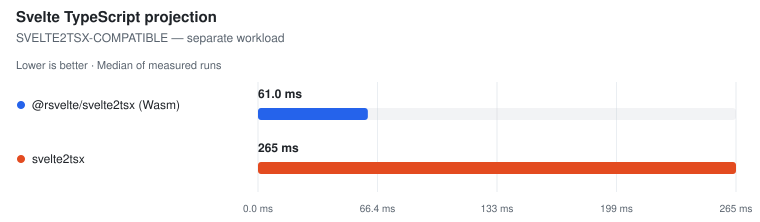
</picture>

| Tool | Files | **Median (primary)** | Min | Stddev | CV% | vs fastest | TSX bytes | Peak RSS | Throughput |
| --- | ---: | ---: | ---: | ---: | ---: | ---: | ---: | ---: | ---: |
| @rsvelte/svelte2tsx (Wasm) | 183 | **61.0 ms** | 57.1 ms | 6.7 ms | 11.0% ⚠ | 1.00x | 621,013 | n/a | 3.0k files/s |
| svelte2tsx | 183 | **265.5 ms** | 249.6 ms | 10.9 ms | 4.1% | 4.35x | 621,320 | n/a | 689 files/s |

Notes

- **@rsvelte/svelte2tsx (Wasm)**: Rust/Wasm drop-in; TypeScript-printer structural parity against official output | gate: ✓ 183/183 valid TSX outputs
- **svelte2tsx**: Official svelte2tsx, Svelte 5 TS projection | gate: ✓ 183/183 valid TSX outputs

##### VERTER-IDE-PROJECTION — separate workload

<picture>
  <source media="(prefers-color-scheme: dark)" srcset="charts/real-world-flowbite-svelte-real-world-linux-flowbite-svelte-proj-1vneav2-dark.svg">
  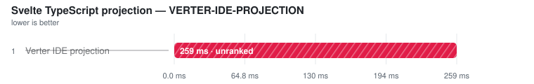
</picture>

| Tool | Files | **Median (primary)** | Min | Stddev | CV% | vs fastest | Projection bytes | Peak RSS | Throughput |
| --- | ---: | ---: | ---: | ---: | ---: | ---: | ---: | ---: | ---: |
| Verter IDE projection ⚠ | 183 | (259.0 ms) | (252.8 ms) | – | – | not ranked | (2,867,307) | n/a | – |

Notes

- **Verter IDE projection ⚠**: Native ensureIdeCompiled/getIde Svelte path; separate class because this is Verter's IDE carrier, not a svelte2tsx-compatible schema | gate: ✗ invalid TSX: '}' expected.

Methodology

- This is the type-analysis projection used by Svelte-aware TypeScript tooling; it is not runtime compilation or component documentation.
- The svelte2tsx-compatible rows use the synchronous in-process API with identical Svelte 5 options and file order.
- Every output must parse as TSX and contain tool-specific Svelte projection helpers.
- The rsvelte row must match official output after TypeScript parses and reprints both outputs, ignoring formatting-only whitespace while retaining syntax and comments.
- Verter's ensureIdeCompiled/getIde output is a genuine Svelte IDE projection, but its carrier and helper contract differ from svelte2tsx; it is therefore measured in a separate comparison class.

Raw runs:

- **@rsvelte/svelte2tsx (Wasm)**: 74.0 ms, 62.0 ms, 57.1 ms, 61.0 ms, 58.2 ms
- **svelte2tsx**: 280.3 ms, 266.3 ms, 263.8 ms, 249.6 ms, 265.5 ms
- **Verter IDE projection**: 5.25 s, 252.8 ms, 259.0 ms, 255.2 ms, 289.0 ms

### Format

Files: **183** · Bytes: **478,393**

Corpus: flowbite-svelte:components @ v1.33.1 (3fbf1a18, released/committed 2026-04-07) · 183 SFCs · library-source · MIT

Tools:

- **Prettier** — prettier --write with prettier-plugin-svelte over a fresh corpus copy.
- **rsvelte-fmt** — @rsvelte/fmt — Rust formatter for .svelte.
- **Oxfmt** — Oxc formatter; skipped because the pinned release excludes .svelte files.

<picture>
  <source media="(prefers-color-scheme: dark)" srcset="charts/real-world-flowbite-svelte-real-world-linux-flowbite-svelte-form-10p0mtl-dark.svg">
  
</picture>

| Tool | Files | **Median (primary)** | Min | Stddev | CV% | vs fastest | Artifact | Peak RSS | Throughput |
| --- | ---: | ---: | ---: | ---: | ---: | ---: | ---: | ---: | ---: |
| rsvelte-fmt | 183 | **140.5 ms** | 138.5 ms | 20.8 ms | 14.8% ⚠ | 1.00x | n/a | n/a | 1.3k files/s |
| Prettier | 183 | **3.19 s** | 3.15 s | 47.6 ms | 1.5% | 22.69x | n/a | n/a | 57 files/s |
| Oxfmt ⏭ | 183 | skipped | – | – | – | – | – | – | – |

Notes

- **rsvelte-fmt**: rsvelte-fmt . (Rust); may route embedded JS/TS/CSS through other formatters | ⓘ file coverage verified: rewrote 183/183 Svelte files.
- **Prettier**: prettier --write **/*.svelte with prettier-plugin-svelte · single-threaded | ⓘ file coverage verified: rewrote 183/183 Svelte files.
- **Oxfmt ⏭**: Pinned Oxfmt release excludes .svelte files; no CLI-startup proxy is timed.

Methodology

- Every timed invocation receives a fresh copy of the same Svelte corpus.
- All rows are CLI invocations; any non-zero exit is an operational failure and cannot rank, even if some files changed first.
- A nested markup-rewrite plant fails tools that no-op, format only &lt;script>, or use a non-recursive file pattern.
- An untimed coverage census dirties every Svelte file; a tool that rewrites fewer than the full corpus is measured but unranked.
- Output style is not normalized — this measures whole-SFC format throughput, not byte identity.
- Tool order is rotated; ranking metric is the median of warmed runs.

Raw runs:

- **rsvelte-fmt**: 140.5 ms, 140.3 ms, 186.5 ms, 140.6 ms, 138.5 ms
- **Prettier**: 3.15 s, 3.16 s, 3.26 s, 3.19 s, 3.23 s

### Lint

Files: **183** · Bytes: **478,393**

Corpus: flowbite-svelte:components @ v1.33.1 (3fbf1a18, released/committed 2026-04-07) · 183 SFCs · library-source · MIT

Tools:

- **eslint-plugin-svelte (1T API)** — ESLint API + eslint-plugin-svelte recommended rules, single-threaded.
- **eslint-plugin-svelte (worker pool)** — ESLint API + eslint-plugin-svelte recommended rules, split across worker threads.
- **eslint-plugin-svelte (CLI)** — ESLint CLI + eslint-plugin-svelte recommended rules.
- **rsvelte-lint** — @rsvelte/lint — Rust Svelte linter.
- **Verter host lint** — VerterHost lint/diagnostics API with fileKind=svelte; experimental and gated on the {@html} diagnostic.

##### ESLINT-RECOMMENDED-RULES — separate workload

<picture>
  <source media="(prefers-color-scheme: dark)" srcset="charts/real-world-flowbite-svelte-real-world-linux-flowbite-svelte-lint-1tcgxz8-dark.svg">
  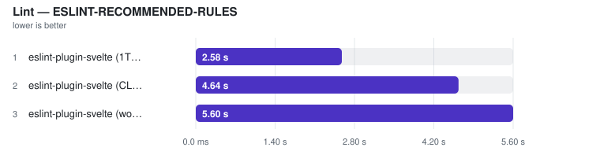
</picture>

| Tool | Files | **Median (primary)** | Min | Stddev | CV% | vs fastest | Artifact | Peak RSS | Throughput |
| --- | ---: | ---: | ---: | ---: | ---: | ---: | ---: | ---: | ---: |
| eslint-plugin-svelte (1T API) | 183 | **1.95 s** | 1.86 s | 302.4 ms | 15.5% ⚠ | 1.00x | n/a | n/a | 94 files/s |
| eslint-plugin-svelte (CLI) | 183 | **3.50 s** | 3.41 s | 51.5 ms | 1.5% | 1.79x | n/a | n/a | 52 files/s |
| eslint-plugin-svelte (worker pool) | 183 | **4.13 s** | 4.04 s | 74.9 ms | 1.8% | 2.11x | n/a | n/a | 44 files/s |

Notes

- **eslint-plugin-svelte (1T API)**: ESLint flat config + eslint-plugin-svelte recommended; explicit file list | ⓘ file coverage by construction: the invocation receives all 183 corpus files as an explicit list.
- **eslint-plugin-svelte (CLI)**: eslint . over the same isolated corpus; pays startup and config load | ⓘ file coverage verified: named 183/183 planted Svelte files.
- **eslint-plugin-svelte (worker pool)**: ESLint worker_threads fan-out; explicit file list | ⓘ file coverage by construction: the invocation receives all 183 corpus files as an explicit list.

##### RSVELTE-NATIVE-RULES — separate workload

<picture>
  <source media="(prefers-color-scheme: dark)" srcset="charts/real-world-flowbite-svelte-real-world-linux-flowbite-svelte-lint-1ls505w-dark.svg">
  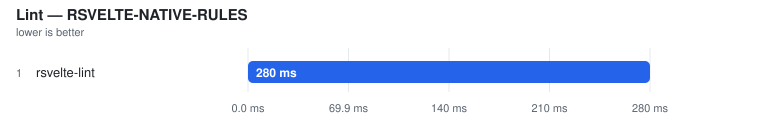
</picture>

| Tool | Files | **Median (primary)** | Min | Stddev | CV% | vs fastest | Artifact | Peak RSS | Throughput |
| --- | ---: | ---: | ---: | ---: | ---: | ---: | ---: | ---: | ---: |
| rsvelte-lint | 183 | **228.6 ms** | 227.3 ms | 5.6 ms | 2.4% | — | n/a | n/a | — |

Notes

- **rsvelte-lint**: rsvelte-lint . (Rust linter) | ⓘ file coverage verified: named 183/183 planted Svelte files.

##### VERTER-NATIVE-DIAGNOSTICS — separate workload

<picture>
  <source media="(prefers-color-scheme: dark)" srcset="charts/real-world-flowbite-svelte-real-world-linux-flowbite-svelte-lint-0ryghf2-dark.svg">
  
</picture>

| Tool | Files | **Median (primary)** | Min | Stddev | CV% | vs fastest | Artifact | Peak RSS | Throughput |
| --- | ---: | ---: | ---: | ---: | ---: | ---: | ---: | ---: | ---: |
| Verter host lint ⚠ | 183 | (181.7 ms) | (179.9 ms) | – | – | not ranked | – | n/a | – |

Notes

- **Verter host lint ⚠**: VerterHost.upsert(fileKind=svelte) + lint/getDiagnostics for each explicit file | ⚠ FAILED VALIDATION — planted issue or markup work not observed | ⓘ file coverage by construction: the invocation receives all 183 corpus files as an explicit list.

Methodology

- Every tool receives the same isolated Svelte corpus.
- A planted {@html} issue must be reported; missing the template rule leaves the time visible but unranked.
- An untimed file-coverage census requires each directory-walk CLI to name every planted corpus file; explicit-list APIs are exact by construction.
- ESLint is measured in single-threaded API, worker-pool API, and CLI modes so invocation and thread-count costs remain visible.
- Rule sets are not identical, so ESLint recommended rules, rsvelte native rules, and Verter diagnostics are separate workload classes. The shared planted gate establishes minimum work but never cross-engine equivalence.
- Tool order is rotated; ranking metric is the median of warmed runs.

Raw runs:

- **eslint-plugin-svelte (1T API)**: 2.11 s, 2.59 s, 1.95 s, 1.90 s, 1.86 s
- **eslint-plugin-svelte (CLI)**: 3.50 s, 3.41 s, 3.52 s, 3.52 s, 3.44 s
- **eslint-plugin-svelte (worker pool)**: 4.18 s, 4.24 s, 4.13 s, 4.11 s, 4.04 s
- **rsvelte-lint**: 227.3 ms, 228.6 ms, 239.0 ms, 236.8 ms, 227.7 ms
- **Verter host lint**: 180.5 ms, 185.3 ms, 186.9 ms, 181.7 ms, 179.9 ms

## open-webui

- **Generated:** 2026-09-12T10:53:07.414Z
- **Fixture:** `pinned real-world Svelte source checkouts` (650 Svelte files)
- **Runs / warmups:** 5 / 1
- **Runner:** Linux · linux/x64 · 4 CPUs · AMD EPYC 7763 64-Core Processor · 16 GB RAM · Node v22.23.2
- **Commit:** [cc44ddb](https://github.com/pikax/svelte-benchmarks/commit/cc44ddb)
- **CI run:** https://github.com/pikax/svelte-benchmarks/actions/runs/34688914621
- **Source:** `real-world-Linux-open-webui.json`

Corpus: open-webui:app

### SFC compile (unique contents)

Files: **649** · Bytes: **3,610,179**

Corpus: open-webui:app @ v0.11.0 (f9590b80, released/committed 2026-07-27) · 650 SFCs · app-source · Open WebUI License

Version-class scopes: svelte-5.56.8: **649/650** files (1 excluded) · svelte-5.56.4: **649/650** files (1 excluded). Each row's Files column identifies its applicable corpus; classes are never ranked together.

Tools:

- **svelte/compiler 5.56.8** — Primary official Svelte compiler reference used by the rsvelte packages in this harness.
- **svelte/compiler 5.56.4** — Pinned official reference for @mrwaip/svelte-rs, which documents parity against Svelte 5.56.4.
- **@mrwaip/svelte-rs (NAPI)** — MrWaip/svelte-rs native compiler through its svelte/compiler-compatible API.
- **@rsvelte/compiler (wasm)** — rsvelte WASM compiler bindings.
- **@rsvelte/native (NAPI)** — rsvelte native NAPI compiler (@rsvelte/vite-plugin-svelte-native).

Validation (runtime semantic plants):

Suite 2026-09-12.2 · hash 451381a17402 · 2 cell(s)

| Cell | Status | Entrypoint verdicts |
| --- | --- | --- |
| client/production/source-map-off | FAIL | svelte-official: PASS · svelte-mrwaip-reference: PASS · mrwaip-svelte-rs: FAIL · rsvelte-wasm: FAIL · rsvelte-native: FAIL |
| server/production/source-map-off | FAIL | svelte-official: PASS · svelte-mrwaip-reference: PASS · mrwaip-svelte-rs: FAIL · rsvelte-wasm: PASS · rsvelte-native: PASS |

Compile results are **grouped by target × environment**, then by comparison class.

#### CLIENT · production

Target: `client` · Environment: `production`

##### EXPERIMENTAL-SVELTE — separate workload

<picture>
  <source media="(prefers-color-scheme: dark)" srcset="charts/real-world-open-webui-real-world-linux-open-webui-compile-client-0g1kspv-dark.svg">
  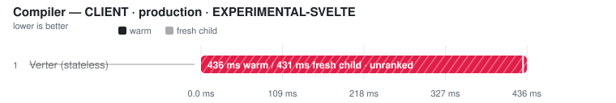
</picture>

| Tool | Files | **Median (primary)** | Min | Stddev | CV% | vs fastest | Artifact | Peak RSS | Throughput |
| --- | ---: | ---: | ---: | ---: | ---: | ---: | ---: | ---: | ---: |
| Verter native ⏭ | 649 | skipped | – | – | – | – | – | – | – |

Notes

- **Verter native ⏭**: No public Svelte runtime compile API; the experimental carrier exposes an IDE projection only. No proxy workload is timed.

##### SVELTE-5.56.4 — separate workload

<picture>
  <source media="(prefers-color-scheme: dark)" srcset="charts/real-world-open-webui-real-world-linux-open-webui-compile-client-0l7yn7n-dark.svg">
  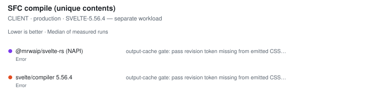
</picture>

| Tool | Files | **Median (primary)** | Min | Stddev | CV% | vs fastest | Code bytes | Peak RSS | Throughput |
| --- | ---: | ---: | ---: | ---: | ---: | ---: | ---: | ---: | ---: |
| svelte/compiler 5.56.4 ❌ | 649 | error | – | – | – | – | – | – | – |
| @mrwaip/svelte-rs (NAPI) ❌ | 649 | error | – | – | – | – | – | – | – |

Notes

- **svelte/compiler 5.56.4 ❌**: output-cache gate: pass revision token missing from emitted CSS for 00051--ManageOllama.svelte — the compiler did not process this pass's input
- **@mrwaip/svelte-rs (NAPI) ❌**: output-cache gate: pass revision token missing from emitted CSS for 00051--ManageOllama.svelte — the compiler did not process this pass's input

##### SVELTE-5.56.8 — separate workload

<picture>
  <source media="(prefers-color-scheme: dark)" srcset="charts/real-world-open-webui-real-world-linux-open-webui-compile-client-0ojtvjb-dark.svg">
  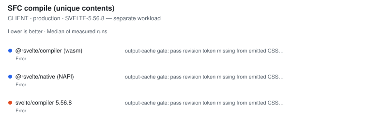
</picture>

| Tool | Files | **Median (primary)** | Min | Stddev | CV% | vs fastest | Code bytes | Peak RSS | Throughput |
| --- | ---: | ---: | ---: | ---: | ---: | ---: | ---: | ---: | ---: |
| svelte/compiler 5.56.8 ❌ | 649 | error | – | – | – | – | – | – | – |
| @rsvelte/compiler (wasm) ❌ | 649 | error | – | – | – | – | – | – | – |
| @rsvelte/native (NAPI) ❌ | 649 | error | – | – | – | – | – | – | – |

Notes

- **svelte/compiler 5.56.8 ❌**: output-cache gate: pass revision token missing from emitted CSS for 00051--ManageOllama.svelte — the compiler did not process this pass's input
- **@rsvelte/compiler (wasm) ❌**: output-cache gate: pass revision token missing from emitted CSS for 00051--ManageOllama.svelte — the compiler did not process this pass's input
- **@rsvelte/native (NAPI) ❌**: output-cache gate: pass revision token missing from emitted CSS for 00051--ManageOllama.svelte — the compiler did not process this pass's input

#### SERVER · production

Target: `server` · Environment: `production`

##### EXPERIMENTAL-SVELTE — separate workload

<picture>
  <source media="(prefers-color-scheme: dark)" srcset="charts/real-world-open-webui-real-world-linux-open-webui-compile-server-04jjrdb-dark.svg">
  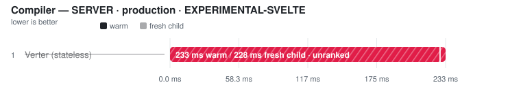
</picture>

| Tool | Files | **Median (primary)** | Min | Stddev | CV% | vs fastest | Artifact | Peak RSS | Throughput |
| --- | ---: | ---: | ---: | ---: | ---: | ---: | ---: | ---: | ---: |
| Verter native ⏭ | 649 | skipped | – | – | – | – | – | – | – |

Notes

- **Verter native ⏭**: No public Svelte runtime compile API; the experimental carrier exposes an IDE projection only. No proxy workload is timed.

##### SVELTE-5.56.4 — separate workload

<picture>
  <source media="(prefers-color-scheme: dark)" srcset="charts/real-world-open-webui-real-world-linux-open-webui-compile-server-0y7dnnb-dark.svg">
  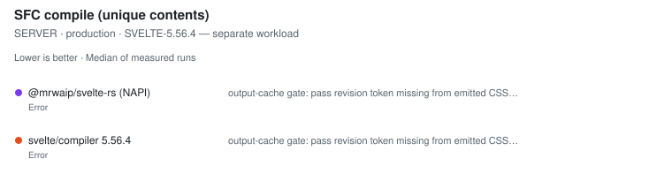
</picture>

| Tool | Files | **Median (primary)** | Min | Stddev | CV% | vs fastest | Code bytes | Peak RSS | Throughput |
| --- | ---: | ---: | ---: | ---: | ---: | ---: | ---: | ---: | ---: |
| svelte/compiler 5.56.4 ❌ | 649 | error | – | – | – | – | – | – | – |
| @mrwaip/svelte-rs (NAPI) ❌ | 649 | error | – | – | – | – | – | – | – |

Notes

- **svelte/compiler 5.56.4 ❌**: output-cache gate: pass revision token missing from emitted CSS for 00051--ManageOllama.svelte — the compiler did not process this pass's input
- **@mrwaip/svelte-rs (NAPI) ❌**: output-cache gate: pass revision token missing from emitted CSS for 00051--ManageOllama.svelte — the compiler did not process this pass's input

##### SVELTE-5.56.8 — separate workload

<picture>
  <source media="(prefers-color-scheme: dark)" srcset="charts/real-world-open-webui-real-world-linux-open-webui-compile-server-0uvifbn-dark.svg">
  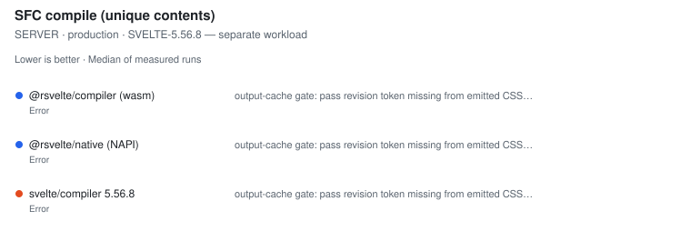
</picture>

| Tool | Files | **Median (primary)** | Min | Stddev | CV% | vs fastest | Code bytes | Peak RSS | Throughput |
| --- | ---: | ---: | ---: | ---: | ---: | ---: | ---: | ---: | ---: |
| svelte/compiler 5.56.8 ❌ | 649 | error | – | – | – | – | – | – | – |
| @rsvelte/compiler (wasm) ❌ | 649 | error | – | – | – | – | – | – | – |
| @rsvelte/native (NAPI) ❌ | 649 | error | – | – | – | – | – | – | – |

Notes

- **svelte/compiler 5.56.8 ❌**: output-cache gate: pass revision token missing from emitted CSS for 00051--ManageOllama.svelte — the compiler did not process this pass's input
- **@rsvelte/compiler (wasm) ❌**: output-cache gate: pass revision token missing from emitted CSS for 00051--ManageOllama.svelte — the compiler did not process this pass's input
- **@rsvelte/native (NAPI) ❌**: output-cache gate: pass revision token missing from emitted CSS for 00051--ManageOllama.svelte — the compiler did not process this pass's input

Methodology

- Matrix: generate ∈ {client, server} × env ∈ {production, development} × source-map ∈ {off, on} (off by default).
- Within each pinned compiler-version class, every tool receives the same in-memory Svelte SFC corpus. Real-world eligibility is decided independently by that class's official reference and per-row file counts remain visible.
- Official: svelte/compiler compile() with runes=auto. Generated fixtures force runes; real-world sources use compiler auto-detection.
- MrWaip: @mrwaip/svelte-rs native compiler through its compatible compile() API, ranked inside the pinned svelte-5.56.4 class with svelte/compiler 5.56.4 as the official reference/baseline.
- rsvelte: WASM (@rsvelte/compiler) and NAPI (@rsvelte/vite-plugin-svelte-native) paths are separate rows in the svelte-5.56.8 class.
- Verter exposes no public Svelte runtime compile API in the installed package (probed at runtime), so it is reported skipped; its different runtime-render batching API is not substituted.
- Every warmed/fresh pass compiles a REVISED corpus: a fixed-width comment token plus a used CSS custom-property rule. The timed loop asserts the token reached the emitted CSS, so a cached whole-output result from a previous pass fails the gate. Adapter parity additionally requires every warm and fresh pass to have received a distinct input revision.
- Every compiler must return one non-empty code artifact per input file, emit the expected Svelte client/server runtime import, and remove Svelte runes; aggregate byte totals alone are not accepted as proof of coverage.
- Fresh child = the first timed row workload in a NEW child process, after excluded Node startup, package imports, adapter construction and input materialisation. It is NOT machine-cold (OS page cache is not flushed) and its ratio never substitutes for the warm verdict.
- Source maps: every compared Svelte 5 compiler ALWAYS emits js.map/css.map from compile() (no off/on flag exists — the 'sourcemap' option is a chained-map INPUT), so an off/on matrix would measure the harness, not the tools. Instead the maps' COORDINATE CORRECTNESS gates every row: anchored tokens in generated JS/CSS must trace back to their exact source positions (segment fallback allowed, exact line/column required, sourcesContent equal to the full component), across LF/CRLF and non-BMP-shifted columns. Wrong-file, shifted, stale or byte-counted maps unrank the row.
- Runtime semantic validity: a 28-plant Svelte 5 suite (props/state/derived/bindable/bindings/events/each-keyed/await/snippets/stores/actions/context/dynamic components/{@html}/SVG/module script/legacy syntax + CSS semantics) runs per entrypoint per cell in isolated child processes after timing; non-PASS rows unrank, and a failed official reference unrankS every candidate in its compatibility class (no survivor promotion).
- Tool order is rotated on every warmup and measured run. A row is unranked unless the measured runs cover every active execution position; ranking metric is the median of warmed runs.

### Svelte TypeScript projection

Files: **650** · Bytes: **3,612,860**

Corpus: open-webui:app @ v0.11.0 (f9590b80, released/committed 2026-07-27) · 650 SFCs · app-source · Open WebUI License

Tools:

- **svelte2tsx** — Official Svelte-to-TSX projection from sveltejs/language-tools.
- **@rsvelte/svelte2tsx (Wasm)** — rsvelte Rust/Wasm drop-in Svelte-to-TSX projection.
- **Verter IDE projection** — VerterHost ensureIdeCompiled/getIde Svelte projection; separate schema from svelte2tsx.

##### SVELTE2TSX-COMPATIBLE — separate workload

<picture>
  <source media="(prefers-color-scheme: dark)" srcset="charts/real-world-open-webui-real-world-linux-open-webui-projection-pro-110xcq4-dark.svg">
  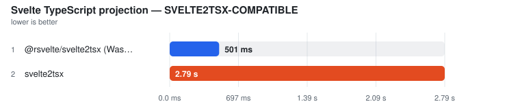
</picture>

| Tool | Files | **Median (primary)** | Min | Stddev | CV% | vs fastest | TSX bytes | Peak RSS | Throughput |
| --- | ---: | ---: | ---: | ---: | ---: | ---: | ---: | ---: | ---: |
| @rsvelte/svelte2tsx (Wasm) | 650 | **501.3 ms** | 497.4 ms | 8.4 ms | 1.7% | 1.00x | 4,963,608 | n/a | 1.3k files/s |
| svelte2tsx | 650 | **2.79 s** | 2.76 s | 52.5 ms | 1.9% | 5.56x | 4,963,608 | n/a | 233 files/s |

Notes

- **@rsvelte/svelte2tsx (Wasm)**: Rust/Wasm drop-in; TypeScript-printer structural parity against official output | gate: ✓ 650/650 valid TSX outputs
- **svelte2tsx**: Official svelte2tsx, Svelte 5 TS projection | gate: ✓ 650/650 valid TSX outputs

##### VERTER-IDE-PROJECTION — separate workload

<picture>
  <source media="(prefers-color-scheme: dark)" srcset="charts/real-world-open-webui-real-world-linux-open-webui-projection-pro-1j6ermm-dark.svg">
  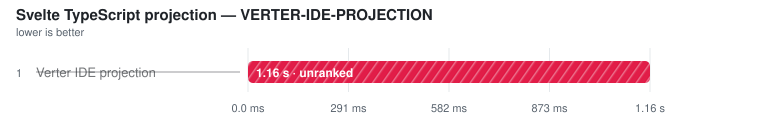
</picture>

| Tool | Files | **Median (primary)** | Min | Stddev | CV% | vs fastest | Projection bytes | Peak RSS | Throughput |
| --- | ---: | ---: | ---: | ---: | ---: | ---: | ---: | ---: | ---: |
| Verter IDE projection ⚠ | 650 | (1.16 s) | (1.15 s) | – | – | not ranked | (12,804,683) | n/a | – |

Notes

- **Verter IDE projection ⚠**: Native ensureIdeCompiled/getIde Svelte path; separate class because this is Verter's IDE carrier, not a svelte2tsx-compatible schema | gate: ✗ invalid TSX: Unexpected token. Did you mean `{'>'}` or `&gt;`?

Methodology

- This is the type-analysis projection used by Svelte-aware TypeScript tooling; it is not runtime compilation or component documentation.
- The svelte2tsx-compatible rows use the synchronous in-process API with identical Svelte 5 options and file order.
- Every output must parse as TSX and contain tool-specific Svelte projection helpers.
- The rsvelte row must match official output after TypeScript parses and reprints both outputs, ignoring formatting-only whitespace while retaining syntax and comments.
- Verter's ensureIdeCompiled/getIde output is a genuine Svelte IDE projection, but its carrier and helper contract differ from svelte2tsx; it is therefore measured in a separate comparison class.

Raw runs:

- **@rsvelte/svelte2tsx (Wasm)**: 515.4 ms, 501.3 ms, 513.3 ms, 497.4 ms, 499.4 ms
- **svelte2tsx**: 2.88 s, 2.76 s, 2.76 s, 2.85 s, 2.79 s
- **Verter IDE projection**: 1.17 s, 1.15 s, 1.16 s, 1.18 s, 1.16 s

### Format

Files: **650** · Bytes: **3,612,860**

Corpus: open-webui:app @ v0.11.0 (f9590b80, released/committed 2026-07-27) · 650 SFCs · app-source · Open WebUI License

Tools:

- **Prettier** — prettier --write with prettier-plugin-svelte over a fresh corpus copy.
- **rsvelte-fmt** — @rsvelte/fmt — Rust formatter for .svelte.
- **Oxfmt** — Oxc formatter; skipped because the pinned release excludes .svelte files.

<picture>
  <source media="(prefers-color-scheme: dark)" srcset="charts/real-world-open-webui-real-world-linux-open-webui-format-format-all-dark.svg">
  
</picture>

| Tool | Files | **Median (primary)** | Min | Stddev | CV% | vs fastest | Artifact | Peak RSS | Throughput |
| --- | ---: | ---: | ---: | ---: | ---: | ---: | ---: | ---: | ---: |
| Prettier | 650 | **17.46 s** | 17.29 s | 704.4 ms | 4.0% | — | n/a | n/a | — |
| rsvelte-fmt ❌ | 650 | error | – | – | – | – | – | – | – |
| Oxfmt ⏭ | 650 | skipped | – | – | – | – | – | – | – |

Notes

- **Prettier**: prettier --write **/*.svelte with prettier-plugin-svelte · single-threaded | ⓘ file coverage verified: rewrote 650/650 Svelte files.
- **rsvelte-fmt ❌**: /home/runner/work/svelte-benchmarks/svelte-benchmarks/node_modules/.bin/rsvelte-fmt . exited with 2 No files found matching the given patterns. rsvelte-fmt: /home/runner/work/svelte-benchmarks/svelte-benchmarks/work-real/open-webui/format/work/format/rsvelte-fmt-12/00106--Embeds.svelte: rsvelte_formatter error: script parse failed: Diagnostics([OxcDiagnostic { inner: OxcDiagnosticInner { message: "A required parameter cannot follow an optional parameter.", labels: [LabeledSpan { label: None, span: Span { start: 304, end: 320 }, primary: false }], help: None, note: None, severity: Error, code: OxcCode { scope: Some("TS"), number: Some("1016") }, url: None } }]) rsvelte-fmt: formatted 648 / 651 files
- **Oxfmt ⏭**: Pinned Oxfmt release excludes .svelte files; no CLI-startup proxy is timed.

Methodology

- Every timed invocation receives a fresh copy of the same Svelte corpus.
- All rows are CLI invocations; any non-zero exit is an operational failure and cannot rank, even if some files changed first.
- A nested markup-rewrite plant fails tools that no-op, format only &lt;script>, or use a non-recursive file pattern.
- An untimed coverage census dirties every Svelte file; a tool that rewrites fewer than the full corpus is measured but unranked.
- Output style is not normalized — this measures whole-SFC format throughput, not byte identity.
- Tool order is rotated; ranking metric is the median of warmed runs.

Raw runs:

- **Prettier**: 19.00 s, 17.77 s, 17.29 s, 17.38 s, 17.46 s

### Lint

Files: **650** · Bytes: **3,612,860**

Corpus: open-webui:app @ v0.11.0 (f9590b80, released/committed 2026-07-27) · 650 SFCs · app-source · Open WebUI License

Tools:

- **eslint-plugin-svelte (1T API)** — ESLint API + eslint-plugin-svelte recommended rules, single-threaded.
- **eslint-plugin-svelte (worker pool)** — ESLint API + eslint-plugin-svelte recommended rules, split across worker threads.
- **eslint-plugin-svelte (CLI)** — ESLint CLI + eslint-plugin-svelte recommended rules.
- **rsvelte-lint** — @rsvelte/lint — Rust Svelte linter.
- **Verter host lint** — VerterHost lint/diagnostics API with fileKind=svelte; experimental and gated on the {@html} diagnostic.

##### ESLINT-RECOMMENDED-RULES — separate workload

<picture>
  <source media="(prefers-color-scheme: dark)" srcset="charts/real-world-open-webui-real-world-linux-open-webui-lint-lint-clas-1gxzjl0-dark.svg">
  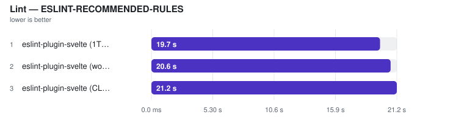
</picture>

| Tool | Files | **Median (primary)** | Min | Stddev | CV% | vs fastest | Artifact | Peak RSS | Throughput |
| --- | ---: | ---: | ---: | ---: | ---: | ---: | ---: | ---: | ---: |
| eslint-plugin-svelte (1T API) | 650 | **19.74 s** | 19.52 s | 1.51 s | 7.6% | 1.00x | n/a | n/a | 33 files/s |
| eslint-plugin-svelte (worker pool) | 650 | **20.65 s** | 20.37 s | 352.2 ms | 1.7% | 1.05x | n/a | n/a | 31 files/s |
| eslint-plugin-svelte (CLI) | 650 | **21.18 s** | 20.87 s | 511.6 ms | 2.4% | 1.07x | n/a | n/a | 31 files/s |

Notes

- **eslint-plugin-svelte (1T API)**: ESLint flat config + eslint-plugin-svelte recommended; explicit file list | ⓘ file coverage by construction: the invocation receives all 650 corpus files as an explicit list.
- **eslint-plugin-svelte (worker pool)**: ESLint worker_threads fan-out; explicit file list | ⓘ file coverage by construction: the invocation receives all 650 corpus files as an explicit list.
- **eslint-plugin-svelte (CLI)**: eslint . over the same isolated corpus; pays startup and config load | ⓘ file coverage verified: named 650/650 planted Svelte files.

##### RSVELTE-NATIVE-RULES — separate workload

<picture>
  <source media="(prefers-color-scheme: dark)" srcset="charts/real-world-open-webui-real-world-linux-open-webui-lint-lint-clas-0liko6s-dark.svg">
  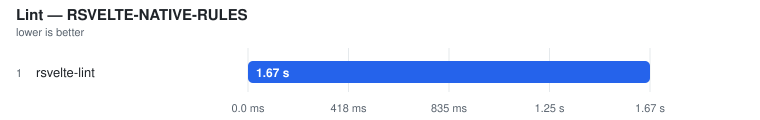
</picture>

| Tool | Files | **Median (primary)** | Min | Stddev | CV% | vs fastest | Artifact | Peak RSS | Throughput |
| --- | ---: | ---: | ---: | ---: | ---: | ---: | ---: | ---: | ---: |
| rsvelte-lint | 650 | **1.70 s** | 1.63 s | 82.6 ms | 4.9% | — | n/a | n/a | — |

Notes

- **rsvelte-lint**: rsvelte-lint . (Rust linter) | ⓘ file coverage verified: named 650/650 planted Svelte files.

##### VERTER-NATIVE-DIAGNOSTICS — separate workload

<picture>
  <source media="(prefers-color-scheme: dark)" srcset="charts/real-world-open-webui-real-world-linux-open-webui-lint-lint-clas-1w1h826-dark.svg">
  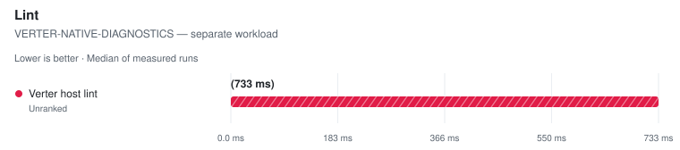
</picture>

| Tool | Files | **Median (primary)** | Min | Stddev | CV% | vs fastest | Artifact | Peak RSS | Throughput |
| --- | ---: | ---: | ---: | ---: | ---: | ---: | ---: | ---: | ---: |
| Verter host lint ⚠ | 650 | (732.8 ms) | (711.2 ms) | – | – | not ranked | – | n/a | – |

Notes

- **Verter host lint ⚠**: VerterHost.upsert(fileKind=svelte) + lint/getDiagnostics for each explicit file | ⚠ FAILED VALIDATION — planted issue or markup work not observed | ⓘ file coverage by construction: the invocation receives all 650 corpus files as an explicit list.

Methodology

- Every tool receives the same isolated Svelte corpus.
- A planted {@html} issue must be reported; missing the template rule leaves the time visible but unranked.
- An untimed file-coverage census requires each directory-walk CLI to name every planted corpus file; explicit-list APIs are exact by construction.
- ESLint is measured in single-threaded API, worker-pool API, and CLI modes so invocation and thread-count costs remain visible.
- Rule sets are not identical, so ESLint recommended rules, rsvelte native rules, and Verter diagnostics are separate workload classes. The shared planted gate establishes minimum work but never cross-engine equivalence.
- Tool order is rotated; ranking metric is the median of warmed runs.

Raw runs:

- **eslint-plugin-svelte (1T API)**: 19.52 s, 19.54 s, 19.74 s, 23.06 s, 20.16 s
- **eslint-plugin-svelte (worker pool)**: 20.58 s, 20.37 s, 21.31 s, 20.80 s, 20.65 s
- **eslint-plugin-svelte (CLI)**: 20.95 s, 20.87 s, 21.19 s, 22.15 s, 21.18 s
- **rsvelte-lint**: 1.63 s, 1.85 s, 1.69 s, 1.76 s, 1.70 s
- **Verter host lint**: 735.9 ms, 733.0 ms, 729.9 ms, 732.8 ms, 711.2 ms

## platform

- **Generated:** 2026-09-12T10:58:36.766Z
- **Fixture:** `pinned real-world Svelte source checkouts` (2462 Svelte files)
- **Runs / warmups:** 5 / 1
- **Runner:** Linux · linux/x64 · 4 CPUs · AMD EPYC 7763 64-Core Processor · 16 GB RAM · Node v22.23.2
- **Commit:** [cc44ddb](https://github.com/pikax/svelte-benchmarks/commit/cc44ddb)
- **CI run:** https://github.com/pikax/svelte-benchmarks/actions/runs/34688914621
- **Source:** `real-world-Linux-platform.json`

Corpus: platform:workspace

### SFC compile (unique contents)

Files: **2,432** · Bytes: **7,859,391**

Corpus: platform:workspace @ v0.7.426 (ccefccd8, released/committed 2026-07-05) · 2462 SFCs · app-source · EPL-2.0

Version-class scopes: svelte-5.56.8: **2432/2462** files (30 excluded) · svelte-5.56.4: **2432/2462** files (30 excluded). Each row's Files column identifies its applicable corpus; classes are never ranked together.

Tools:

- **svelte/compiler 5.56.8** — Primary official Svelte compiler reference used by the rsvelte packages in this harness.
- **svelte/compiler 5.56.4** — Pinned official reference for @mrwaip/svelte-rs, which documents parity against Svelte 5.56.4.
- **@mrwaip/svelte-rs (NAPI)** — MrWaip/svelte-rs native compiler through its svelte/compiler-compatible API.
- **@rsvelte/compiler (wasm)** — rsvelte WASM compiler bindings.
- **@rsvelte/native (NAPI)** — rsvelte native NAPI compiler (@rsvelte/vite-plugin-svelte-native).

Validation (runtime semantic plants):

Suite 2026-09-12.2 · hash 451381a17402 · 2 cell(s)

| Cell | Status | Entrypoint verdicts |
| --- | --- | --- |
| client/production/source-map-off | FAIL | svelte-official: PASS · svelte-mrwaip-reference: PASS · mrwaip-svelte-rs: FAIL · rsvelte-wasm: FAIL · rsvelte-native: FAIL |
| server/production/source-map-off | FAIL | svelte-official: PASS · svelte-mrwaip-reference: PASS · mrwaip-svelte-rs: FAIL · rsvelte-wasm: PASS · rsvelte-native: PASS |

Compile results are **grouped by target × environment**, then by comparison class.

#### CLIENT · production

Target: `client` · Environment: `production`

##### EXPERIMENTAL-SVELTE — separate workload

<picture>
  <source media="(prefers-color-scheme: dark)" srcset="charts/real-world-platform-real-world-linux-platform-compile-client-pro-0bc8mgv-dark.svg">
  
</picture>

| Tool | Files | **Median (primary)** | Min | Stddev | CV% | vs fastest | Artifact | Peak RSS | Throughput |
| --- | ---: | ---: | ---: | ---: | ---: | ---: | ---: | ---: | ---: |
| Verter native ⏭ | 2,432 | skipped | – | – | – | – | – | – | – |

Notes

- **Verter native ⏭**: No public Svelte runtime compile API; the experimental carrier exposes an IDE projection only. No proxy workload is timed.

##### SVELTE-5.56.4 — separate workload

<picture>
  <source media="(prefers-color-scheme: dark)" srcset="charts/real-world-platform-real-world-linux-platform-compile-client-pro-00v1lgn-dark.svg">
  
</picture>

| Tool | Files | **Median (primary)** | Min | Stddev | CV% | vs fastest | Code bytes | Peak RSS | Throughput |
| --- | ---: | ---: | ---: | ---: | ---: | ---: | ---: | ---: | ---: |
| svelte/compiler 5.56.4 ❌ | 2,432 | error | – | – | – | – | – | – | – |
| @mrwaip/svelte-rs (NAPI) ❌ | 2,432 | error | – | – | – | – | – | – | – |

Notes

- **svelte/compiler 5.56.4 ❌**: output-cache gate: pass revision token missing from emitted CSS for 00554--Calendar.svelte — the compiler did not process this pass's input
- **@mrwaip/svelte-rs (NAPI) ❌**: output-cache gate: pass revision token missing from emitted CSS for 00554--Calendar.svelte — the compiler did not process this pass's input

##### SVELTE-5.56.8 — separate workload

<picture>
  <source media="(prefers-color-scheme: dark)" srcset="charts/real-world-platform-real-world-linux-platform-compile-client-pro-1wkaf43-dark.svg">
  
</picture>

| Tool | Files | **Median (primary)** | Min | Stddev | CV% | vs fastest | Code bytes | Peak RSS | Throughput |
| --- | ---: | ---: | ---: | ---: | ---: | ---: | ---: | ---: | ---: |
| svelte/compiler 5.56.8 ❌ | 2,432 | error | – | – | – | – | – | – | – |
| @rsvelte/compiler (wasm) ❌ | 2,432 | error | – | – | – | – | – | – | – |
| @rsvelte/native (NAPI) ❌ | 2,432 | error | – | – | – | – | – | – | – |

Notes

- **svelte/compiler 5.56.8 ❌**: output-cache gate: pass revision token missing from emitted CSS for 00554--Calendar.svelte — the compiler did not process this pass's input
- **@rsvelte/compiler (wasm) ❌**: output-cache gate: pass revision token missing from emitted CSS for 00554--Calendar.svelte — the compiler did not process this pass's input
- **@rsvelte/native (NAPI) ❌**: output-cache gate: pass revision token missing from emitted CSS for 00554--Calendar.svelte — the compiler did not process this pass's input

#### SERVER · production

Target: `server` · Environment: `production`

##### EXPERIMENTAL-SVELTE — separate workload

<picture>
  <source media="(prefers-color-scheme: dark)" srcset="charts/real-world-platform-real-world-linux-platform-compile-server-pro-11k1iub-dark.svg">
  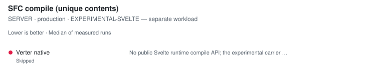
</picture>

| Tool | Files | **Median (primary)** | Min | Stddev | CV% | vs fastest | Artifact | Peak RSS | Throughput |
| --- | ---: | ---: | ---: | ---: | ---: | ---: | ---: | ---: | ---: |
| Verter native ⏭ | 2,432 | skipped | – | – | – | – | – | – | – |

Notes

- **Verter native ⏭**: No public Svelte runtime compile API; the experimental carrier exposes an IDE projection only. No proxy workload is timed.

##### SVELTE-5.56.4 — separate workload

<picture>
  <source media="(prefers-color-scheme: dark)" srcset="charts/real-world-platform-real-world-linux-platform-compile-server-pro-1jrtykj-dark.svg">
  
</picture>

| Tool | Files | **Median (primary)** | Min | Stddev | CV% | vs fastest | Code bytes | Peak RSS | Throughput |
| --- | ---: | ---: | ---: | ---: | ---: | ---: | ---: | ---: | ---: |
| svelte/compiler 5.56.4 ❌ | 2,432 | error | – | – | – | – | – | – | – |
| @mrwaip/svelte-rs (NAPI) ❌ | 2,432 | error | – | – | – | – | – | – | – |

Notes

- **svelte/compiler 5.56.4 ❌**: output-cache gate: pass revision token missing from emitted CSS for 00554--Calendar.svelte — the compiler did not process this pass's input
- **@mrwaip/svelte-rs (NAPI) ❌**: output-cache gate: pass revision token missing from emitted CSS for 00554--Calendar.svelte — the compiler did not process this pass's input

##### SVELTE-5.56.8 — separate workload

<picture>
  <source media="(prefers-color-scheme: dark)" srcset="charts/real-world-platform-real-world-linux-platform-compile-server-pro-1n3p6w7-dark.svg">
  
</picture>

| Tool | Files | **Median (primary)** | Min | Stddev | CV% | vs fastest | Code bytes | Peak RSS | Throughput |
| --- | ---: | ---: | ---: | ---: | ---: | ---: | ---: | ---: | ---: |
| svelte/compiler 5.56.8 ❌ | 2,432 | error | – | – | – | – | – | – | – |
| @rsvelte/compiler (wasm) ❌ | 2,432 | error | – | – | – | – | – | – | – |
| @rsvelte/native (NAPI) ❌ | 2,432 | error | – | – | – | – | – | – | – |

Notes

- **svelte/compiler 5.56.8 ❌**: output-cache gate: pass revision token missing from emitted CSS for 00554--Calendar.svelte — the compiler did not process this pass's input
- **@rsvelte/compiler (wasm) ❌**: output-cache gate: pass revision token missing from emitted CSS for 00554--Calendar.svelte — the compiler did not process this pass's input
- **@rsvelte/native (NAPI) ❌**: output-cache gate: pass revision token missing from emitted CSS for 00554--Calendar.svelte — the compiler did not process this pass's input

Methodology

- Matrix: generate ∈ {client, server} × env ∈ {production, development} × source-map ∈ {off, on} (off by default).
- Within each pinned compiler-version class, every tool receives the same in-memory Svelte SFC corpus. Real-world eligibility is decided independently by that class's official reference and per-row file counts remain visible.
- Official: svelte/compiler compile() with runes=auto. Generated fixtures force runes; real-world sources use compiler auto-detection.
- MrWaip: @mrwaip/svelte-rs native compiler through its compatible compile() API, ranked inside the pinned svelte-5.56.4 class with svelte/compiler 5.56.4 as the official reference/baseline.
- rsvelte: WASM (@rsvelte/compiler) and NAPI (@rsvelte/vite-plugin-svelte-native) paths are separate rows in the svelte-5.56.8 class.
- Verter exposes no public Svelte runtime compile API in the installed package (probed at runtime), so it is reported skipped; its different runtime-render batching API is not substituted.
- Every warmed/fresh pass compiles a REVISED corpus: a fixed-width comment token plus a used CSS custom-property rule. The timed loop asserts the token reached the emitted CSS, so a cached whole-output result from a previous pass fails the gate. Adapter parity additionally requires every warm and fresh pass to have received a distinct input revision.
- Every compiler must return one non-empty code artifact per input file, emit the expected Svelte client/server runtime import, and remove Svelte runes; aggregate byte totals alone are not accepted as proof of coverage.
- Fresh child = the first timed row workload in a NEW child process, after excluded Node startup, package imports, adapter construction and input materialisation. It is NOT machine-cold (OS page cache is not flushed) and its ratio never substitutes for the warm verdict.
- Source maps: every compared Svelte 5 compiler ALWAYS emits js.map/css.map from compile() (no off/on flag exists — the 'sourcemap' option is a chained-map INPUT), so an off/on matrix would measure the harness, not the tools. Instead the maps' COORDINATE CORRECTNESS gates every row: anchored tokens in generated JS/CSS must trace back to their exact source positions (segment fallback allowed, exact line/column required, sourcesContent equal to the full component), across LF/CRLF and non-BMP-shifted columns. Wrong-file, shifted, stale or byte-counted maps unrank the row.
- Runtime semantic validity: a 28-plant Svelte 5 suite (props/state/derived/bindable/bindings/events/each-keyed/await/snippets/stores/actions/context/dynamic components/{@html}/SVG/module script/legacy syntax + CSS semantics) runs per entrypoint per cell in isolated child processes after timing; non-PASS rows unrank, and a failed official reference unrankS every candidate in its compatibility class (no survivor promotion).
- Tool order is rotated on every warmup and measured run. A row is unranked unless the measured runs cover every active execution position; ranking metric is the median of warmed runs.

### Svelte TypeScript projection

Files: **2,456** · Bytes: **8,151,670**

Corpus: platform:workspace @ v0.7.426 (ccefccd8, released/committed 2026-07-05) · 2462 SFCs · app-source · EPL-2.0

Surface scope: **2456/2462** files · 6 excluded before timing because an applicable official reference API rejected the raw, unpreprocessed source. The identical accepted set is used for every row.

Tools:

- **svelte2tsx** — Official Svelte-to-TSX projection from sveltejs/language-tools.
- **@rsvelte/svelte2tsx (Wasm)** — rsvelte Rust/Wasm drop-in Svelte-to-TSX projection.
- **Verter IDE projection** — VerterHost ensureIdeCompiled/getIde Svelte projection; separate schema from svelte2tsx.

##### SVELTE2TSX-COMPATIBLE — separate workload

<picture>
  <source media="(prefers-color-scheme: dark)" srcset="charts/real-world-platform-real-world-linux-platform-projection-project-0pdb814-dark.svg">
  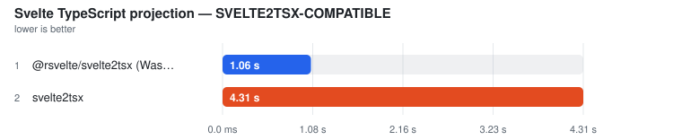
</picture>

| Tool | Files | **Median (primary)** | Min | Stddev | CV% | vs fastest | TSX bytes | Peak RSS | Throughput |
| --- | ---: | ---: | ---: | ---: | ---: | ---: | ---: | ---: | ---: |
| @rsvelte/svelte2tsx (Wasm) | 2,456 | **1.02 s** | 1.01 s | 7.6 ms | 0.7% | 1.00x | 10,283,742 | n/a | 2.4k files/s |
| svelte2tsx | 2,456 | **4.40 s** | 4.39 s | 18.1 ms | 0.4% | 4.33x | 10,283,705 | n/a | 558 files/s |

Notes

- **@rsvelte/svelte2tsx (Wasm)**: Rust/Wasm drop-in; TypeScript-printer structural parity against official output | gate: ✓ 2456/2456 valid TSX outputs
- **svelte2tsx**: Official svelte2tsx, Svelte 5 TS projection | gate: ✓ 2456/2456 valid TSX outputs

##### VERTER-IDE-PROJECTION — separate workload

<picture>
  <source media="(prefers-color-scheme: dark)" srcset="charts/real-world-platform-real-world-linux-platform-projection-project-1h6k0fm-dark.svg">
  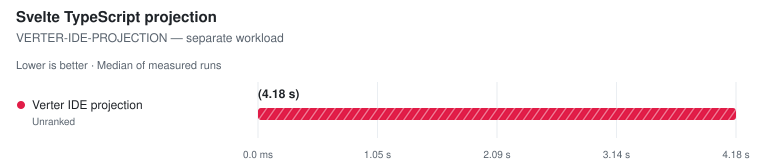
</picture>

| Tool | Files | **Median (primary)** | Min | Stddev | CV% | vs fastest | Projection bytes | Peak RSS | Throughput |
| --- | ---: | ---: | ---: | ---: | ---: | ---: | ---: | ---: | ---: |
| Verter IDE projection ⚠ | 2,456 | (4.18 s) | (4.10 s) | – | – | not ranked | (41,631,813) | n/a | – |

Notes

- **Verter IDE projection ⚠**: Native ensureIdeCompiled/getIde Svelte path; separate class because this is Verter's IDE carrier, not a svelte2tsx-compatible schema | gate: ✗ invalid TSX: Unexpected token. Did you mean `{'>'}` or `&gt;`?

Methodology

- This is the type-analysis projection used by Svelte-aware TypeScript tooling; it is not runtime compilation or component documentation.
- The svelte2tsx-compatible rows use the synchronous in-process API with identical Svelte 5 options and file order.
- Every output must parse as TSX and contain tool-specific Svelte projection helpers.
- The rsvelte row must match official output after TypeScript parses and reprints both outputs, ignoring formatting-only whitespace while retaining syntax and comments.
- Verter's ensureIdeCompiled/getIde output is a genuine Svelte IDE projection, but its carrier and helper contract differ from svelte2tsx; it is therefore measured in a separate comparison class.

Raw runs:

- **@rsvelte/svelte2tsx (Wasm)**: 1.03 s, 1.02 s, 1.01 s, 1.01 s, 1.02 s
- **svelte2tsx**: 4.40 s, 4.43 s, 4.39 s, 4.40 s, 4.42 s
- **Verter IDE projection**: 4.10 s, 4.14 s, 4.18 s, 4.19 s, 4.20 s

### Format

Files: **2,462** · Bytes: **8,184,534**

Corpus: platform:workspace @ v0.7.426 (ccefccd8, released/committed 2026-07-05) · 2462 SFCs · app-source · EPL-2.0

Tools:

- **Prettier** — prettier --write with prettier-plugin-svelte over a fresh corpus copy.
- **rsvelte-fmt** — @rsvelte/fmt — Rust formatter for .svelte.
- **Oxfmt** — Oxc formatter; skipped because the pinned release excludes .svelte files.

<picture>
  <source media="(prefers-color-scheme: dark)" srcset="charts/real-world-platform-real-world-linux-platform-format-format-all-dark.svg">
  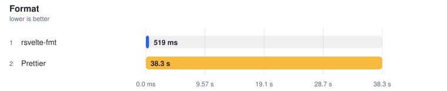
</picture>

| Tool | Files | **Median (primary)** | Min | Stddev | CV% | vs fastest | Artifact | Peak RSS | Throughput |
| --- | ---: | ---: | ---: | ---: | ---: | ---: | ---: | ---: | ---: |
| rsvelte-fmt | 2,462 | **516.5 ms** | 511.5 ms | 2.8 ms | 0.5% | 1.00x | n/a | n/a | 4.8k files/s |
| Prettier | 2,462 | **38.45 s** | 37.95 s | 267.3 ms | 0.7% | 74.44x | n/a | n/a | 64 files/s |
| Oxfmt ⏭ | 2,462 | skipped | – | – | – | – | – | – | – |

Notes

- **rsvelte-fmt**: rsvelte-fmt . (Rust); may route embedded JS/TS/CSS through other formatters | ⓘ file coverage verified: rewrote 2462/2462 Svelte files.
- **Prettier**: prettier --write **/*.svelte with prettier-plugin-svelte · single-threaded | ⓘ file coverage verified: rewrote 2462/2462 Svelte files.
- **Oxfmt ⏭**: Pinned Oxfmt release excludes .svelte files; no CLI-startup proxy is timed.

Methodology

- Every timed invocation receives a fresh copy of the same Svelte corpus.
- All rows are CLI invocations; any non-zero exit is an operational failure and cannot rank, even if some files changed first.
- A nested markup-rewrite plant fails tools that no-op, format only &lt;script>, or use a non-recursive file pattern.
- An untimed coverage census dirties every Svelte file; a tool that rewrites fewer than the full corpus is measured but unranked.
- Output style is not normalized — this measures whole-SFC format throughput, not byte identity.
- Tool order is rotated; ranking metric is the median of warmed runs.

Raw runs:

- **rsvelte-fmt**: 517.4 ms, 512.8 ms, 511.5 ms, 516.5 ms, 517.6 ms
- **Prettier**: 38.56 s, 38.49 s, 38.45 s, 38.10 s, 37.95 s

### Lint

Files: **2,462** · Bytes: **8,184,534**

Corpus: platform:workspace @ v0.7.426 (ccefccd8, released/committed 2026-07-05) · 2462 SFCs · app-source · EPL-2.0

Tools:

- **eslint-plugin-svelte (1T API)** — ESLint API + eslint-plugin-svelte recommended rules, single-threaded.
- **eslint-plugin-svelte (worker pool)** — ESLint API + eslint-plugin-svelte recommended rules, split across worker threads.
- **eslint-plugin-svelte (CLI)** — ESLint CLI + eslint-plugin-svelte recommended rules.
- **rsvelte-lint** — @rsvelte/lint — Rust Svelte linter.
- **Verter host lint** — VerterHost lint/diagnostics API with fileKind=svelte; experimental and gated on the {@html} diagnostic.

##### ESLINT-RECOMMENDED-RULES — separate workload

<picture>
  <source media="(prefers-color-scheme: dark)" srcset="charts/real-world-platform-real-world-linux-platform-lint-lint-class-es-13tdm8o-dark.svg">
  
</picture>

| Tool | Files | **Median (primary)** | Min | Stddev | CV% | vs fastest | Artifact | Peak RSS | Throughput |
| --- | ---: | ---: | ---: | ---: | ---: | ---: | ---: | ---: | ---: |
| eslint-plugin-svelte (1T API) ❌ | 2,462 | error | – | – | – | – | – | – | – |
| eslint-plugin-svelte (worker pool) ❌ | 2,462 | error | – | – | – | – | – | – | – |
| eslint-plugin-svelte (CLI) ❌ | 2,462 | error | – | – | – | – | – | – | – |

Notes

- **eslint-plugin-svelte (1T API) ❌**: source.isSpaceBetweenTokens is not a function Occurred while linting /home/runner/work/svelte-benchmarks/svelte-benchmarks/work-real/platform/lint/work/lint/n2462/00154--PopupInstance.svelte:39 Rule: "svelte/no-reactive-functions"
- **eslint-plugin-svelte (worker pool) ❌**: TypeError: source.isSpaceBetweenTokens is not a function Occurred while linting /home/runner/work/svelte-benchmarks/svelte-benchmarks/work-real/platform/lint/work/lint/n2462/00154--PopupInstance.svelte:39 Rule: "svelte/no-reactive-functions"     at Object.fix (file:///home/runner/work/svelte-benchmarks/svelte-benchmarks/node_modules/.pnpm/eslint-plugin-svelte@3.23.0_eslint@10.10.0_svelte@5.57.0_@typescript-eslint+types@8.70.0_/node_modules/eslint-plugin-svelte/lib/rules/no-reactive-functions.js:48:61)     at normalizeFixes (/home/runner/work/svelte-benchmarks/svelte-benchmarks/node_modules/.pnpm/eslint@10.10.0/node_modules/eslint/lib/linter/file-report.js:296:25)     at /home/runner/work/svelte-benchmarks/svelte-benchmarks/node_modules/.pnpm/eslint@10.10.0/node_modules/eslint/lib/linter/file-report.js:328:11     at Array.map (<anonymous>)     at mapSuggestions (/home/runner/work/svelte-benchmarks/svelte-benchmarks/node_modules/.pnpm/eslint@10.10.0/node_modules/eslint/lib/linter/file-report.js:321:5)     at FileReport.addRuleMessage (/home/runner/work/svelte-benchmarks/svelte-benchmarks/node_modules/.pnpm/eslint@10.10.0/node_modules/eslint/lib/linter/file-report.js:558:8)     at FileContext.report (/home/runner/work/svelte-benchmarks/svelte-benchmarks/node_modules/.pnpm/eslint@10.10.0/node_modules/eslint/lib/linter/linter.js:583:28)     at SvelteReactiveStatement > ExpressionStatement > AssignmentExpression > :function (file:///home/runner/work/svelte-benchmarks/svelte-benchmarks/node_modules/.pnpm/eslint-plugin-svelte@3.23.0_eslint@10.10.0_svelte@5.57.0_@typescript-eslint+types@8.70.0_/node_modules/eslint-plugin-svelte/lib/rules/no-reactive-functions.js:36:32)     at ruleErrorHandler (/home/runner/work/svelte-benchmarks/svelte-benchmarks/node_modules/.pnpm/eslint@10.10.0/node_modules/eslint/lib/linter/linter.js:645:33)     at /home/runner/work/svelte-benchmarks/svelte-benchmarks/node_modules/.pnpm/eslint@10.10.0/node_modules/eslint/lib/linter/source-code-visitor.js:76:46
- **eslint-plugin-svelte (CLI) ❌**: /home/runner/work/svelte-benchmarks/svelte-benchmarks/node_modules/.bin/eslint . exited with 2 Oops! Something went wrong! :(  ESLint: 10.10.0  TypeError: source.isSpaceBetweenTokens is not a function Occurred while linting /home/runner/work/svelte-benchmarks/svelte-benchmarks/work-real/platform/lint/work/lint/n2462/00154--PopupInstance.svelte:39 Rule: "svelte/no-reactive-functions"     at Object.fix (file:///home/runner/work/svelte-benchmarks/svelte-benchmarks/node_modules/.pnpm/eslint-plugin-svelte@3.23.0_eslint@10.10.0_svelte@5.57.0_@typescript-eslint+types@8.70.0_/node_modules/eslint-plugin-svelte/lib/rules/no-reactive-functions.js:48:61)     at normalizeFixes (/home/runner/work/svelte-benchmarks/svelte-benchmarks/node_modules/.pnpm/eslint@10.10.0/node_modules/eslint/lib/linter/file-report.js:296:25)     at /home/runner/work/svelte-benchmarks/svelte-benchmarks/node_modules/.pnpm/eslint@10.10.0/node_modules/eslint/lib/linter/file-report.js:328:11     at Array.map (<anonymous>)     at mapSuggestions (/home/runner/work/svelte-benchmarks/svelte-benchmarks/node_modules/.pnpm/eslint@10.10.0/node_modules/eslint/lib/linter/file-report.js:321:5)     at FileReport.addRuleMessage (/home/runner/work/svelte-benchmarks/svelte-benchmarks/node_modules/.pnpm/eslint@10.10.0/node_modules/eslint/lib/linter/file-report.js:558:8)     at FileContext.report (/home/runner/work/svelte-benchmarks/svelte-benchmarks/node_modules/.pnpm/eslint@10.10.0/node_modules/eslint/lib/linter/linter.js:583:28)     at SvelteReactiveStatement > ExpressionStatement > AssignmentExpression > :function (file:///home/runner/work/svelte-benchmarks/svelte-benchmarks/node_modules/.pnpm/eslint-plugin-svelte@3.23.0_eslint@10.10.0_svelte@5.57.0_@typescript-eslint+types@8.70.0_/node_modules/eslint-plugin-svelte/lib/rules/no-reactive-functions.js:36:32)     at ruleErrorHandler (/home/runner/work/svelte-benchmarks/svelte-benchmarks/node_modules/.pnpm/eslint@10.10.0/node_modules/eslint/lib/linter/linter.js:645:33)     at /home/runner/work/svelte-benchmarks/svelte-benchmarks/node_modules/.pnpm/eslint@10.10.0/node_modules/eslint/lib/linter/source-code-visitor.js:76:46

##### RSVELTE-NATIVE-RULES — separate workload

<picture>
  <source media="(prefers-color-scheme: dark)" srcset="charts/real-world-platform-real-world-linux-platform-lint-lint-class-rs-0eec7c8-dark.svg">
  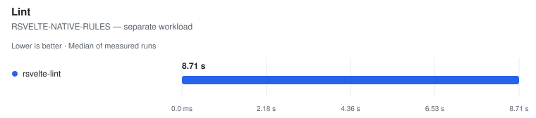
</picture>

| Tool | Files | **Median (primary)** | Min | Stddev | CV% | vs fastest | Artifact | Peak RSS | Throughput |
| --- | ---: | ---: | ---: | ---: | ---: | ---: | ---: | ---: | ---: |
| rsvelte-lint | 2,462 | **8.71 s** | 3.99 s | 2.16 s | 24.8% ⚠ | — | n/a | n/a | — |

Notes

- **rsvelte-lint**: rsvelte-lint . (Rust linter) | ⓘ file coverage verified: named 2462/2462 planted Svelte files.

##### VERTER-NATIVE-DIAGNOSTICS — separate workload

<picture>
  <source media="(prefers-color-scheme: dark)" srcset="charts/real-world-platform-real-world-linux-platform-lint-lint-class-ve-1druh42-dark.svg">
  
</picture>

| Tool | Files | **Median (primary)** | Min | Stddev | CV% | vs fastest | Artifact | Peak RSS | Throughput |
| --- | ---: | ---: | ---: | ---: | ---: | ---: | ---: | ---: | ---: |
| Verter host lint ⚠ | 2,462 | (4.80 s) | (2.66 s) | – | – | not ranked | – | n/a | – |

Notes

- **Verter host lint ⚠**: VerterHost.upsert(fileKind=svelte) + lint/getDiagnostics for each explicit file | ⚠ FAILED VALIDATION — planted issue or markup work not observed | ⓘ file coverage by construction: the invocation receives all 2462 corpus files as an explicit list.

Methodology

- Every tool receives the same isolated Svelte corpus.
- A planted {@html} issue must be reported; missing the template rule leaves the time visible but unranked.
- An untimed file-coverage census requires each directory-walk CLI to name every planted corpus file; explicit-list APIs are exact by construction.
- ESLint is measured in single-threaded API, worker-pool API, and CLI modes so invocation and thread-count costs remain visible.
- Rule sets are not identical, so ESLint recommended rules, rsvelte native rules, and Verter diagnostics are separate workload classes. The shared planted gate establishes minimum work but never cross-engine equivalence.
- Tool order is rotated; ranking metric is the median of warmed runs.

Raw runs:

- **rsvelte-lint**: 8.89 s, 8.71 s, 3.99 s, 9.10 s, 8.44 s
- **Verter host lint**: 4.80 s, 4.65 s, 2.66 s, 8.21 s, 7.62 s

## smui

- **Generated:** 2026-09-12T10:50:48.776Z
- **Fixture:** `pinned real-world Svelte source checkouts` (126 Svelte files)
- **Runs / warmups:** 5 / 1
- **Runner:** Linux · linux/x64 · 4 CPUs · AMD EPYC 7763 64-Core Processor · 16 GB RAM · Node v22.23.2
- **Commit:** [cc44ddb](https://github.com/pikax/svelte-benchmarks/commit/cc44ddb)
- **CI run:** https://github.com/pikax/svelte-benchmarks/actions/runs/34688914621
- **Source:** `real-world-Linux-smui.json`

Corpus: smui:components

### SFC compile (unique contents)

Files: **126** · Bytes: **530,360**

Corpus: smui:components @ v9.0.1 (8d204fe8, released/committed 2026-06-02) · 126 SFCs · library-source · Apache-2.0

Version-class scopes: svelte-5.56.8: **126/126** files (0 excluded) · svelte-5.56.4: **126/126** files (0 excluded). Each row's Files column identifies its applicable corpus; classes are never ranked together.

Tools:

- **svelte/compiler 5.56.8** — Primary official Svelte compiler reference used by the rsvelte packages in this harness.
- **svelte/compiler 5.56.4** — Pinned official reference for @mrwaip/svelte-rs, which documents parity against Svelte 5.56.4.
- **@mrwaip/svelte-rs (NAPI)** — MrWaip/svelte-rs native compiler through its svelte/compiler-compatible API.
- **@rsvelte/compiler (wasm)** — rsvelte WASM compiler bindings.
- **@rsvelte/native (NAPI)** — rsvelte native NAPI compiler (@rsvelte/vite-plugin-svelte-native).

Validation (runtime semantic plants):

Suite 2026-09-12.2 · hash 451381a17402 · 2 cell(s)

| Cell | Status | Entrypoint verdicts |
| --- | --- | --- |
| client/production/source-map-off | FAIL | svelte-official: PASS · svelte-mrwaip-reference: PASS · mrwaip-svelte-rs: FAIL · rsvelte-wasm: FAIL · rsvelte-native: FAIL |
| server/production/source-map-off | FAIL | svelte-official: PASS · svelte-mrwaip-reference: PASS · mrwaip-svelte-rs: FAIL · rsvelte-wasm: PASS · rsvelte-native: PASS |

Compile results are **grouped by target × environment**, then by comparison class.

#### CLIENT · production

Target: `client` · Environment: `production`

##### EXPERIMENTAL-SVELTE — separate workload

<picture>
  <source media="(prefers-color-scheme: dark)" srcset="charts/real-world-smui-real-world-linux-smui-compile-client-prod-class--1g0llnj-dark.svg">
  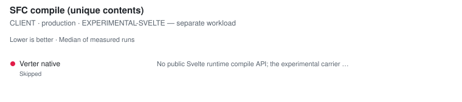
</picture>

| Tool | Files | **Median (primary)** | Min | Stddev | CV% | vs fastest | Artifact | Peak RSS | Throughput |
| --- | ---: | ---: | ---: | ---: | ---: | ---: | ---: | ---: | ---: |
| Verter native ⏭ | 126 | skipped | – | – | – | – | – | – | – |

Notes

- **Verter native ⏭**: No public Svelte runtime compile API; the experimental carrier exposes an IDE projection only. No proxy workload is timed.

##### SVELTE-5.56.4 — separate workload

<picture>
  <source media="(prefers-color-scheme: dark)" srcset="charts/real-world-smui-real-world-linux-smui-compile-client-prod-class--0aee493-dark.svg">
  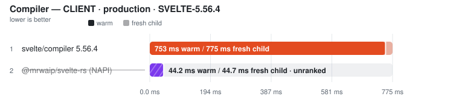
</picture>

| Tool | Files | Fresh child | vs fastest fresh | **Warm (primary)** | Min | Stddev | CV% | vs fastest | Code bytes | Peak RSS | Throughput |
| --- | ---: | ---: | ---: | ---: | ---: | ---: | ---: | ---: | ---: | ---: | ---: |
| svelte/compiler 5.56.4 | 126 | 775.0 ms | — | **752.5 ms** | 709.1 ms | 31.3 ms | 4.2% | — | 633,060 | n/a | — |
| @mrwaip/svelte-rs (NAPI) ⚠ | 126 | (44.7 ms) | not ranked | (44.2 ms) | (44.1 ms) | – | – | not ranked | (598,944) | n/a | – |

Notes

- **svelte/compiler 5.56.4**: Pinned official reference for @mrwaip/svelte-rs; generate=client, dev=false, css=external | runtime gate: ✓ 126/126 parseable outputs use svelte/internal/client and match official CSS presence; dev option changes output | ⓘ adapter parity: 10 distinct input revisions across 10 passes (warm + fresh child) | ✓ runtime semantic validity: 33/33 plants passed through svelte-mrwaip-reference/compiler compile() per plant, css=external, runes=true | ✓ source-map coordinates: 4/4 anchored tokens traced exactly (LF/CRLF, non-BMP)
- **@mrwaip/svelte-rs (NAPI) ⚠**: @mrwaip/svelte-rs compile(), generate=client, dev=false, css=external | runtime gate: ✓ 126/126 parseable outputs use svelte/internal/client and match official CSS presence; dev option changes output | ⓘ adapter parity: 10 distinct input revisions across 10 passes (warm + fresh child) | ⚠ SOURCE-MAP COORDINATE VALIDITY FAIL — all 33 runtime plants passed, but generated JS/CSS tokens did not trace back to their exact source positions (lf-styles: css.css-0: mapped to 2:24; expected 9:24; crlf-styles: css.css-0: mapped to 2:24; expected 9:24). The timing remains visible but cannot rank until the emitted maps are correct.

##### SVELTE-5.56.8 — separate workload

<picture>
  <source media="(prefers-color-scheme: dark)" srcset="charts/real-world-smui-real-world-linux-smui-compile-client-prod-class--072ivxf-dark.svg">
  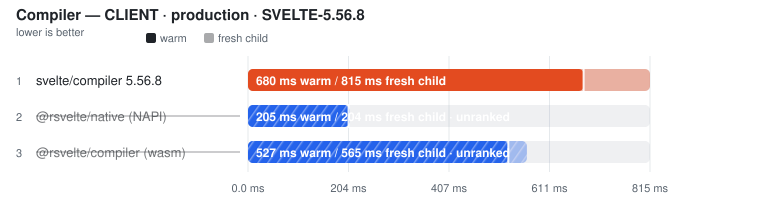
</picture>

| Tool | Files | Fresh child | vs fastest fresh | **Warm (primary)** | Min | Stddev | CV% | vs fastest | Code bytes | Peak RSS | Throughput |
| --- | ---: | ---: | ---: | ---: | ---: | ---: | ---: | ---: | ---: | ---: | ---: |
| svelte/compiler 5.56.8 | 126 | 814.6 ms | — | **680.1 ms** | 644.2 ms | 66.9 ms | 9.8% | — | 641,386 | n/a | — |
| @rsvelte/native (NAPI) ⚠ | 126 | (203.7 ms) | not ranked | (205.2 ms) | (205.0 ms) | – | – | not ranked | (634,181) | n/a | – |
| @rsvelte/compiler (wasm) ⚠ | 126 | (565.3 ms) | not ranked | (527.5 ms) | (522.9 ms) | – | – | not ranked | (633,849) | n/a | – |

Notes

- **svelte/compiler 5.56.8**: Official svelte/compiler compile(), generate=client, dev=false, css=external, runes=auto | runtime gate: ✓ 126/126 parseable outputs use svelte/internal/client and match official CSS presence; dev option changes output | ⓘ adapter parity: 10 distinct input revisions across 10 passes (warm + fresh child) | ✓ runtime semantic validity: 33/33 plants passed through svelte/compiler compile() per plant, css=external, runes=true | ✓ source-map coordinates: 4/4 anchored tokens traced exactly (LF/CRLF, non-BMP)
- **@rsvelte/native (NAPI) ⚠**: rsvelte NAPI compile(), generate=client, dev=false, css=external | runtime gate: ✓ 126/126 parseable outputs use svelte/internal/client and match official CSS presence; dev option changes output | ⓘ adapter parity: 10 distinct input revisions across 10 passes (warm + fresh child) | ⚠ SOURCE-MAP COORDINATE VALIDITY FAIL — all 33 runtime plants passed, but generated JS/CSS tokens did not trace back to their exact source positions (lf-raw: js.script: mapped to 2:19; expected 2:17; lf-styles: js.script: mapped to 2:19; expected 2:17). The timing remains visible but cannot rank until the emitted maps are correct.
- **@rsvelte/compiler (wasm) ⚠**: rsvelte WASM compile(), generate=client, dev=false, css=external. ⚠ WASM path — not the NAPI native binding. | runtime gate: ✓ 126/126 parseable outputs use svelte/internal/client and match official CSS presence; dev option changes output | ⓘ adapter parity: 10 distinct input revisions across 10 passes (warm + fresh child) | ⚠ SOURCE-MAP COORDINATE VALIDITY FAIL — all 33 runtime plants passed, but generated JS/CSS tokens did not trace back to their exact source positions (lf-raw: js.script: mapped to 2:19; expected 2:17; lf-styles: js.script: mapped to 2:19; expected 2:17). The timing remains visible but cannot rank until the emitted maps are correct.

Raw runs

- **svelte/compiler 5.56.4**: 785.2 ms, 721.0 ms, 764.6 ms, 709.1 ms, 752.5 ms · fresh child: 775.0 ms, 762.2 ms, 744.0 ms, 786.2 ms, 818.3 ms
- **@mrwaip/svelte-rs (NAPI)**: 44.3 ms, 45.6 ms, 44.2 ms, 44.1 ms, 44.1 ms · fresh child: 44.7 ms, 44.3 ms, 44.6 ms, 44.7 ms, 45.4 ms
- **svelte/compiler 5.56.8**: 812.6 ms, 680.1 ms, 682.7 ms, 661.7 ms, 644.2 ms · fresh child: 788.8 ms, 810.9 ms, 814.6 ms, 829.8 ms, 838.1 ms
- **@rsvelte/native (NAPI)**: 205.0 ms, 205.2 ms, 205.7 ms, 209.1 ms, 205.1 ms · fresh child: 203.7 ms, 203.4 ms, 203.8 ms, 203.1 ms, 204.5 ms
- **@rsvelte/compiler (wasm)**: 545.6 ms, 526.4 ms, 527.5 ms, 530.1 ms, 522.9 ms · fresh child: 567.6 ms, 553.8 ms, 567.0 ms, 559.1 ms, 565.3 ms

#### SERVER · production

Target: `server` · Environment: `production`

##### EXPERIMENTAL-SVELTE — separate workload

<picture>
  <source media="(prefers-color-scheme: dark)" srcset="charts/real-world-smui-real-world-linux-smui-compile-server-prod-class--178tb2b-dark.svg">
  
</picture>

| Tool | Files | **Median (primary)** | Min | Stddev | CV% | vs fastest | Artifact | Peak RSS | Throughput |
| --- | ---: | ---: | ---: | ---: | ---: | ---: | ---: | ---: | ---: |
| Verter native ⏭ | 126 | skipped | – | – | – | – | – | – | – |

Notes

- **Verter native ⏭**: No public Svelte runtime compile API; the experimental carrier exposes an IDE projection only. No proxy workload is timed.

##### SVELTE-5.56.4 — separate workload

<picture>
  <source media="(prefers-color-scheme: dark)" srcset="charts/real-world-smui-real-world-linux-smui-compile-server-prod-class--1siyxcz-dark.svg">
  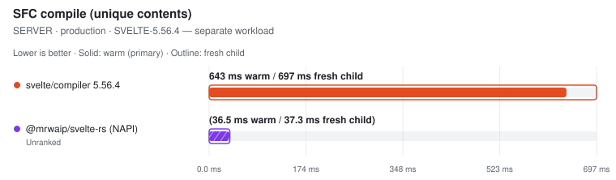
</picture>

| Tool | Files | Fresh child | vs fastest fresh | **Warm (primary)** | Min | Stddev | CV% | vs fastest | Code bytes | Peak RSS | Throughput |
| --- | ---: | ---: | ---: | ---: | ---: | ---: | ---: | ---: | ---: | ---: | ---: |
| svelte/compiler 5.56.4 | 126 | 696.8 ms | — | **642.6 ms** | 636.5 ms | 23.7 ms | 3.7% | — | 454,783 | n/a | — |
| @mrwaip/svelte-rs (NAPI) ⚠ | 126 | (37.3 ms) | not ranked | (36.5 ms) | (36.4 ms) | – | – | not ranked | (435,528) | n/a | – |

Notes

- **svelte/compiler 5.56.4**: Pinned official reference for @mrwaip/svelte-rs; generate=server, dev=false, css=external | runtime gate: ✓ 126/126 parseable outputs use svelte/internal/server and match official CSS presence; dev option changes output | ⓘ adapter parity: 10 distinct input revisions across 10 passes (warm + fresh child) | ✓ runtime semantic validity: 33/33 plants passed through svelte-mrwaip-reference/compiler compile() per plant, css=external, runes=true | ✓ source-map coordinates: 4/4 anchored tokens traced exactly (LF/CRLF, non-BMP)
- **@mrwaip/svelte-rs (NAPI) ⚠**: @mrwaip/svelte-rs compile(), generate=server, dev=false, css=external | runtime gate: ✗ returned empty JavaScript; dev option changes output | ⓘ adapter parity: 10 distinct input revisions across 10 passes (warm + fresh child) | ⚠ SOURCE-MAP COORDINATE VALIDITY FAIL — all 33 runtime plants passed, but generated JS/CSS tokens did not trace back to their exact source positions (lf-raw: js.missing or invalid version-3 source map; lf-styles: js.missing or invalid version-3 source map). The timing remains visible but cannot rank until the emitted maps are correct.

##### SVELTE-5.56.8 — separate workload

<picture>
  <source media="(prefers-color-scheme: dark)" srcset="charts/real-world-smui-real-world-linux-smui-compile-server-prod-class--1vuu5on-dark.svg">
  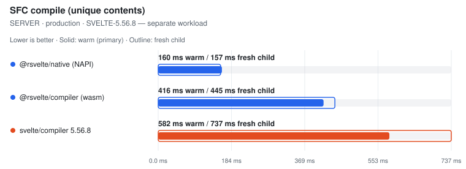
</picture>

| Tool | Files | Fresh child | vs fastest fresh | **Warm (primary)** | Min | Stddev | CV% | vs fastest | Code bytes | Peak RSS | Throughput |
| --- | ---: | ---: | ---: | ---: | ---: | ---: | ---: | ---: | ---: | ---: | ---: |
| @rsvelte/native (NAPI) | 126 | 157.2 ms | 1.00x | **160.3 ms** | 159.4 ms | 0.9 ms | 0.5% | 1.00x | 467,102 | n/a | 786 files/s |
| @rsvelte/compiler (wasm) | 126 | 444.6 ms | 2.83x | **416.1 ms** | 413.6 ms | 3.1 ms | 0.7% | 2.60x | 460,782 | n/a | 303 files/s |
| svelte/compiler 5.56.8 | 126 | 737.5 ms | 4.69x | **581.7 ms** | 574.7 ms | 20.1 ms | 3.5% | 3.63x | 460,975 | n/a | 217 files/s |

Notes

- **@rsvelte/native (NAPI)**: rsvelte NAPI compile(), generate=server, dev=false, css=external | runtime gate: ✓ 126/126 parseable outputs use svelte/internal/server and match official CSS presence; dev option changes output | ⓘ adapter parity: 10 distinct input revisions across 10 passes (warm + fresh child) | ✓ runtime semantic validity: 33/33 plants passed through @rsvelte/vite-plugin-svelte-native compileSync() per plant, css=external, runes=true | ✓ source-map coordinates: 4/4 anchored tokens traced exactly (LF/CRLF, non-BMP)
- **@rsvelte/compiler (wasm)**: rsvelte WASM compile(), generate=server, dev=false, css=external. ⚠ WASM path — not the NAPI native binding. | runtime gate: ✓ 126/126 parseable outputs use svelte/internal/server and match official CSS presence; dev option changes output | ⓘ adapter parity: 10 distinct input revisions across 10 passes (warm + fresh child) | ✓ runtime semantic validity: 33/33 plants passed through @rsvelte/compiler compile() per plant after initSync, css=external, runes=true | ✓ source-map coordinates: 4/4 anchored tokens traced exactly (LF/CRLF, non-BMP)
- **svelte/compiler 5.56.8**: Official svelte/compiler compile(), generate=server, dev=false, css=external, runes=auto | runtime gate: ✓ 126/126 parseable outputs use svelte/internal/server and match official CSS presence; dev option changes output | ⓘ adapter parity: 10 distinct input revisions across 10 passes (warm + fresh child) | ✓ runtime semantic validity: 33/33 plants passed through svelte/compiler compile() per plant, css=external, runes=true | ✓ source-map coordinates: 4/4 anchored tokens traced exactly (LF/CRLF, non-BMP)

Raw runs

- **svelte/compiler 5.56.4**: 674.8 ms, 636.5 ms, 638.6 ms, 688.2 ms, 642.6 ms · fresh child: 691.6 ms, 696.8 ms, 666.1 ms, 703.4 ms, 709.1 ms
- **@mrwaip/svelte-rs (NAPI)**: 36.5 ms, 36.5 ms, 37.1 ms, 36.6 ms, 36.4 ms · fresh child: 37.3 ms, 37.4 ms, 37.1 ms, 37.4 ms, 37.0 ms
- **@rsvelte/native (NAPI)**: 161.6 ms, 159.4 ms, 160.3 ms, 160.6 ms, 159.7 ms · fresh child: 156.7 ms, 158.4 ms, 157.2 ms, 156.8 ms, 157.8 ms
- **@rsvelte/compiler (wasm)**: 420.8 ms, 413.6 ms, 416.1 ms, 414.2 ms, 418.8 ms · fresh child: 442.7 ms, 469.6 ms, 444.6 ms, 446.8 ms, 439.1 ms
- **svelte/compiler 5.56.8**: 581.7 ms, 619.9 ms, 578.3 ms, 607.8 ms, 574.7 ms · fresh child: 730.6 ms, 738.4 ms, 731.6 ms, 740.7 ms, 737.5 ms

Methodology

- Matrix: generate ∈ {client, server} × env ∈ {production, development} × source-map ∈ {off, on} (off by default).
- Within each pinned compiler-version class, every tool receives the same in-memory Svelte SFC corpus. Real-world eligibility is decided independently by that class's official reference and per-row file counts remain visible.
- Official: svelte/compiler compile() with runes=auto. Generated fixtures force runes; real-world sources use compiler auto-detection.
- MrWaip: @mrwaip/svelte-rs native compiler through its compatible compile() API, ranked inside the pinned svelte-5.56.4 class with svelte/compiler 5.56.4 as the official reference/baseline.
- rsvelte: WASM (@rsvelte/compiler) and NAPI (@rsvelte/vite-plugin-svelte-native) paths are separate rows in the svelte-5.56.8 class.
- Verter exposes no public Svelte runtime compile API in the installed package (probed at runtime), so it is reported skipped; its different runtime-render batching API is not substituted.
- Every warmed/fresh pass compiles a REVISED corpus: a fixed-width comment token plus a used CSS custom-property rule. The timed loop asserts the token reached the emitted CSS, so a cached whole-output result from a previous pass fails the gate. Adapter parity additionally requires every warm and fresh pass to have received a distinct input revision.
- Every compiler must return one non-empty code artifact per input file, emit the expected Svelte client/server runtime import, and remove Svelte runes; aggregate byte totals alone are not accepted as proof of coverage.
- Fresh child = the first timed row workload in a NEW child process, after excluded Node startup, package imports, adapter construction and input materialisation. It is NOT machine-cold (OS page cache is not flushed) and its ratio never substitutes for the warm verdict.
- Source maps: every compared Svelte 5 compiler ALWAYS emits js.map/css.map from compile() (no off/on flag exists — the 'sourcemap' option is a chained-map INPUT), so an off/on matrix would measure the harness, not the tools. Instead the maps' COORDINATE CORRECTNESS gates every row: anchored tokens in generated JS/CSS must trace back to their exact source positions (segment fallback allowed, exact line/column required, sourcesContent equal to the full component), across LF/CRLF and non-BMP-shifted columns. Wrong-file, shifted, stale or byte-counted maps unrank the row.
- Runtime semantic validity: a 28-plant Svelte 5 suite (props/state/derived/bindable/bindings/events/each-keyed/await/snippets/stores/actions/context/dynamic components/{@html}/SVG/module script/legacy syntax + CSS semantics) runs per entrypoint per cell in isolated child processes after timing; non-PASS rows unrank, and a failed official reference unrankS every candidate in its compatibility class (no survivor promotion).
- Tool order is rotated on every warmup and measured run. A row is unranked unless the measured runs cover every active execution position; ranking metric is the median of warmed runs.

### Svelte TypeScript projection

Files: **126** · Bytes: **530,360**

Corpus: smui:components @ v9.0.1 (8d204fe8, released/committed 2026-06-02) · 126 SFCs · library-source · Apache-2.0

Tools:

- **svelte2tsx** — Official Svelte-to-TSX projection from sveltejs/language-tools.
- **@rsvelte/svelte2tsx (Wasm)** — rsvelte Rust/Wasm drop-in Svelte-to-TSX projection.
- **Verter IDE projection** — VerterHost ensureIdeCompiled/getIde Svelte projection; separate schema from svelte2tsx.

##### SVELTE2TSX-COMPATIBLE — separate workload

<picture>
  <source media="(prefers-color-scheme: dark)" srcset="charts/real-world-smui-real-world-linux-smui-projection-projection-clas-0xidrig-dark.svg">
  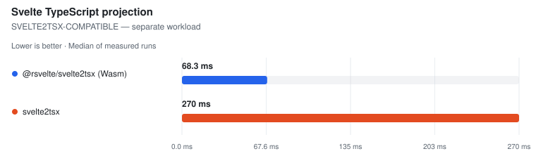
</picture>

| Tool | Files | **Median (primary)** | Min | Stddev | CV% | vs fastest | TSX bytes | Peak RSS | Throughput |
| --- | ---: | ---: | ---: | ---: | ---: | ---: | ---: | ---: | ---: |
| @rsvelte/svelte2tsx (Wasm) | 126 | **68.3 ms** | 64.4 ms | 7.7 ms | 11.3% ⚠ | 1.00x | 731,489 | n/a | 1.8k files/s |
| svelte2tsx | 126 | **270.4 ms** | 261.7 ms | 9.5 ms | 3.5% | 3.96x | 731,490 | n/a | 466 files/s |

Notes

- **@rsvelte/svelte2tsx (Wasm)**: Rust/Wasm drop-in; TypeScript-printer structural parity against official output | gate: ✓ 126/126 valid TSX outputs
- **svelte2tsx**: Official svelte2tsx, Svelte 5 TS projection | gate: ✓ 126/126 valid TSX outputs

##### VERTER-IDE-PROJECTION — separate workload

<picture>
  <source media="(prefers-color-scheme: dark)" srcset="charts/real-world-smui-real-world-linux-smui-projection-projection-clas-0kftj2q-dark.svg">
  
</picture>

| Tool | Files | **Median (primary)** | Min | Stddev | CV% | vs fastest | Projection bytes | Peak RSS | Throughput |
| --- | ---: | ---: | ---: | ---: | ---: | ---: | ---: | ---: | ---: |
| Verter IDE projection ⚠ | 126 | (277.8 ms) | (275.7 ms) | – | – | not ranked | (2,237,900) | n/a | – |

Notes

- **Verter IDE projection ⚠**: Native ensureIdeCompiled/getIde Svelte path; separate class because this is Verter's IDE carrier, not a svelte2tsx-compatible schema | gate: ✗ invalid TSX: ')' expected.

Methodology

- This is the type-analysis projection used by Svelte-aware TypeScript tooling; it is not runtime compilation or component documentation.
- The svelte2tsx-compatible rows use the synchronous in-process API with identical Svelte 5 options and file order.
- Every output must parse as TSX and contain tool-specific Svelte projection helpers.
- The rsvelte row must match official output after TypeScript parses and reprints both outputs, ignoring formatting-only whitespace while retaining syntax and comments.
- Verter's ensureIdeCompiled/getIde output is a genuine Svelte IDE projection, but its carrier and helper contract differ from svelte2tsx; it is therefore measured in a separate comparison class.

Raw runs:

- **@rsvelte/svelte2tsx (Wasm)**: 82.3 ms, 77.0 ms, 68.3 ms, 65.8 ms, 64.4 ms
- **svelte2tsx**: 286.1 ms, 264.1 ms, 270.4 ms, 272.4 ms, 261.7 ms
- **Verter IDE projection**: 276.6 ms, 5.27 s, 277.8 ms, 278.0 ms, 275.7 ms

### Format

Files: **126** · Bytes: **530,360**

Corpus: smui:components @ v9.0.1 (8d204fe8, released/committed 2026-06-02) · 126 SFCs · library-source · Apache-2.0

Tools:

- **Prettier** — prettier --write with prettier-plugin-svelte over a fresh corpus copy.
- **rsvelte-fmt** — @rsvelte/fmt — Rust formatter for .svelte.
- **Oxfmt** — Oxc formatter; skipped because the pinned release excludes .svelte files.

<picture>
  <source media="(prefers-color-scheme: dark)" srcset="charts/real-world-smui-real-world-linux-smui-format-format-all-dark.svg">
  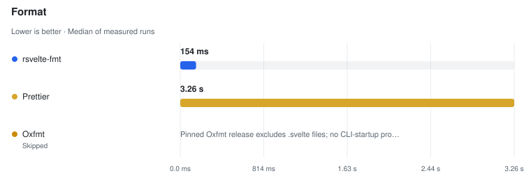
</picture>

| Tool | Files | **Median (primary)** | Min | Stddev | CV% | vs fastest | Artifact | Peak RSS | Throughput |
| --- | ---: | ---: | ---: | ---: | ---: | ---: | ---: | ---: | ---: |
| rsvelte-fmt | 126 | **153.9 ms** | 151.0 ms | 1.4 ms | 0.9% | 1.00x | n/a | n/a | 818 files/s |
| Prettier | 126 | **3.26 s** | 3.21 s | 44.9 ms | 1.4% | 21.15x | n/a | n/a | 39 files/s |
| Oxfmt ⏭ | 126 | skipped | – | – | – | – | – | – | – |

Notes

- **rsvelte-fmt**: rsvelte-fmt . (Rust); may route embedded JS/TS/CSS through other formatters | ⓘ file coverage verified: rewrote 126/126 Svelte files.
- **Prettier**: prettier --write **/*.svelte with prettier-plugin-svelte · single-threaded | ⓘ file coverage verified: rewrote 126/126 Svelte files.
- **Oxfmt ⏭**: Pinned Oxfmt release excludes .svelte files; no CLI-startup proxy is timed.

Methodology

- Every timed invocation receives a fresh copy of the same Svelte corpus.
- All rows are CLI invocations; any non-zero exit is an operational failure and cannot rank, even if some files changed first.
- A nested markup-rewrite plant fails tools that no-op, format only &lt;script>, or use a non-recursive file pattern.
- An untimed coverage census dirties every Svelte file; a tool that rewrites fewer than the full corpus is measured but unranked.
- Output style is not normalized — this measures whole-SFC format throughput, not byte identity.
- Tool order is rotated; ranking metric is the median of warmed runs.

Raw runs:

- **rsvelte-fmt**: 151.0 ms, 153.9 ms, 153.6 ms, 154.5 ms, 154.0 ms
- **Prettier**: 3.26 s, 3.21 s, 3.33 s, 3.24 s, 3.28 s

### Lint

Files: **126** · Bytes: **530,360**

Corpus: smui:components @ v9.0.1 (8d204fe8, released/committed 2026-06-02) · 126 SFCs · library-source · Apache-2.0

Tools:

- **eslint-plugin-svelte (1T API)** — ESLint API + eslint-plugin-svelte recommended rules, single-threaded.
- **eslint-plugin-svelte (worker pool)** — ESLint API + eslint-plugin-svelte recommended rules, split across worker threads.
- **eslint-plugin-svelte (CLI)** — ESLint CLI + eslint-plugin-svelte recommended rules.
- **rsvelte-lint** — @rsvelte/lint — Rust Svelte linter.
- **Verter host lint** — VerterHost lint/diagnostics API with fileKind=svelte; experimental and gated on the {@html} diagnostic.

##### ESLINT-RECOMMENDED-RULES — separate workload

<picture>
  <source media="(prefers-color-scheme: dark)" srcset="charts/real-world-smui-real-world-linux-smui-lint-lint-class-eslint-rec-0aff248-dark.svg">
  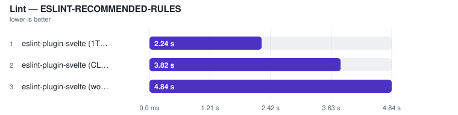
</picture>

| Tool | Files | **Median (primary)** | Min | Stddev | CV% | vs fastest | Artifact | Peak RSS | Throughput |
| --- | ---: | ---: | ---: | ---: | ---: | ---: | ---: | ---: | ---: |
| eslint-plugin-svelte (1T API) | 126 | **2.24 s** | 2.12 s | 323.7 ms | 14.4% ⚠ | 1.00x | n/a | n/a | 56 files/s |
| eslint-plugin-svelte (CLI) | 126 | **3.82 s** | 3.80 s | 67.2 ms | 1.8% | 1.70x | n/a | n/a | 33 files/s |
| eslint-plugin-svelte (worker pool) | 126 | **4.84 s** | 4.81 s | 58.7 ms | 1.2% | 2.16x | n/a | n/a | 26 files/s |

Notes

- **eslint-plugin-svelte (1T API)**: ESLint flat config + eslint-plugin-svelte recommended; explicit file list | ⓘ file coverage by construction: the invocation receives all 126 corpus files as an explicit list.
- **eslint-plugin-svelte (CLI)**: eslint . over the same isolated corpus; pays startup and config load | ⓘ file coverage verified: named 126/126 planted Svelte files.
- **eslint-plugin-svelte (worker pool)**: ESLint worker_threads fan-out; explicit file list | ⓘ file coverage by construction: the invocation receives all 126 corpus files as an explicit list.

##### RSVELTE-NATIVE-RULES — separate workload

<picture>
  <source media="(prefers-color-scheme: dark)" srcset="charts/real-world-smui-real-world-linux-smui-lint-lint-class-rsvelte-na-04tm8y0-dark.svg">
  
</picture>

| Tool | Files | **Median (primary)** | Min | Stddev | CV% | vs fastest | Artifact | Peak RSS | Throughput |
| --- | ---: | ---: | ---: | ---: | ---: | ---: | ---: | ---: | ---: |
| rsvelte-lint | 126 | **291.3 ms** | 286.6 ms | 4.7 ms | 1.6% | — | n/a | n/a | — |

Notes

- **rsvelte-lint**: rsvelte-lint . (Rust linter) | ⓘ file coverage verified: named 126/126 planted Svelte files.

##### VERTER-NATIVE-DIAGNOSTICS — separate workload

<picture>
  <source media="(prefers-color-scheme: dark)" srcset="charts/real-world-smui-real-world-linux-smui-lint-lint-class-verter-nat-15jf876-dark.svg">
  
</picture>

| Tool | Files | **Median (primary)** | Min | Stddev | CV% | vs fastest | Artifact | Peak RSS | Throughput |
| --- | ---: | ---: | ---: | ---: | ---: | ---: | ---: | ---: | ---: |
| Verter host lint ⚠ | 126 | (167.3 ms) | (165.6 ms) | – | – | not ranked | – | n/a | – |

Notes

- **Verter host lint ⚠**: VerterHost.upsert(fileKind=svelte) + lint/getDiagnostics for each explicit file | ⚠ FAILED VALIDATION — planted issue or markup work not observed | ⓘ file coverage by construction: the invocation receives all 126 corpus files as an explicit list.

Methodology

- Every tool receives the same isolated Svelte corpus.
- A planted {@html} issue must be reported; missing the template rule leaves the time visible but unranked.
- An untimed file-coverage census requires each directory-walk CLI to name every planted corpus file; explicit-list APIs are exact by construction.
- ESLint is measured in single-threaded API, worker-pool API, and CLI modes so invocation and thread-count costs remain visible.
- Rule sets are not identical, so ESLint recommended rules, rsvelte native rules, and Verter diagnostics are separate workload classes. The shared planted gate establishes minimum work but never cross-engine equivalence.
- Tool order is rotated; ranking metric is the median of warmed runs.

Raw runs:

- **eslint-plugin-svelte (1T API)**: 2.66 s, 2.85 s, 2.24 s, 2.12 s, 2.17 s
- **eslint-plugin-svelte (CLI)**: 3.94 s, 3.81 s, 3.82 s, 3.80 s, 3.92 s
- **eslint-plugin-svelte (worker pool)**: 4.84 s, 4.81 s, 4.95 s, 4.82 s, 4.88 s
- **rsvelte-lint**: 291.3 ms, 293.8 ms, 286.6 ms, 299.3 ms, 289.9 ms
- **Verter host lint**: 167.2 ms, 169.4 ms, 165.6 ms, 167.3 ms, 168.6 ms

